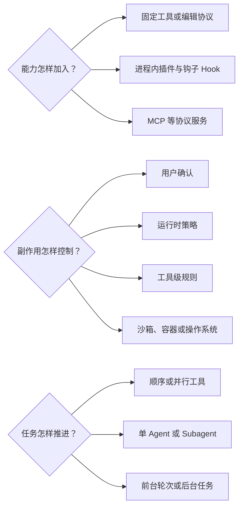

# 七个 Agent Harness 的横向能力地图

七个系统都能让模型参与代码修改，但“能够修改代码”只是共同外观。对同一个配置解析错误，Aider 会优先把任务组织成编辑与 Git 反馈，Codex、Gemini CLI、Goose 和 OpenCode 会让工具调度与权限系统承担更多工作，DeepSeek Harness 的实际能力取决于插件组合，Pi 则从少量基础工具出发，把更多选择留给扩展和宿主。使用体验相似，不意味着背后的控制结构相同。

横向地图的作用，是让读者先建立一组稳定坐标。我们关心的不是哪个产品菜单更长，而是四个更实际的问题：任务循环由谁推进，模型本轮能看见什么，行动在哪里被执行和约束，任务状态能保存到什么粒度。后续章节会把每个问题展开；本章先给出总体位置和最值得注意的设计分叉。

## 先抓住四个决定体验的问题

第一个问题是**谁在推进任务**。最简单的 Harness 循环会准备模型输入、接收响应、执行行动，再把结果送回模型。循环可以围绕一段编辑协议展开，也可以围绕结构化工具调用、事件或插件检查点展开。循环的停止条件同样重要：模型是因为给出最终回答而结束，还是因为用户拒绝、工具失败、令牌预算超限或任务被取消而结束，会直接影响错误处理与恢复方式。

第二个问题是**模型此刻能看见什么**。上下文不只是聊天记录，还可能包括系统指令、项目说明、仓库地图、选中的文件片段、工具定义、测试输出和压缩摘要。材料越多不一定越好：完整仓库通常放不进模型窗口，旧输出也可能已经过时。因此，Harness 必须在可见性、相关性和令牌成本之间选择，并保留足够来源信息，让模型区分用户要求、项目规则、真实命令输出和自己先前的推断。

第三个问题是**行动怎样跨进现实世界**。模型提出读取文件、写入代码或运行 Shell，只是一个行动请求。Harness 还要校验参数，决定是否需要批准，再调用真正的执行器。内建工具、MCP 服务、进程内插件和宿主命令都能提供行动能力，却具有不同的生命周期与信任边界。一个工具出现在模型的能力列表中，并不自动意味着它可以无条件执行。

第四个问题是**任务如何保持连续**。有的系统只保存可再次放入对话的文本历史，有的保存结构化消息、工具调用和事件，还有的用数据库或树形日志支持恢复、分支和派生视图。上下文压缩（Compaction）解决的是模型窗口过长，可检索记忆（Memory）解决的是信息能否跨更长时间重新使用，任务恢复（Resume）解决的是如何从保存状态继续任务；三个概念相关，却不是一回事。

带着这四个问题，下面的矩阵先比较七个系统的主要产品路径，再从矩阵中归纳几种常见的控制中心。这样既能看见共同能力，也能保留相同名称背后的实现差异。

## 核心能力地图

表 2-1 直接对应上一节的四个问题。它不追求列出所有功能，只保留最能说明系统控制位置的机制；更细的模型接入、扩展、令牌管理、委派和 Git 行为会在后续机制章展开。

| 系统 | 任务怎样推进 | 模型看见什么 | 行动怎样执行与受控 | 任务怎样保持连续 |
|---|---|---|---|---|
| **Aider** | 围绕编辑提议、应用结果和反思重试顺序推进 | 在聊文件、项目提示与仓库地图 | 编辑协议直接形成代码修改；Shell 会确认，测试按配置或交互接入 | 保存对话并摘要较早历史，重点维持编辑任务的文本连续性 |
| **Codex** | 会话和轮次组织结构化工具循环，可派生子任务 | 系统与项目指令、环境状态、文件和工具说明 | 工具路由连接专用编辑与 Shell，审批和文件/网络沙箱分层 | 有序任务记录支持恢复、分支与派生线程 |
| **DeepSeek Harness** | 小型循环在插件检查点间推进，产品行为由组合决定 | Agent 预设按作用域装入提示、工具与压缩能力 | 宿主组合工具、权限、沙箱与模型路由 | 会话事件写入持久后端，恢复能力随产品组合而定 |
| **Gemini CLI** | 客户端驱动模型轮次，调度器管理工具批次 | 项目说明、环境信息、相关历史与工具目录 | 调度器关联调用、策略、确认和执行，可配置沙箱 | 追加式聊天记录与检查点支持续接，窗口过长时可压缩 |
| **Goose** | 一般消息走经典循环，特定开关或 `!` 命令进入新状态机 | 项目提示、技能包、工具说明与会话材料 | MCP 扩展执行工具，权限规则、客户端确认和可选容器协同 | 本地数据库保存会话，支持加载、导入和继续 |
| **OpenCode** | 持久会话驱动提示与工具循环，新执行核心仍在演进 | 系统上下文、项目指令、Agent 配置、技能包与工具 | 规则按 Agent 和工具作出允许、询问或拒绝，隔离取决于执行环境 | 数据库存储消息、工具部分与事件；父子会话支持委派 |
| **Pi** | 小型事件循环执行结构化工具，独立调用可并行 | 上下文文件、系统提示、技能包、模板与基础工具 | 项目信任控制资源加载；逐调用治理主要由扩展或宿主提供 | 树形追加记录保存分支与压缩点，支持恢复和切换分支 |

这张表最重要的信息是相同体验背后的恢复单位和控制位置。例如，Aider 的对话历史主要恢复文本连续性，Codex 的持久记录、Goose 与 OpenCode 的数据库状态、Pi 的树形 JSONL 则保留更多结构。它们都可以叫 Resume，但能否重建工具调用关系、分支以及压缩前历史并不相同；无论保存多细，已经结束的进程和已经发生的外部副作用仍需要重新检查。

编辑、测试与 Git 也不是固定的三件套。Aider 把编辑解析、自动 lint 和自动 commit 组织成较完整的编辑事务，测试则在配置或交互触发后进入反馈循环。其他多数系统拥有专门的读取或编辑工具，但测试和许多 Git 操作仍由 Shell 完成。通用命令执行带来更广的适应性，同时要求 Harness 正确保留工作目录、退出状态、输出截断和副作用归属，否则一次失败很容易在下一轮被误读。

Provider 数量同样不能代表自治程度。多 Provider Harness 必须规范化流式输出、工具描述、结束原因、Token 用量和错误；针对单一模型族优化的系统则可以更深入利用原生接口。两种选择讨论的是模型接入边界，不直接决定 Agent 会不会自主规划、能否连续调用工具，或是否拥有更大的执行权限。

## 四种控制中心

把矩阵按架构重组，可以看到四种较鲜明的控制中心。第一种是**编辑事务**：Aider 的核心问题是怎样把模型输出可靠地转成代码修改，并把 lint、Git 和反思重新接回对话。它牺牲了一部分通用工具总线的整齐性，换来对代码编辑工作流的紧密整合。

第二种是**Session 运行时**。Codex、Gemini CLI、Goose 与 OpenCode 都在不同程度上让会话对象、工具状态和事件承担控制责任。Codex 更集中地组织轮次、审批与沙箱；Gemini CLI 让客户端循环和调度器分工；Goose 以 Provider、扩展和持久 Session 为平台中心；OpenCode 把 Session、Provider、工具、权限和事件投影拆成可组合服务。共同收益是通用行动容易接入，代价是必须持续处理调用关联、取消、并发和恢复的一致性。

第三种是**插件装配**。DeepSeek Harness 把宿主能力与 Agent 预设分开：宿主负责模型路由、持久化、权限和执行基础，预设决定单个 Agent 看见哪些提示、工具、压缩与委派能力。改变预设可以改变模型的能力表面，却不会自动搬走持久化后端或执行策略。这种设计让组合关系成为产品行为的一部分，也要求部署者理解“能力可见”和“能力如何执行”分别由谁负责。

第四种是**可编程小内核**。Pi 默认只提供少量基础工具和轻量循环，却把树形 Session、分支、压缩和扩展（Extension）做成直接可编程的组成部分。它不会替宿主统一提供逐工具审批或沙箱，因此简单路径十分清楚，高级治理能力则取决于所选扩展和运行环境。这个取向适合嵌入和定制，也把更多集成责任交给使用者。

这些中心不是互斥标签。一个 Session 运行时可以同时支持插件，一个编辑器也可以接入外部模型和命令。它们只是指出：当一次任务出现歧义、失败或副作用时，系统最先在哪里寻找控制状态。理解这一点，往往比记住项目内部组件名称更有用。

> **特色设计：Goose 的两条循环入口**
>
> Goose 的一般对话默认进入经典回复循环；启用环境开关后，一般消息可以进入新的有序状态机。除此之外，以 `!` 开头的非空命令还有一条独立的特殊入口，会被解释成 Shell 行动后送入该状态机。这个设计说明同一产品可以同时保留成熟主路径和窄范围实验路径：用户从哪种输入进入，直接决定他观察到经典循环还是新状态机。

> **特色设计：Pi 把两类信任问题分开**
>
> Pi 的项目信任（Project Trust）在启动时决定是否加载项目级设置、资源、扩展包与 Extension，防止陌生仓库直接把自身配置带入 Agent。它处理的是“项目内容能否进入 Harness”，并不逐次批准模型之后提出的每个读、写、编辑或 Shell 动作。执行阶段的限制可以由 Extension、容器或操作系统补充。把加载期信任与执行期权限分开，是 Pi 相对于多数样本很鲜明的选择。

## 扩展、控制与自治不是一条刻度

功能多、工具多或自动步骤多，都不能单独说明一个 Harness “更自治”。人机自动化研究将自动化拆分为信息获取、信息分析、决策选择和行动实施，并指出系统可以在不同阶段采用不同程度的人类参与 [@parasuraman2000automation]。映射到配置修复任务，自动找到相关文件、选择修改方案、决定是否运行测试和真正执行 Shell，是四个不同的决定。

一个 Harness 可以自动准备丰富上下文，却在每次 Shell 前询问；也可以允许模型连续调用工具，但用沙箱限制可访问的文件和网络；还可以让根 Agent 只负责拆分任务，由子 Agent（Subagent）搜索和测试，最后仍要求用户批准写入。理解自治程度时，至少要同时观察三件事：动作能否并发，任务能否委派，以及工作能否在当前前台轮次之外继续。

图中的三个问题可以自由组合，不构成从低到高的路线。例如，并行工具调用不要求存在 Subagent，MCP 也不意味着执行自动绕过审批。进程内插件便于共享类型和会话状态，却进入更深的进程内信任域；协议服务容易跨语言和进程扩展，却增加服务器生命周期、凭据、网络与远端工具授权问题；宿主沙箱能够限制错误后果，却通常不了解这条命令属于哪个任务阶段。成熟的 Harness 往往把多种控制层叠加，而不是依赖单一开关。

## 从静态地图走向任务时间线

现在回到配置修复案例。若只看能力表，七个系统似乎都能取得代码、修改文件并运行命令；真正进入任务后，差异会表现为一系列时间问题：项目指令是在会话创建时还是每轮重新装入，工具调用是在模型流式输出中立即调度还是成批执行，用户批准发生在参数确定之前还是之后，测试失败怎样成为下一轮可见结果，压缩和 Subagent 又会在哪个时刻改变上下文。

因此，阅读矩阵时可以先找三处分叉：配置与项目说明怎样进入上下文，修改和测试怎样成为行动，行动执行前由谁裁决。然后进入[第三章的纵向生命周期](03_vertical_lifecycle_walkthrough.md)，看这些机制在同一个任务中以什么顺序出现。若 Session、Turn、Event、Context 或 Artifact 的含义发生混淆，再由[第四章的参考架构](04_reference_architecture.md)统一对象边界。

横向地图回答的是“能力和控制放在哪里”。它已经显示出七个系统的共同底座，也说明相似功能可能拥有完全不同的责任边界。下一章将把这张静态地图沿时间展开，观察一次 Coding Agent 任务从自然语言请求到修改、测试、解释和恢复，究竟经历哪些状态变化。
