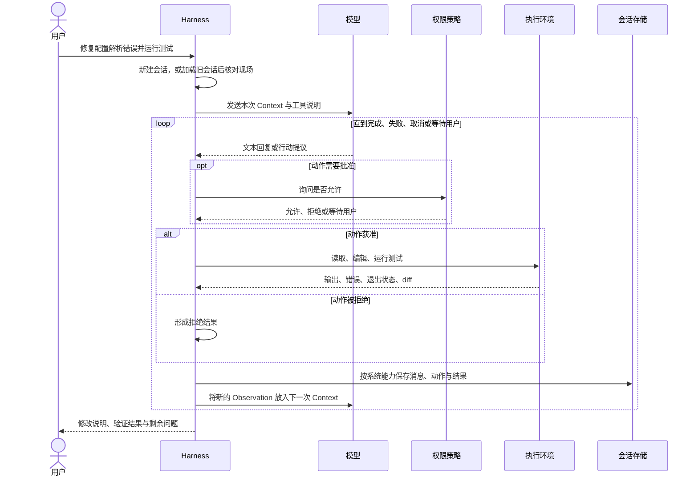

# 一次 Coding Agent 任务的纵向生命周期

[上一章](02_horizontal_capability_map.md)从横向上比较了七个 Harness 的能力。本章换一个视角，不再问“它们各自有什么”，而是沿一个代表性的配置修复示例，看这些能力在什么时候出现、彼此怎样衔接。这个示例用于串联共同机制，不对应某个产品的一次完整运行记录。

贯穿本章的请求是：“请定位并修复仓库中的配置解析错误，运行相关测试，并解释修改。”这句话看似完整，实际上只给出了目标。Harness 还要找到工作区，读取项目约束，把相关材料放进模型上下文，将模型建议转成可执行动作，在必要时请求批准，收集测试结果，并在中断后知道从哪里继续。七个系统对这些责任的拆法不同，但一次任务大体都要经历“形成任务—观察环境—提出行动—执行并反馈—验证与收束”这条主线。

## 新建与任务恢复（Resume）：先确定从哪里开始

新建任务时，Harness 通常从当前工作目录和用户输入出发，建立一个会话身份，选择模型与工具，并加载项目级指令。此时“修复配置解析错误”还不是一个可以直接执行的命令，因为“配置”可能指命令行参数、项目文件、环境变量覆盖，也可能指模型服务的连接配置。Harness 能做的第一件事，是把这份模糊目标安放到一个明确的工作区和会话中，然后允许模型通过读取与搜索逐步缩小范围。

恢复任务时，顺序有所不同。Harness 先读回以前保存的消息、工具结果、摘要或控制状态，再把它们与当前工作区、当前权限和当前模型重新绑定。这里有一个很实用的区别：历史告诉系统“上次进行到了哪里”，现场观察告诉系统“现在还是不是那样”。例如，历史中可能写着“解析器已修改，测试通过”，但用户可能在两天后切换了分支，依赖也发生了变化。一个可靠的 Resume 不会把旧结论直接当成当前事实，而会先检查关键文件、Git 状态和必要测试。

不同系统保存的恢复材料并不相同。Aider 更接近“围绕一个编辑会话继续对话”，重点维持文本和编辑任务的连续性；结构化会话系统还可以保留工具调用、事件、分支或摘要节点；组合式产品的恢复能力则取决于实际装入的持久化部件。差别不在界面上有没有“恢复”按钮，而在于读回的材料有多细，以及恢复后会重新确认哪些现场状态。

对配置修复案例而言，任务开始时至少要形成一张朴素的“任务卡”：当前仓库在哪里，用户希望修复什么，哪些操作需要确认，已经掌握哪些报错，怎样才算完成。系统不一定真的保存这样一张表，但后续行动需要能回答这些问题。否则，认证失败可能被误说成测试失败，工作目录错误可能被误说成解析器缺陷，用户取消也可能被误说成任务已经完成。

## 本轮上下文（Context）：模型这一刻究竟看到了什么

会话建立后，Harness 要为第一次模型调用准备本轮上下文（Context），也就是模型这一次实际可见的输入。它通常由用户请求、系统提示、项目指令、相关历史、文件片段、仓库概览、工具说明和环境信息组成。会话（Session）保存的材料可以很多，Context 却必须经过选择：会话里有一百条消息，不意味着模型本次能看到全部一百条；相反，工具参数说明或当前工作目录可能进入 Context，却不出现在聊天记录中。

在本例中，好的第一次 Context 不需要塞入整个仓库。它更可能包含原始报错、项目规则、仓库结构线索和几种只读工具，让模型先回答三个问题：错误能否复现，配置从哪个入口被读取，附近有哪些测试。Aider 用在聊文件与仓库概览缩小可见范围，Gemini CLI 将项目说明、环境与工具纳入统一流水线，DeepSeek Harness 则允许产品用插件决定请求中加入哪些信息。实现形式不同，工程取舍却相同：材料太少，模型容易猜错入口；材料太多，旧输出与无关代码会挤占窗口并干扰判断。

Context 中的材料也不具有相同可信度。用户约束表示意图，项目文件描述仓库，命令输出记录某个时刻的现场，模型摘要则只是对旧材料的压缩解释。假设摘要说“问题位于配置加载器”，但新的搜索发现真正报错来自命令行覆盖层，新的观察应当能够推翻旧摘要。为此，Harness 需要尽量保留材料的来源、时间和调用关系，并明确标记被截断的输出；“输出中没有看到”与“对象确实不存在”不是一回事。

工具说明也是 Context 的一部分。它决定模型可以提出哪些动作，以及参数应该怎样表达。同样名为“读取文件”的能力，可以返回全文、一个行区间，也可以只返回受限窗口；Shell 工具可能运行在宿主机、容器或沙箱里。模型只有先理解这些接口，才能生成 Harness 可以解释的行动。因此，Context 并非单纯的聊天历史，而是一次模型调用的工作说明书。

## 行动—观察循环：修复怎样一步步向前推进

准备好 Context 后，Harness 调用模型。模型若给出最终说明，系统可以进入收束判断；模型若提出读取、搜索、编辑或测试动作，Harness 就要解析动作、检查权限、执行，并把结果作为环境观察（Observation）放回下一次 Context。这个循环的核心并不复杂：每一次行动都必须带回可归属的结果，结果又会改变下一步选择。

*图 3-1　配置修复任务的主循环。不同系统会合并或拆分其中的步骤，但行动必须经过执行，结果必须返回下一轮。*

例如，模型先搜索配置入口，结果发现解析器接受一个已经废弃的字段；随后它读取相邻测试，提出一个小范围修改，再运行针对性测试。若测试返回“未知选项”，这不是需要隐藏的噪声，而是下一轮推理的新输入：模型应该检查测试命令或兼容分支，而不是继续宣称测试通过。失败结果对循环的价值，常常不低于成功结果。

结构化工具调用（Tool Call）是实现这条循环的常见方法。Gemini CLI 将工具请求交给调度器，Pi 可以并行执行互不依赖的调用。Aider 保留了另一条重要路线：模型生成受约束的编辑提议，Harness 解析并写入文件；若编辑格式无法应用，错误会作为反思材料进入下一轮。两种路线都实现了“提议—执行—反馈”，并不需要强行采用同一种网络协议。

并发会让结果归属变得更重要。模型可能同时请求读取配置、搜索解析器并检查测试，三个动作的完成顺序与提出顺序并不一致。Harness 需要用调用标识或稳定顺序把结果送回正确位置，否则模型会把某个搜索错误误配给另一个文件读取。取消和 Resume 也依赖这层关联：只有知道哪个调用已经成功、失败、拒绝或仍然悬空，系统才能安全地决定下一步。

## 从行动提议到真实副作用

模型说“修改文件”时，现实世界还没有改变。一个动作通常要经过四层：先解析模型提议，再校验参数，然后由权限策略作出允许、拒绝或询问的决定，最后由执行环境真正读写文件或启动进程。确认框回答的是“用户是否同意这次动作”，沙箱回答的是“即使动作获准，它最多能影响什么”；两者解决的问题不同。

控制点可以集中，也可以分散。Codex 把审批策略与沙箱限制分层，OpenCode 用可配置规则作出允许、询问或拒绝决定；Pi 的默认路径则先判断是否信任并加载项目资源，把逐次工具调用的限制主要交给扩展或宿主环境。理解安全边界时，应看最终动作由谁裁决、在哪里执行，而不是只数界面中的按钮。

错误恢复也要服从动作语义。模型服务限流可以退避后重试，格式错误可以交给模型重新生成，文件搜索通常可以安全重跑；文件写入却应先读回目标区域，测试进程被取消后要检查是否留下缓存，Git 或网络动作更要确认远端和引用状态。有副作用的操作一旦结果不明，盲目重试可能造成重复提交或重复请求。可靠的 Harness 不是“不会失败”，而是能说明失败发生在哪一层，已经产生了哪些结果，以及下一步如何重新观察。

任务的完成也需要从最新 Observation 得出。对本例，较稳妥的顺序是重新读取关键修改，运行针对性测试，检查退出状态与 diff，再让模型解释原因、修改范围和未解决问题。文件差异、测试输出和最终说明是三种不同产物：diff 说明改了什么，测试说明某条命令在某个环境中的结果，说明文字负责把两者交给用户。任何一种都不能单独替代另外两种。

## 窗口不足时：上下文压缩（Compaction）与子 Agent（Subagent）

如果配置问题牵涉多个包，搜索、失败测试和多轮编辑会逐渐挤满模型窗口。Harness 此时可以压缩历史，也可以把部分工作交给 Subagent，但两者解决的是不同问题。Compaction 通过删除、选择或摘要减少本次 Context；Subagent 则创建新的执行分支，让另一个 Agent 在较小的局部上下文中调查或验证。

压缩是一种有损变换。它应该保留用户目标、禁止事项、最近修改、失败原因和未完成调用，却可能舍弃早期原始输出。Aider 倾向于摘要较早的对话；Pi 会保留压缩前记录，同时让模型只看摘要后的投影。两种做法都说明摘要位置和触发时机会改变恢复能力，也清楚地区分了“磁盘上仍保存什么”和“模型现在看到什么”。

子 Agent 更像一次有边界的委派。根 Agent 可以让它只定位解析入口，或只运行某组测试，然后把结果带回主任务。Codex 提供内建子任务，OpenCode 用父子会话承载委派，Pi 则把通用子 Agent 留给扩展。无论采用哪种形式，子 Agent 的一句“已经修复”都只是报告。父任务仍要检查实际 diff、测试结果和工作区状态，并决定结果是否可以合并。

委派还引入三类同步问题：父任务要给子任务哪些上下文，子任务能使用哪些权限，取消父任务时子任务是否跟随终止。若多个子任务同时修改同一文件，还要处理合并和冲突。DAG 可以表达依赖关系，例如“定位解析器”完成后才能“实现修复”，“实现修复”完成后才能“运行回归测试”；但 DAG 本身只描述先后约束，不会自动解决共享工作区冲突。真正的同步仍依赖隔离的工作区、清晰的产物交接和父流程的最终验证。

## 持久化与 Resume：保存过去，重新确认现在

当任务结束、程序退出或用户稍后继续时，Harness 能恢复多少，取决于它保存了什么。最轻量的做法是保存对话文本，足以继续讨论，却难以判断某次工具调用是否完成；数据库式会话能够保存更多消息与工具状态；Pi 的树形记录还会保留分支与压缩节点。保存结构越细，越容易发现悬空动作或重建分支，但也需要更严格地维护顺序和一致性。

这些记录保存的是 Harness 对过去的描述，并不是文件系统、进程和远端服务的事务快照。回滚恢复研究早已指出，内部检查点与日志无法自然撤销打印、取款等外部效果，系统还需要处理不可重放输入和对外输出提交 [@elnozahy2002rollback]。对应到 Coding Agent，恢复聊天不会让已经结束的测试进程继续运行，读回一次文件写入结果也不能保证文件仍未改变，更不能撤销已经推送的提交或发出的网络请求。

因此，Resume 后的第一轮通常应该以核对为主：重新读取关键文件，查看 Git 状态，确认是否仍有活动进程，必要时重跑最小测试。如果历史里某个动作只有“已发起”而没有最终结果，应先检查现场，再决定补做、跳过或询问用户。只有动作本身幂等，或外部系统提供稳定的请求标识、事务或补偿机制时，自动重放才可能更安全。

配置修复最终形成了一条完整链路：用户目标被绑定到会话和工作区；Context 让模型看见当前问题；模型提出行动，权限与执行环境把行动变成受控副作用；Observation 推动下一轮；Compaction 或 Subagent 在需要时改变信息与执行结构；diff、测试和解释完成验证；持久记录则让任务能够在未来继续。下一章将把这条时间线折叠成一张稳定的[参考架构](04_reference_architecture.md)，并定义 Session、Turn、Message、Event、Item、Context、Memory 与 Artifact 的边界。
