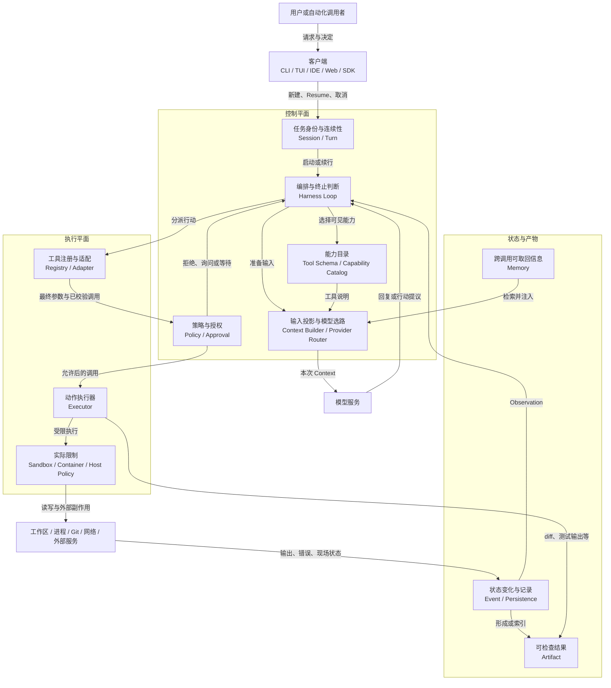
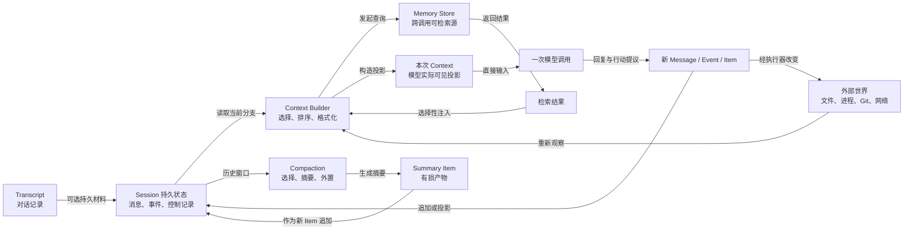

# Agent Harness 统一参考架构

[上一章](03_vertical_lifecycle_walkthrough.md)沿一次配置修复任务解释了 Harness 在什么时候建立会话、准备本轮上下文、调用模型、执行工具、压缩历史或恢复任务。本章把这条时间线折叠成一张结构图：哪些部分负责作决定，哪些部分真正改变工作区，哪些对象承载会话连续性，哪些结果可以交给用户检查。

七个系统没有共享同一套类名或数据库结构。Aider 可以把多项责任集中在一个编码循环里，DeepSeek Harness 可以通过插件组合出运行时，Codex、Gemini CLI、Goose、OpenCode 和 Pi 又以不同方式拆开会话、调度、事件与执行。统一参考架构的作用，是为这些设计提供一组最少但稳定的中文解释，而不是要求它们改造成同一种产品。

## 总体结构：控制平面决定，执行平面行动

图 4-1 先给出全貌。一次请求从客户端进入会话，由 Harness 循环组织下一步；上下文构造器选择模型本次可见的内容，模型服务路由器负责连接具体模型服务。模型若提出工具动作，能力目录与工具适配层先把它解析成明确调用，权限策略决定是否放行，执行器再在沙箱、容器或宿主限制下访问工作区。执行结果以事件和环境观察回流，同时形成可以保存或交付的任务产物（Artifact）。



*图 4-1　Agent Harness 统一参考架构。控制平面组织任务和授权，执行平面改变工作区或外部资源，状态与产物沿结果路径回流。*

控制平面与执行平面是责任划分，不一定是两个进程。单进程 CLI 可以同时包含输入、模型循环、工具执行和终端输出；服务化产品则可能让客户端只负责提交请求和显示事件，由后台服务持有会话，再把工具交给容器或协议服务器执行。前者部署简单，但共享同一权限与故障域；后者更容易隔离和支持多客户端，却要额外处理身份、断线、取消和状态同步。

模型位于控制循环的服务边界，而不是整个系统的中心。模型服务适配层（Provider）负责把请求翻译成某个模型接口所需的消息与流，上下文构造器决定这次请求带什么内容，Harness 循环决定收到回复后是结束、调用工具还是继续。把三项责任分开看，才能区分“模型服务重试了一次”“当前轮次重新采样”和“整个任务从持久记录恢复”这三种不同事件。

工具描述（Tool Schema）、授权和执行限制也要分开理解。Tool Schema 告诉模型可以提出什么动作；权限策略判断这一次动作是否允许；沙箱、容器和操作系统权限限制动作获准后实际能触达的资源。例如，模型能看见 `bash` 能力，只表示它可以提出命令，并不自动得到执行许可。用户批准一条命令，表达的是本次意图；执行环境仍要限制路径、网络和进程能力。

## 八个核心对象：一项任务由什么组成

为了让后续章节使用同一套语言，本报告采用八个核心对象。它们是逻辑概念，不要求项目中存在同名类型。一个实现可以把多个对象放在同一结构里，也可以用多个服务共同实现一个对象。

| 对象 | 含义 | 在配置修复任务中的例子 |
| --- | --- | --- |
| **Session** | 围绕一项可连续或恢复任务的逻辑容器，关联身份、历史与控制状态 | “修复配置解析错误”这项任务及其多次交互 |
| **Turn** | 从一次新输入或内部续行开始，到完成、失败、取消、等待或交还控制为止的处理区间 | 用户发出请求后，模型经历多次读写与测试，最终返回说明 |
| **Message** | 具有语义角色的内容，如用户输入、模型回复或工具结果 | 用户要求、模型解释、测试失败文本 |
| **Event** | 表示状态随时间发生变化的通知或记录 | 工具进入执行、审批被拒绝、测试结束 |
| **Item** | 可排序、引用或展示的工作单元，可容纳消息、工具调用、结果、审批与摘要 | 一次文件读取调用及其结果 |
| **Context** | 某一次模型调用实际可见的输入投影 | 项目指令、相关历史、文件片段和工具说明 |
| **Memory** | 位于当前调用之外、可保存并在以后检索或注入的信息源 | 可跨任务取回的项目约定或用户偏好 |
| **Artifact** | 任务产生、可被外部检查或后续消费的有界结果 | diff、修改后的文件、带退出状态的测试输出、最终报告 |

这些对象构成了任务的基本关系。一个 Session 可以包含多个 Turn；一个 Turn 可以读取旧 Item，并产生新的 Message、Tool Call、Tool Result、审批或摘要 Item。Message 强调“内容扮演什么角色”，Event 强调“状态发生了什么变化”，因此同一个测试结果既可以作为工具结果进入模型历史，也可以触发“测试已完成”的 Event。Artifact 面向任务外部：用户可以检查 diff 和测试输出，而内部调度器的等待状态通常只是 Event，不是交付物。

Turn 的边界由控制权变化决定，不必等于一次模型请求。模型可以在同一 Turn 内多次调用工具、根据失败结果再次采样，也可以等待用户批准后继续。若系统把任务交还给用户，用户补充条件后再开始，通常更适合视为新的 Turn。这样的定义适用于集中式编辑循环，也适用于事件驱动会话，不会强迫七个系统共享一种网络协议。

Item 是连接不同实现的缓冲层。结构化 Tool Call、Aider 式编辑提议、审批请求和压缩摘要的编码形式不同，但都可以作为有顺序的工作单元来讨论。Observation 不是第九个核心对象，而是“环境结果被 Harness 用来更新下一步”的角色；它可以由 Message、Tool Result Item 或一组 Event 表达。Resume 也不是对象，而是从持久材料重建可继续控制状态的操作。

最容易混淆的是 Session、Context 和 Artifact。Session 关心任务连续性，Context 关心模型这一次实际看见什么，Artifact 关心任务向外部交付什么。会话中保存了一次“测试通过”的消息，并不等于这条消息必然进入下一次 Context；即使进入，也不等于当前工作区仍通过测试。只有重新运行并得到新的退出状态，才能形成当前可检查的测试 Artifact。

## 本轮上下文、可检索记忆与压缩：保存和看见是两回事

图 4-2 展开信息如何进入模型。Session 保存消息、事件和控制记录；Context Builder 从中选择当前分支所需材料，并按需查询 Memory；Compaction 把过长历史变成有损摘要，再把摘要作为新的 Item 放回 Session。模型只消费当次 Context，不会直接读取整个会话或整个 Memory Store。



*图 4-2　Context、Session、Memory 与 Compaction 的关系。Session 保存任务材料，Memory 通过检索进入 Context，Compaction 只改变模型可见的历史表示。*

可以用一个简单表达式概括这一步：

```text
本次 Context = 选择（Session 当前分支、用户新输入、项目指令、工具说明、
                      检索到的 Memory、刚刚观察到的环境状态）
```

“选择”会受到模型窗口、令牌（Token）预算、客户端能力和安全策略影响，所以同一 Session 的相邻两次调用不必看见相同内容。Context 回答“模型现在知道什么”，Session 回答“任务过去保存了什么”，Memory 回答“哪些信息以后可以找回”，Compaction 回答“过长材料如何被压缩成新的可见表示”。

对话记录能够帮助恢复，但通常不足以复原某次旧 Context。系统提示可能升级，工具集合可能变化，项目文件与环境变量也会漂移；当时被截断的命令输出或临时编辑器状态甚至可能从未写入记录。Resume 因而是在旧材料基础上构造一个新的 Context，而不是让时间回到原来的模型调用。

摘要也不会自动成为长期 Memory。若摘要只是在压缩后替代旧消息，它只服务当前 Session；要成为可跨调用检索的信息，还需要明确的保存、索引、查询与注入路径。反过来，Memory 也不一定是摘要，它可以是用户偏好、项目知识库或外部检索系统。两者的共同要求是保留来源和新鲜度，让新的文件读取与测试能够推翻过时信息。

Compaction 是有损变换，至少要保住几项不变量：用户目标和禁止事项仍可识别，未完成调用不会被总结为已完成，最近的失败与修改位置仍可追踪，Session 身份与分支关系不会因摘要而改变。若系统把“测试曾失败”压成“测试已处理”，下一轮就可能错误结束任务。Token 节省因此不是简单删除最旧消息，而是保护约束和未决状态的选择问题。

## 能力、协议与客户端：同一工具为什么会有不同体验

能力回答“系统能做什么”，协议回答“组件怎样表达请求和结果”，客户端回答“谁怎样使用这些能力”。文件读取、补丁编辑、Shell、Git、搜索和测试属于能力；MCP、Agent 客户端协议（Agent Client Protocol，ACP）、应用内消息或模型接口可以承载这些能力；CLI、TUI、IDE、Web 与 SDK 则负责选择入口、展示进度和收集用户决定。

三层可以重合，却不能互相代替。某个系统提供 MCP 服务，并不表示默认 CLI 已经启用该服务；TUI 能显示审批，并不保证无界面的 SDK 会采用同样交互；Shell 能运行 Git，也不表示 Harness 实现了 Git 事务。多入口产品尤其需要说明哪些入口共享 Session 和执行策略，哪些入口只有相同的模型调用，却采用不同的工具集或权限方式。

SWE-agent 对 Agent–Computer Interface 的研究提供了一个实用视角：能力的质量不只由工具名称决定，还取决于参数是否简洁、工作目录是否明确、错误是否完整、输出是否标记截断、调用与结果是否能准确配对 [@yang2024sweagent]。这也解释了协议适配器的真正职责。适配器不能只转发一段数据，还要保留流式增量、调用标识、取消、结束原因、并发顺序和错误语义；若把拒绝包装成成功文本，下一层就会对现实状态产生错误判断。

扩展同时改变能力和信任。进程内插件（Plugin）或扩展（Extension）可以注册工具、改写 Context、拦截调用，并继承宿主进程权限；协议外部工具改善语言和进程解耦，却引入服务器身份、凭据、网络和描述漂移问题。无论能力从哪里接入，“模型看得见工具”“动作得到授权”“执行器可以访问资源”仍然是三个需要分别回答的问题。

## 信任边界：意图、授权与后果

从模型提议到外部副作用，可以沿五个问题检查：输入来自哪里，谁根据最终参数作出决定，哪个执行器真正访问资源，过程保存了哪些状态，出错后怎样恢复或补偿。这个顺序能把界面上的“允许”按钮还原成完整行动链。

输入可能来自用户、仓库文件、命令输出、模型服务、恢复历史以及插件或协议对端。它们都可以进入 Context，却不具有同等信任。例如，仓库说明可能包含诱导模型读取凭据的文本；这段文本只是输入，模型据此生成的 Shell 命令仍是待审批的行动提议。权限策略应检查最终命令、工作目录和目标资源，执行环境还要限制文件、进程、网络与凭据。

Saltzer 与 Schroeder 提出的完全仲裁与最小权限原则，分别要求每次访问都经过检查，并只授予完成任务所需的最小权力 [@saltzer1975protection]。放到 Harness 中，工具注册时检查一次并不够，批准之后的扩展也不应悄悄扩大路径或网络目标。人类确认表达意图，运行时策略形成授权，沙箱、容器和操作系统权限限制后果；三者叠加，才能覆盖从“想做”到“实际做了什么”的全过程。

记录能够支持恢复，却不能自动撤销动作。文件写入完成后，后置钩子（Hook）拒绝展示结果也无法抹去修改；测试进程被取消前可能已经创建缓存；网络超时前，远端可能已经收到请求。回滚恢复研究将内部状态恢复与外部输出一致性分开处理 [@elnozahy2002rollback]。因此，Harness 在 Resume 后读取文件、检查进程与 Git 状态，再决定重试、补偿或交给用户处理。

这条边界也决定完成条件。diff、测试输出和最终解释都是 Artifact，但它们回答不同问题。diff 显示工作树差异，测试输出记录一条命令在某个环境中的结果，最终解释把原因、改动和限制交给人类。会话中保存一句“测试通过”只是一条历史内容；当前是否通过，仍取决于新鲜的执行结果。

## 七个系统怎样落在这张架构图上

表 4-2 只回答参考架构中的责任在哪里聚合，以及状态记录与实际执行之间怎样分界。各产品的完整能力画像已经由第二章给出，这里不再重复。

| 系统 | 主要责任聚合点 | 状态与执行边界 |
| --- | --- | --- |
| **Aider** | 一个集中的编码循环组合上下文、模型交互、编辑和 Git | 对话维持连续性；编辑和命令直接作用于宿主工作区 |
| **Codex** | 会话、轮次、工具路由和执行器分层协作 | 有序工作单元与事件进入任务记录；审批和沙箱分别约束执行 |
| **DeepSeek Harness** | 宿主组合装入会话、路由、工具和治理，Agent 预设决定可见能力 | 持久会话事件与运行事件分开；权限、沙箱和存储随组合装配 |
| **Gemini CLI** | 客户端与轮次组织模型循环，工具调度器承接行动 | 流式事件服务界面，追加记录支持续接；策略、确认和沙箱分层 |
| **Goose** | Agent、会话管理与扩展管理分别承担循环、状态和外部工具 | 运行事件回到客户端，持久会话另存本地；确认与可选容器协同 |
| **OpenCode** | 会话服务、执行循环、工具和权限围绕持久存储协作 | 消息与工具状态进入数据库，事件流更新客户端；规则控制行动 |
| **Pi** | 小型循环、模型运行时与树形会话各自保持清晰边界 | 事件驱动界面，树形记录保留分支；逐调用限制主要交给扩展或宿主 |

这张映射呈现三种责任密度：集中式循环把多个对象压进同一路径，分层式运行时让会话、调度和执行各自持有状态，组合式系统则把“本次装入哪些责任”本身作为配置。无论采用哪一种，界面事件、持久记录与外部副作用仍是三类不同事实：客户端显示过结果，不等于结果已经持久化；能够读回历史，也不等于旧进程和外部效果可以恢复。最终参数在哪里获准、实际资源在哪里受限、结果怎样回到当前会话，才是参考架构需要保留的稳定问题。

## 本章小结

统一参考架构把 Agent Harness 看成三组相互连接的责任：控制平面解释目标、组织 Context、调用模型并作出授权决定；执行平面把获准动作变成文件、进程、Git 或网络上的真实变化；状态与产物把结果送回循环、保存到 Session，并形成可检查的 Artifact。八个核心对象进一步说明了任务怎样保持连续：Session 包含多个 Turn，Message 与 Event 从不同角度描述变化，Item 容纳工作单元，Context 是一次模型调用的投影，Memory 提供可检索信息，Artifact 则面向外部交付。

最值得带入后续章节的三条边界是：保存的 Session 历史与模型本次看到的 Context 不相同，Compaction 摘要与可检索 Memory 不相同，工具可见、动作获准和执行环境能够触达资源也不相同。接下来的机制章将以这张架构图为坐标，分别深入 Harness Loop、Provider、Context、Tool Call、扩展、Memory、Resume、Compaction、Subagent 与安全控制。
