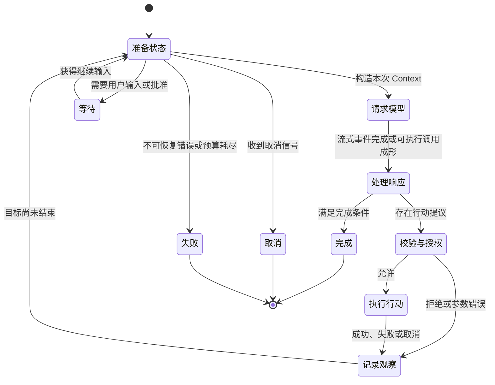

# Harness Loop：从一次模型响应到持续任务

前四章已经建立了 Agent Harness 的工作定义、横向能力地图、任务生命周期和统一参考架构。本章沿用[统一参考架构中的八个核心对象](04_reference_architecture.md#八个核心对象一项任务由什么组成)，尤其沿用其中对轮次（Turn）的定义：Turn 从一次新输入或内部续行开始，到完成、失败、取消、等待或交还控制为止；它可以包含多次模型请求和多次工具执行。

仍以[序章建立的配置修复案例](00_index.md#一句话请求先要落到正确的工作区)为教学案例。模型第一次响应也许只建议搜索配置入口，也许同时提出读取文件和运行测试。真正的问题不是怎样获得这段响应，而是系统怎样在目标尚未完成时继续，怎样让每个行动接受现实反馈，又怎样在完成、等待和失控之间作出可靠区分。Harness Loop 就是承担这项持续控制责任的运行循环。

## 为什么一次响应不等于一个 Agent

一次模型响应是一次受当前输入约束的生成结果。它可以包含解释、候选答案或行动提议，却不会因为写出了“我将读取文件”就真的访问磁盘，也不会因为写出了“测试通过”就产生新的测试记录。即使模型在单次生成中给出很长的推理链，它仍然只是在已有信息上继续生成。思维链提示（Chain-of-Thought Prompting）说明中间推理步骤可以帮助复杂推理，但它并没有为模型增加环境读取、动作执行或取消语义 [@wei2022chain]。

Agent 的关键变化来自闭环：行动能够改变环境或取得新信息，环境观察（Observation）又进入下一次决定。ReAct 把推理与行动交错起来，说明外部观察怎样帮助模型更新计划和处理例外 [@yao2023react]。在配置修复中，第一次搜索没有命中、补丁无法应用、测试命令写错或测试暴露新分支，都可能推翻先前判断。没有 Observation，模型只能在旧信息上把同一个猜测说得更完整；有了 Observation，下一步才受真实工作区约束。

这仍不足以构成工程上的 Agent。模型负责提出下一步候选，Harness 还要决定怎样表示行动、何时执行、结果怎样关联、失败是否继续、何时等待用户，以及任务何时结束。认知语言智能体（Cognitive Language Agent，CoALA）的组织框架把行动空间区分为内部记忆操作和外部环境操作，并把 Agent 看成持续的决策过程 [@sumers2024coala]；这一视角有助于解释循环为何大于模型调用，但它不替代具体 Harness 的会话、权限、并发和取消实现。

因此，要区分三个时间尺度。一次**模型请求**从 Context 发出，到流式响应结束；一次 **Turn** 可以在同一用户输入下反复请求模型、执行工具和吸收结果；一个 **Session** 则容纳多个 Turn，并为暂停、恢复或分支保存任务连续性。把三者混在一起，会产生常见误判：模型请求结束被当成任务结束，工具返回被当成新用户 Turn，或者 Session 能恢复被当成旧进程仍在运行。

配置修复的第一段响应可能只是“先搜索配置键并读取解析器”。Harness 解析这个提议，执行搜索，把命中位置送回模型；模型再请求读取代码、提出编辑、运行测试，直到生成一份可以交付的说明。沿这条链看，Agent 不是一个静态对象，也不是某段 Prompt 的别名，而是目标、状态、模型和执行环境在 Loop 中持续耦合后的行为。

> **学术背景｜语言反馈能延续判断，但不等于恢复执行**
>
> Reflexion 展示了如何把失败后的语言反思写入情景记忆缓冲区，供后续试次改进决策 [@shinn2023reflexion]。这能解释“把测试失败总结成下一轮提示”为什么有用，却不能说明文件写入是否已经发生、进程是否仍存活或网络请求是否提交。语言反馈属于可再次输入模型的信息；外部副作用的状态仍要由 Harness 重新观察。

## Turn、状态与循环不变量

Turn 的边界由控制权变化决定，而不是由模型调用次数决定。用户提交修复请求后，模型可以连续读取、编辑和测试；只要 Harness 没有完成、失败、取消、等待或把控制交还用户，这些步骤仍属于同一 Turn。模型要求用户批准危险命令时，Turn 可以进入等待；批准后继续原 Turn，用户若改变目标或补充新要求，则通常开启新的 Turn。不同产品可以采用不同内部编号，但分析时应保持这条语义边界。

循环每走一步，状态都在变化。至少要知道当前目标与约束、模型本次看见的 Context、已经提出和执行的行动、每个行动的结果、待处理输入、取消信号以及当前终止原因。状态不一定集中在一个对象中：它可能分散在会话记录、内存队列、工具调度器、客户端事件流和工作区里。所谓 Loop，不只是一个 `while` 式控制结构，而是这些状态之间有序推进的协议。

为了让实现差异仍可比较，本章采用表 5-1 的六条循环不变量。这里的“不变量”不是说每个字段永远不变，而是说每次循环边界都必须维护这些关系，否则系统就无法可靠解释自己正在做什么。

| 循环不变量 | 要维持的关系 | 破坏后的直接后果 |
|---|---|---|
| 目标连续 | 用户目标、禁止事项和完成条件在继续执行时仍可识别 | Loop 忙于局部动作，却偏离原任务 |
| 行动可归属 | 每个行动提议都有所属 Turn、调用标识和明确状态 | 并发结果错配，失败被安到另一个动作上 |
| 结果闭合 | 已发起行动最终成为成功、错误、拒绝、取消或结果未知之一 | 悬空调用被误当成完成，Resume 时无法判断是否重做 |
| 观察优先 | 新鲜环境结果可以推翻旧推断、摘要和计划 | 模型重复使用过时事实，错误收敛 |
| 副作用受控 | 参数校验、授权决定与实际执行边界保持分离 | “模型可提议”被误成“模型可任意执行” |
| 终止可解释 | 离开 Loop 时有明确原因，且活动工作已收敛或被标记 | 取消伪装成成功，后台任务成为孤儿 |

*表 5-1　Harness Loop 的六条核心不变量。表中描述的是跨实现的关系，不要求七个系统使用相同字段。*

表 5-1 的第一条保护任务意义，第二至第四条保护事实一致性，第五条保护执行边界，第六条保护控制权。它们互相依赖：若调用没有稳定身份，系统就无法确认结果是否闭合；若取消后仍有工具在后台运行，终止原因再清楚也不能说明副作用已经停止；若压缩丢掉禁止事项，后续动作即使逐个获得结果，也可能沿错误目标稳定前进。

图 5-1 把这些不变量放进一个最小状态机。模型响应只是“采样”状态的输出；只有行动经过校验、授权和执行，Observation 被记录并影响继续判断，Loop 才真正向任务结果推进。

*图 5-1　概念图：Harness Loop 的最小状态机。替代说明：系统在准备状态、模型请求、响应处理、校验授权、执行和观察之间循环，并从明确的完成、等待、取消或失败状态退出；不表示七个固定版本都具有同名组件或全部转换。*

图 5-1 特意把“拒绝”和“工具错误”送入 Observation，而不是直接丢弃。拒绝说明当前参数未获授权，参数错误说明行动表达无效，执行失败说明环境没有按预期变化；三者都会改变下一步，但含义不同。完整的 Loop 不追求所有分支都成功，而是让失败分支也保持可解释、可继续和可停止。

## 行动、执行与 Observation

模型输出进入 Loop 后，首先需要被分类。纯文本可以是给用户的说明，也可以只是工具调用前的进度；结构化 Tool Call、受约束编辑格式或生成后由 Harness 解析的命令，则是行动提议。Harness 不能只根据文本语气判断副作用，而要把最终工具名称、参数、工作目录和调用身份交给明确的执行路径。

行动提议到 Observation 至少经过四层。第一层把 Provider 原生输出规范化为 Harness 能理解的调用；第二层验证工具是否存在、参数是否完整；第三层依据策略决定允许、拒绝或询问；第四层才在工具、宿主进程、容器或沙箱中执行。执行结果随后被规范化为内容、错误、退出状态、截断标记和必要元数据，并用调用标识写回会话。后续的 Tool Call 章节将深入这些接口形态，本章关注它们怎样推动 Loop。

Observation 的价值不等于输出长度。一次 Shell 运行最重要的信息可能是退出状态、最后几行错误和是否被取消；一次编辑最重要的信息可能是目标版本不匹配，因而没有写入；一次文件读取若被截断，则“未看到配置项”不能当作“不存在配置项”。Harness 需要把事实状态与供模型阅读的文本同时保住，避免展示层的压缩改变执行语义。

以配置修复为例，模型先提出搜索旧配置键。搜索结果显示键只出现在兼容层，于是下一步转为读取覆盖顺序；编辑器应用补丁失败，Observation 指出文件已变化，模型必须重新读取；测试进程返回非零退出状态和未知选项，下一轮应先修正测试命令，而不是继续改解析器。每一步的意义都来自“行动改变了哪些已知事实”，不是来自模型是否保持自信。

> **设计取舍｜错误是异常，还是可继续的观察？**
>
> Provider 认证失败、调度器内部损坏等错误通常无法靠模型换一种参数解决，更适合结束当前 Turn 或进入受控重试。文件未找到、补丁冲突、测试失败和权限拒绝则常常是任务语义的一部分，把它们作为带类型的 Observation 送回模型更有价值。边界若过于宽松，系统会让模型反复处理基础设施故障；边界若过于严格，一次正常的工具失败就会中止本可修复的任务。

行动闭合还要求区分“没有结果”和“结果未知”。取消可能发生在请求尚未发出、工具已启动、外部服务已收到请求或结果正在回传的任何时刻。对于只读搜索，重新执行通常代价有限；对于文件写入、Git 推送或网络提交，结果未知意味着 Harness 必须先检查现场，不能用自动重试掩盖不确定性。Loop 的下一步应由动作语义和新观察决定，而不是统一地“失败就再试一次”。

## 流式事件与并行 Tool Call

模型响应和工具结果经常以流式处理（Streaming）的形式逐段到达。流式事件可以让客户端及时显示文本、推理摘要、工具参数增量和执行进度，也让 Harness 在完整响应结束前建立工作单元。然而，流式展示不应提前制造完成事实：半段 JSON 参数、尚未结束的 Shell 输出和只收到开始事件的工具，都不能当成可执行或已完成的结果。

因此，Loop 通常同时维护两种状态：一类是供界面投影的增量状态，例如文本片段和进度；另一类是用于调度和持久化的提交状态，例如完整 Tool Call、最终结果和终止原因。增量可以反复更新，提交状态必须有清楚边界。若程序崩溃，恢复路径也应知道哪些内容只是用户曾经看见的前缀，哪些已经成为可重放的会话记录。

并行工具调用（Parallel Tool Call）进一步放大了这一区别。模型一次可能请求读取多个文件、搜索多个目录或并行运行互不依赖的检查。并行带来较低等待时间，但“同时执行”至少包含三个不同问题：哪些调用允许重叠，最多并发多少，结果按完成顺序还是模型提出顺序写回。只回答第一个问题，还不足以保证后续 Context 稳定。

表 5-2 展示了三种常见策略。无论采用哪种策略，调用标识都必须稳定，单个调用的错误不能吞掉其他已完成结果，取消还要停止继续发起新调用并处理已经启动的工作。

| 策略 | 主要收益 | 主要代价 | 适合场景 |
|---|---|---|---|
| 全部顺序执行 | 状态简单，副作用顺序明确 | 独立读取和检查相互等待 | 编辑、依赖前序结果的命令、共享状态强的工具 |
| 批次并行、完成后按模型顺序提交 | 降低延迟，同时保持稳定历史 | 要缓存先完成结果，并处理慢调用和取消 | 多文件读取、独立搜索、只读检查 |
| 滚动并发池与屏障 | 控制资源占用，遇到独占调用可收敛 | 调度和错误清理复杂 | 大批工具、混合并行与独占操作 |

*表 5-2　Tool Call 并发的三种组织策略。表中的“提交”指结果进入稳定会话与下一轮 Context 的顺序。*

表 5-2 说明并行性不是一个布尔功能。Pi 会在未要求顺序且工具没有声明顺序执行时并行调用，并在批次结束后按原调用顺序形成结果；DeepSeek Harness 的固定版本使用有上限的滚动并发池，独占调用形成屏障，工具主体可以重叠，但策略处理、持久结果和结果 Context 保持模型顺序。Gemini CLI 用独立调度器管理工具批次、确认和状态事件。Codex 则在一次采样中收集工具任务，等待在途工具收敛后再决定是否继续 Turn。它们都在做并发，但稳定顺序、资源上限与取消收敛的落点不同。

流量背压（Backpressure）是另一个容易被界面流畅度遮住的问题。模型事件、工具进度、持久化和客户端消费速度不同；无限缓冲会占用内存，直接阻塞又会让慢客户端拖住工具。实际系统会使用有界通道、批次等待或选择性进度事件来控制压力。对读者而言，更重要的判断标准是：关键终态是否必达，增量事件能否被丢弃或合并，以及消费者断开是否会取消底层任务。

## 终止、取消与防失控

Loop 最危险的错误不一定是工具失败，而是系统不知道自己为什么还在继续。模型可能重复搜索同一路径，反复提交被拒绝的命令，在没有新 Observation 时改写同一解释，或因为错误的完成判断过早结束。防失控不是给模型追加一句“不要循环”，而是让 Harness 在模型之外维护预算、进度、权限和终止状态。

第一层控制是**有界推进**。系统可以限制模型步数、Turn 内请求数、工具并发、输出长度、总 Token、费用或时间。上限不是完成判定，只是最坏情况的资源边界；达到上限时应产生“预算耗尽”或“需要用户决定”的终止原因，而不是伪装成成功。Gemini CLI 的固定版本为递归续行设置最多一百次 Turn，并另有重复模式检测；Goose 和 OpenCode 可以按会话或 Agent 配置限制轮数或步骤；Aider 对自动反思修正设置次数上限。这些机制覆盖的单位不同，不能只比较数字大小。

第二层控制是**检测没有进展的重复**。重复工具名并不一定有问题，例如测试—编辑—再测试本来就会重复；真正可疑的是相同参数、相同结果和相同决策连续出现，却没有新的事实进入 Context。OpenCode 会在短窗口内识别重复工具调用并转入权限询问，Gemini CLI 的循环检测器会尝试给模型一次重新思考的反馈，并在重复升级时停止。检测策略需要容忍合理重试，也要避免让模型自行决定重复是否安全。

第三层控制是**对每次副作用重新仲裁**。自动化可以在信息获取、分析、决策和行动实施阶段采用不同的人机参与程度 [@parasuraman2000automation]。允许模型自动读取代码，不等于允许它自动写文件或访问网络；允许一条命令，也不等于批准参数变化后的下一条命令。权限策略应在参数成形后作决定，执行环境再限制实际可触达资源。工具风险研究也说明，只评估任务是否成功不足以覆盖 Agent 行动风险，执行或仿真与安全评估需要独立于策略模型 [@ruan2024toolemu]。

第四层控制是**取消收敛**。取消信号通常是协作式的：模型流、调度器和工具需要主动观察它。可靠实现会停止发起新调用，标记未开始调用，等待或终止已经开始的工作，关闭进度流，并写入明确的取消终态。它仍然不能保证撤销已经发生的外部效果。回滚恢复研究指出，内部检查点不能自动收回已经对外产生的输出 [@elnozahy2002rollback]；因此，取消后的第一步常常是检查文件、进程、Git 和远端状态，而不是宣布“一切已撤销”。

> **安全提示｜取消不是回滚**
>
> 攻击或事故的前提可以只是一个高副作用工具已获准并开始执行。此后用户按下取消，最多要求系统停止后续工作和尽快终止可控进程；已经写入的文件、启动的后台任务、发送的网络请求或远端提交可能仍然存在。缓解方向包括更小权限、幂等请求标识、事务或临时工作区、执行后核对，以及把“已取消但副作用未知”作为独立终态交给用户处理。

最后一层控制是**完成证据**。模型没有 Tool Call，只能说明本次响应没有继续提出行动；它不自动证明用户目标满足。对于配置修复，Loop 应根据最新 diff、测试退出状态和剩余问题判断是否交付。若停止钩子、完成工具或用户策略要求进一步验证，系统可以阻止结束并把原因写回下一步。完成应是 Harness 对目标、状态和 Observation 的联合判断，而不是从一句“Done”中解析出来。

## 七个系统如何组织 Loop

七个固定版本都形成了行动—观察闭环，但它们选择了不同的“最小可控单位”。表 5-3 按循环中心、继续条件、并发与防失控落点组织比较。这里比较的是主要产品路径；实验路径、扩展路径和不同配置会改变具体行为。

| 系统 | Loop 的主要组织中心 | 何时继续 | 并发与流式特点 | 终止与防失控落点 |
|---|---|---|---|---|
| **Aider** | 集中的编码循环与编辑事务 | 编辑格式失败、lint 或测试失败可形成反思输入 | 主要围绕单次模型流和顺序编辑反馈；不是通用并行工具调度器 | 用户中断、Provider 重试上限、反思次数上限和交互确认 |
| **Codex** | Session 中的 Turn、采样步骤与事件 | 工具调用、待处理输入、停止钩子或上下文续行要求继续 | 响应增量映射为事件，在途工具收敛后进入下一次采样 | 取消令牌、明确 TurnComplete/TurnAborted、停止钩子和 Token 边界 |
| **DeepSeek Harness** | 持久的 Turn/Step 事件与插件检查点 | 工具结果或下一步输入进入下一 Step；待处理消息可开启后续 Turn | 有界滚动并发池，独占调用形成屏障，结果按模型顺序提交 | 显式取消收敛、未分发调用合成错误结果、平衡的 Turn 终态与不变量检查 |
| **Gemini CLI** | 客户端 Turn 与独立 Tool Scheduler | 工具结果、续说判断或钩子反馈触发后续 Turn | 模型流生成工具请求，调度器管理批次、确认、执行和进度 | 最大 Turn 数、循环检测与恢复提示、用户取消和策略拒绝 |
| **Goose** | 默认经典回复循环；可选有序状态机 | 工具结果、用户引导、停止钩子或最终输出决定继续 | 经典路径可合并多个工具流；状态机把操作排成可重入流水线 | 最大轮数、取消令牌、停止钩子上限；新状态机需显式环境开关 |
| **OpenCode** | 持久 Session 消息、Step 与流处理器 | 仍有工具调用、压缩任务或子任务时继续 | 流式增量直接更新消息部件，工具状态按调用标识结算 | Agent 步数、重复调用询问、权限拒绝策略、取消时清理悬空工具 |
| **Pi** | 小型事件循环与可扩展工具钩子 | 工具结果、steering 或 follow-up 消息存在时继续 | 默认可并行，顺序工具形成整批顺序路径；结果稳定回写 | AbortSignal、输出截断时禁止执行不完整调用、可配置 Turn 后停止钩子 |

*表 5-3　七个 Harness 的 Loop 组织方式。比较聚焦固定版本中可从入口追踪到的主路径，不把项目定位差异解释为高低排名。*

表 5-3 显示，集中式 Loop 的优势是路径短、编辑反馈紧密。Aider 在一个编码器对象中组织模型请求、编辑应用、默认 lint，以及按配置启用的测试和 Git 提交；编辑格式不合规会直接成为下一次反思消息。代价是它的自然抽象是“完成一次代码编辑事务”，而不是任意工具组成的统一调度图。Architect 模式还可以把方案交给专门编辑模型，但这仍是固定的双阶段流水线，而不是通用多 Agent 编排 [@gauthier2024aiderarchitect]。

事件化运行时更强调状态边界。Codex 在一个用户可感知 Turn 内进行多次采样，工具请求会产生后续采样需求，响应文本、推理、工具参数和完成原因分别成为流式事件；Turn 结束前等待在途工具，取消则形成独立的中止终态。OpenAI 的官方 Loop 长文以 turn、thread、Responses API 输入与工具结果回流解释这条持续路径，同时明确区分 CLI Harness 与 Cloud/VS Code 产品环境 [@bolin2026codexloop]。OpenCode 让会话数据库中的消息和工具部件直接承载运行状态：Provider 即使错误返回普通停止原因，只要仍有未结算 Tool Call，Loop 仍会继续；中断清理会把悬空调用标为错误，避免下次把它们当成成功。其 `CONTEXT.md` 把 Provider Turn 与 Session Drain 写成维护者的运行时契约词汇，但这份设计文档不证明所有 Provider 已满足相同不变量 [@opencode2026sessionruntime]。

DeepSeek Harness 把循环不变量表达得最显式：Turn 内包含一个或多个 Step，开始和结束事件必须配对，工具调用及结果保留来源关系。其并发池允许工具主体重叠，却让策略、结果持久化和下一步 Context 按模型顺序提交；取消时不再启动新调用，并为未分发调用补齐可解释的错误结果。这种设计提高了回放与竞态处理的确定性，代价是需要维护更多事件和收敛规则。

Gemini CLI 和 Goose 都把“循环”进一步拆成编排层。Gemini CLI 的 Turn 负责解析 Provider 流和产生工具请求，Scheduler 负责策略、确认与工具生命周期，客户端再决定何时续行。Goose 的默认路径保留既有的经典回复循环，同时固定版本还提供由环境开关启用的状态机；以 `!` 开头的 Shell 输入也能进入该状态机。双路径有利于逐步迁移，但分析或调试时必须先确认请求实际经过哪一条 Loop。

Pi 则把共性机制压进较小内核：事件流描述消息和工具生命周期，外层 Loop 接受 follow-up，内层 Loop 处理 Tool Call 与 steering；工具可通过前后钩子改变结果或要求终止。它默认允许并行执行，但任一工具声明顺序执行时会把该批次转成顺序路径。这种小内核便于嵌入，逐调用审批、沙箱和更复杂的资源治理则更多由宿主或扩展承担。

> **设计取舍｜让提交顺序追随模型，还是追随完成时间？**
>
> 按完成时间立即写回延迟最低，模型却可能在不同运行中看到不同结果顺序；按模型提出顺序提交更稳定，也会让先完成的结果等待慢调用。DeepSeek Harness 和 Pi 的固定版本都保留模型顺序，但前者用有界滚动池和独占屏障组织大批调用，后者以整批并行后顺序回收为主。选择取决于工具规模、是否需要回放、慢调用比例和共享副作用，而不是并行越多越好。

## 本章小结

一次模型响应不等于一个 Agent，因为它既没有持续任务状态，也没有把行动变成受控副作用、把现实结果带回下一步的能力。Harness Loop 把多个模型请求、Tool Call、Observation 和控制决定组织在一个 Turn 中；Session 再把多个 Turn 连接成可持续任务。目标连续、行动可归属、结果闭合、观察优先、副作用受控和终止可解释，是不同实现都必须维护的六条关系。

七个系统的差异主要落在控制中心和提交边界：Aider 围绕编辑事务，Codex 与 OpenCode 围绕会话事件，DeepSeek Harness 显式维护 Turn/Step 和有序并发，Gemini CLI 把模型 Turn 与工具调度拆开，Goose 并存经典循环与可选状态机，Pi 保持小型可扩展内核。它们没有共同的最佳循环形状；Loop 越通用，通常越需要更细的调用身份、并发、取消和持久状态，Loop 越专注于编辑事务，则越能把 lint、测试和 Git 反馈紧密收束。

下一章将从 Loop 的模型边界继续向内追问：不同 Provider 怎样表达消息、流式响应、结束原因和 Tool Call，Harness 又怎样在保留原生能力的同时建立可迁移的模型接入层。之后的 Tool Call、Session、可靠性与安全章节，会分别展开本章已经建立的行动关联、取消收敛和防失控基础。
