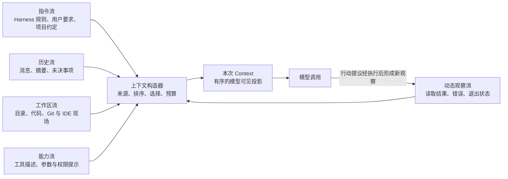

# 上下文构造与指令系统

[一次任务的纵向生命周期](03_vertical_lifecycle_walkthrough.md#本轮上下文context模型这一刻究竟看到了什么)已经建立了一个直觉：会话里保存了什么，和模型这一次真正看见什么，并不是同一件事。[统一参考架构](04_reference_architecture.md#八个核心对象一项任务由什么组成)进一步把本轮上下文（Context）定义为一次模型调用的输入投影。本章沿用这些定义，不再重新发明 Session、Message、Event、Item、Memory 或 Artifact，而是深入回答投影是怎样形成的：哪些指令先进入，工作区和代码如何被选择，动态现场怎样更新，容量不够时舍弃什么，以及为什么仓库文件和工具结果不能因为进入 Context 就获得更高权威。

继续使用[序章建立的配置解析错误案例](00_index.md#一句话请求先要落到正确的工作区)。用户只说“定位并修复错误”，模型却至少需要知道当前仓库、项目规则、相关代码、已有报错、可用工具和最近一次观察。少了任何一类，模型都可能在错误目录工作、违反局部约定、调用不存在的能力，或者把过时输出当成当前事实；把所有材料原样拼在一起，又会超过窗口、淹没关键约束，并把不可信文本混入指令。Context 构造因此不是排版工作，而是 Harness 每次调用模型前执行的一次受预算、来源和信任边界约束的状态投影。

## Context 为什么不只是 Prompt

提示词（Prompt）通常指发送给模型的一段或一组内容；Context 则是这次调用所依赖的完整可见状态。它可能最终被序列化为系统角色（system）、开发者角色（developer）、用户角色（user）、模型角色（assistant）和工具角色（tool）等消息，也可能被某个 Provider 转换成另一套角色或内容块，但序列化格式不是机制本身。真正需要解释的是：系统从哪些状态中取材，以什么顺序和角色呈现，哪些材料只在本轮有效，以及哪些来源在窗口不足时仍必须保留。

以配置修复的第一轮为例，用户目标只是入口。Harness 还可能加入基础行为规则、项目级 `AGENTS.md` 或 `GEMINI.md`、当前工作目录、仓库结构、模型可见的工具描述和原始报错。搜索之后，下一轮又会加入文件片段、命令退出状态和新的目录指令。模型看见的是这些材料在某一时刻的组合，而不是“整个仓库”“整个 Session”或 Harness 内部全部状态。

图 7-1 把这次投影分成五类输入。指令流回答“应该怎样做”，历史流保留任务连续性，工作区流提供代码和环境事实，能力流声明可以提出哪些动作，动态观察流则让现实结果更新旧判断。上下文构造器同时应用来源规则、选择策略和容量预算，才形成模型输入。

*图 7-1　概念图：Context 的五类输入与循环更新。图中的箭头表示信息进入当次模型调用，而不是来源之间具有相同权威；不表示七个固定版本都具有同名组件或全部转换。*

图 7-1 也解释了为什么“加长 Prompt”不能替代 Context 系统。检索增强生成（Retrieval-Augmented Generation，RAG）说明系统可以从窗口外取回材料，再把检索结果作为生成条件 [@lewis2020rag]；虚拟上下文研究也把主窗口与外部存储之间的显式换入、换出区分开来 [@packer2023memgpt]。两者提供的共同启发是：系统拥有的信息可以多于模型此刻可见的信息。但 Coding Harness 还要额外处理文件是否仍新鲜、工具结果属于哪次调用、项目规则适用于哪个目录，以及取回内容能否触发真实副作用。Context 因而是运行时状态的投影，而不仅是知识检索的结果。

## 指令来源、层级与冲突

Context 中最容易混淆的是“先出现”“更具体”和“权威更高”。三者并不相同。Harness 的基础指令规定通用行为和工具使用边界；用户直接输入表达本次目标与约束；项目指令描述仓库内的构建方法、代码风格和目录规则；Skill、扩展或 MCP 服务还可能提供专门工作流和工具说明。它们可以按某种顺序拼接，却不能仅凭靠后出现就覆盖前面的约束。

项目指令内部常采用目录作用域。根目录规则适用于整个仓库，子目录规则只约束更小范围；当两者冲突时，更具体的规则通常应优先。Codex 从项目根到当前目录加载多层 `AGENTS.md`，并用来源信息区分宿主用户指令与项目文档；DeepSeek Harness 的工作区指令文本直接说明“更具体的规则优先”，同时声明项目规则不覆盖 system、developer 或用户的直接要求。Pi 沿 cwd 祖先链加载每层首选的 `AGENTS.override.md`、`AGENTS.md` 或 `CLAUDE.md`。OpenCode 在启动时装入全局和项目规则，读取更深目录的文件时再补入尚未出现的局部规则。共同问题是作用域继承，不是文件名本身。

另一类冲突来自时间。旧 Context 说“工作目录是 A”，恢复后现场变成 B；早先的项目指令文件后来被修改或删除；摘要说错误在加载器，新搜索却证明错误来自覆盖层。此时，新观察应替换同类旧状态，而不是与旧文本并列后让模型自行猜测。Codex 的世界状态（World State）会为 AGENTS 指令生成替换或移除通知，DeepSeek Harness 会在 read、write、edit 触及路径后调和指令的新增、替换与移除。这类机制表达的是“新状态使旧状态失效”，不同于“低层指令推翻高层规则”。

> **学术背景｜指令层级不等于字符串顺序**
>
> 指令层级研究指出，模型可能把系统提示与用户或第三方文本视为近似平权的自然语言，并提出通过训练让模型忽略与高特权指令冲突的低特权内容 [@wallace2024instructionhierarchy]。这说明 Harness 仅在文本前加一个标题，并不能保证冲突一定按预期解决。工程上仍应保留来源、使用合适角色、限制低信任内容能够触达的能力，并在最终动作处实施授权。本章只建立这一交叉点；从提示词注入到工具执行的完整攻击链留给第 17 章。

因此，一个可解释的指令系统至少要回答四个问题：来源是谁，适用范围在哪里，何时装入或失效，与更高权威内容冲突时如何处理。具体模型 API 是否提供 system 或 developer 角色，只决定表达手段；Harness 仍需先建立自己的来源和覆盖规则，再由 Provider 层翻译。否则，同一份项目说明在不同模型上可能因为角色降级而悄悄改变语义。

## Workspace、代码与动态上下文

指令告诉模型怎样工作，工作区（Workspace）则告诉模型工作发生在哪里。一个可靠 Context 不能只出现路径字符串，还要让当前目录、仓库根、额外工作区、平台、日期、文件状态和可用执行环境彼此一致。恢复旧任务时尤其如此：Session 可以保存原 working directory，却不能保证目录仍存在，也不能保证当前进程已经切回那里。

七个系统都在不同位置处理这类绑定。Aider 先确定 Git root，再把可编辑文件名解释为相对该根目录的路径；若启动时猜错仓库，会用正确根目录重新解析配置。Goose 把 working directory 保存到 Session，恢复时若当前目录不同，交互模式会询问是否切回，非交互模式则明确警告仍停留在当前目录。Pi 在选择或恢复 Session 后才确定最终 cwd，并据此重新创建项目设置、资源加载器、模型和工具服务，避免用启动目录误解另一个项目的配置。

动态上下文还包括界面和执行现场。Gemini CLI 的初始用户消息可以包含工作区目录树、操作系统、日期和项目临时目录；IDE 模式第一次发送活动文件、光标、选区与其他打开文件，后续只发送变化。它还会在模型刚发出函数调用（function call）、等待函数结果（function response）时延迟 IDE 更新，因为在两者之间插入普通用户消息会破坏 Provider 要求的调用—结果相邻关系。Codex 则为每个模型调用步骤（Step）固化具体模型、环境、工作区根目录（workspace roots）、权限、MCP 连接和工具计划，再把 cwd、网络、时区或权限变化投影成新的 Context 条目。

这些机制揭示一个重要原则：动态 Context 是带时间的观察，不是永久事实。IDE 中的选区可以解释用户此刻关注什么，却不能代替重新读取文件；目录树可以帮助定位入口，却不证明某个文件内容；一次测试输出记录的是某个命令在某个环境下的结果，也不保证恢复之后仍成立。SWE-agent 对智能体—计算机接口的研究同样强调工作目录、错误、截断标记和调用—结果配对会影响软件工程 Agent 的行为 [@yang2024sweagent]。Harness 应让来源和新鲜度足以支持下一步判断，而不是把所有动态材料包装成无差别的背景文字。

## 文件选择、Repo Map 与检索

仓库级任务的核心矛盾是：模型需要跨文件关系，却通常不能读取整个仓库。实际系统主要采用三种互补路径。第一种是显式文件集合，把用户或 Agent 已选择的少量文件完整放入 Context；第二种是结构摘要，只发送文件名、关键符号及其关系；第三种是按需检索，让模型通过 glob、grep、语言服务器或 read 工具逐步扩大视野。

Aider 对前两种路径的区分最清楚。已加入对话的可编辑文件和只读文件会以完整内容进入独立消息区块，Repo Map 则把其余仓库表示成只读结构摘要。它从 tree-sitter 提取定义和引用，构造文件间图，用当前消息提到的文件、标识符和已在对话中的文件调整排序，再在 `map_tokens` 预算内选择接近目标大小的树。Repo Map 的价值不是代替源码，而是先告诉模型“哪些文件和符号值得读取”；模型真正修改前仍需要取得目标文件内容。

仓库级代码补全研究也表明，多文件信息往往要经过检索—生成的迭代，而不是一次性全部放进窗口 [@zhang2023repocoder]。这一结论可以解释 Coding Agent 为什么需要反复搜索与读取，但不能把 Aider Repo Map、grep 或语言服务器直接称为 RepoCoder 实现。Repo Map 利用静态符号关系形成全局骨架，迭代检索则根据当前问题不断提出新查询；两者的更新成本、召回方式和错误模式不同。

其他系统更多依靠第三条路径。Gemini CLI 可在首轮提供受 ignore 规则过滤的目录树，并让搜索与读取工具继续缩小范围；OpenCode 的 read 工具读取文件时，还会沿该文件目录向上发现尚未装入的局部指令。DeepSeek Harness 的本地 `@file` 搜索只索引有界的路径候选，默认排除 `.git` 与 `node_modules`，选中路径仍只是普通 Prompt 文本，文件内容必须通过 read 工具取得。这种分离避免自动补全在用户选中文件前就把内容塞进 Context。

> **设计取舍｜先给 Repo Map，还是让 Agent 自己搜索？**
>
> 结构摘要能在第一轮提供跨文件方向，尤其适合符号关系稳定、仓库较大的编辑任务；代价是构建和刷新索引需要时间，动态生成文件、配置继承和运行时调用关系也可能不在图中。按需检索把成本推迟到真正需要时，并能根据新观察改变查询；代价是模型必须提出足够好的搜索词，早期遗漏会让任务在局部代码中打转。实际系统可以组合两者：先提供小型结构视图，再用搜索和读取验证关键路径。

文件选择的失败也必须进入 Context。Aider 在 Repo Map 递归错误时会禁用该功能并继续；DeepSeek Harness 的文件索引在不可读子树上返回空候选而保留其他分支；OpenCode 的 read 会对不存在文件给出少量近似路径，并对大文件明确要求 offset/limit。可靠的结果不是“尽量多给文本”，而是让模型知道这次选择覆盖了什么、在哪里截断，以及下一步怎样取得缺失部分。

## 容量预算与不可信内容

Context 窗口有限，但“窗口总长度”仍然过于粗糙。Harness 实际要为基础指令、项目规则、历史、文件、工具 schema、工具结果和预期输出分别留出空间。若输入刚好塞满窗口，模型可能没有足够空间生成补丁或工具参数；若工具结果没有独立上限，一次大型日志就能挤掉用户约束；若项目指令没有预算，一个深目录链也可能在真正代码进入前耗尽容量。

长上下文研究发现，相关信息位于输入中部时，模型表现可能明显下降，简单增加长度并不保证稳定利用全部材料 [@liu2024lostinthemiddle]。这使排序和分区成为质量机制：稳定的高层指令适合放在清晰、可复用的前缀，最新观察和未决问题需要靠近当前任务，较早工具输出则应截断、摘要或外置，并留下可重新取得原文的定位符（locator）。

七个系统在不同入口设置预算。Aider 用 `map_tokens` 控制 Repo Map，并在总输入空间允许时才追加提醒。Codex 的项目指令有总体字节上限，后到的层级文件可能被截短。DeepSeek Harness 的工作区指令渲染器会记录哪些文件被省略、哪些内容被截断。OpenCode 为模型输出保留预算，工具结果默认超过 2,000 行或 50 KiB 时写入文件并返回预览和路径。Pi 的 read 与 Shell 同样限制行数和字节数，并在截断时保留继续读取或取得完整输出的办法。Goose 对超大工具文本采用临时文件定位。Gemini CLI 在压缩前倒序保护较新的 function response，并把过大的旧结果保存到文件；请求估算超过剩余窗口时会发出窗口溢出（overflow）事件，而不是盲目发送。

表 7-1 将这些做法按“被控制的对象”而不是项目功能数量归类。表中机制并不互相替代：限制项目指令无法阻止测试日志淹没窗口，外置工具输出也不能解决旧历史长期累积。

| 预算对象 | 典型机制 | 主要避免的问题 | 恢复信息 |
|---|---|---|---|
| 项目与目录指令 | 总字节上限、逐层截断、遗漏标记 | 深层规则挤占代码和用户目标 | 来源路径、截断或移除通知 |
| 仓库结构与文件 | Repo Map token 预算、目录树过滤、offset/limit | 全仓库原文超窗、无关文件过多 | 文件名、符号、查询条件和继续读取位置 |
| 工具 schema | 只暴露当前可用工具、稳定排序、按 Agent 过滤 | 能力描述占满窗口或暴露不可用动作 | 工具名、参数与可见性条件 |
| 工具结果 | 行/字节上限、头尾预览、外置文件 | 大日志覆盖高价值约束 | 截断标记、完整输出 locator、退出状态 |
| 历史与输出空间 | 输入估算、输出预留、压缩触发 | 请求被 Provider 拒绝或无空间生成结果 | token 使用、压缩点和保留尾部 |

表 7-1 的关键不是某个阈值，而是每次降级都留下后续动作。没有 locator 的截断容易把“未看见”误写成“不存在”；没有来源的摘要无法被新事实纠正；没有退出状态的日志片段也无法证明测试成功。

容量问题同时与信任问题相交。仓库文档、源码注释、网页内容和工具结果都可能包含看似命令的文本，它们属于不可信内容，而不是因为被放进系统提示附近就自动升级为高权威指令。Codex 在活动项目被标记为不可信时停止读取项目 `AGENTS.md`；Gemini CLI 在文件夹信任（Folder Trust）未建立时不加载项目与子目录指令。Pi 的项目信任（Project Trust）主要阻止项目设置、包、扩展和 Skill 自动装入；当前代码路径中的祖先 `AGENTS.md` 发现独立进行，因此不能把这项机制描述为项目文本的全面隔离。Goose、OpenCode、Aider 与 DeepSeek Harness 在本章所查路径中更多依靠作用域说明、ignore、来源标记和容量限制，这些措施有助于管理 Context，却不等同于执行授权。

> **安全提示｜项目文本进入 Context 的攻击前提**
>
> 攻击者需要先控制模型会读取的仓库文件、外部内容或工具结果，再诱导模型提出读取凭据、扩大权限或向外发送数据的行动。仅有恶意文字并不等于副作用已经发生；真正影响取决于低信任文本能否改变模型选择、相关工具是否可见、最终参数是否经过授权，以及执行环境能触达什么资源。Harness 应把内容来源与能力授权分开，并在动作边界实施检查。这里不对七个项目作漏洞结论，完整的来源—敏感动作（source-to-sink）分析留给安全章节。

## 七个系统的上下文策略

表 7-2 把七个固定版本放在三个共同问题下：主要材料从哪里来，何时选择或更新，容量与信任边界放在哪里。它不把 Repo Map 当作必选能力，也不把“加载项目规则”和“逐工具授权”混成一个安全开关。

| 系统 | 主要 Context 与指令来源 | 选择和更新方式 | 容量与信任边界 |
|---|---|---|---|
| **Aider** | coder 系统提示、对话历史、可编辑/只读文件、Repo Map | 显式文件给全文；Repo Map 按符号图、文件与标识符提及信息动态排序 | `map_tokens`、历史摘要与输入余量；ignore 文件默认跳过 |
| **Codex** | 模型基础指令、宿主用户指令、分层 `AGENTS.md`、环境、权限、工具与扩展 | 每个 Step 固化环境与工具计划，以 World State 差异更新变化 | 项目指令总体字节预算；不可信项目不加载项目文档 |
| **DeepSeek Harness** | 有序系统片段、动态 Context 提供者、工具提供者、preset 与工作区指令 | 每步按 Agent 作用域装配；文件触达后调和局部指令变化 | 工作区指令省略/截断标记；`@file` 仅索引有界路径；安全取决于组合 |
| **Gemini CLI** | 全局/扩展/项目 `GEMINI.md`、首轮环境、目录树、IDE 现场、工具 | 第一层进入 system，第二层进入首个 user，第三层按需加载子目录；IDE 发送全量/增量 | Folder Trust 控制项目指令；ignore 过滤；请求估算与工具结果外置 |
| **Goose** | 基础模板、扩展说明、前端指令、`.goosehints`/`AGENTS.md`、Session working dir | 模型推理前组装系统提示；工具路径触发子目录 hints | 恢复时检测 cwd 漂移；超大工具文本外置；固定版本当前指令路径未识别同型 Workspace Trust gate |
| **OpenCode** | Provider prompt、环境、全局/项目/远程指令、MCP、Skill、历史和工具 | 每步并行组装；read 文件时按需加载局部指令并去重 | 工具输出外置与输出预算；固定版本当前指令路径未识别同型 Workspace Trust gate |
| **Pi** | 小内核系统提示、祖先上下文文件、实际工具、Skill、扩展自定义消息 | Session cwd 确定后重建服务与 Prompt；扩展可逐轮改写 | Project Trust 控制项目配置和可执行资源，不是逐工具授权或文本全面隔离 |

表 7-2 显示，七个系统的主要分叉不在于“Context 多不多”，而在于控制中心。Aider 把结构摘要靠近编辑事务；Codex 把 Context 视为 Step 级 World State；DeepSeek Harness 把装配规则开放给作用域与插件；Gemini CLI 明确分层并吸收 IDE 现场；Goose 把提示和扩展生态连接起来；OpenCode 把系统指令贡献源与按需局部指令组合；Pi 则保持可重建的小型系统提示，把高级改写留给扩展。

它们也体现两种更新节奏。预装配路径在调用前准备较完整的基础视图，优点是第一轮方向清楚，代价是启动和前缀成本较高；按需路径只在读取文件、访问子目录或工具返回后增加材料，优点是节省窗口并贴近当前问题，代价是早期搜索质量决定能否发现关键规则。Codex、DeepSeek Harness、Gemini CLI、Goose 与 OpenCode 都以不同形式混合两种节奏，说明 Context 构造通常不是一次性初始化，而是贯穿 Loop 的持续维护。

最后，比较必须尊重系统定位。Aider 的 Repo Map 是其以 Git 为中心（Git-centric）的编辑路径的重要组成，要求 Pi 或 DeepSeek Harness 复制同样机制没有意义；后两者更强调通过工具、插件或宿主选择 Context。反过来，平台型系统需要处理多 Provider、多入口和动态工具目录，Aider 集中的编辑循环不必承担完全相同的装配复杂度。公平的比较问题是：在该系统选择的边界内，模型是否得到足够、可追溯、不过载且能被新观察纠正的信息。

## 本章小结

Context 不是一段更长的 Prompt，而是 Harness 对当前任务状态的一次模型可见投影。它同时容纳不同权威的指令、Session 历史、Workspace 与代码事实、工具能力以及最新 Observation；好的构造机制还会保留来源、作用域、时间和调用关系，使新事实能够替换旧状态，使截断内容能够按 locator 重新取得。

七个系统展示了三类互补策略：显式文件与 Repo Map 提供结构化先验，搜索和 read 工具按需取得细节，分层项目指令与动态环境更新则维持局部规则和现场。它们采用不同的预算和信任闸门，也提醒我们，内容进入 Context、模型愿意遵循它、动作最终得到授权，是三个不同阶段。下一章将从最后一个阶段之前继续推进：当模型已经看见工具并提出行动后，Harness 如何把意图变成参数明确、可关联、可执行且能够返回 Observation 的 Tool Call。
