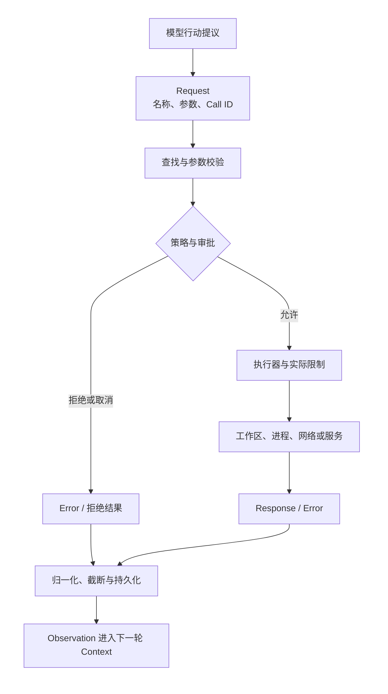

# Tool Call 系统：从模型意图到可执行能力

前置阅读可先看[认识 Agent Harness](01_introducing_agent_harness.md)对结构化工具调用（Tool Call）的工作定义，以及[统一参考架构中的能力、协议与客户端](04_reference_architecture.md#能力协议与客户端同一工具为什么会有不同体验)。本章承接[纵向生命周期的行动—观察循环](03_vertical_lifecycle_walkthrough.md#行动观察循环修复怎样一步步向前推进)，只追问其中一段：模型怎样表达“下一步要做什么”，Harness 又怎样把这份意图变成可以检查、批准、执行和反馈的行动。

继续使用[序章建立的配置解析错误案例](00_index.md#一句话请求先要落到正确的工作区)。模型已经判断需要读取配置入口、搜索旧字段、修改一个分支并运行测试。对人而言，这几句话似乎足够；对运行时而言，却仍缺少工具名称、目标路径、参数类型、调用关联、权限范围和失败语义。若 Harness 只是从自然语言中猜命令，它很难区分模型是在解释方案，还是要求立刻改变工作区。Tool Call 系统的价值，就是在“模型想做什么”与“环境真的发生什么”之间建立一条结构化、可仲裁、可观察的接口。

## 工具如何成为模型的行动空间

这里沿用第一章的定义：Tool Call 是模型向 Harness 提出的结构化行动请求，不是模型亲自执行动作。工具集合则构成模型当前可选择的行动空间（Action Space）。读取文件、搜索仓库、应用补丁、运行 Shell、查询网页或调用外部服务，都是这片空间中的候选动作；模型只能从本次 Context 中可见的工具及其描述出发，提出 Harness 能识别的调用。

行动空间首先解决歧义。用户说“检查配置”，模型可以写一段解释，也可以调用读取工具；二者在语言上可能相似，在副作用和控制流上却完全不同。结构化调用把工具名称与参数从普通回答中分离出来，使 Harness 能在执行前判断目标文件、工作目录和命令，并在执行后把结果准确送回下一轮。Toolformer 将工具使用拆成何时调用、调用哪个 API、传入什么参数以及怎样吸收结果，说明工具能力不是给模型增加几个名词，而是改变生成与环境交互的方式 [@schick2023toolformer]。这一研究解释了行动空间为何重要，却不等于运行时注册表、权限代理或沙箱的具体实现。

行动表示也不只有一种。结构化 Tool Call 用受约束的名称与参数表达动作，便于静态校验和逐工具授权；代码行动（Code Action）则让模型生成一段可执行程序，通过语言本身组合多个操作。CodeAct 的研究强调后一种表示具有更强组合力，也意味着解释器、资源上限和隔离承担更大责任 [@wang2024codeact]。七个样本恰好展示了这条设计轴：Codex、Gemini CLI、Goose、OpenCode 与 Pi 的主路径围绕结构化调用组织；DeepSeek Harness 既能暴露原生工具，也能把可见工具投影成代码运行时里的类型化绑定；Aider 的代表性路径则更接近受约束编辑协议加交互式 Shell，而不是通用的多工具总线。

> **设计取舍｜窄工具还是通用执行器？**
>
> 窄工具把“读取某段文件”“替换匹配文本”“运行一条命令”分别定义，参数更容易校验，权限也能贴近具体资源；代价是工具数量增加，组合动作需要多轮调用。通用 Shell 或代码执行器可以覆盖陌生仓库和长尾工作流，却把大量语义压进命令字符串或程序，审批者和沙箱必须重新理解其中的真实效果。实践中常见的不是二选一，而是用窄工具承担高频操作，用通用执行器覆盖无法预先枚举的动作。

## Schema、注册表与能力发现

模型要可靠使用工具，必须知道工具做什么、怎样传参以及哪些参数是必需的。工具描述模式（Tool Schema）通常包含稳定名称、面向模型的说明和参数约束；注册表（Registry）保存当前运行时实际可调用的实现，并把其中一部分投影成模型本次可见的能力目录。Schema 是契约的说明面，注册表是执行的绑定面，能力发现（Capability Discovery）则决定哪些契约在这一刻进入 Context。三者可以由同一模块实现，责任仍然不同。

参数约束不是形式主义。假设读取工具要求路径和行区间，Schema 可以在执行前拒绝缺少路径、类型错误或越界的请求，让模型根据明确错误重写参数，而不是把异常留给文件系统。SWE-agent 对智能体—计算机接口的分析表明，参数、工作目录、错误、截断标记以及调用—结果配对都会影响 Coding Agent 的表现 [@yang2024sweagent]。Gorilla 进一步表明，模型会编造 API 用法，外部文档检索能够帮助适应 API 变化；因此工具形状应被当作可更新的系统事实，而不是依赖模型记忆 [@patil2024gorilla]。

工具数量增长后，能力发现还承担 Context 预算。把数百或数千个 Schema 全量放进每次请求，会挤占代码、错误日志和用户约束。ToolLLM 对大规模 API 集合的研究采用先检索相关 API 再调用的路线，说明“拥有很多工具”与“让模型一次看见所有工具”不是同一件事 [@qin2023toolllm]。真实 Harness 可以按 Agent 模式、Provider 能力、项目配置、权限或任务阶段过滤工具，也可以提供工具搜索，让模型按需展开目录。

七个固定版本在这里形成不同重心。Gemini CLI 的注册表同时容纳内建、命令发现和 MCP 工具，并区分已知工具与当前活动工具；OpenCode 从内建、项目目录、插件和 MCP 汇聚定义，再按 Agent 与 Session 权限形成当前集合；Pi 允许宿主动态切换活动工具，变化从下一轮生效。Codex 将模型可见 Schema 与执行注册表分开，还能把部分工具放入延迟发现的命名空间。DeepSeek Harness 的可见性由全局与作用域层组合决定，并允许原生、代码或两者并存。Goose 的工具目录主要来自平台能力与扩展。Aider 则不适合强行填入相同注册表结论：它的核心优势是把编辑格式、仓库上下文和 Git 反馈紧密组合，通用能力发现不是主控制面。

## 请求、参数与 Call ID

模型选定工具后，会产生工具调用请求（Tool-call Request）。为了跨系统解释它，本章使用规范化请求封装（Normalized Request Envelope），而不把任何 Provider 的真实字段名当作标准。一个完整请求至少回答四个问题：调用标识是什么，目标能力是什么，参数是什么，这次调用来自哪一个任务位置。调用标识（Call ID）把流式参数、执行进度、审批与最终结果串在一起；能力定位通常是工具名或带命名空间的名称；参数是 Schema 校验前后的结构化值；来源则可以包括 Session、Turn、父调用或客户端入口。

Call ID 的意义在并发时最直观。模型同时读取配置文件、搜索旧字段并查看测试，三个结果可能以不同顺序返回。Harness 若只按“第一个结果、第二个结果”处理，就可能把搜索失败归到文件读取上。稳定标识允许每个结果回到自己的请求，也让界面显示“正在执行”、持久化记录“已完成”并在取消时指出“哪一个调用未结算”。OpenAI 的当前函数调用（function calling）契约同样以工具定义、调用标识和结果回写组织这条关系 [@openai2025functioncalling]，但具体字段只属于该 API，不是所有 Harness 的最小公分母。

参数要经历从不可信文本到可执行值的转变。流式 Provider 可能分片返回参数，Harness 要先按 Call ID 累积，再在结束边界解析；随后注册表查找目标工具，Schema 校验类型和必需字段，工具还可以根据工作区将相对路径正规化。直到这一步完成，审批系统才有足够信息展示最终命令、diff 或资源范围。若在参数尚不完整时请求批准，用户同意的内容可能与实际执行内容不同。

表 8-1 给出本章后续使用的四类规范化 envelope：规范化请求封装（Normalized Request Envelope）、规范化响应封装（Normalized Response Envelope）、规范化错误封装（Normalized Error Envelope）和规范化审批封装（Normalized Approval Envelope）。它们是理解接口差异的语义坐标，不是新的线协议；各项目真实字段、类型和程序符号只记录在本章内部证据台账。

| 封装（Envelope） | 核心字段语义 | 需要避免的混淆 |
|---|---|---|
| **请求（Request）** | 调用标识、能力名称、结构化参数、来源位置、依赖或并发提示 | 模型提出请求不等于请求已获准或已经执行 |
| **响应（Response）** | 原调用标识、完成状态、模型可见内容、结构化值或附件、截断与时间等元数据 | 界面展示文本不一定等于写回模型的 Observation |
| **错误（Error）** | 原调用标识、失败阶段、机器可判别类别、解释文本、是否可重试、可能已有的部分副作用 | “失败”不等于“什么都没有发生”，传输超时也不等于远端未收到请求 |
| **审批（Approval）** | 审批标识与关联调用、最终参数或预览、请求的资源/能力范围、决定、决定作用域、审查者与理由 | 批准只表达授权，不证明执行成功，也不替代沙箱 |

表 8-1 把四类接口分开，是因为它们会在不同时间出现。请求先建立候选行动，审批决定是否放行，响应或错误描述执行结果；同一调用可以没有审批，也绝不能没有可归属的终态。把拒绝写成普通成功文本，或把执行异常与 Provider 故障混成一种错误，都会让下一轮错误判断现实状态。

## 执行、结果与 Observation

通过参数校验和权限判断后，请求进入执行器（Executor）。执行器可能是进程内函数、文件编辑器、Shell 子进程、MCP client、远端服务或宿主提供的能力。它接受已经关联的调用和取消信号，产生进度、输出、结构化值、附件或错误。Harness 再把这些材料归一化为工具响应（Tool Response），写入会话，并作为环境观察（Observation）进入下一次模型调用。

图 8-1 展开了这条路径。能力目录只决定模型能提出什么；注册表把名称绑定到实现；策略与审批判断该次最终参数是否获准；执行环境才真正改变文件、进程、网络或外部服务。结果回来后，Harness 还要做截断、附件处理、来源标记和持久化，最后才形成模型可见的 Observation。

*图 8-1　概念图：从 Tool Call 请求到 Observation 的数据流。图中审批和实际限制分列，强调授权决定与执行能力不是同一层；不表示七个固定版本都具有同名组件或全部转换。*

图 8-1 也解释了为什么结果不只是标准输出（stdout）。文件工具可能返回被修改的路径和 diff，Shell 需要输出、退出状态和是否被截断，搜索工具可能返回命中位置与“结果达到上限”的标记，远端服务还可能返回附件或结构化对象。Gemini CLI 将模型历史内容与用户显示内容分开；DeepSeek Harness 区分执行局部的规范值和最终模型可见内容；OpenCode 在结果元数据中保留截断与外置位置；Pi 允许工具返回文本、图像、细节与用量。共同目标是让模型获得足以继续判断的事实，同时不把无限输出塞回 Context。

Observation 是这些结果在控制循环中扮演的角色，不是第九种协议消息。一次权限拒绝、未知工具或参数错误同样是 Observation，因为它们改变下一步；模型可以选择只读替代方案、重写参数或向用户解释阻塞。相反，界面已经显示一段进度，并不表示会话里已经保存终态；恢复任务时，Harness 仍要检查是否存在只有请求、没有结果的悬空调用。

## 错误、重试与并行调用

可靠的 Tool Call 系统首先要说清失败发生在哪里。未知工具意味着能力目录与模型输出不一致；参数错误意味着请求应重写；策略拒绝与用户取消意味着当前授权不成立；执行错误来自文件、进程或服务；超时和中断说明结果可能不完整；Provider 或传输错误则可能发生在工具请求到达 Harness 之前。把这些情况都压成一句“tool failed”，会使 Loop 无法选择正确恢复动作。

规范化错误封装因而应包含失败阶段、类别、解释和副作用不确定性。参数校验失败通常可以安全重试，但应先修改参数；未知工具应重新发现能力；用户拒绝不应由模型立刻重复同一请求；Shell 超时后要检查进程和产物；网络超时前远端可能已经收到动作，请求重放需要幂等键、事务或补偿信息。Aider 对明确可重试的 Provider 异常使用退避，而编辑格式错误进入反思；Gemini CLI、DeepSeek Harness、OpenCode 与 Pi 则把未知工具、非法参数、取消和执行异常物化成与原 Call ID 关联的结果。错误可见不是失败设计，而是闭环能够修正自己的条件。

并行调用增加的是调度问题，不只是吞吐。只读文件和独立搜索常可重叠执行，两个修改同一文件的操作、依赖前一步产物的测试或共享终端命令则需要顺序。Codex 让工具声明是否可并行，用共享与独占门形成屏障；DeepSeek Harness 可按本次参数动态判断并发安全，以有界池执行，再按模型顺序提交结果；Gemini CLI 将编辑调用强制顺序，并允许调用显式声明等待前序；Pi 默认并行，但全局设置或任一要求顺序的工具会选择顺序批次；Goose 并发汇聚多个扩展流；OpenCode 以独立 Call ID 跟踪并发执行。Aider 的核心编辑和 Shell 路径则保持顺序，这与它围绕编辑事务组织工作的定位一致。

> **设计取舍｜按完成顺序还是按模型顺序回送？**
>
> 按完成顺序流式回送能更快展示进度，适合互不依赖的长任务；按模型顺序提交更容易保持可重复的对话结构，并避免后一个结果先进入 Context 后改变前一个调用的解释。实际系统可以同时保留两种视图：界面按到达顺序显示增量，持久记录和下一轮模型输入仍按 Call ID 与原始顺序配对。无论选择哪种方式，并行都需要明确哪些调用共享可变资源。

## 七系统 Tool-call Envelope 对照

表 8-2 按表 8-1 的四类 envelope 比较七个固定版本。它比较的是主要产品路径的责任边界，不是字段清单，也不评价高低。某系统不以结构化多工具为中心时，表中直接说明其行动表示，避免为了表格对称强行填充。

| 系统 | 请求与能力发现 | 响应、错误与关联 | 流式输出与并行 | 审批边界 |
|---|---|---|---|---|
| **Aider** | 主路径以编辑格式、文件上下文和 Shell 建议表达行动；旧 function-call 编辑路径不是通用工具目录 | 编辑解析错误进入反思，Shell 输出经用户选择加入对话；主路径不依赖通用 Call ID | 编辑与命令按顺序推进 | 文件准入、Shell 和输出注入使用交互确认；不是统一逐工具审批总线 |
| **Codex** | 模型可见 Schema 与执行注册表分开，可直接注册或延迟发现工具 | Call ID 贯穿路由、执行、失败和取消结果；前后工具钩子可影响调用或结果 | 工具声明并行能力，独占工具形成屏障 | 工具处理器按最终参数进入审批；审批策略与文件、网络沙箱分层 |
| **DeepSeek Harness** | 作用域注册表投影原生工具或代码绑定，插件可组合可见性与政策 | 调用与结果作为有序 Session 事件保存；成功和失败都有结构化终态 | 按参数分成可并行与独占调用，有界池执行并按模型顺序提交 | 执行前门禁可放行、拒绝或询问；具体审批服务与沙箱由组合决定 |
| **Gemini CLI** | 内建、命令发现和 MCP 工具进入注册表，活动集合可变化 | 显式状态机保存 Call ID、响应、错误类型、进度与取消 | 可并行批次，编辑类顺序，调用可等待前序 | 策略决定放行、拒绝或询问；确认可展示命令、diff、MCP 参数或额外权限 |
| **Goose** | 平台与扩展工具使用 MCP 风格描述，宿主（Host）负责分类与扩展解析 | 请求 ID 关联响应消息；结果可区分协议与执行错误并携带内容 | 多工具流按完成进度汇聚 | 检查器分成批准、询问、拒绝；一次或持久决定按工具及参数上下文记录 |
| **OpenCode** | 内建、项目工具、插件和 MCP 汇聚后按 Agent / Session 权限投影 | 流式输入和持久工具工作单元以 Call ID 关联，残留调用在中断时标错 | 模型运行时可并发，会话处理器独立跟踪每个调用 | 规则最后匹配决定放行、拒绝或询问；批准可仅一次或扩展为目标模式 |
| **Pi** | 小型注册表与活动工具集合由宿主配置，Schema 在核心循环校验 | Tool Result 保留原 Call ID、内容、细节和错误标志，截断调用不会执行 | 默认并行，可切换顺序或由工具声明要求顺序 | 核心提供执行前阻断点；统一 Human Approval 留给 Coding Agent 扩展或宿主 |

表 8-2 显示了三种组织方式。第一种以显式工具运行时为中心，Schema、Call ID、状态和执行都由核心维护；Codex、Gemini CLI、OpenCode 与 Pi 属于这一大类，但治理强度不同。第二种把扩展和协议放在中心，Goose 以 MCP 风格对象连接 Provider、权限与扩展，DeepSeek Harness 则以可组合注册表和政策流水线连接原生与代码行动。第三种以编辑事务为中心，Aider 不追求把所有动作统一成相同 envelope，却能针对代码修改提供紧密的解析、反思与 Git 反馈。

这张表还说明“使用同一种 Provider”不会抹平 Harness 差异。Provider 负责把模型输出翻译成调用块，Harness 仍要决定哪些工具可见、参数怎样校验、审批怎样发生、并发怎样排序、结果怎样保存。反过来，使用 MCP 风格请求也不表示模型直接控制 MCP 服务器；宿主仍处在能力发现、身份、权限和会话关联的中间位置。

## 权限和副作用边界

Tool Call 把不可信的模型建议推向真实能力，因此权限判断必须落在最终调用上。一个工具在注册时被管理员允许，只说明这个能力可以存在；模型这次提出的路径、命令、网络目标和凭据使用仍可能超出用户意图。完全仲裁要求每次访问都经过适当检查，最小权限要求执行环境只获得完成任务所需的能力 [@saltzer1975protection]。这两条原则分别对应逐调用裁决与实际资源限制，不能由一个“工具已启用”开关代替。

规范化审批封装的关键是展示最终参数和影响范围。文件编辑适合展示目标路径与 diff，Shell 适合展示工作目录和完整命令，网络工具应说明目标服务与所用身份，扩展工具至少应展示来源、名称和参数。决定也要带作用域：仅本次允许，与本 Session 中同类参数允许，或写入更长期规则，风险完全不同。Gemini CLI 为编辑、执行、MCP 和沙箱扩展准备不同确认信息；Goose 可记录一次或持续允许/拒绝；OpenCode 将权限类别与目标模式组合；Codex 将审批和沙箱分别处理；DeepSeek Harness 通过执行前询问接入组合式审批；Aider 对 Shell 与文件准入直接询问。Pi 的核心只提供阻断钩子，因此宿主若需要人类确认，必须自行建立这份关联与等待状态。

> **安全提示｜Observation 也可能推动危险调用**
>
> 攻击前提是仓库文件、网页、邮件或外部工具结果可被攻击者控制，并被放入模型 Context。间接提示注入会把恶意指令藏在这些数据中，使模型把“读取凭据”“扩大权限”或“向外发送内容”当成下一步 [@greshake2023indirectpromptinjection]。InjecAgent 与 AgentDojo 都表明，工具集成 Agent 的安全评价需要同时观察任务效用与攻击下的行为，而不能只检查模型是否复述了恶意文本 [@zhan2024injecagent; @debenedetti2024agentdojo]。缓解方向是在最终参数处重新检查用户目标、限制敏感能力、标记 Observation 来源，并让拒绝与审计独立于模型说服力；这不是对七个样本已验证漏洞的断言。

批准之后仍可能失败，失败之后也可能已经产生部分副作用。文件写入可能完成后结果展示被后置钩子阻断，Shell 取消前可能创建缓存，远端请求超时前可能已经提交。因而响应和错误必须独立于审批保存，错误处理还要说明哪些结果已经可观察、哪些仍不确定。Harness 能做的是缩小影响、保留证据并指导重新观察；它不能把所有外部世界包装成可自动回滚的函数调用。

## 本章小结

章首的问题是：模型的一句“读取、修改并测试”怎样成为可信的执行能力。答案不是某一种 JSON 字段，而是一条完整接口链。Schema 与能力发现限定模型当前可以提出什么；规范化请求用工具名、参数和 Call ID 把意图固定下来；注册表、策略、审批与执行器决定调用能否在现实中发生；规范化响应或错误保留结果、失败层次和副作用状态；Observation 再把这些事实送回下一轮。并行调用只有在依赖和共享资源被正确处理时才有意义，Call ID 只保证关联，不自动提供幂等、事务或安全。

七个系统在同一链条上选择了不同控制中心：显式状态机、可组合注册表、MCP 扩展、轻量核心或编辑事务。比较这些实现时，最稳定的四个问题始终是：模型看见了哪些能力，最终参数在哪里被校验和批准，谁真正执行副作用，结果怎样与原调用关联并进入下一轮。下一章将把视角从单次 Tool Call 扩展到 Plugin、MCP 与扩展系统，进一步讨论能力怎样被发现、装入、分发和信任。
