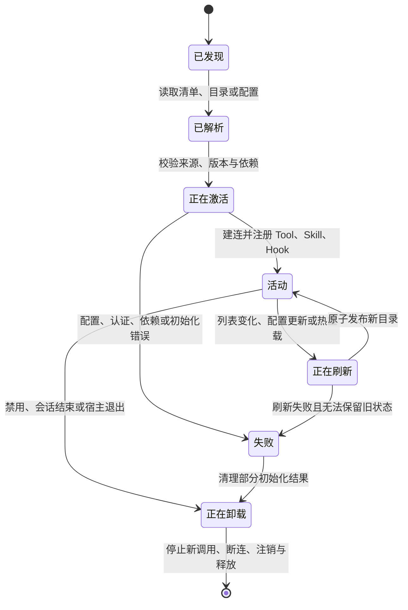

# Plugin、MCP 与扩展系统

[统一参考架构](04_reference_architecture.md#能力协议与客户端同一工具为什么会有不同体验)已经把能力、协议与客户端分成三层：能力回答系统能做什么，协议回答组件怎样交换请求与结果，客户端回答用户从哪里使用这些能力。本章沿这个坐标继续追问：当内建工具不够时，一项新能力怎样进入 Harness，又怎样在不破坏生命周期、权限和可恢复性的前提下参与任务？

仍以[序章的配置解析错误案例](00_index.md#一句话请求先要落到正确的工作区)为例。模型已经定位到本地解析器，但修复还需要查询公司内部配置目录、读取 CI 平台的失败记录，并遵守项目专用发布流程。把每一种服务都写进 Harness 核心并不现实；让模型直接执行从仓库里发现的任意程序又过于危险。扩展系统位于这两者之间：它让能力、指令与生命周期行为可以被发现和组合，同时要求宿主把“装进来了什么、何时可用、出错后留下什么”说清楚。

## Harness 为什么需要扩展

一个只包含读文件、写文件和 Shell 的 Harness 已经能够完成许多 Coding 任务，但真实工作流很快会超出这组固定能力。团队可能需要访问工单、数据库 Schema、云端日志、设计文档或专用构建服务；不同仓库还会有不同的检查命令、发布门禁和审计要求。若每增加一种服务都修改核心并重新发布整个应用，核心会逐渐绑定具体组织与供应商，测试面、凭据面和升级成本也会一起增长。

最直觉的替代办法是让模型“自己找命令”。这在本地、稳定、已有清楚文档的命令行工具上很有效，却不能解决全部问题。模型仍要知道命令是否存在、参数是否可信、凭据从哪里来、输出如何与原调用关联，以及远端服务是否要求交互认证。更重要的是，命令说明和执行权限被揉成了一件事：读到一份 README 不等于获得访问生产数据库的授权，能够启动一个进程也不等于 Harness 知道怎样取消它或恢复它的调用状态。

扩展系统因此承担两类彼此关联的责任。第一类是**扩大能力表面**：注册新工具、连接外部服务、提供新的 Provider 或客户端部件。第二类是**改变运行方式**：加入任务专用指令，在模型调用、工具执行、压缩或 Session 边界插入控制逻辑。前者改变“模型可以提出什么动作”，后者改变“动作与状态怎样经过 Harness”。把两类责任都叫“插件”虽然方便，却会遮住它们不同的失败方式和信任边界。

外部专家编排研究展示过一种更广义的动机：语言模型可以根据描述选择外部模型或服务来完成子任务，能力不必全部固化在一个模型内部 [@shen2023hugginggpt]。对 Coding Harness 而言，这只是设计类比，不意味着七个系统实现了同一种编排方法。工程上的关键仍是：外部能力如何被宿主发现，怎样投影到本轮上下文（Context），调用结果怎样回到当前 Session，以及谁对副作用负责。

## Plugin、Extension、MCP、Skill 与 Hook

本报告用表 9-1 区分五个常被混用的概念。它们都能让产品“多做一些事”，但接入层、运行位置和主要产物不同。

| 机制 | 中文解释与主要作用 | 典型运行位置 | 主要改变什么 | 不自动提供什么 |
|---|---|---|---|---|
| **插件（Plugin）** | 可安装或可选择的装配包，声明一组由宿主解析和激活的贡献 | 宿主进程内，或由宿主解析的包目录 | 可同时带入 Skill、MCP Server、Hook、应用（App）或界面元数据 | 不因安装就自动获得全部权限，也不保证所有贡献成功激活 |
| **扩展（Extension）** | 对产品可编程面的统称，常以模块 API 注册工具、命令、事件处理器或界面 | 多数在宿主进程内，也可能包装外部服务 | 运行时行为、工具、命令、Provider、界面与状态 | 不天然跨语言、跨进程，也不天然隔离 |
| **模型上下文协议（Model Context Protocol，MCP）** | Host、Client 与 Server 交换能力和上下文的互操作协议 | 本地子进程或远端服务 | Tools、Resources、Prompts，以及部分双向客户端能力 | 不负责 Agent Loop、模型选路和宿主权限政策 |
| **技能（Skill）** | 可发现、按需加载的任务专用过程性指令 | 文件、包或远端目录，内容进入 Context | 模型在某类任务中应遵循的步骤、约束和资源入口 | 不天然注册可执行工具，也不自动授予脚本执行权限 |
| **钩子（Hook）** | 在生命周期事件前后运行的拦截或通知处理器 | 宿主进程回调、命令进程或 MCP Tool | 阻断、改写、附加上下文、审计或清理 | 不自动形成事务，也不能撤销已经发生的外部副作用 |

*表 9-1　Plugin、Extension、MCP、Skill 与 Hook 的责任边界。*

表 9-1 最重要的不是名称，而是“改变了哪一层”。Skill 主要改变 Context：模型先看到摘要，在任务匹配时再加载完整说明；它引用的脚本若要执行，仍须经过 Shell 或其他工具。MCP 主要改变协议层：Server 暴露 Tool，并不决定模型何时调用，也不决定调用是否获准。Hook 主要改变生命周期：执行前 Hook 可以阻断一次工具调用，执行后 Hook 可以加工结果，但若工具已经写入文件，后置拒绝不能把文件自动还原。

Plugin 与 Extension 的界线最依赖具体产品。本章将 Plugin 用于“有清单、有来源、可被宿主选择和解析的装配包”，将 Extension 用于“产品公开的可编程扩展面”。一个 Plugin 可以打包若干 Extension 贡献；一个 Extension 也可以只注册一个 Tool，而没有独立包清单。分析真实系统时应沿发现与调用路径判断责任，不应仅凭上游名称强求统一。

> **设计取舍｜进程内扩展还是协议服务？**
>
> 进程内 Extension 可以直接共享类型、Session 状态、事件总线和界面对象，调用开销低，也容易对多个生命周期节点作细粒度改写；代价是它通常进入宿主进程的权限与故障域，异常、依赖冲突或恶意代码能够影响更大的系统范围。MCP Server 通过协议把能力放到进程或网络边界之外，便于跨语言部署和独立升级；代价是 Host 必须管理连接、认证、Schema 漂移、取消、重连与远端身份。两种方式不是高低关系：需要深度改写宿主行为时，进程内接口更直接；需要隔离部署或复用既有服务时，协议边界更清楚。

## 发现、注册与生命周期

扩展进入 Harness 不是一个瞬时的“加载”动作，而是一条生命周期。图 9-1 用规范化检查表说明从发现到卸载时需要核对的主要状态。真实系统可能只实现其中子集、合并状态或使用不同名称；一个可用能力仍要经过来源解析、配置校验、依赖准备与注册，失败或卸载时还要撤销已发布的部分状态。

*图 9-1　规范化检查表：扩展从发现到活动、刷新、失败和卸载时需要核对的状态。真实系统可以只实现其中子集；Aider 的固定版本不映射到这套状态机。*

图 9-1 中，“已解析”与“活动”必须分开。清单存在只说明宿主知道一个候选；只有初始能力同步完成、注册表已经更新，模型才应把它当成可调用能力。DeepSeek Harness 的 MCP Client 插件会在激活完成前等待首次连接与工具发现尝试结算：成功时工具随激活可见，配置要求启动失败即失败时插件执行单元（Fiber）会回滚，否则插件可以保持活动并进入重连，但此时不能把尚未注册的工具写成可用。Codex 的插件解析接口也把“解析出带来源权限的惰性描述”与“激活其中的 Skill、MCP 或 Hook”分开。这样的边界避免了半初始化能力提前进入模型目录。

发现来源通常不止一处。用户目录、项目目录、企业托管配置、已安装包和本次 Session 选择可能同时贡献同名对象。宿主需要规定优先级、命名空间与冲突语义：Gemini CLI 对 Skill 采用内建、Extension、用户、Workspace 的覆盖顺序，并在冲突时告警；DeepSeek Harness 为每个 MCP Server 保留唯一命名空间，把 Tool 映射为带 Server 名的公开名称，重复 Server 名在加载时直接报错；Goose、OpenCode 与 Codex 也需要把 Server 或插件归属保留到 Tool 目录中。没有这些规则，后加载对象可能无声替换原能力，模型看到的行动空间会随加载顺序漂移。

依赖注入（Dependency Injection）和服务注册（Service Registration）解决的是装配顺序。插件声明自己需要 Tool Registry、Session Store 或 Provider Router，Loader 在依赖可用后创建作用域，再把注册贡献发布给消费者。事件总线（Event Bus）则负责通知“工具列表已变化”“Session 已开始”等事实。它与 Hook 不同：被动事件监听器通常只观察，Hook 可以在规定边界阻断或改写流程。若实现让所有事件监听器都能任意修改运行状态，生命周期顺序和错误归属会变得难以推理。

活动状态也不是终点。MCP Server 可以发送工具列表变化通知，Extension 可以热重载，项目 Skill 可以在下一次扫描时改变。宿主需要先构造新目录，再以稳定方式替换旧目录；在途调用仍应绑定发起时的 Tool 定义和 Server 身份。卸载时则应停止接受新调用，等待或取消在途工作，断开连接，注销工具与 Hook，最后释放进程、临时目录和事件订阅。只从注册表删除名称而不停止后台重连，会产生“界面上已禁用、进程仍在运行”的分裂状态。

## MCP Transport 与双向能力

MCP 采用 JSON 远程过程调用（JSON Remote Procedure Call，JSON-RPC）2.0 的请求、通知、响应与错误形状；带标识的请求需要对应响应，通知则没有响应，协议不绑定具体传输 [@jsonrpc2013]。MCP 2025-06-18 规范在这层之上定义 Host、Client、Server，以及初始化、能力协商、服务端工具（Tools）、资源（Resources）、提示模板（Prompts）与客户端工作区根（roots）等消息。它管理的是上下文与能力交换，不管理应用如何调用模型或组织完整 Agent Loop [@mcp20250618]。

Host 通常为每个 Server 建立一个 Client，由 Host 统一管理多个连接的能力目录与生命周期 [@mcp2024architecture]。对本地标准输入输出传输（standard input/output transport，stdio），Host 启动子进程，通过标准输入输出交换按行分隔的 JSON-RPC；子进程退出、环境变量、工作目录和标准错误处理都进入 Host 的生命周期。对可流式 HTTP 传输（Streamable HTTP），Server 可以独立部署，Client 还要处理 URL、请求头、开放授权（OAuth）、连接恢复和远端错误。2025-06-18 规范已经用 Streamable HTTP 取代旧版 HTTP 加服务器发送事件（Server-Sent Events，SSE）作为现行主传输；部分 Harness 保留 SSE 兼容分支，是产品兼容选择，不应反写成现行协议的唯一形式 [@mcp20250618]。

传输改变故障域，却不改变 Tool 的业务语义。同一个“查询 CI 失败记录”工具可以由本地子进程或远端服务提供；stdio 失败更像本地进程启动、依赖与环境问题，Streamable HTTP 失败更像认证、网络、服务端版本与租户身份问题。Host 需要把两类错误都转换成当前 Session 能理解的状态，而不是把“Server 不可达”伪装成“工具返回空结果”。

MCP 也不是单向的“远端函数列表”。Server 可以向 Client 提供 Tools、Resources 与 Prompts；Client 可以声明 roots，告诉 Server 当前允许讨论的文件系统根，还可以在宿主选择支持时处理模型采样（sampling）或信息征询（elicitation）等反向请求。Goose 的固定版本实现了包括 sampling、roots 与用户交互在内的多种 Client Handler；OpenCode 的固定版本启用了 roots，而 sampling 与 elicitation 在客户端能力配置中仍未开放。这里的差异说明协议能力与产品能力必须分开写：规范允许双向请求，不表示每个 Host 都启用，也不表示 Server 可以绕过宿主直接调用模型。

工具发现以后，还存在一次必要适配。MCP 的 `tools/list` 与 `tools/call` 不等于模型 Provider 的 Tool Call。Host 要把 Server 的名称和输入 Schema 转为 Provider 可接受的工具描述，为名称加命名空间，保存调用标识，并在模型提出动作后实施策略、确认和超时。MCP 将执行错误与协议错误分开表示；Host 若把二者都压成普通文本，就会让下一轮模型误判“调用成功但没有数据”。因此，[统一参考架构中的工具适配与权限边界](04_reference_architecture.md#总体结构控制平面决定执行平面行动)仍然位于 MCP Client 两侧。

## 配置、分发与组合失效

扩展配置至少包含三类信息：**来源**说明从哪里取得包、目录或 Server；**装配**说明启用哪些贡献、以什么名称和优先级注册；**运行**说明命令、参数、环境变量、URL、请求头、超时、认证与重连策略。把三类信息塞进一个不分层的配置对象，会让升级与审计都变得困难。例如，更新一个 Extension 版本不应悄悄改变生产 Server URL，切换 Session 中的工具允许列表（Tool allowlist）也不应重写用户安装来源。

分发方式决定可重复性。内建扩展随 Harness 版本发布，兼容性最容易统一；本地路径适合开发，却会依赖当前工作区和未提交文件；Git 或包管理器便于共享，但需要版本约束、依赖安装和来源校验；远端 MCP 不下载执行代码到本地，却把可用性与身份交给网络服务。Pi 的包可以同时携带 Extension、Skill、Prompt 与主题，Gemini CLI 的 Extension 可以聚合 MCP Server、Policy、Hook、Skill 与上下文文件，Codex 的插件清单（manifest）也可以声明 Skill、MCP、App 与 Hook。打包减少了分发碎片，也意味着一次安装可能同时改变行动空间、Context 与生命周期。

组合失效往往不发生在单个组件内部，而发生在它们的连接处。常见模式包括：两个 Server 导出同名 Tool；新版 Schema 与恢复中的旧 Tool Call 不兼容；Extension 已卸载但 Context 仍保留旧目录；一个 MCP 连接失败导致整包其他 Skill 是否可用语义不清；热重载时旧调用尚未结束，新工具目录已经发布；Hook 在工具执行后失败，宿主却把整个动作标成未执行；多个来源覆盖同名 Skill，模型读到的不是用户以为的版本。

处理这些失效需要几个稳定原则。名称冲突要显式拒绝、限定命名空间或按可解释优先级覆盖；一次调用要绑定发起时的定义与来源；注册表刷新要么保留可工作的旧快照，要么明确把新状态标成失败；错误要区分发现、认证、调用、协议和业务结果；卸载要先处理在途工作，再撤销能力。恢复 Session 时，宿主还要重新确认扩展版本与 Server 状态，因为旧记录只能说明过去使用过什么，不能证明现在仍存在相同能力。

> **设计取舍｜DeepSeek Harness 把 MCP 连接做成可回滚插件生命周期**
>
> DeepSeek Harness 的 MCP Client 本身是依赖 Tool Registry 的 Cordis 插件。每个实例只连接一个 Server，激活前完成首次工具同步；Server 名冲突在加载时失败，释放作用域会停止重连、断开 Client 并注销工具。它相对“启动一个旁路进程再把工具名塞进数组”的差异，在于连接、工具目录和插件 Fiber 共享同一生命周期。收益是装配状态更可观察，代价是产品行为更依赖插件图、作用域与回滚语义；完整系统设计将在相应个案章中再从整体控制中心解释。

## 七个系统的扩展路径

表 9-2 按“主要扩展入口、MCP 位置、Skill 与 Hook、生命周期重点”比较七个固定版本。它不比较生态规模，也不要求所有系统采用通用插件平台；某系统选择固定核心，本身就是一种设计取舍。

| 系统 | 主要扩展入口 | MCP 在系统中的位置 | Skill 与 Hook | 生命周期与边界重点 |
|---|---|---|---|---|
| **Aider** | CLI 配置、外部编辑器、通知命令、文件观察与第三方 IDE 集成 | 当前分析范围内未识别第一方通用 MCP Client | 未识别第一方 Skill 或通用生命周期 Hook；Git pre-commit Hook 是 Git 提交开关 | 固定编辑核心较集中，外部集成多在进程或编辑器边界之外 |
| **Codex** | Plugin manifest 聚合多类贡献，另有独立配置层 | MCP 管理层合并配置、插件与宿主贡献，再投影为运行时 Server 与 Tool | 多来源 Skill Loader；命令或 MCP Tool Hook 可作用于工具、权限、压缩与 Session 事件 | 解析与激活分离，资源保留来源权限；托管策略可限制 Hook 与 MCP 来源 |
| **DeepSeek Harness** | Cordis 插件图、依赖注入、智能体预设（Agent preset）与作用域服务 | MCP Client 是可重复装载的插件，每实例一个 Server | Skill Provider Registry 与 Skill 加载 Tool；Hook 由独立协议与桥接插件接入 | Fiber 激活、失败、热模块替换（Hot Module Replacement，HMR）与释放统一管理贡献，组合关系本身就是产品行为 |
| **Gemini CLI** | 可安装 Extension 聚合 MCP、Policy、Hook、Skill、Agent、命令和上下文 | 多 Client Manager 管理本地与远端 Server，并刷新 Tool、Prompt、Resource Registry | Skill 有明确来源优先级；Hook 覆盖模型、工具选择、执行、压缩与 Session | 安装同意、来源允许列表、完整性记录、启停和可选热重载组成管理面 |
| **Goose** | Extension 以 MCP 为主要外部能力边界，另有平台内建 Extension | Extension Manager 直接管理 MCP Client、Tool、Resource、Prompt 与反向能力 | 文件与插件 Skill；权限检查位于 Tool 执行链 | Session 保存启用扩展；子进程、远端连接、OAuth、工具变更和在途调用由管理器协调 |
| **OpenCode** | 进程内 Plugin Hook、独立 MCP 服务和 Skill 服务并行 | 支持 stdio、Streamable HTTP、SSE 兼容与 OAuth，向 Server 提供 roots | Skill 从配置、项目、外部目录和远端索引发现；Plugin Hook 横跨系统、Tool、Shell、消息与压缩 | 插件安装、兼容性、动态导入和最终清理分阶段；新旧核心接口仍在演进 |
| **Pi** | TypeScript Extension API 注册 Tool、命令、Provider、事件与界面；包可分发多类资源 | 默认 Coding Agent 明确不内建 MCP，可由 Extension 自行桥接 | 多目录 Skill；Extension 事件可阻断 Tool、改写 Context、处理 Session 与界面 | 小内核把高级治理交给 Extension；项目资源加载信任与逐调用控制需要分别配置 |

*表 9-2　七个固定版本的扩展路径与主要责任边界。*

表 9-2 显示出三条不同路线。第一条是**固定核心加外部集成**，Aider 主要通过已有命令、编辑器和第三方插件协作，不把通用扩展运行时放在产品中心。第二条是**受管理的多贡献包**，Codex 与 Gemini CLI 让一个包同时带入若干能力，再由宿主解析、策略与生命周期管理。第三条是**可编程运行时**，DeepSeek Harness、OpenCode 与 Pi 公开较深的进程内装配面；Goose 则把 MCP Extension 提升为平台的主要外部能力边界。Goose 的官方 Code Mode 文章还给出一条可选变体：先按需发现 MCP 工具，再把调用投影成 JavaScript API 并在 Boa 中执行；它是开放实现探索，不是默认唯一路径或已经证明显著更优的研究结论 [@hancock2025goosecodemode]。

这些路线带来的不是单一“扩展性”刻度。Pi 的 Extension 能深度改变工具、Provider、事件和界面，却默认不提供 MCP；Goose 广泛使用 MCP，却仍保留平台内建 Extension 与权限链；Aider 的通用扩展面较窄，但固定编辑循环减少了动态组合状态。选择哪种结构取决于产品是否更看重统一治理、跨语言复用、运行时可编程性，还是专注工作流的可预测性。

> **设计取舍｜Pi 选择“扩展可构建 MCP”，而不是默认内建 MCP**
>
> Pi 的固定版本把 Extension API 作为主要可编程面：扩展可以动态注册 Tool、命令、Provider、事件处理器和界面，也可以实现权限门、子 Agent 或 MCP 桥接。其默认 Coding Agent 明确不内建 MCP。收益是核心能力表面小、工作流可以按宿主需要塑形；代价是 MCP 互操作、逐调用治理和扩展质量由所选包与部署者承担。这个选择说明“支持扩展”与“选择某个标准协议作为默认边界”是两项独立决策。

### DeepSeek Harness：Cordis 插件图让产品行为成为可组合生命周期

DeepSeek Harness 的区分点不只是“支持插件”，而是产品行为本身由 bundle、智能体预设（Agent preset）和作用域服务共同装配。Cordis 论文用可逆 Effect、反应式 Coeffect 与统一 Context 形式化这种时空组合问题 [@shi2026spatiotemporal]；它解释的是元框架的组合语义，不是 DeepSeek Harness 产品功能表或生产安全证明。若只列出系统具有 MCP、Skill、Hook 或 Subagent，读者仍看不见能力为什么会随宿主组合而变化，也无法判断一个部署到底承诺了哪些控制。

装配链从 bundle 与 preset 选择开始，在 Scope 中解析依赖并创建插件执行单元（Fiber）；MCP Client 作为依赖 Tool Registry 的插件，在激活期连接一个 Server、完成首次工具同步，再把带命名空间的能力发布给当前 Agent。激活失败可以让 Fiber 回滚，保留活动状态的连接可以重试，热模块替换（Hot Module Replacement，HMR）与 dispose 则负责撤销旧贡献、停止重连并释放作用域。

这种结构的代价是保证取决于实际装配。某个插件实现了回滚或有界释放，不表示所有 bundle 都装入它，也不表示进程内插件获得了隔离；不同失败政策还可能选择“启动失败即失败”或“保持活动并等待重连”。因此，固定版本支持的是可组合生命周期，不是每个产品 Profile 都具有同一能力表面和同等强制性。

这条控制中心可与[上下文的作用域装配](07_context_and_instruction_system.md#七个系统的上下文策略)、[Skill 与 Hook 的组合方式](11_skills_prompts_commands_and_hooks.md#七个系统的组合方式)、[Session 后端的可组合边界](12_session_persistence_and_resume.md#七个系统的持久化路径)和[安全控制取决于 Extension graph](17_security_permissions_and_sandboxing.md#七系统安全模型)连起来阅读。

### Gemini CLI：Extension 不只是插件包，而是受管理的贡献集合

Gemini CLI 的 Extension 解决的不是单一 Tool 如何安装，而是一组会同时改变能力、Context 和生命周期的贡献怎样作为同一来源被管理。把它缩写成“插件包”会遗漏用户需要审查的不只是代码，还包括 MCP Server、Policy、Hook、Skill、Agent、Command 与上下文文件。

管理链先识别 Git、Release、本地目录或 link 等来源，经过安装同意、来源允许列表和完整性记录，再按启用状态把各类贡献送入对应 Registry。MCP Client Manager、Policy、Hook、Skill 与 Command 各自保留运行语义；启停和可选热重载更新活动贡献，而不是只改一个包目录标签。

这套管理面也有明确边界。本地完整性记录可以发现已安装内容与记录不一致，却不是发布者签名；安装同意不等于每次 Tool Call 已获授权；同包贡献可能处于不同活动状态，Agent/Subagent 还受 preview 与模型适用条件限制。管理面提高了来源和变化的可见性，但不能把供应链信任、运行权限和执行隔离合并成一个结论。

进一步理解这组贡献怎样进入系统，可以接着阅读[分层 Context 与 Folder Trust](07_context_and_instruction_system.md#指令来源层级与冲突)、[Skill、Command 与 Hook 的运行边界](11_skills_prompts_commands_and_hooks.md#七个系统的组合方式)、[IDE Companion 与 ACP 的客户端路径](20_interfaces_and_human_in_the_loop.md#acpjson-rpc-与应用服务器)以及[Extension 来源与完整性边界](22_configuration_identity_and_supply_chain.md#pluginmcp-与-skill-来源)。

## 供应链与信任边界

扩展系统把新的主体带进[参考架构的信任边界](04_reference_architecture.md#信任边界意图授权与后果)。资产包括源码、凭据、Session、工作区、模型预算和外部服务；主体包括包作者、Plugin、Extension、MCP Server、Skill 内容、Hook 命令与宿主。风险不能只按“是否第三方”划分，而要看扩展以哪种方式产生后果：导入代码、启动进程、连接远端，还是把文本注入 Context。

进程内 Plugin 或 Extension 通常继承宿主可访问的文件、环境变量和网络，也可能直接注册 Provider、改写模型请求或监听 Session 事件。stdio MCP Server 虽然位于子进程边界，却仍由宿主启动，命令、依赖解析与环境变量决定实际执行了什么。远端 MCP 不在本机导入代码，但需要确认服务器身份、认证范围、租户与返回数据。Skill 表面上只是 Markdown，仍可能把外部文本包装成模型应遵循的步骤；工具结果、网页和文件把不可信数据带入 Context 时，也可能形成间接提示词注入（Indirect Prompt Injection）路径 [@greshake2023indirectpromptinjection]。

> **安全提示｜发现、安装、授权与执行是四道不同边界**
>
> 攻击前提可能是攻击者控制扩展包、MCP Server、Skill 内容或工具返回数据，并且宿主加载了该来源或用户批准了相关能力。传播路径通常从内容或代码进入 Context/宿主，再影响模型选择 Tool，最后由文件、进程、网络或凭据能力产生后果。缓解需要分层：安装前核对来源、版本和完整性；激活时限制允许的贡献与凭据；调用时按最终参数实施完全仲裁和最小权限；执行后记录来源、结果与异常，并提供禁用、清理和恢复路径 [@saltzer1975protection]。这些措施降低风险，不等于某个扩展已经过安全验证；深入的提示注入到能力执行分析留给第 17 章，身份、更新与分发供应链留给第 22 章。

完整性校验也要解释其保护对象。Gemini CLI 的固定版本记录已安装 Extension 的完整性数据，并通过本地密钥检测记录被篡改；这能帮助发现安装后内容与记录不一致，却不能证明上游源代码无恶意。Goose 对以 `npx` 或 `uvx` 启动的扩展查询特定恶意软件公告，未知命令则跳过这项检查；这是一道有边界的预防控制，不是通用沙箱。Codex 把解析后的插件资源绑定到来源环境与包根，能够防止清单路径越出解析根，但运行时权限仍要由后续策略决定。类似地，来源 allowlist 只约束候选集合，不能替代对最终 Tool 参数的逐次授权。

安全评价还要兼顾任务效用。若策略一律禁止外部数据和工具，当然减少了一部分攻击面，也会让 Agent 无法完成需要工单、邮件或 CI 的真实任务。AgentDojo 一类研究因此同时衡量任务效用与对不可信数据攻击的抵抗，而不是只统计是否拒绝 [@debenedetti2024agentdojo]。对 Harness 设计者，更实际的问题是：哪些来源可以进入模型视野，哪些动作必须逐次批准，哪些能力可以在受限身份或沙箱中自动执行，以及发生不确定副作用后怎样停止和核对。

## 本章小结

Harness 需要扩展，是因为真实 Coding 工作流不会停留在固定的读、写与 Shell 工具上；但扩展的价值不在于把所有能力无条件塞给模型，而在于建立可发现、可装配、可管理的边界。本章区分了五类机制：Plugin 是多贡献装配包，Extension 是产品可编程面，MCP 是 Host、Client、Server 之间的互操作协议，Skill 是按需加载的过程性指令，Hook 是生命周期拦截或通知点。它们能够组合，却分别改变能力、协议、Context 与控制流。

MCP 的核心贡献是标准化能力发现和调用，并通过 stdio 或 Streamable HTTP 跨进程、跨语言连接 Server；Agent Loop、Provider Tool Call 映射、权限与执行限制仍属于 Host。扩展生命周期则必须覆盖发现、校验、激活、刷新、失败和卸载，特别处理名称冲突、Schema 漂移、部分初始化、在途调用与恢复后的重新确认。七个系统由此呈现固定核心、受管理多贡献包、MCP 平台和可编程小内核等不同路径，没有一条路径可以脱离部署目标被简单排成高低。

扩展最终会把新的说明、资源和结果带入模型可见范围。下一章将从“能力怎样加入系统”转向“信息怎样在任务之外保存并重新进入 Context”，讨论可检索记忆（Memory）与 Session 历史、本轮 Context、Skill 指令之间的边界。
