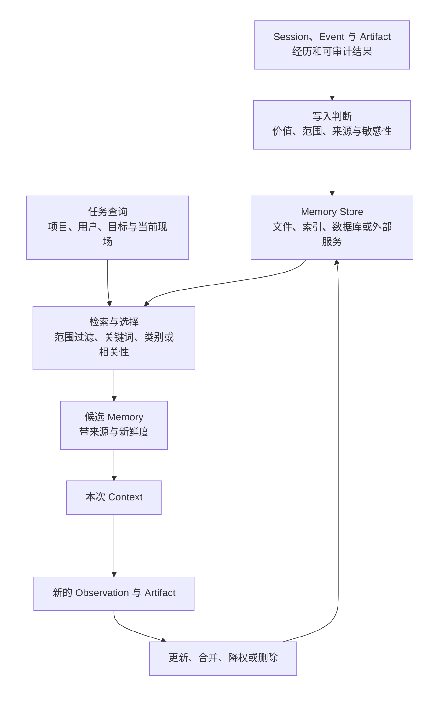

# Memory：Harness 如何保存可复用经验

[统一参考架构](04_reference_architecture.md#八个核心对象一项任务由什么组成)已经给出了本章所需的最小定义：会话（Session）围绕一项可连续任务保存身份、历史与控制状态，本轮上下文（Context）是某次模型调用实际可见的输入投影，事件（Event）记录状态怎样变化，任务产物（Artifact）则是 diff、测试结果或报告等可由任务外部检查的有界结果。本章直接沿用这些对象，不重新定义它们。

继续考虑[序章建立的配置解析错误案例](00_index.md#一句话请求先要落到正确的工作区)。Agent 在第一次任务中发现：仓库的测试必须通过一个特定环境变量启动，某个旧配置键只为向后兼容保留，用户还要求最终说明使用中文。几天后，用户在同一项目发起另一项修复。如果 Harness 只恢复旧 Session，模型可以重新阅读整段对话，却也会带回大量已经结束的搜索、失败尝试和临时判断；如果完全新建任务，模型又会重复踩过已经确认的配置陷阱。真正需要保存的不是“过去发生过的一切”，而是以后仍可能有用、能够在适当范围内取回、并且可被新事实修正的经验。

这正是可检索记忆（Memory）要解决的问题。本章关注“跨任务保存与取回什么”：哪些经历值得留下，怎样区分事实、偏好与过程，写入后如何检索、更新或遗忘，以及不同范围会带来什么传播与安全后果。[第 7 章的 Context 系统](07_context_and_instruction_system.md#context-为什么不只是-prompt)负责决定这些材料在某一次调用中如何投影；后续第 13 章将讨论窗口不足时怎样压缩、截断或外置内容。两章会使用 Memory，却不在这里展开窗口内排序与压缩算法。

## Memory 与 Session 状态的区别

最容易产生的误解是：只要系统保存了聊天记录，就已经拥有 Memory。Session 的职责是让同一项任务能够继续。它需要保留用户输入、模型回复、Tool Call、审批、Event、摘要和分支关系，使“刚才做到哪里”仍然可追踪。Memory 的职责则是从一次或多次任务中保留以后值得复用的信息，使“下一项任务开始时不必从零学习”成为可能。

两者的选择标准不同。Session 通常按发生顺序记录，即使一次错误搜索没有长期价值，也必须保留它与后续结果的因果关系；Memory 应当更克制，只保存具有未来效用的事实、偏好、约束或工作方式。Session 中的一条“测试失败”消息对恢复当前任务很重要，但不适合无条件传播到以后所有任务。相反，“这个仓库的集成测试必须设置 `CONFIG_MODE=legacy`”若经过当前配置和测试 Artifact 验证，就可能成为项目级 Memory。

二者的真值地位也不同。Session Event 说明过去发生过什么，Artifact 说明某次执行产生了什么可检查结果；Memory 是从这些材料中形成的先验。它可以帮助下一项任务先检查正确入口，却不能证明当前工作区仍与过去相同。依赖已经升级、脚本已经改名或用户偏好已经变化时，新的文件读取、命令退出状态和测试 Artifact 必须能够推翻旧 Memory。

因此，Memory 不以“是否落盘”来定义。内存中的 Session 可以没有持久 Memory；一个长期存在的聊天文件也可能只是可恢复记录；项目里的规则文件、用户偏好文件或外部知识库，只要有明确的保存、发现、检索与注入路径，都可以承担 Memory。检索也不必等于向量相似度搜索：按目录层级自动加载、按类别读取、关键词搜索和由模型先读索引再打开详情，都是不同的取回方式。

> **设计取舍｜完整经历还是提炼经验？**
>
> 保存完整经历便于追溯来源，也能让未来系统重新解释旧证据；代价是体积持续增长，临时错误和敏感 Tool Result 会一起留下。只保存提炼后的经验更短、更容易注入 Context，却会丢失细节，并把提炼模型的误判固化下来。稳健的设计通常同时保留可审计来源与较小的使用层：Session 或 rollout 记录负责追溯，Memory 索引、摘要或规则负责未来取回，二者通过来源标识关联而不互相冒充。

## Working、Episodic、Semantic 与 Procedural Memory

认知语言智能体架构常把记忆分为工作记忆、情景记忆、语义记忆与过程性记忆。这套分类可以帮助分析 Harness 保存了哪类内容，但它是内容角色，不要求源码中存在四个同名数据库 [@sumers2024coala]。

**工作记忆（Working Memory）**保存当前仍在使用的目标、约束、最近 Observation 和未决事项。在配置修复中，“正在核对命令行覆盖层，尚未运行回归测试”属于工作记忆。它通常位于 Loop 状态、当前 Context 或 Session 的活跃尾部，生命周期最短。工作记忆若跨任务保存，必须先判断其中哪些内容已经结束，否则“未运行测试”可能在任务完成后仍被错误带入下一次任务。

**情景记忆（Episodic Memory）**保存一次具体经历：在什么项目、什么条件下尝试了什么，结果怎样。测试因缺少环境变量失败、补上变量后通过，就是一段带条件和结果的情景。Reflexion 展示了把失败后的语言反思写入情景缓冲区、供后续试次参考的做法 [@shinn2023reflexion]；对 Coding Harness 而言，还应把反思与原始命令、退出状态和代码版本分开，因为文字总结不能代替外部现场。

**语义记忆（Semantic Memory）**是从经历中提取的相对稳定事实与关系，例如“该仓库采用分层配置，环境变量优先于项目文件”或“用户通常希望中文交付说明”。它比单次经历更适合跨任务复用，却更需要范围和新鲜度。一个项目事实若被写成用户全局偏好，会污染其他仓库；一个用户偏好若只存进某个 Session，又无法在新项目中复用。

**过程性记忆（Procedural Memory）**保存“怎样完成一类任务”。它可以是一组自然语言步骤，也可以外置为 Skill、命令模板或经过验证的脚本。Voyager 的技能库把可执行程序作为可检索、可组合的过程知识，并要求环境反馈和自验证后再入库 [@wang2024voyager]。这一思路说明过程性 Memory 不必只是摘要，但不能据此把七个 Harness 的 Skill 目录都称为自动学习系统：现实中多数 Skill 仍由人编写、安装或审阅，第 11 章将专门讨论其发现与加载。

四类内容经常在同一文件中混合。项目 `AGENTS.md` 可能同时包含语义事实与过程步骤；一次 rollout summary 可能既记录情景，也提炼出语义结论；一个 Todo 工具可以充当外置工作记忆，却不适合保存跨项目偏好。分析时应问“这条内容在未来扮演什么角色、由谁验证、何时失效”，而不是只看文件名是否含有 `memory`。

## 写入、检索、更新与遗忘

可靠 Memory 是一条生命周期，而不是一个 `save` 动作。相关综述把长期记忆操作概括为写入、管理与读取，其中管理还包括摘要、合并冗余与遗忘 [@zhang2024memorysurvey]。图 10-1 将这一抽象翻译为 Harness 的工程路径。

*图 10-1　概念图：Memory 从经历到未来 Context 的生命周期。写入与检索之间隔着范围和管理，新的 Observation 还能反向修正已存内容；不表示七个固定版本都具有同名组件或全部转换。*

图 10-1 的第一道门是写入判断。候选内容至少要回答：它是否可能在另一项任务中仍有价值，证据来自用户明确要求、稳定项目文件，还是模型对一次失败的推断；应保存原始经历、简短事实还是过程步骤；其中是否含有凭据、个人信息或大段工具输出。自动写入能减少遗漏，却也把提炼模型变成持久状态的作者；人工写入更可控，但依赖用户或 Agent 主动识别价值。

第二道门是检索。Generative Agents 的 memory stream 以自然语言保存经历，检索综合相关性、近因与重要性，再通过反思形成更高层结论并写回 [@park2023generativeagents]。它说明长期记忆至少包含记录、取回、抽象和再存储，而不是把全部历史永久塞进 Prompt；但其对象是社交模拟，不应直接当作 Coding Agent 的实现规范。Coding 场景还要加入项目身份、目录范围、代码版本和任务类型等过滤条件。

更新用于处理同一事实的演化。简单追加会留下“使用旧命令”和“使用新命令”两条互相冲突的规则；覆盖可以保持简洁，却可能抹去为什么改变。更可审计的做法是保留来源和更新时间，在使用层标出当前结论，在需要时仍能回到旧情景。若检索命中旧规则，Harness 应先用当前文件或测试验证，再决定替换、保留为版本限定，或删除。

遗忘不是系统失败，而是控制长期噪声的一种管理操作。MemoryBank 用时间衰减和回忆强化实现选择性遗忘，并区分原始对话、事件摘要与用户画像 [@zhong2024memorybank]。这种遗忘曲线只是特定对话系统的工程启发，Coding Harness 可以采用更直接的条件：超过保留期、长期未使用、项目已不存在、来源版本已失效、用户明确删除，或内容已被更高置信度事实取代。关键是让删除可解释，而不是在存储满时静默丢掉未知条目。

## 项目级、用户级与 Session 级范围

Memory 的范围（Scope）决定谁会在什么任务中看到它。表 10-1 用三种核心范围说明传播半径；实现还可以增加团队、组织、工作区或设备范围，但仍要回答同样的问题。

| 范围 | 适合保存 | 典型载体 | 主要收益 | 主要风险 |
|---|---|---|---|---|
| Session 级 | 当前任务的未决事项、临时选择、一次性恢复线索 | Session Item、摘要、Todo、扩展状态 | 与任务因果关系最清楚，不污染其他任务 | 容易被误称为长期 Memory；任务结束后价值迅速下降 |
| 项目级 | 架构约定、构建与测试命令、目录规则、项目特有陷阱 | 仓库指令文件、项目私有目录、项目索引 | 新任务可复用仓库知识，团队规则可共享 | 仓库重构后陈旧；共享文件可能泄漏个人或机器信息 |
| 用户级 | 跨项目语言偏好、通用工作方式、个人环境习惯 | 用户配置目录、全局 Memory 文件 | 减少跨项目重复说明 | 传播半径最大，错误和隐私内容会影响所有项目 |

*表 10-1　Session、项目与用户范围的适用内容及风险。*

表 10-1 最重要的规则是“一条事实只选择一个最合适的范围”。用户说“这个仓库必须使用 Node 22”时，项目范围比用户全局更准确；用户说“所有交付都优先用中文”时，用户范围才有意义；“本轮暂时不要改测试”则应留在 Session。把同一内容复制到多个范围看似保险，实际会制造更新分叉：用户只改了一份文件，另一份旧副本仍会在不同入口重新出现。

共享性与私密性也不是同一个轴。项目级 Memory 可以提交到仓库，成为团队共同规则；也可以位于被忽略的本地目录，只服务某位用户在该项目中的机器配置。Harness 应让载体和界面清楚表达这一差异，尤其不能因为“属于项目”就把本机路径、内部服务地址或个人偏好自动写入版本控制。

范围还影响冲突处理。项目规则与用户偏好冲突时，不应只按后加载者取胜。更合理的解释是：项目事实约束当前仓库，用户偏好只在不违背项目要求时生效，Session 中的直接要求则表达本次任务的具体意图。最终怎样进入模型可见输入，仍由 Context 系统依据来源、作用域和权威构造，而不是由 Memory Store 单独决定。

## Memory、Context 与 Compaction

Memory 回答“哪些信息可以在以后找回”，Context 回答“模型这一次实际看见什么”。Memory Store 可以有上千条记录，当前任务只应取回与项目、用户目标和现场相关的少量候选；候选还要与用户新输入、项目指令、工具说明和最新 Observation 一起经过[第 7 章的投影与容量预算](07_context_and_instruction_system.md#容量预算与不可信内容)。因此，Memory 容量大不等于 Context 可以无限增长，检索命中也不等于内容拥有更高指令权威。

Context 中的工作记忆也不自动成为长期 Memory。模型刚刚发现一个可能的配置入口，这对下一步搜索有用，却不值得立刻跨任务保存。只有当新 Artifact 证明该入口稳定、或多次经历显示同一模式反复出现时，才适合进入写入判断。否则，自动保存会把探索中的猜测升级为未来任务的先验。

Compaction 回答的是另一问题：当某个 Session 历史过长，怎样用摘要、截断、选择或外置让当前模型调用继续。它可以把旧消息变成较短的 Summary Item，但 Summary 仍可能只服务这个 Session。要让其中某条经验跨任务复用，还需经过 Memory 的范围、写入、索引与未来检索路径。反过来，Memory 检索结果进入 Context 后，也可能因窗口压力被裁剪；这不等于原 Memory 被遗忘或删除。

> **学术背景｜外部存储扩大的是可取回范围，不是模型窗口**
>
> MemGPT 把有界主上下文与外部存储之间的显式换入、换出类比为虚拟内存 [@packer2023memgpt]。这一视角适合解释“系统保存的信息多于模型此刻看到的信息”，但不能据此声称七个 Harness 实现了 MemGPT。对本报告而言，Memory 负责窗口外的跨任务保存与取回，第 7 章负责当次投影，第 13 章负责窗口压力下的有损管理；三者通过数据流连接，却保持不同的正确性条件。

## 七个系统的实际机制

表 10-2 按固定版本比较七个系统的主要跨任务路径。它不把 Session 恢复、指令文件、Skill 和自动学习强行压成同一种能力，也不按功能数量排名。

| 系统 | 跨任务保存与取回路径 | 范围与写入方式 | 更新、遗忘与边界 |
|---|---|---|---|
| **Aider** | 可选恢复项目聊天历史；conventions 文件可在每次启动时作为只读 Context 加载 | chat history 位于项目；约定由用户显式维护 | `--restore-chat-history` 默认关闭，过长历史会摘要；本次未识别第一方自动经验提取或检索服务 |
| **Codex** | 可选两阶段管线从旧 rollout 提取、整合 Memory；未来任务先用摘要判断，再按需搜索详情并可附来源引用 | 用户级 memory root；模型从符合条件的 root Session 提取 | Memory feature 固定版本默认关闭；按使用次数、最近使用与未使用期限选择，失败有领取和退避，生成字段做 secret redaction |
| **DeepSeek Harness** | 通过通用 MCP Client 接入 Memorix、MCP Reference Memory 或 Engram 等外部服务 | Provider 自己决定项目身份、存储和检索；overlay 默认关闭 | 交付组合不含 Memory Server；DSH 管连接与 Tool 暴露，不替 Provider 做冲突、遗忘或数据修复 |
| **Gemini CLI** | 分层 Markdown Memory 自动进入未来 Context；实验 Auto Memory 从旧 Session 提议 patch 与 Skill | 共享项目、项目私有、用户全局分层；显式写文件或 inbox 审阅后应用 | Auto Memory 默认关闭，候选不能直接改活跃文件；支持 reload、目标 allowlist、审阅与丢弃 |
| **Goose** | 内建 Memory MCP Extension 提供分类写入、读取和删除；全局内容进入 Extension instructions | 项目 `.goose/memory/` 与用户配置目录；模型调用 Tool 写入 | Extension 需启用并要求保存前确认；按类别全文取回，无内建向量排名、TTL 或自动冲突合并 |
| **OpenCode** | 核心以数据库 Session、instructions、Skill 和持久权限规则为主；生态提供跨 Session Memory 插件 | 项目/用户指令与 Skill 由配置发现；特定 Provider Prompt 另约定仓库 memory 文件 | 核心通用 Memory 服务在本次范围内未识别；`always` 权限保存的是项目策略，不是用户知识 |
| **Pi** | 树形 Session 用于 Resume；全局/项目 Context 文件、Skill 与 Extension 可承载长期知识 | 用户目录、cwd 祖先与项目资源；主要由人或 Extension 维护 | 核心保持小型，本次未识别自动 Memory 提取管线；第三方扩展可增加其他存储与检索方式 |

*表 10-2　七个固定版本的 Memory 及相邻机制。表中“未识别”只描述本次核心源码、文档、配置和测试范围。*

表 10-2 显示了四种不同路线。Codex 与 Gemini CLI 的 Auto Memory 都从旧任务中提取候选，但控制方式不同：Codex 在可选后台管线中先逐 rollout 提取，再全局串行整合；Gemini CLI 把自动候选隔离在项目 inbox，要求用户审阅后才影响活跃 Memory。二者都说明“从 Session 学习”需要专门的调度、并发、失败和安全路径，不能由普通聊天保存顺便完成。

Gemini CLI 的显式文件与 Goose 的 Memory Extension 更强调可理解的写入范围。前者把团队项目、项目私有和用户全局事实路由到不同 Markdown 层，并用普通编辑工具维护；后者用项目/用户目录和分类 Tool 提供写、读、删。它们的检索不以向量库为前提，优点是内容可见、可直接修订，代价是相关性选择、冲突检测和自动遗忘能力有限，文件规模增长后还要另建索引或人工整理。

> **特色机制｜Codex 把提取与全局整合拆成两个阶段**
>
> 固定版本的 Codex 只在非临时、非子 Agent、状态数据库可用且 Memory feature 开启的根 Session 启动后台任务。第一阶段并行领取符合年龄和空闲条件的旧 rollout，生成结构化 raw memory 与摘要并脱敏；第二阶段取得全局锁，按使用和时间选择输入，更新 memory 工作区，再让无网络、仅本地写权限且禁止递归委派的内部 Agent 完成整合。分段设计让逐任务提取可以扩展，同时避免多个实例并发改写全局 Memory；代价是管线状态、领取、退避、基线和整合模型都成为新的可靠性边界。完整产品组合将在 Codex 个案章中展开。

Aider、OpenCode、Pi 与 DeepSeek Harness 说明“不把自动 Memory 放在核心”同样是明确的架构选择。Aider 以编辑与 Git 闭环为中心，允许恢复历史或每次加载 conventions；Pi 把 Session、Context 文件、Skill 和 Extension 分开，让部署者组合长期知识；OpenCode 的核心区分 Session、可复用指令、Skill 与项目级持久权限，第三方 `opencode-supermemory` 才提供通用跨会话记忆；DeepSeek Harness 则把 Memory 明确放在可选 MCP Provider 边界，交付组合不替外部系统拥有数据。公平的问题不是“为什么它们没有同一个向量库”，而是该系统是否清楚区分任务历史、长期规则、外部 Memory 与运行时权限。

## 污染、隐私与陈旧信息

Memory 的价值来自跨任务传播，这也使它成为完整性和隐私边界。若攻击者控制仓库文本、网页、Tool Result 或某次 Session 内容，并能让其中的恶意示范被写入长期存储，后续检索就可能把它送进新的 Context。AgentPoison 表明，在采用 RAG 式长期记忆或知识库的 Agent 中，少量特制条目可以在触发查询时被高概率取回并诱导后续行动，而不需要修改模型权重 [@chen2024agentpoison]。这一研究依赖攻击者能够注入记忆和向量检索路径，不能直接视为七个项目的已验证漏洞；它揭示的是写入与检索都需要完全仲裁。

> **安全提示｜Memory 污染需要跨过哪些边界**
>
> 攻击前提是攻击者或低信任输入能够影响持久写入，或用户批准了来源不明的 Memory、Skill 与扩展。传播路径是：不可信内容进入 Session 或 Tool Result，提取器或模型把它改写为长期条目，未来任务检索并把它放入 Context，模型再据此提出文件、Shell 或网络动作。缓解应覆盖整条链：写入前保留来源、范围和用户意图；自动提取只生成隔离候选并限制目标；检索时过滤项目与身份，显示来源和日期；最终 Tool 参数仍经权限与沙箱检查；发现错误后能定位、删除并审计受影响任务。只在输出里标注“这是记忆”不足以阻止污染。

隐私风险有两层。第一层是存储：用户级 Memory 可能保存语言偏好，也可能误收机器路径、内部地址、客户信息或凭据。项目共享文件还可能被提交到 Git，项目私有目录和用户目录则需要合适的文件权限、备份与删除策略。第二层是提取：即使最终 Memory 保存在本地，自动分析旧 Session 时仍可能把选中的 transcript 片段发送给配置的模型 Provider。Codex 对生成字段做 secret redaction，Gemini CLI 也要求提取 Agent 避免凭据并只把候选写入 inbox；这些控制降低风险，却不能证明所有商业敏感信息都会被识别。

陈旧性比恶意污染更常见。构建命令、分支策略、目录结构和用户偏好都会变化。只追加不更新，会让新旧规则同时命中；只覆盖不留来源，又难以解释变化。Harness 可以结合更新时间、来源版本、最近使用、项目存在性和用户删除来管理条目，并在检索后先验证高风险事实。特别是“测试已通过”“漏洞已修复”“服务可用”这类带时间的结论，应回到当前 Workspace 重新执行，形成新的 Event 与 Artifact，而不是依赖 Memory 直接宣布完成。

设计 Memory 时还需要一条负向规则：不要保存可以廉价重新观察的临时事实。当前 Git diff、正在运行的进程、一次命令的 stdout 和未提交文件内容，通常应由工具重新读取；把它们长期复制既增加隐私面，也更容易过时。Memory 更适合保存“去哪里检查、为什么检查、哪些约束长期有效”，而把“现在究竟是什么状态”交给新的 Observation。

## 本章小结

本章章首的问题是：Harness 怎样避免下一项任务从零开始，又不把整段旧对话当成永远正确的知识？答案是把 Session 与 Memory 分开。Session 保存同一任务的连续性和因果记录，Event 说明发生过什么，Artifact 提供可检查结果；Memory 则从这些经历中选择以后仍可能有用的事实、偏好和过程，并通过明确范围在未来任务中取回。Working、episodic、semantic 与 procedural 描述内容角色，不要求系统实现四个同名存储。

一条可靠 Memory 路径必须覆盖写入、检索、更新和遗忘。写入时判断价值、来源、范围与敏感性；检索时按项目、用户和任务过滤；使用时把条目当作可被当前 Observation 推翻的先验；更新时处理冲突和版本；遗忘时给出时间、使用、删除或替代依据。项目级、用户级与 Session 级范围不能互相复制代替，因为传播半径越大，复用收益、污染影响和隐私责任都会一起扩大。

七个固定版本并没有收敛到一种实现：Codex 提供默认关闭的两阶段提取与整合，Gemini CLI 组合分层 Markdown 与人工审阅的实验 Auto Memory，Goose 用可启用的内建 Memory MCP Extension 保存分类文本；DeepSeek Harness 把长期 Memory 交给可选外部 MCP Provider，Aider、OpenCode 与 Pi 则主要依靠显式历史、指令、Skill、权限或扩展保持可复用性。它们共同说明，Memory 的核心不是“有没有向量数据库”，而是保存对象、范围、取回路径、更新责任和安全边界是否清楚。

接下来第 11 章将进一步拆开过程性知识的主要载体，解释 Skill、Prompt Template、Slash Command 与 Hook 怎样把可复用工作方式接入 Harness。之后的 Session 章会讨论同一任务如何持久化与 Resume，第 13 章再处理历史装不进模型窗口时的 Compaction；三者与 Memory 相连，但分别回答“怎样继续同一任务”“怎样缩短当前可见历史”和“跨任务保存什么”。
