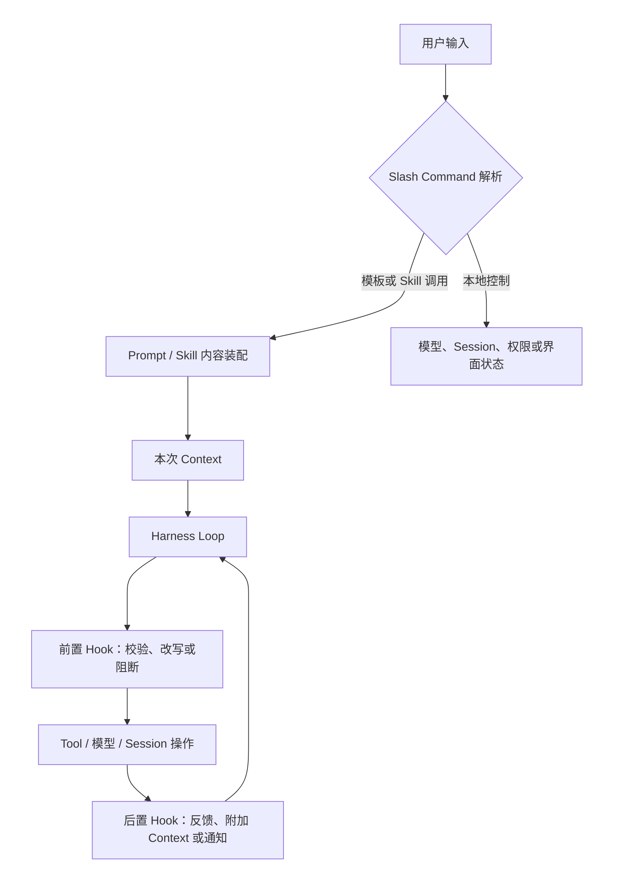

# Skills、Prompt、Command 与 Hook

[第 09 章](09_plugins_mcp_and_extensions.md#pluginextensionmcpskill-与-hook)已经把插件（Plugin）、扩展（Extension）、模型上下文协议（Model Context Protocol，MCP）、技能（Skill）与钩子（Hook）放进同一张五分类坐标。本章不再重复 MCP 的传输、初始化与能力协商，而是把其中最容易在使用体验里混成一团的四类机制拆开：Skill 让过程性说明可以被发现和按需装入，提示模板（Prompt Template）把可复用文本实例化，斜杠命令（Slash Command）让用户显式控制 Harness，Hook 则在生命周期边界观察、改写或阻断运行。

继续使用[序章建立的配置解析错误案例](00_index.md#一句话请求先要落到正确的工作区)。团队希望 Agent 每次都先确认复现路径、只改必要文件、运行指定测试，并在结束前检查 diff。最简单的办法，是每次手写这段要求；很快，团队就会希望把它保存成模板，把更长的调试步骤做成 Skill，用 `/fix-config` 明确触发，再用 Hook 阻止未经验证的结束。四类机制看起来都在“给 Agent 加规则”，但若不区分触发者、参数、生命周期与权限，系统就会把“读到一份说明”误成“已经获准执行”，把“命令展开了一段 Prompt”误成“命令已经完成”，或把后置 Hook 的失败误成外部副作用没有发生。

## 四类机制分别解决什么问题

Skill 解决的是**过程怎样被复用**。它通常以带元数据的文件或目录存在，目录项只向模型暴露名称与描述；当任务匹配时，模型或用户再装入完整正文，并按需读取脚本、参考资料和资产。Skill 因而位于[第 07 章的 Context 投影](07_context_and_instruction_system.md#context-为什么不只是-prompt)与[第 09 章的扩展来源](09_plugins_mcp_and_extensions.md#pluginextensionmcpskill-与-hook)之间：它把过程性知识移出常驻系统提示，却不自动注册新的执行能力。

Prompt Template 解决的是**同一意图怎样稳定实例化**。模板把固定结构与变量槽分开，用户提供文件名、组件名、时间范围或其他参数后，Harness 生成一份普通 Prompt。提示工程综述将 Prompt Template 定义为带一个或多个变量、替换后得到具体实例的函数；Prompt Pattern 则进一步强调可复用方案应描述意图、结构、适用条件与后果，而不只是保存一句示例 [@schulhoff2024promptreport; @white2023promptpatterns]。在 Harness 中，模板仍然只是 Context 的构造材料；它不会因为含有“运行测试”几个字就直接启动进程。

Slash Command 解决的是**用户怎样明确选择控制路径**。`/model`、`/compact`、`/skills` 可以由客户端本地处理，直接改变模型、Session 或界面；`/review` 也可以展开 Prompt，进入下一次模型调用。关键不在前导斜杠，而在客户端先解析命名空间、参数与当前状态，再决定调用本地处理器、Skill、Template、Recipe 或 Agent Loop。Hook 解决的是**系统怎样在固定阶段施加横切约束**。它可以在用户 Prompt 提交、模型请求、工具选择、权限判断、工具执行、压缩、停止或 Session 结束前后运行；不同 Hook 点能否改写、阻断或仅通知，必须分别定义。

表 11-1 用触发者和主要产物固定这四类机制的边界。它们可以组合，却不形成从“简单”到“高级”的等级。

| 机制 | 典型触发者 | 主要输入 | 主要产物 | 不自动提供什么 |
|---|---|---|---|---|
| **Skill** | 模型根据目录选择，或用户显式调用 | 名称、描述、完整说明、资源定位 | 注入当前 Context 的过程性指令 | 新工具、脚本授权、事务与沙箱 |
| **Prompt Template** | 用户、API 或工作流入口 | 模板正文与参数 | 一次具体 Prompt 实例 | 生命周期控制、执行结果与权限 |
| **Slash Command** | 用户在客户端显式输入 | 命令名、参数、当前 UI/Session 状态 | 本地状态变化，或送入模型的 Prompt/Skill | 所有命令共享同一种持久化与副作用语义 |
| **Hook** | Harness 生命周期事件 | Session、Turn、工具参数、结果或模型请求 | 允许、询问、拒绝、改写、附加 Context 或通知 | 外部副作用回滚与天然隔离 |

表 11-1 最重要的分界是：Skill 与 Template 主要生产模型可见信息，Command 生产用户选择的控制动作，Hook 生产运行时决策。一次 `/review src/config.ts` 可以先选择一个 Template，把参数代入 Prompt，再让模型装入代码审查 Skill；随后，Pre-Tool Hook 检查模型提出的 Shell 参数。四步共享同一任务，却没有任何一步可以替另外三步证明执行成功。

*图 11-1　概念图：Skill、Prompt Template、Slash Command 与 Hook 在一次 Turn 中的组合位置。替代说明：用户命令可以直接改变本地状态，也可以装配模板或 Skill；Loop 执行动作时，前后 Hook 分别介入操作边界；不表示七个固定版本都具有同名组件或全部转换。*

图 11-1 强调触发顺序而不是固定实现。某个系统可以没有独立 Prompt Template 目录，也可以把 Skill 暴露成 Slash Command；只要仍能回答“谁选择了它、内容何时进入 Context、哪个处理器拥有副作用、失败怎样回到 Session”，四类责任就没有被混淆。

## Skill 的发现、选择与加载

Skill 的第一阶段是发现，而不是执行。一个典型加载器会扫描用户目录、项目目录、兼容目录、已安装包或远端索引，只读取 `SKILL.md` 的前置元数据（frontmatter），校验名称和描述，再合并成可用目录。Codex、DeepSeek Harness、Gemini CLI、Goose、OpenCode 与 Pi 的固定版本都采用了这种“摘要常驻、正文按需”的方向，但目录优先级并不一致：Gemini CLI 依次合并内建、Extension、用户与 Workspace 来源，后者覆盖前者；DeepSeek Harness 用 cwd 与 Agent Scope 合并多层 Provider，近层同名项获胜；Pi 对同名项告警并保留先发现者；OpenCode 还可以从配置 URL 拉取带版本的远端目录。名称相同并不意味着内容相同，所以来源与冲突政策是 Skill 身份的一部分。

第二阶段是选择。模型自动选择依赖目录描述是否足够具体，用户显式选择则需要稳定名称和调用入口。Agent Skills 的工程说明把渐进披露分成三层：启动时只预载元数据，相关时读取完整 Skill，更大的材料再从附加文件按需取得 [@anthropic2025agentskills]。这个结构减少常驻 Token，却把路由压力集中到名称与描述上；描述过宽会频繁误触发，描述过窄则让适用任务无法被发现。Voyager 的技能库将可执行程序作为可检索、可组合的过程性知识，并在入库前经过环境反馈与自验证 [@wang2024voyager]。它说明过程知识可以外置并复用，但 Minecraft 程序技能并不等于 Coding Harness 的 `SKILL.md`，后者是否可执行仍取决于 Tool 链。

第三阶段是装入。Gemini CLI 通过 `activate_skill` Tool 找到 Skill、请求激活确认，再把正文和目录结构返回模型；OpenCode 的 `skill` Tool 在读取前执行名为 `skill` 的权限检查，并把相对资源基准写入结果；DeepSeek Harness 的目录把模型调用与用户调用分成两个独立布尔政策，模型 Tool 和用户显式注入都会在读取后再次检查；Goose 支持 `load_skill` Tool 与同名 Slash Command，并可把参数代入 Skill 正文；Pi 则在 system prompt 中列出路径，要求模型用普通 read 工具读取全文，也允许 `/skill:name` 强制装入。它们共同保持了一条边界：Skill 进入 Context 是读取动作，Skill 里提到的脚本仍要通过 Shell 或专用 Tool 执行。

> **设计取舍｜模型自动选择还是用户显式选择？**
>
> 自动选择减少用户操作，适合描述边界清楚、读取成本低的 Skill；它也会把不准确描述转成额外 Context 和意外工作流。显式选择更可预测，并能承载用户参数，却要求用户知道 Skill 名称。实际系统常同时保留两条路径：模型根据精简目录按需装入，用户用命令或提及语法强制选择；禁用模型调用的 Skill 则只保留用户入口。

发现还必须处理变化与失败。DeepSeek Harness 的文件 Provider 为目录变化维护 watcher 与不完整快照：发现暂时失败时，可用候选仍可读取，但结果不进入稳定缓存；OpenCode 对远端 Skill 使用 staging、旧版本备份与原子替换，下载不完整时保留可用缓存；Gemini CLI 和 Pi 提供 reload 路径。这样的恢复比“每轮重新扫描全部目录”更复杂，却避免模型在半更新时看到一份既不是旧版也不是新版的目录。

## Prompt Template 与项目定制

Prompt Template 把稳定结构与变化参数分开。Pi 的模板支持位置参数、全部参数、默认值和切片；Gemini CLI 的自定义命令用 `{{args}}` 替换用户输入，并可用文件注入和 Shell 注入先取得现场材料；OpenCode 的 Command Template 支持 `$ARGUMENTS`、位置参数、文件引用与 Shell 输出；Goose 的内建 Prompt 使用 MiniJinja 渲染结构化上下文，并允许用户在配置目录中覆盖已注册模板。模板机制的共同要求不是占位符语法一致，而是替换边界明确、错误可见、来源可追溯。

参数展开可能只是字符串替换，也可能触及执行平面。Gemini CLI 在普通文本中原样代入参数，在 Shell 注入块内先执行 Shell 转义，并在最终命令成形后要求确认；文件注入还受 Workspace 范围约束。OpenCode 把反引号 Shell 输出和 `@file` 内容加入最终 Prompt。此时，Template 已经不再是纯函数：它先读取文件或启动进程，再把 Observation 拼进 Prompt。因此，Harness 要沿用[第 08 章的四类 envelope](08_tool_call_system.md#请求参数与-call-id)思想，至少保留最终命令、工作目录、退出状态与拒绝原因，不能让模板处理器用一段静态文本掩盖真实副作用。

项目定制扩大了复用，也扩大了信任面。把 `.gemini/commands/`、`.opencode/commands/` 或 `.pi/prompts/` 提交进仓库，可以让团队共享流程；同一机制也允许仓库作者预置模型将看到的文字，甚至在模板展开时建议执行命令。Gemini CLI 在 Folder Trust 未建立时不加载项目 Command，并阻止 Project Hook 执行；Pi 只在项目受信任后加载项目 Skill、Prompt 与 Extension 资源。Codex 与 DeepSeek Harness 更强调配置层和 Scope 来源，OpenCode 当前固定版本的 Command/Skill 发现路径则未形成同名的统一 Workspace Trust 闸门。公平比较应描述这些实际边界，而不是假设所有项目定制都采用同一信任模型。

> **学术背景｜模板保存的是解法结构，不是一次答案**
>
> Prompt Pattern Catalog 把可复用提示写成类似软件设计模式的结构：问题、动机、解法、后果与组合关系 [@white2023promptpatterns]。这对项目模板的启发是，稳定部分应表达任务结构和输出契约，变化部分才由参数提供。该目录面向对话式模型，不定义 Coding Harness 的命令运行时；文件读取、Shell 注入、Session 选择和权限仍由各 Harness 自己实现。

Aider 是一个有用的对照。它的固定版本拥有丰富的 Coder Prompt 类、模型与编辑格式专用模板，也允许 `--message-file` 把文件内容作为一次用户输入；但当前分析范围内未识别与 Gemini CLI、OpenCode 或 Pi 对等的第一方项目 Prompt Template 目录。它把稳定 Prompt 更紧密地绑定到编辑事务和 Coder 类型，而不是开放成用户命名的模板注册表。这不是能力缺失排名，而是定制边界的不同选择。

## Slash Command 与用户控制

Slash Command 的首要价值是消除“这是给模型的话，还是给 Harness 的指令”这一歧义。Aider 用 `Commands.run` 在模型之前解析 `/` 命令，方法名 `cmd_xxx` 自动进入命令目录；`/add`、`/drop`、`/model` 与 `/test` 直接操作文件集合、模型或测试路径，`/load` 还能顺序执行命令文件。Codex 的命令枚举明确区分是否允许行内参数、任务运行中能否执行以及侧对话中是否可用；`/permissions`、`/compact`、`/resume` 与 `/skills` 因而不是普通 Prompt 的快捷写法，而是带当前状态约束的控制入口。

DeepSeek Harness 把 Human Command 做成作用域 Registry。客户端先解析完整命令行，再针对精确 Agent 查找定义；命中后写入配对的 `command/run` 与 `command/done` 日志事件，Handler 得到原始参数、附件和取消信号，结果直接进入 UI，不自动形成模型 Message。它把“用户命令生命周期”与“Agent Turn 生命周期”分开，说明 Command 可以有持久化证据，却不必污染模型上下文。

另一类 Command 会转化成模型工作。Gemini CLI 的 Command Service 并行加载内建、文件、Skill、MCP Prompt 等来源，再用 Resolver 处理冲突；Skill 命令先生成 `activate_skill` Tool 调用，激活后才把用户附加要求送入模型。Goose 让内建命令优先于工作流配方（Recipe）与 Skill，同名 Recipe 又优先于 Skill；Recipe 命令可解析必选和可选参数，并把选定 Recipe 持久到 Session。OpenCode 的自定义 Command 还可以选择 Agent、模型以及是否创建 Subtask；Pi 的 Prompt Template、Skill 与 Extension Command 则共同占据斜杠命名空间。

这些差异说明 Command 参数属于控制面，而不只是文本。参数可能选择模型、Agent、Session 分支、权限模式、附件、Recipe 或 Skill，也可能只是进入 Prompt。可靠的客户端需要在提交前完成命名空间解析与可用性判断：未知命令应报错或保留为普通文本，歧义前缀不应随加载顺序随机选择，任务运行中不可安全执行的命令应禁用，取消信号还要传给正在执行的 Command Handler。

> **特色机制｜Goose 把 Skill 与 Recipe 都投影为 Slash Command**
>
> Goose 的固定版本把文件系统 Skill 和参数化 Recipe 放进同一个用户可发现目录，却保留不同执行语义：Skill 命令把完整过程说明装入本次 Agent Context，Recipe 命令还能设置 Session 级工作流、扩展和结构化输出要求。内建命令、Recipe、Skill 的冲突优先级由注册表明确决定。收益是用户入口统一；代价是调试时必须继续追踪命令最终落到一次 Prompt、一个持久 Recipe，还是纯本地控制。

## Hook 与生命周期拦截

Hook 的定义必须包含阶段、输入、控制能力与失败政策。Git Hook 提供了清楚的工程先例：`pre-commit` 在提交创建前运行，非零退出可以中止；`post-commit` 在结果已经形成后通知，不能改变提交结果；部分前置 Hook 还能被显式绕过 [@git2026githooks]。Agent Hook 可以借用“固定阶段插入处理器”的思想，却不能直接继承 Git 的事件名、绕过开关或退出码语义。

前置 Hook 位于副作用之前。Codex 的 PreToolUse Hook 接收 Session、Turn、cwd、模型、权限模式、工具名、Call ID 和最终参数，可以阻断、追加 Context 或给出更新后的输入；多个改写按实际完成次序选取最后一个，只有具有控制权限的 Handler 才能应用阻断和改写。Gemini CLI 的 BeforeTool 也可以合并参数覆盖，BeforeToolSelection 可以过滤工具集合，BeforeModel 甚至可以修改请求或提供合成响应。Pi 的 `tool_call` Extension 允许处理器原地修改参数或返回阻断结果；其固定版本明确提示修改后不会再次执行 Schema 校验，这把正确性责任交给 Extension 作者。

后置 Hook 位于事实已经发生之后。Codex 的 PostToolUse 可以隐藏或替换模型反馈、追加 Context 或停止后续执行；Goose 的 PostToolUse 与 PostToolUseFailure 带稳定 Tool Call ID 关联调用；OpenCode 的 Plugin Hook 在工具执行、消息、压缩和模型请求周围顺序触发；DeepSeek Harness 将 `hook/invoked` 与 `hook/result` 成对写入 Session，记录决策、退出码、错误摘要和耗时。它们都可以改变下一轮看见什么，却不能因为后置结果是“deny”就自动恢复文件、结束进程或撤回网络请求。

Session 与停止 Hook 更接近控制流程。Gemini CLI 的 SessionStart 只注入初始 Context，`continue` 与 `decision` 被忽略，因此属于建议性（advisory）Hook；AfterAgent 可以拒绝最终回答并触发修正。Goose 的 Stop Hook 可以拒绝结束 Turn，把理由作为新 Context 送回模型，同时设置连续阻断上限，避免 Hook 自己制造无限循环。Codex 的 Stop Hook 也能返回继续片段；UserPromptSubmit 则可以阻断输入或附加 Context。所谓“Hook 支持很多事件”并不能说明控制更强，真正决定语义的是某一事件是否处在可逆边界之前，以及 Loop 怎样处理其结果。

Hook 自身也会失败。DeepSeek Harness 的共享 Runner 通过 Shell 服务执行命令 Hook，继承凭据清理、进程组取消和超时；基础设施故障被转成非阻断结果，多 Hook 权限按 `deny > ask > allow` 聚合。Gemini CLI 把退出码 2 解释为业务阻断，其他非零退出通常作为警告继续；Codex 区分继续型失败与中止型失败，并对能施加控制效果的来源做权限区分。没有统一的最佳失败时放行（fail-open）或失败时关闭（fail-closed）策略：审计通知失败通常不应摧毁任务，高风险执行门禁失效却可能需要停止。设计者必须按资产、攻击前提和恢复能力选择，而不能用“Hook 执行过”替代安全结论。

## 权限、参数与上下文继承

四类机制组合时，最危险的简化是“子机制继承父机制的一切”。更稳妥的做法，是把继承拆成三组：**定位信息**包括 cwd、Workspace、Session 与 Turn；**任务信息**包括用户参数、当前 Agent、模型和已加载 Context；**能力信息**包括可见 Tool、调用权限、审批与沙箱。前两组常用于构造输入，第三组必须在动作边界重新求值。

表 11-2 描述的是最小继承关系，而不是要求七个系统使用同一字段。

| 机制 | 通常可以继承 | 必须重新判断 | 应返回原边界的结果 |
|---|---|---|---|
| **Skill** | cwd、来源 Scope、用户附加参数、资源基准 | 是否可见、是否可装入、脚本能否执行 | 装入内容、读取错误与资源定位 |
| **Prompt Template** | 用户参数、项目路径、模板来源 | 文件/Shell 展开权限、参数转义与输出上限 | 最终 Prompt、展开错误与执行状态 |
| **Slash Command** | 当前客户端、Agent、Session 与交互状态 | 命令是否可用、参数是否有效、是否允许改变状态 | UI 结果、Session 事件或新 Prompt |
| **Hook** | Session/Turn ID、cwd、权限模式、Tool 参数与结果 | 处理器是否有控制权、超时、聚合与失败政策 | allow/ask/deny、改写、Context 或诊断 |

表 11-2 解释了两个常见误区。第一，用户显式运行 `/skill:deploy` 只能证明他选择了说明，不能证明说明中所有网络和发布命令都获准。第二，Hook 收到了权限模式，只表示它可以据此计算决策，不表示 Hook 进程本身应获得模型请求里的全部凭据。参数、Context 和权限可以沿同一次 Turn 相关联，却不应被压成一个可任意传播的环境对象。

来源还会改变继承范围。Codex 用 User、Repo、System 与 Admin Scope 标注 Skill，并以配置层决定启用状态；DeepSeek Harness 的 Skill、Prompt Section 与 Command 都可以注册到 Agent Scope，读取时只合并可见链；OpenCode 的 Agent 权限可以隐藏或询问某些 Skill，自定义 Command 又能显式切换 Agent 和模型；Pi 的 Extension Context 能取得 cwd、Session、模型与当前取消信号，但 Project Trust 与逐 Tool 阻断仍是不同事件。相同字段名背后仍有不同权威，恢复或委派时必须重新构造有效 Context，而不是复制旧对象。

> **安全提示｜说明的来源不能替代最终参数审查**
>
> 攻击前提可以是攻击者控制项目 Skill、Prompt Template、Command 文件或 Hook 包，并且该来源被宿主加载。恶意内容先影响模型或参数展开，随后借文件、Shell、网络或凭据能力产生后果。缓解需要分别检查来源与完整性、限制项目资源加载、对 Shell 参数做转义和最终预览、在 Tool 边界重新授权、给 Hook 设置最小环境与超时，并记录实际结果。这里讨论的是传播路径，不是对七个固定版本已验证的漏洞结论。

## 七个系统的组合方式

表 11-3 按“哪一类机制是主要入口、它们怎样组合”比较固定版本。表中没有勾选数量，也不把功能面大小当作架构质量。

| 系统 | Skill 与 Prompt | Slash Command | Hook | 主要路径状态 | 组合中心与适用边界 |
|---|---|---|---|---|---|
| **Aider** | Coder 专用内建 Prompt；可用消息文件输入；当前分析范围未识别第一方 Skill/项目 Template 目录 | 方法式内建命令直接操作编辑、模型、Git 与测试状态 | Git pre-commit 是 Git 行为开关；未识别第一方通用 Harness Hook | not identified | 固定编辑事务，路径短，动态组合面较窄 |
| **Codex** | 多 Scope Skill，摘要目录与显式装入；Plugin 可携带迁移后的命令 Skill | 丰富内建命令按任务状态限制可用性 | 命令或 MCP Tool Hook 覆盖 Prompt、Tool、权限、压缩、Session 与 Stop | feature-gated | 受管理的 Session 运行时，将控制权限与 Hook 来源分开 |
| **DeepSeek Harness** | 分层 Skill Provider、按需 Tool、用户/模型双调用政策；Prompt Section/Context 可作用域装配 | 作用域 Registry，直接 UI Handler，配对持久事件 | 协议桥接、命令 Runner、结构化聚合与 Session 审计 | opt-in | 组合式服务图，Scope 与生命周期是主要控制单元 |
| **Gemini CLI** | 内建、Extension、用户、Workspace Skill；项目 Command 同时充当 Prompt Template | 多 Loader 与冲突 Resolver；Skill 命令转成激活 Tool | 模型、工具、Agent、压缩与 Session 的配置/运行时 Hook | opt-in | 管理面较完整，Folder Trust 与激活确认承担关键边界 |
| **Goose** | 文件 Skill、可定制 MiniJinja Prompt、参数化 Recipe | 内建、Recipe、Skill 合并为统一目录 | Plugin Command Hook 接入工具与状态机，Stop Hook 可要求继续 | opt-in | MCP/Recipe 平台，用户入口统一但内部语义保持分层 |
| **OpenCode** | 多来源 Skill 与按需 Tool；Markdown/JSON Command Template 可选 Agent、模型与 Subtask | 自定义命令可覆盖内建命令 | 进程内 Plugin Hook 顺序改写模型、Tool、Shell、消息与压缩 | opt-in | 会话服务、权限和 Plugin Hook 并行，固定版本接口仍在演进 |
| **Pi** | 多来源 Skill、项目/用户 Prompt Template，均可由包与 CLI 扩展 | 内建、Prompt、Skill、Extension 命令共享入口 | Extension 事件覆盖输入、Context、Provider、Tool、Session 与 UI | opt-in | 可编程小内核；加载期信任与执行期治理由宿主组合 |

表 11-3 显示出三种重复出现的组合逻辑。第一种是**控制入口集中**：Aider 把命令、Prompt 与编辑事务集中在 Coder 周围，减少动态注册与生命周期状态。第二种是**受管理目录与运行时**：Codex、Gemini CLI、Goose 和 OpenCode 让 Skill、Command 与 Hook 进入统一 Session 或 UI，但仍保留不同注册表和权限路径。第三种是**组合式小内核**：DeepSeek Harness 与 Pi 把 Scope 或 Extension API 作为主要装配面，部署者可以改变系统形状，也必须承担更明确的冲突、信任和错误处理责任。

没有一种组合对所有场景都占优。团队共享固定修复流程时，项目 Command Template 足够直接；流程长、资料多且只在相关任务出现时需要，Skill 更节省 Context；组织需要在所有入口强制审计或门禁，Hook 才能覆盖模型与用户没有主动选择的生命周期点。若需求只是跨语言调用外部服务，应回到[第 09 章的 MCP 协议边界](09_plugins_mcp_and_extensions.md#mcp-transport-与双向能力)，而不是把协议能力误塞进 Skill 或 Hook。

## 本章小结

本章的问题是：怎样把可复用流程、用户控制和运行时约束加入 Harness，而不让它们混成一团。答案是按触发者与生命周期拆分。Skill 用“发现摘要—选择—按需装入—继续读取资源”复用过程性知识；Prompt Template 用参数生成一次具体 Context；Slash Command 让用户明确选择本地控制或模型工作；Hook 在固定边界对 Prompt、模型、Tool、压缩、停止与 Session 施加观察、改写、阻断或通知。

四类机制组合时，Context、参数和权限必须分别传播。用户调用 Skill 不等于批准脚本，Template 展开 Shell 不等于命令成功，Command 进入 Session 不等于模型已经执行，后置 Hook 拒绝结果也不等于副作用回滚。七个系统的不同之处，主要在于它们把发现目录、用户入口、生命周期控制和项目定制集中到编辑事务、Session 运行时、MCP/Recipe 平台、作用域服务图或可编程小内核中的哪一处。

这些机制最终都会产生需要保存的状态：装入过哪一版 Skill、Command 改变了什么、Hook 阻断了哪个调用、模板展开时观察到了什么。下一章将从这里进入 Session、持久化与 Resume，讨论这些记录怎样跨进程保留，又为什么保存一段历史仍不能恢复已经变化的外部世界。
