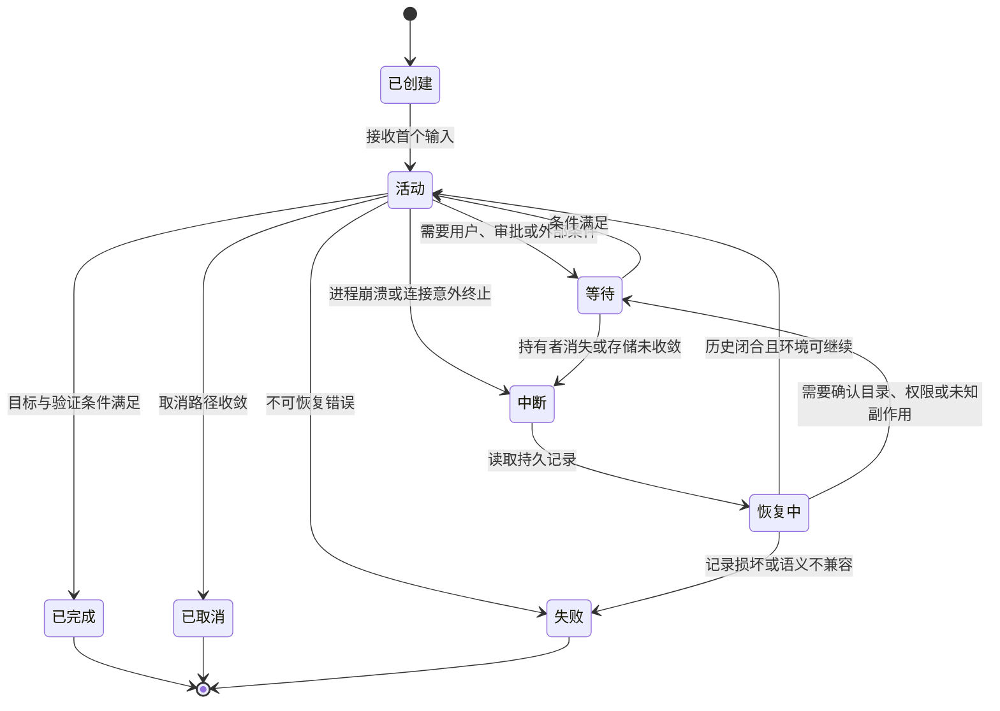

# Session、持久化与 Resume

[统一参考架构的八个核心对象](04_reference_architecture.md#八个核心对象一项任务由什么组成)已经给出 Session、Turn、Message、Event、Item、Context、Memory 与 Artifact 的定义；[Harness Loop](05_harness_loop.md#turn状态与循环不变量)又说明，一个 Turn 只有在行动可归属、结果闭合、观察优先和终止可解释时才算完整。本章不重新定义这些对象，而是追问一个更具体的问题：进程突然退出、终端断线或用户隔天回来时，状态怎样可靠落盘，又怎样从持久材料重建成可以继续的任务？

仍以[序章建立的配置修复案例](00_index.md#一句话请求先要落到正确的工作区)为教学案例。中断可能发生在搜索之后、文件写入之后、测试进程运行中，甚至网络服务已经收到请求而 Harness 尚未记录结果时。保存几条聊天气泡只能帮助回忆；可靠 Resume 还要知道当前任务属于哪个工作区，哪些 Tool Call 已经结束，哪个 Turn 被中断，哪些结果只是界面曾经显示，哪些事实已经进入稳定记录，以及外部世界是否仍与记录一致。

本章的核心结论可以先用一句话概括：Session 持久化保存的是**可重建的任务连续性**，不是对旧进程的时间冻结。Resume 读取过去，却必须在现在重新装配 Context、Provider、工具、权限和工作区；一旦动作已经越过 Harness 的内部状态边界，还要先观察副作用，再决定重试、补偿或交给用户。

## Session 保存的任务边界

Session 的边界应围绕“一项可以被继续、查询或派生的任务”建立，而不是围绕一个终端窗口或一个模型连接建立。最少要保存三类事实。第一类是身份和谱系：Session ID、创建时间、父 Session 或 Fork 来源，使后续写入不会误接到另一个任务。第二类是已提交历史：用户目标、消息、工具请求与结果、审批、摘要、Turn 终态和必要配置。第三类是环境绑定：工作目录、项目根、模型与 Provider 选择、扩展来源、权限模式，以及能够解释旧记录的格式版本。

这些材料仍不是进程镜像。调用栈、打开的文件描述符、模型连接中的缓冲区、正在运行的 Shell 子进程和扩展对象通常只存在于内存。进程退出后，新进程需要重新创建 Provider client、工具注册表、取消令牌和客户端订阅。旧 Session 可以说明“测试命令曾经启动”，却不能让旧进程继续从同一条机器指令执行；它最多提供足够证据，让新的 Loop 判断命令是未启动、已结束，还是结果未知。

图 12-1 给出本章使用的 Session 状态机。它把“等待”与“中断”分开：等待表示系统有意保存控制状态并等待用户、审批或外部条件；中断表示进程或连接没有完成正常收敛。恢复路径先进入恢复中，校验记录和环境后才回到活动或等待；损坏、版本不兼容或无法解释的副作用则进入失败，而不是伪装成一次普通继续。

*图 12-1　概念图：Session 的持久化状态机。替代说明：正常任务在活动、等待与终态之间推进；意外中断必须经过恢复校验，不能直接跳回活动；不表示七个固定版本都具有同名组件或全部转换。*

图 12-1 也说明 Session 的终态不必删除历史。完成、取消和失败仍然是可查询、可导出、可 Fork 的任务记录；区别在于原 Session 是否还接受新的 Turn。某些产品允许在同一 Session 继续对话，某些产品会创建新线程或新分支。稳定要求不是所有系统采用同一种终态，而是每次恢复都能解释当前控制权、活动 Turn 和后续写入应落在哪条谱系上。

## Turn、Message、Event 与 Item

持久化不能只选一个“最详细”的对象然后丢掉其余对象，因为 Turn、Message、Event 与 Item 回答的是不同问题。Message 保存有语义角色的内容，适合重建模型历史和用户界面；Event 保存状态怎样变化，适合解释审批、执行、取消和终态；Item 把消息、工具调用、结果、摘要等异质工作单元放进稳定顺序；Turn 则给这些变化划出控制边界。四者共同决定一条记录能否被可靠 Resume。

表 12-1 用配置修复案例说明不同记录层失效时会丢掉什么。它不是要求每个系统保存四张表，而是帮助判断某种文件或数据库究竟能支持多强的恢复语义。

| 持久层 | 需要保留的关系 | 只保存这一层的局限 |
|---|---|---|
| Turn 边界 | 开始、完成、失败、取消、等待或中断，及其所属 Session | 看得出一轮是否闭合，但无法重建具体内容与调用结果 |
| Message | 角色、内容、来源和必要的 Provider 结构 | 能恢复对话，却可能不知道工具是否真正开始、审批是否发生 |
| Event | 有序状态变化、序号、时间与关联身份 | 能重建控制状态，但仍需投影规则把事件转成模型可见历史 |
| Item | 稳定顺序、类型、Call ID、父子或分支关系 | 便于统一查询和展示，但必须明确哪些更新已提交、哪些只是增量 |

*表 12-1　Turn、Message、Event 与 Item 在恢复中的不同职责。*

表 12-1 的关键是“提交状态”与“展示状态”要分开。[流式 Loop](05_harness_loop.md#流式事件与并行-tool-call)中，客户端可能已经显示半段模型文本、工具参数增量或实时命令输出；这些增量可以丢弃、覆盖或合并。真正用于 Resume 的记录需要一个清楚提交点：完整 Tool Call 已经形成，审批决定已经绑定最终参数，结果已经带原 Call ID 保存，Turn 已经进入明确终态。否则，用户在屏幕上见过什么与新进程能够证明什么会发生分歧。

同一事实也可能同时具有多种表示。测试进程结束可以产生一个“执行结束”Event，一个包含退出状态和输出的 Tool Result Item，以及一条写回 Provider 的 tool Message。可靠实现应指定其中谁是规范事实、其他表示怎样投影出来。若界面事件、数据库消息和模型历史各自独立更新，崩溃就可能让三者落在不同位置；若所有表示都从一份稳定记录派生，恢复时至少有一致的起点。

Session 的详细状态机因此落在本章，而不是停留在“有一份聊天记录”。创建、活动、等待、取消、失败、完成和中断都要能投影到 Turn 与 Item；活动 Turn 内还要追踪模型请求、Tool Call、审批和结果的闭合关系。第 05 章的六条循环不变量在这里转化为落盘要求：只有被持久记录维护的关系，才能跨进程继续成立。

## Event Log、Snapshot 与 Checkpoint

事件日志（Event Log）按发生顺序追加状态变化；快照（Snapshot）保存某一位置的派生状态；检查点（Checkpoint）则声明“越过这个边界之前，恢复所需的材料已经达到规定的耐久条件”。三个词常被混用，实际承担不同责任。

事件溯源（Event Sourcing）的经典表达是把状态变化保存为事件，再通过重放重建当前状态；快照可以缩短重建时间，分支则可以从旧位置建立平行模型 [@fowler2005eventsourcing]。这为分析 Session 提供了清楚坐标，但不能因为一个系统使用 JSONL 就自动称其为完整 Event Sourcing：关键要看记录是否是规范真相，事件是否有稳定顺序和解释规则，快照能否从日志重新生成，以及重放时是否隔离外部更新。

表 12-2 比较三种材料。事件日志保留因果过程，适合审计、迁移和 Fork；快照读取快，却会遗漏到达过程和未决动作；检查点本身不是一种文件格式，它可以由日志 flush、数据库事务提交、Git commit 或多项屏障共同实现。

| 材料 | 主要作用 | 恢复收益 | 主要风险 |
|---|---|---|---|
| Event Log | 保存按序变化与调用关联 | 可重建、审计、截断和派生分支 | 日志增长、版本迁移、尾部撕裂和重放成本 |
| Snapshot | 保存某一位置的折叠状态或工作区版本 | 启动快，可直接提供查询视图 | 来源不清、快照过时、遗漏中间副作用 |
| Checkpoint | 在语义边界建立耐久承诺 | 明确崩溃后最多回退到哪里 | 屏障过密增加延迟，屏障过疏扩大结果未知窗口 |

*表 12-2　Event Log、Snapshot 与 Checkpoint 的职责和风险。*

表 12-2 解释了为什么高质量实现经常组合三者。Codex 先把规范 rollout flush 到 JSONL，再把它投影到 SQLite；DeepSeek Harness 让内存 Session 快速追加 Event，由持久插件批量写入，并在模型请求或顶层工具副作用前显式 flush；Gemini CLI 用 JSONL 保存对话，同时用 shadow Git commit 保存文件现场；OpenCode 与 Pi 的 SQLite 后端则用事务维护关系化状态和分支索引。它们不是在争夺一种“最好格式”，而是在不同位置选择规范日志、查询投影和副作用屏障。

> **学术背景｜持久执行不是序列化调用栈**
>
> 持久执行（Durable Execution）系统可以把工作流写成普通控制流，却把进度保存到事件历史中；Worker 重启后按历史重放决定，已经记录的外部活动结果从历史读取，而不是再次执行。Durable Functions 的形式化工作说明 record-replay 可以在计算与存储分离的故障环境中维持高层语义 [@burckhardt2021durablefunctions]；Temporal 的当前文档也要求 Workflow 对同一历史作出同样决定，并把网络、数据库等不确定交互放入有持久结果的 Activity [@temporal2026durableexecution]。这些机制为 Harness 提供分析参照，不表示七个样本直接实现了相同工作流系统。

检查点的位置决定“记录领先副作用”还是“副作用领先记录”。理想路径是先持久化调用身份和最终参数，再执行动作，最后持久化结果。若进程在第一、二步之间退出，动作尚未发生；在第二、三步之间退出，结果未知；三步之后退出，Resume 应复用已记录结果。完全消除第二个窗口通常需要外部服务配合幂等键、事务或查询接口，Harness 单靠本地日志无法做到。

## Resume、Replay、Branch 与 Fork

任务中断后，“继续”至少包含四种不同操作。恢复（Resume）保持原 Session 身份，在其稳定历史之后继续写入；重放（Replay）读取历史重新计算内部投影，通常不应再次执行外部动作；分支（Branch）在同一逻辑历史中选择旧节点作为新的活动叶；派生（Fork）则创建新的 Session 身份，复制或引用一个历史前缀，并保留来源谱系。

表 12-3 把四种操作放在身份、历史和副作用三个轴上。它能避免常见误解：从旧消息开始新对话可能是 Fork，不是 Resume；把记录重新渲染到界面是 Replay，不是重新运行测试；在树形 Session 中移动 leaf 形成 Branch，也不必复制整份历史。

| 操作 | Session 身份 | 历史处理 | 对外部副作用的默认态度 |
|---|---|---|---|
| Resume | 保持 | 在已提交尾部继续，必要时补中断终态 | 重新观察未决现场，不盲目重做 |
| Replay | 保持或只读视图 | 从日志或快照重建投影 | 已记录结果只读回，不再次发出动作 |
| Branch | 通常保持 | 活动叶移到旧节点，后续形成另一条路径 | 共享同一工作区时必须检查分支间干扰 |
| Fork | 新建并保留来源 | 复制或引用历史前缀，重写必要身份 | 新 Session 不等于新工作区，副作用仍可能共享 |

*表 12-3　Resume、Replay、Branch 与 Fork 的语义差异。*

表 12-3 也揭示了身份与存储成本的取舍。复制式 Fork 简单直观，新 Session 可以独立导出和删除，但长历史会重复存储；引用式 Fork 保存来源位置和历史基线，成本较低，却要求父历史在子 Session 生命周期内保持可解析。Codex 同时出现复制和引用历史的路径；OpenCode 与 Goose 的主要 Fork 会建立新 Session 并复制前缀；Pi 默认 Session 则在一个追加式树中原地 Branch，也能把选定 root-to-leaf 路径导出为新 Session。

分支后的 Context 只应沿当前路径构造。[上下文构造章](07_context_and_instruction_system.md#context-为什么不只是-prompt)已经说明 Context 是投影；本章进一步指出，投影必须先选择 Session 分支。若系统把废弃分支上的工具结果也送入模型，模型就会同时看到互相冲突的文件版本和测试结论。Pi 用 `parentId` 与 `leafId` 沿树回溯，OpenCode Fork 在复制时重写 Message/Part ID 与父引用，Codex 从 rollout 边界截断或引用历史，都是在解决同一条路径选择问题。

> **设计取舍｜修复原 Session，还是创建新 Fork？**
>
> 原地 Resume 保留一个连续任务身份，适合连接短暂中断和客户端重连；代价是恢复逻辑必须处理活动 Turn、悬空工具和格式迁移。Fork 把不确定后缀留在父历史中，以新身份从稳定边界继续，隔离审计和后续写入；代价是用户要理解谱系，而且新 Session 若仍指向同一工作区，文件和进程并没有随身份一起隔离。恢复策略应由记录完整度、工作区共享方式和副作用风险决定，而不是把“继续”统一映射成一个按钮。

## Tool Call 和外部副作用的一致性

[Tool Call 章的四类 envelope](08_tool_call_system.md#请求参数与-call-id)已经区分请求、审批、响应与错误。跨崩溃恢复时，Call ID 仍只解决关联，不能单独提供幂等性（Idempotency）或事务。真正需要保存的是调用越过了哪些边界。

一个可执行调用至少有三种恢复状态。**未启动**表示请求可以存在，但 Harness 没有记录它越过执行屏障；若目标仍需要，通常可以重新调度。**结果未知**表示工具已经开始或外部服务可能已经收到动作，但成功、失败和部分效果没有稳定结果；恢复后必须先检查文件、Git、进程或远端资源。**结果已提交**表示响应或错误已经与 Call ID 持久关联；Replay 应读回该结果，而不是再次执行。

DeepSeek Harness 的固定版本把这一区分直接写进崩溃修复：没有 `tool/call` 的请求生成“未启动”结果，已经记录调用但没有结果的请求生成“结果未知”结果，再补齐 Step 与 Turn 的中断终态。OpenCode 在取消清理时把悬空 Tool Part 标成 interrupted error；Gemini CLI 在恢复 Provider 历史时补齐调用—结果形状，并可用 Git checkpoint 恢复特定文件工具；Codex 对中途历史追加 TurnAborted。这些机制强度不同，却都避免把“没有看到结果”直接解释成“动作没有发生”。

> **安全提示｜取消不是回滚，Resume 也不是重试按钮**
>
> 攻击或事故前提可以只是一个已获准的高副作用工具越过执行边界。用户取消、进程崩溃或客户端断线后，内部日志能够停止后续动作、标记中断并重建控制状态，却不能自动收回已经写入的文件、启动的后台进程、发出的网络请求或远端提交。回滚恢复研究把内部状态恢复与外部输出一致性明确分开 [@elnozahy2002rollback]。缓解方向是副作用前持久屏障、幂等请求键、工作区快照、远端状态查询、补偿操作和人工确认；当结果未知时，系统应保持这一状态，而不是盲目重试。

文件工具相对容易提供局部恢复，因为 Git 或内容寻址快照能够保存被跟踪路径。Gemini CLI 的可选 checkpoint 在文件修改前记录对话与 shadow Git commit，`/restore` 恢复树并删除快照后新增的未跟踪文件；OpenCode 的 Snapshot 服务跟踪 patch 和文件 hash，SessionRevert 恢复文件并清理相应消息后缀；Aider `/undo` 只撤销满足提交归属、未推送和工作树清洁等条件的最近提交。这些都是有边界的补偿，不是对整个 Session 的原子回滚。

网络和外部数据库更依赖对端协议。若创建工单的请求带稳定幂等键，Resume 可以查询相同键是否已经提交；若 API 支持读取当前版本或事务状态，Harness 可以先核对再继续；若对端既不返回可查询身份，也没有补偿接口，最可靠的行为可能是暂停并说明不确定性。事件日志能够保存责任和证据，却不能替外部系统发明事务。

## 七个系统的持久化路径

表 12-4 按规范记录、Resume/Fork 方式和副作用边界比较七个固定版本。这里不以功能数量排名，也不要求专注编辑事务的 Aider 具有平台型 Session 数据库；比较问题是每个系统选择保存什么，以及这种选择允许它做出多强的恢复承诺。

| 系统 | 主要持久材料 | Resume、Replay 与分支 | 副作用一致性边界 |
|---|---|---|---|
| **Aider** | 默认追加输入历史和 Markdown chat history；可选 LLM 日志 | `--restore-chat-history` 显式回灌并摘要；主路径没有通用事件 Replay 或 Session Fork | Git `/undo` 只处理满足严格条件的 Aider 最近提交，Shell/网络另行核对 |
| **Codex** | 规范 JSONL rollout，SQLite 作为可重建查询投影 | Resume 保持线程身份；Fork 从稳定或中断快照产生新线程，可复制或引用历史 | flush 保护规范历史；中途 Fork 追加 TurnAborted，工具外部结果仍按现场判断 |
| **DeepSeek Harness** | 连续 seq 的 Event Log；JSONL/Zstd 或 SQLite 持久后端可组合 | 种子重放恢复 Session；Fork 保留 seed/parent；恢复会修复 torn tail 和开放 Turn | 可选 checkpoint policy 在模型/顶层工具前 flush；结果未知被显式物化 |
| **Gemini CLI** | 项目临时目录中的对话 JSONL；可选 shadow Git checkpoint JSON | Resume 重建 chat 并 harden Provider history；checkpoint restore 同时加载历史与文件快照 | 会话记录默认，文件 checkpoint opt-in；网络与任意 Shell 不在 Git 恢复范围 |
| **Goose** | SQLite/WAL 中的 Session、Conversation、working dir、Provider、扩展和用量 | 读取同一 Session 重新装配；启用 `unstable_session_fork` 的 ACP 构建可复制并截断 Conversation | 消息事务化保存；Provider session 恢复失败可 handoff，活动进程不随 Fork 复制 |
| **OpenCode** | SQLite 中的 Session、Message、Part、顺序记录、输入队列和 Context epoch | 按 ID 读取继续；Fork 克隆消息前缀；Revert 在原 Session 设置边界 | Tool Part 保留 interrupted 状态；Git Snapshot 只恢复被跟踪文件和消息后缀 |
| **Pi** | 默认树形 JSONL；另有事务化 SQLite SessionRepo 包 | 默认原地移动 leaf 形成 Branch，可导出路径或 Fork 新 Session；SQLite 可复制树/分支 | JSONL 解析跳过坏行且未显式 fsync；SQLite 用事务、seq、lane 和 writer lease 增强一致性 |

*表 12-4　七个 Harness 的 Session 持久化、Resume 与副作用边界。*

表 12-4 显示三种主要路线。第一种保存**对话连续性**：Aider 的 Markdown 历史能让模型回忆旧讨论，路径简单，但不会还原通用运行状态。第二种保存**结构化会话状态**：Goose、OpenCode 与 Gemini CLI 的记录让客户端按 Session ID 继续，并把消息、工具状态或工作区元数据查询出来。第三种保存**可重放的有序历史**：Codex、DeepSeek Harness 与 Pi 的树形记录把 Turn/Event/Item 或父子 Entry 的顺序放到中心，更适合中断闭合、Fork 和审计。

同一路线内部仍有重要差异。Codex 把 JSONL 作为规范 rollout，SQLite 是可重建视图；DeepSeek Harness 把 Session 核心、持久后端和语义 checkpoint 拆成可组合服务，因而是否获得副作用前 flush 取决于宿主装配；Pi 默认 Coding Agent JSONL 强调可读与树形交互，官方 SQLite 后端则增加事务、lane、operation record、writer lease 和分支缓存。不能把一个项目的可选后端保证写成所有入口的默认行为。

Gemini CLI 与 OpenCode 还展示了“对话恢复”和“工作区恢复”并行存在。前者保存消息，后者用隔离 Git 仓库保存文件版本；两条路径在 checkpoint 或 revert 元数据处关联，却仍不覆盖外部服务。Goose 的 Provider-native session resume 也只是优化：失败时系统可以把持久 Conversation 作为 handoff 继续，说明 Provider 会话身份不是 Harness Session 的唯一真相。

## 崩溃恢复与安全边界

崩溃一致性（Crash Consistency）首先是存储问题。追加日志可能在一条 JSON 中间断裂，数据库可能只提交部分业务表，后台 writer 可能尚未 flush，磁盘满也可能让系统继续运行却停止记录。可靠实现需要定义有效前缀、写入原子性、排序和恢复策略：是拒绝损坏日志，截断 torn tail，跳过可忽略记录，还是回退到上一个 checkpoint。不同选择会影响可用性与证据完整性。

DeepSeek Harness 的 JSONL 后端对 append 失败回退到写入前长度并 fsync，加载时识别 torn tail、截断后追加合成终态；Codex 的 durable write 要求 recorder flush 后再建立 SQLite 投影；Goose 用 SQLite `BEGIN IMMEDIATE` 和 WAL 串行化写者；Pi 的 SQLite 后端用事务和 writer lease，而默认 JSONL 会跳过 malformed line、使用同步 append 却没有显式 fsync。正文据此只能陈述各自实现的边界，不能把“能再次打开文件”统一写成断电后一致。

第二类风险是**环境漂移**。恢复记录中的 cwd 可能已删除或指向另一个 checkout，Git HEAD、未提交文件、项目指令、日期、Provider 模型和扩展版本都可能改变。[Context 章](07_context_and_instruction_system.md#workspace代码与动态上下文)已经说明动态现场必须重新观察；Resume 应先验证工作目录与项目身份，再加载当前指令、工具 Schema 和权限，而不是把旧环境字段当作永远正确的事实。版本不兼容时，应迁移、降级为只读导出或明确拒绝。

第三类风险是**历史本身进入信任边界**。Session 文件可能包含用户源码、终端输出、凭据片段、模型推理、审批决定和外部工具返回；导出或分享会扩大读者范围。恢复还会把旧的不可信仓库文本和 Tool Result 再次送进 Context，使过去的提示注入重新获得影响机会。存储路径需要文件权限与保留策略，导出需要脱敏，导入需要格式和来源校验，旧批准也不应自动升级成当前环境的长期权限。

> **安全提示｜可恢复历史是一项敏感能力**
>
> 攻击前提可能是攻击者能读取、篡改或提供一个 Session 文件，或者控制其中曾被记录的仓库与工具内容。资产包括源码、凭据、审批记录、工作区路径和外部服务身份；传播路径从持久历史进入新 Context，再影响模型提出 Tool Call。缓解方向包括限制 Session 文件访问、校验格式版本与身份、保留来源和调用关联、恢复时重新应用当前权限策略、对导入与分享内容脱敏，以及让未知事件只在明确标记可忽略时跳过。历史可读不代表历史可信，恢复成功也不代表旧授权仍有效。

最后，恢复必须给用户一个可理解的结果。系统应说明从哪个 Session 和边界恢复，旧 Turn 是完成、取消还是中断，哪些调用结果未知，工作目录和模型是否变化，以及哪些文件或外部资源已经重新核对。把这些信息藏在调试日志里，会让用户把“记录已载入”误成“任务已安全继续”。Session 的价值不仅是让 Agent 少问一次背景，更是让责任、事实和未决风险在中断之后仍然可解释。

## 本章小结

章首的问题是：状态怎样可靠落盘，并在中断后重建？答案不是保存一份聊天文本，而是为任务建立稳定身份和谱系，把 Turn、Message、Event 与 Item 的已提交关系写入可解释的持久材料，并在关键副作用前后设置清楚的检查点。Event Log 保存变化过程，Snapshot 加速状态或工作区恢复，Checkpoint 定义耐久边界；Resume 保持原任务身份，Replay 重建内部投影，Branch 在同一历史中选择新路径，Fork 以新身份继承历史前缀。

七个系统分别选择了 Markdown 历史、JSONL rollout、可修复 Event Log、Conversation JSONL 加 Git checkpoint、SQLite Session、关系化 Message/Part，以及树形 JSONL 与可选 SQLite 后端。它们没有共同的最佳格式，只有共同的正确性问题：历史是否有稳定顺序，活动 Turn 是否闭合，调用与结果是否关联，恢复后的 Context 是否重新投影，工作区与外部状态是否重新观察。

最重要的安全与可靠性边界仍是第 05 章建立的那句话：取消不是回滚。Resume 同样不能把外部世界倒回旧时刻；它只能保留证据、缩小不确定性，并根据工具语义选择读回结果、重新观察、幂等重试、补偿或人工确认。下一章将从“历史能够被重建”继续追问“历史过长时怎样缩短而不破坏这些不变量”，进入 Compaction 与上下文管理。
