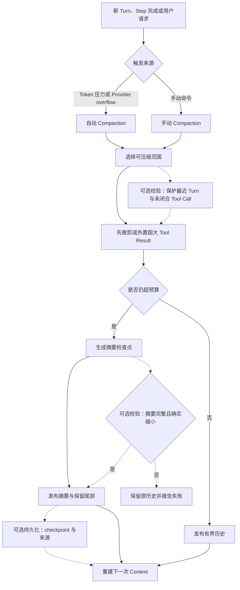

# Compaction 与上下文管理

[统一参考架构](04_reference_architecture.md#八个核心对象一项任务由什么组成)已经给出本章直接沿用的四个对象：会话（Session）保存一项任务的连续材料，本轮上下文（Context）是某次模型调用实际可见的输入投影，事件（Event）记录状态怎样变化，任务产物（Artifact）则是可被外部检查或后续取回的有界结果。本章不重新定义它们，而是追问一个更具体的问题：当 Session 还要继续、Context 却已经装不下时，Harness 应当舍弃什么、改写什么、移到哪里，又怎样避免把任务事实压成一个流畅但错误的故事。

仍以[序章的配置解析错误案例](00_index.md#一句话请求先要落到正确的工作区)为教学案例。任务开始时只有用户要求和几段代码，后来却会积累搜索结果、文件读取、编辑尝试、失败日志、测试输出、权限决定与模型解释。[纵向生命周期](03_vertical_lifecycle_walkthrough.md)已经用“测试已处理”说明了摘要漂移的直觉风险：原始事实可能只是“测试失败，仍待确认”，压缩后的文字却把它改成了完成状态。本章将把这个例子推进到机制层，说明截断、摘要、选择、外部化和恢复分别怎样改变信息表示，以及七个固定版本怎样处理这些边界。

这里还要先划清两条相邻章节的责任。[上下文构造章节](07_context_and_instruction_system.md#容量预算与不可信内容)解释一次请求如何给指令、代码、工具与历史分配容量，并用 locator 保留未进入窗口的材料；本章聚焦压力出现后，压缩算法如何选择范围、生成替代表示并维持保真度。Memory 面向跨调用或跨任务的按需取回，Compaction 面向当前 Session 窗口内的取舍；前者回答“以后怎样找回来”，后者回答“下一次模型调用现在看什么”。

## 为什么上下文最终会装不下

Context 会增长，不是因为对话变长这一项原因，而是因为 Harness 每轮都要重新提交一组共同工作材料。系统指令、项目规则、Tool Schema、用户新输入、近期历史、文件片段和 Tool Result 都会占用窗口；模型还必须预留输出空间。配置修复若经历十几次搜索、读取和测试，每次命令的输出都可能远大于模型最后需要记住的结论。历史增长于是呈现出一个不对称现象：产生证据很便宜，反复携带证据却越来越昂贵。

单纯增大窗口不能消除这个问题。首先，工具和仓库能够产生的文本没有固定上界，一次递归日志或构建输出就可能吞掉大部分容量。其次，较长并不等于更容易使用；相关信息落在长上下文中部时，模型利用质量可能下降 [@liu2024lostinthemiddle]。最后，过时结果会与新结果同时存在，例如旧分支上的测试失败与修改后的测试通过都被保留，模型还要判断哪一条更接近当前现场。容量压力因此同时是大小、位置和时效性问题。

真正需要保护的也不是“聊天记录”这个整体，而是 Loop 的关键不变量：用户目标与禁止事项仍可识别，未完成调用没有被写成完成，最近修改和失败仍可追踪，新鲜 Observation 能推翻旧推断，终止判断还有可核对的 Artifact。若这些状态被保住，早期的重复搜索文本可以离开窗口；若这些状态被破坏，即使摘要只有几百字，任务也已经失去连续性。

这解释了为什么 Context 压力不能等到 Provider 拒绝请求后再临时删除最旧消息。可靠路径会在请求前估算可用空间，在工具返回时限制单个结果，在 Loop 边界识别压力，并为已确认的 Provider overflow 准备恢复路径。不同系统选择的阈值和统计口径并不相同，但它们都在回答同一件事：必须在模型窗口真正耗尽之前，给压缩操作本身留下输入与输出空间。

## 截断、摘要、选择与外部化

压缩不是一种算法，而是四类信息操作。表 13-1 从“原文是否仍在窗口”“是否生成新语义”“怎样恢复细节”三个角度区分它们。

| 方法 | 模型本次看见什么 | 主要收益 | 典型失真与恢复方式 |
|---|---|---|---|
| **截断（Truncation）** | 原文头部、尾部或若干固定片段 | 无需模型调用，大小上界清楚 | 中间证据消失；依靠截断标记、offset 或重跑工具恢复 |
| **摘要（Summarization）** | 模型生成的较短语义表示 | 能合并重复过程并保留跨步骤关系 | 可能遗漏、误述或新增事实；依靠原始 Event、Tool Result 与 Artifact 核验 |
| **选择（Selection）** | 按相关性、时间或类型挑出的原始单位 | 保留被选材料的逐字保真 | 选择器可能漏掉关键单位；依靠检索、扩大范围或改变查询恢复 |
| **外部化（Externalization）** | 有界预览、定位信息（Locator）与取回说明 | 原文不常驻窗口，仍可按需取回 | locator 失效、权限不足或文件已清理；依靠 Artifact 生命周期与失败提示处理 |

*表 13-1　四类上下文压缩方法。它们可以串联使用，但保留的信息性质不同。*

表 13-1 最重要的结论是：缩短长度不等于采用了同一种风险。截断保留原文局部，适合 Shell 尾部错误、文件头部定义或搜索前几项；它不会凭空创造事实，却可能把关键证据切掉。摘要可以把“搜索—修改—测试”的因果关系压成几条状态，但它生成了新的文本，必须接受忠实度风险。选择通常发生在更早的 Context Builder，例如只送相关文件、Repo Map 或最近 Turn；它保留原始内容，却把风险移到了选择器。外部化则不改原文，只把它移出窗口，留下预览和 locator。

提示压缩研究进一步说明，高压缩比不能靠对整段输入均匀删除来实现。组件级预算、问题相关选择与细粒度删减会影响被保留信息的密度 [@jiang2023llmlingua]；在长上下文中，重排和问题感知选择还会改变关键信息所处位置 [@jiang2024longllmlingua]。这些研究为比较算法提供了视角，但不等于七个 Harness 实现了相应论文方法。

> **学术背景｜外置与压短是两种不同的连续性机制**
>
> MemGPT 用显式换入、换出和外部存储类比虚拟内存，说明有界窗口可以通过“当前可见区 + 外部存储”扩展，而不必把所有材料都改写成摘要 [@packer2023memgpt]。对 Coding Harness 而言，spill 文件、日志、Session 数据库和 diff Artifact 都可能承担外置材料，但只有建立了定位、权限、读取和失效语义，外置才真正可用；仅仅把文本写到临时文件，还不是可检索 Memory。

实际系统通常把四类方法串起来：Tool Result 先按头尾截断并写入 Artifact，历史选择器保护最近 Turn，再把较老范围交给摘要模型，最后用一个摘要检查点（checkpoint）加保留尾部构成新 Context。每一层都要留下可见标记；否则模型无法区分“这里本来没有内容”和“这里有内容但当前没有携带”。

## 自动和手动 Compaction

自动压缩与手动压缩使用的摘要算法可以相同，控制语义却不同。自动路径由 Harness 判断压力，需要在用户没有显式发令时保持任务继续；手动路径由用户主动要求腾出空间，通常适合在阶段性工作完成、准备切换主题或模型之前建立检查点。图 13-1 是一份兼顾两类触发的规范化检查表，其中虚线节点表示固定版本实现可以选择的校验或持久化步骤。

*图 13-1　规范化检查表：自动与手动 Compaction 可共享范围选择、结果裁剪、摘要校验和持久化步骤；虚线表示各实现可选的校验节点，失败时不应伪造完成的 checkpoint。*

图 13-1 把压缩放在一个明确事务边界内。范围选择不能切开尚未得到 Tool Result 的调用，否则下一次请求会出现孤立结果或悬空调用；最近 Turn 要么整体保留，要么在可解释边界切分，并为被压掉的 Turn 前缀另存摘要。摘要返回后还要检查它是否非空、是否真的比原范围小、是否在生成期间遇到取消，以及选中的历史是否已经被新消息改变。只有这些条件成立，系统才应发布新的模型可见历史。

自动路径还要处理两个时点。预请求压缩发生在新用户输入和动态 Context 加入之前，适合防止下一次调用越界，但容易低估即将注入的材料；中途压缩发生在同一 Turn 已执行若干工具之后，需要保住当前用户要求、最新 World State 和未完成工作。Provider 明确返回 context overflow 时，系统可以压缩后重放一次请求，但必须限制重试次数，避免“压缩—仍溢出—再次压缩”的无界循环。

手动路径则要尊重控制权。若当前 Agent 正在执行，系统可以拒绝、等待空闲，或先取消正在运行的 Turn；这三种选择带来的副作用语义不同。用户主动压缩也不表示旧事实失效，更不表示磁盘状态被回滚。一个清楚的界面应报告压缩了多少历史、是否保留尾部、是否失败，以及失败后原历史是否仍然可见。

> **设计取舍｜更早压缩还是更晚压缩**
>
> 较早触发会增加摘要调用次数，也更频繁地改写请求前缀；收益是给摘要本身、工具输出和模型回复留下充足空间。较晚触发减少辅助调用，却可能让 summarizer 也装不下，或只能先粗暴删除 Tool Result。合理阈值必须结合窗口口径、输出 reserve、典型工具大小和恢复策略解释，不能把七个系统的百分比直接排成优劣。

## Tool Result 与文件内容压缩

Tool Result 是 Context 中最容易突然膨胀的对象，也是最不适合统一摘要的对象。测试输出的末尾通常包含失败原因和退出总结，文件读取的开头更可能包含导入、类型和主定义，搜索结果需要保留命中路径与行号，结构化响应还要维护字段与调用身份。对象感知的压缩会先判断结果类型，再选择保留头部、尾部、头尾两端、结构字段或少量匹配项。

位置裁剪必须携带缺失说明。模型看到“最后三十行”时，需要知道前面仍有多少内容、是否保存了完整输出，以及怎样用 offset、limit、grep 或 read 继续读取。没有截断标记时，“没有看到错误”会被错误推成“没有错误”；有了 locator，模型才能把当前预览当作线索而不是全集。[Tool Call 章节](08_tool_call_system.md#执行结果与-observation)强调的执行状态、Call ID 与错误语义在这里仍应保留，不能为了省文本把成功、失败、取消和结果未知压成同一种自然语言。

文件内容还存在一个额外维度：文件可能在压缩之后变化。把旧文件全文概括成“解析器在第 80 行读取环境变量”，下一轮若文件已被修改，这条摘要就只是一段历史知识。更稳妥的表示会保留路径、读取范围、内容散列或修改时刻，并在真正编辑前重新读取。对于大型文件，分块读取与按需加载往往比一次生成全文摘要更可靠；摘要适合保存“为什么这个文件相关”，原始片段适合支撑“现在具体怎样改”。

七个固定版本展示了三种常见组合。OpenCode 与 Pi 在工具层对输出设置行数和字节上限，并把完整文本写到可继续读取的位置；DeepSeek Harness 的 base bundle 同时使用溢写（spill）与无模型裁剪器（model-free pruner），让完整结果和后续模型可见替代物分开；Gemini CLI 会在聊天压缩前优先保留较新的 Function Response，把更老的大结果写盘并缩成尾部预览，还可以对超大结果附加事实摘要。它们共同说明，Tool Result 压缩最好发生在全会话摘要之前，因为一个异常大的结果不应迫使整段历史立刻失真。

> **安全提示｜locator 也是敏感 Artifact**
>
> 攻击或泄露前提可能只是工具输出含有凭据、私有路径或用户数据，而 Harness 把完整文本写到共享临时目录，再把路径放进 Session。压缩降低了模型窗口中的暴露量，却可能扩大磁盘留存和 Resume 可见性。缓解需要让 Artifact 归属于 Session，采用最小文件权限，限制跨工作区读取，记录清理期限，并在写盘失败时明确选择“保留内联结果”还是“返回受控错误”；不能悄悄丢掉成功调用的唯一结果。

## 信息保真度与摘要漂移

摘要漂移（Summary Drift）是摘要在多次改写中逐渐偏离原始事实、状态或约束。它既可能表现为遗漏，也可能表现为状态反转。新闻摘要研究把不忠实内容区分为对原文概念的误述和原文无法支持的新增事实，并说明流畅度或词面重合不足以证明忠实 [@maynez2020faithfulness]。虽然该研究对象不是 Agent Session，它揭示的风险正适用于 Compaction：模型生成的新文本不能因为读起来完整，就自动取得原 Event 和 Artifact 的证据地位。

回到“测试已处理”的例子。原始链条可能是：第一次测试命令参数错误，第二次测试启动后被取消，第三次尚未运行。若摘要只留下“已处理测试问题”，它同时丢失了退出状态、取消事实和待办项。下一轮模型很可能据此宣布完成；这不是一般性的“少了一点细节”，而是把完成谓词从 false 改成 true，直接破坏 Loop 的终止判断。

保真度保护应围绕可判定状态组织。目标与禁止事项需要逐字或近似逐字保留；文件和符号要保留精确名称；Tool Call 要区分 proposed、running、succeeded、failed、cancelled 与 unknown；测试要保留命令、退出状态、适用代码版本和时间；下一步要明确是建议、计划还是已经执行。结构化摘要模板能提醒模型覆盖这些字段，保留近期原文能减少最新状态被二次解释，第二次自检或“摘要必须缩小”检查能拒绝一部分坏结果，但它们都不能从机制上证明语义正确。

重复 Compaction 会进一步放大漂移。若第二次摘要只读第一次摘要和新尾部，它无法发现第一次已经遗漏的事实；若每次都重放完整原始历史，又会失去压缩的意义。实际系统通常采用“前次 checkpoint + 新增历史”的增量更新，并要求合并仍然有效的约束、删除已过时状态。这个设计的核心不是让摘要永远累加，而是让新 Observation 有权覆盖旧摘要，同时保留来源关系，使用户或恢复逻辑能够回到原始记录核对。

评价摘要质量也应超越字数。一个可用于继续 Coding 的 checkpoint 至少要回答：目标是否仍准确，最近现实状态是什么，哪些结论来自工具，哪些只是模型推断，哪些任务完成、失败或未决，哪些 Artifact 能重新检查。压缩比很高但缺少这五类信息，只是把窗口压力变成了更隐蔽的任务风险。

## Memory、Resume 与上下文重建

Compaction 与 Memory 的共同点是都能让过去影响未来，区别在于取回路径。Compaction 的 checkpoint 通常位于当前 Session 分支中，Context Builder 默认把它当作先前历史的替代表示；Memory 位于当前调用之外，需要保存、索引、查询和选择性注入，且可能跨 Session 或跨任务使用。把一次任务摘要自动升级为 Memory，会让临时判断污染后续任务；把长期项目规则只放在 compaction 摘要里，又会在 Session 结束后失去稳定取回路径。

Resume 则是重建操作。它先从持久 Session 中找到最新有效的 compaction boundary，恢复摘要、保留尾部与后续 Event；再重新读取当前项目指令、工具目录、工作区和必要 Artifact，构造一个新的 Context。这个过程不会恢复旧模型调用的精确输入，也不会让文件、进程、Git 或远端服务回到过去。旧摘要可以说明“上次认为测试失败”，新执行结果才说明“现在是否仍失败”。

不同持久化结构会改变恢复强度。append-only Event Log 可以保留被 checkpoint 遮蔽的原始记录，让重放确定地得到同一模型可见 surface；数据库可以保存 compaction message、summary 与 tail 起点，再在查询时重排；树形 Session 可以把 compaction 作为新 Entry，旧分支仍然存在；简单聊天日志则可能只恢复文本，再由摘要器重新压缩。它们都能提供连续性，但只有明确记录 checkpoint 来源、适用分支、保留尾部和失败状态，Resume 才知道该信任哪一个压缩结果。

Artifact 是连接压缩与现实的关键。完整 Tool Result、diff、测试记录和被外置的文件内容可以不常驻 Context，却应在需要核验时可取回。若 locator 已失效，恢复逻辑必须把相应结论降级为待确认，而不是继续引用摘要。于是，一次可靠的上下文重建不是“加载最近摘要”这一动作，而是“加载保存状态、检查可取回证据、重新观察易漂移现场，再形成新投影”的组合。

## 七个系统的机制与失效模式

表 13-2 按主要触发、压缩形状、Tool/File 策略和关键失效边界比较七个固定版本。表中描述的是已接入的主要路径，不是质量或成熟度排名。

| 系统 | 主要触发与范围 | 压缩后的模型可见形状 | Tool/File 处理 | 关键失效模式与处理 |
|---|---|---|---|---|
| **Aider** | 已完成历史超过模型相关软上限时后台摘要；用户可 `/clear`、`/drop` | 较早历史摘要 + 近期消息尾部 | Repo Map 在预算内选择仓库结构；已加入聊天的文件通常原样进入 | 摘要失败尝试弱模型到主模型；历史过大仍可要求用户清理或继续尝试 |
| **Codex** | 手动 `/compact`，请求前/中途 Token 压力，模型缩窗或兼容性变化 | 本地/远端 summary replacement，或 token-budget 新窗口 | 请求历史按模型策略截断；压缩后重新注入当前 World State | Hook 可中止；远端失败可按条件 fallback；checkpoint 与 replacement history 支持 Resume 重建 |
| **DeepSeek Harness** | base bundle 默认自动压力、canonical overflow 与 `/compact` | 日志保留原 Event，surface 用 checkpoint + recent tail 替代旧范围 | 先 model-free prune；超长纯文本 spill 为预览 + locator | tool pairing、不缩小摘要、范围变化会拒绝；未闭合 start 保留为可检测锁 |
| **Gemini CLI** | 默认窗口比例触发，手动 `/compress` 强制 | `<state_snapshot>` + 近期约三成历史 | 旧 Function Response 按逆向预算截断并写盘；可选 Tool/File distillation | 空摘要或 Token 膨胀不落地；一次自动摘要失败后可只做截断，避免反复付费失败 |
| **Goose** | 默认比例自动触发，`/compact` 经确认；Provider 可声明自管 Context | agent-only 结构化摘要 + continuation，原消息仍可 user-visible | 可后台摘要旧 Tool pair；summarizer overflow 时渐进移除中部 Tool Response | 结构解析失败保留原始摘要文本；移除全部 Tool Response 仍溢出则失败 |
| **OpenCode** | 自动 Token/Provider overflow，TUI/API 手动 compact | compaction marker + summary + 按 Token 保留的近期 tail | Tool output 默认写文件并给预览；旧结果可标为 compacted 后清空 | compaction agent 禁用工具；摘要本身 overflow 会停止；媒体过大时剥离并给继续说明 |
| **Pi** | 默认阈值、一次 overflow 恢复与手动 compact | 持久 Compaction Entry + retained tail；可在 Turn 内切分 | read 保留头部，bash 保留尾部，完整输出路径按工具提供 | Extension 可取消/替换摘要；自动 overflow 只 compact-and-retry 一次，避免循环 |

*表 13-2　七个固定版本的 Compaction、Tool Result 压缩与失效边界。阈值数字因窗口口径和配置不同，不作横向排名。*

表 13-2 显示出四种控制中心。Aider 把压缩嵌入集中式编辑循环，重点是历史摘要、Repo Map 与人工清理；Codex、Gemini CLI 和 Pi 把压缩作为 Turn 生命周期的一部分，显式区分手动、阈值与 overflow；Goose 和 OpenCode 以 Session 可见性或数据库边界保存 checkpoint；DeepSeek Harness 则把测量、pruning、summarization、surface replacement 与 spill 拆成可组合服务。定位不同，所以“不适用”本身也是结果：Aider 没有必要被强行描述成事件驱动 compaction 事务，Provider 自行管理 Context 时 Goose 也会退出宿主压缩路径。

> **特色机制｜DeepSeek Harness 把原始日志、模型可见 surface 与外置 Artifact 分成三层**
>
> 固定版本的 base bundle 先用 Token Meter 判断压力，允许 Tool Result Pruner 在不调用模型的情况下替换超大结果；若仍需摘要，Compaction Engine 在日志中记录 start、summary 与 end，用一个带来源的 replacement message 改变模型可见 surface；独立 spill policy 则把完整 Tool Result 保存为 Session 归属 Artifact。收益是“保存了什么、模型看什么、完整文本在哪里”可以分别追踪，代价是锁、surface generation、locator 生命周期和多插件失败顺序都要明确管理。

跨系统真正值得比较的不是摘要模板长短，而是五个问题：压缩能作用于哪些范围，哪些近期事实和调用配对受到保护，摘要失败是否保留原历史，原文与来源是否可取回，Resume 能否识别最新有效 checkpoint。只有同时回答这些问题，才能判断一个系统是在降低窗口压力，还是把不可见的损失留给下一轮模型猜测。

## 本章小结

上下文最终会装不下，是因为 Coding Agent 不断产生比最终结论更大的过程证据，而模型窗口还要同时容纳指令、工具、文件和输出空间。Compaction 的任务不是简单删旧消息，而是在 Session 继续存在的前提下，为下一次 Context 选择新的表示。截断保留局部原文，摘要生成有损语义，选择保留原始子集，外部化用 locator 把完整材料移出窗口；四者可以组合，却有不同的保真度和恢复路径。

可靠压缩要保护目标、未决状态、Tool pairing、最近修改和可核验 Artifact；自动路径还要区分请求前、中途与 Provider overflow，手动路径则要明确当前任务是否空闲、失败后历史是否改变。摘要模板、自检、保留尾部和结构校验能够降低风险，但不能把生成文字升级成事实。最关键的防线仍是让新 Observation 推翻旧摘要，并让原始 Event、Tool Result 与 Artifact 在需要时可以重新检查。

Memory、Compaction 与 Resume 由此形成清楚分工：Memory 负责跨调用或跨任务的检索，Compaction 负责当前窗口内的取舍，Resume 则把持久 checkpoint、后续历史与当前现场重新投影成新的 Context。下一章将沿这条边界继续讨论 Token 账本、缓存、输入输出预算和成本控制，区分“窗口装得下”与“任务整体更省、更快”这两个相关但不同的问题。
