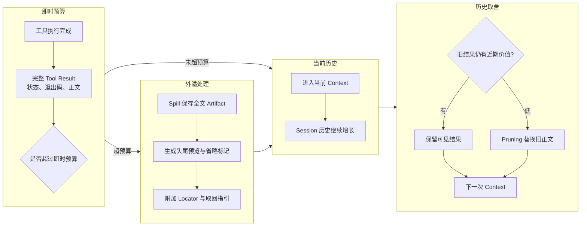

# Token 效率与成本控制

[统一参考架构](04_reference_architecture.md#本轮上下文可检索记忆与压缩保存和看见是两回事)已经把本轮上下文（Context）定义为一次模型调用实际可见的投影，[模型与 Provider 抽象](06_model_and_provider_abstraction.md#token速率限制与认证)则说明了不同 Provider 的使用量字段不能直接相加。本章把问题转到 Harness 策略侧：在[序章建立的配置解析错误案例](00_index.md#一句话请求先要落到正确的工作区)中，系统怎样少发送无关材料、少保留重复输出、复用稳定前缀、限制生成与推理，并把辅助调用和 Subagent 也纳入总账。

这里的目标不是把 Token 数压到最低。若为了省输入而漏掉项目约束，为了省输出而不给出可检查的测试结果，或把主会话的消耗转移到未计量的子会话，数字会变小，任务却会变差。有效的 Token 效率，是在完成质量和安全边界仍成立时，减少完成一项任务所需的重复计算、无关信息与无效生成。

## Token 账本到底记录什么

令牌账本（Token ledger）首先要回答“这一项数字代表什么”，然后才回答“用了多少”。输入 Token 可能包含未缓存输入，也可能已经包含缓存读取；推理 Token 有时是输出的子集，有时只在 Provider 的明细中出现；缓存写入还可能采用与普通输入不同的价格。第 06 章已经建立这些字段的包含关系，本章不重复 Provider 字段表，只保留 Harness 作决策所需的四类视图。

第一类是**窗口占用**：下一次请求实际要放进模型窗口的系统指令、工具 Schema、历史消息、文件片段与最新 Observation。第二类是**账单使用量**：Provider 最终报告的非缓存输入、缓存读写、输出与费用。第三类是**辅助开销**：历史摘要、Tool Result 蒸馏、标题生成、路由判断、自动审查与 Subagent 的独立调用。第四类是**任务结果**：是否完成目标、验证覆盖到哪里、是否发生重试，以及用户等待了多久。缺少任一类，都可能把“窗口变小”“单次请求变便宜”或“主 Session 看起来更干净”误写成整个任务更高效。

表 14-1 给出一份面向 Harness 的最小观测面。它不是统一数据 Schema，而是要求不同系统在比较前说明数字的来源、范围和包含关系。

| 观测面 | 至少保留什么 | 容易产生的误判 |
|---|---|---|
| 请求压力 | Context window、当前输入投影、为输出预留的空间 | 把模型最大窗口当成每轮可用输入 |
| 账单桶 | 非缓存输入、cache read、cache write、输出、推理明细、费用来源 | 把缓存 Token 重复计入 input，或把推理再加到 output 上 |
| 调用拓扑 | 主模型、摘要、蒸馏、弱模型、重试、Subagent | 只统计主会话，忽略辅助调用和失败重做 |
| 时间与资源 | 首 Token 延迟、总延迟、并发、Provider 限流、外置存储 | 把更少 Token 直接等同于更低延迟 |
| 任务质量 | 成功、测试与 diff、约束保留、未决错误、人工修正 | 以省钱为由接受未完成或不可验证的结果 |

*表 14-1　Token 效率的五类观测面。只有把资源使用与任务结果放在同一记录中，才能判断一次优化是否真的有效。*

七个固定版本已经呈现不同的落点。DeepSeek Harness 的 Token Meter 明确区分互斥的未缓存输入、输出、缓存读取与缓存写入，并把账单累计、下一请求压力和 Context 构成分成三个投影。Pi 同样采用互斥输入与缓存桶，并在模型费率上计算各自成本。OpenCode 接收 AI SDK 的 inclusive input 后主动减去缓存读写，再从输出中分出 reasoning。Goose 的使用量账本额外记录费用来源、是否属于 compaction，并能汇总 Subagent 子树。Codex 按 Session 与 Turn 累积 input、cached input、cache write、output 与 reasoning output。Gemini CLI 保留原生 `usageMetadata` 并通过 `/stats` 展示 Session、模型和工具视图。Aider 的 `/tokens` 更接近当前 Context 的估算器，实际缓存统计和费用在 streaming 路径上可能不可得。它们都能回答一部分问题，却不能把同名列直接拼成性能排名。

## 减少输入与选择上下文

最直接的节省不是压缩每个词，而是避免把无关材料选进请求。[上下文构造章节](07_context_and_instruction_system.md#文件选择repo-map-与检索)已经说明 Context 是投影；从成本角度看，投影的价值在于让高复用、高权威、当前相关的信息进入窗口，让完整仓库、旧日志和可重新读取的材料留在窗口之外。

以配置解析错误为例，第一次请求通常不需要整个仓库。Harness 可以先保留用户目标、项目指令、相关报错与工具目录，再用路径搜索、符号索引或 Repo Map 找到候选入口。Aider 的 Repo Map 从定义—引用关系中选择预算内的符号树，并允许 `map_tokens` 调整规模；没有文件加入对话时，它还会扩大结构视图以帮助建立全局方向。OpenCode、Codex、Gemini CLI、Goose、DeepSeek Harness 与 Pi 更依赖目录、搜索、按需读取、Workspace 指令和工具调用逐步取得代码。这里不存在一种对所有仓库都更好的方式：结构摘要减少探索轮数，却可能带入大量暂时无关的符号；逐步读取初始输入小，却可能用更多模型—工具往返换取定位。

提示压缩（Prompt compression）是另一条路径。它在材料已经选中后继续删除低信息部分，而不是决定材料是否应进入。LLMLingua 展示了按指令、示例和问题分配不同压缩预算，再做 token 级压缩的思路 [@jiang2023llmlingua]。这可以解释“均匀删除每段文字”为何粗糙，却不能据此声称七个 Harness 实现了该论文。Coding 场景中更常见的工程做法仍是选择文件、限制 Repo Map、保留近期 Observation，并让旧历史进入 compaction。

选择还要考虑调用次数。一轮多带一点稳定的项目约束，可能避免模型走错目录后连续重试；一开始少给得过头，则会用多次搜索、读取与纠错补回。判断输入是否有效，不能只看单轮 prompt tokens，而要看一项任务从定位到验证的总请求数，以及关键约束是否一直可见。

## 截断、Pruning、Spill 与 Locator

工具输出是 Context 膨胀最快的来源之一。测试日志、搜索结果或生成文件可能在一次调用中返回数万行，而模型真正需要的只是退出状态、错误附近几行和完整内容的位置。[Tool Call 章节的结果 Envelope](08_tool_call_system.md#七系统-tool-call-envelope-对照)要求结果保留调用身份、状态和截断信息；成本控制在此基础上增加四种不同动作。

**截断（truncation）**在输出刚产生时保留头部、尾部或固定窗口，并明确标记省略。**修剪（pruning）**在历史已经积累后，删除或替换较旧、低价值的 Tool Result。**外溢（spill）**把完整正文保存到窗口之外，只返回预览。**定位符（locator）**则告诉模型或用户怎样重新找到全文。四者可以组合：一次超大输出先 spill，后续历史变长时再 prune 旧预览；也可以只截断，但若没有 locator，就失去重新核对的路径。

图 14-1 展示 Tool Result 从执行事实到模型可见投影的分层。全文 Artifact 和模型输入不是同一对象，是否写入 Session 记录也需要单独决定。

*图 14-1　概念图：Tool Result 的即时截断、外溢和历史修剪路径。替代说明：工具全文先作为可检查结果保存，模型只接收有界预览；历史增长后，较旧结果还可进一步修剪；不表示七个固定版本都具有同名组件或全部转换。*

图 14-1 的关键是把“执行成功”与“模型看见全文”拆开。OpenCode 默认按行数和字节数把全文写入保留目录，返回预览、路径以及使用 Grep、Read 或 Explore Agent 处理的提示；后台还会清理过期文件。DeepSeek Harness 的 spill policy 对超阈值纯文本保存 Session 级 Artifact，返回头尾预览、opaque locator 与 retrieval hint；若没有 Session owner、没有 backend 或保存失败，则保留原始结果，不能让一次存储故障把成功 Tool Call 改成失败。它的模型无关 Pruner 又能在 compaction 前对旧 Tool Result 做确定性替换，并通过可重放事件更新 Token Meter。

Gemini CLI 在运行期 Tool distillation 中保存原文、结构化截断，并可为特别大的结果额外生成“为什么重要”的摘要；在 chat compression 前，它还从最新历史向前累计 function response 预算，优先保留近期输出，旧输出外置后只留下定位信息。Goose 的 summarizer 若自己发生 overflow，会依次移除更多中部 Tool Response，直到能总结或明确失败。Pi 提供按行和字节的头部/尾部截断工具，具体工具是否附带可恢复 locator 由 Coding Agent 或扩展组合决定。Codex 则让模型元数据和配置共同决定 Tool output 的 token/byte 截断策略。

> **安全提示｜截断可能隐藏最重要的一行**
>
> 攻击或事故的前提是，攻击者能够控制仓库内容、命令输出或远端工具结果，而 Harness 只把其中一段送入模型。被省略的中间区域可能包含失败原因、权限升级指令、敏感数据或与预览相反的结论。缓解方向不是永远传全文，而是保留退出状态、省略范围、来源和受控 locator；在模型准备执行高副作用动作前，按 locator 定点复查相关区间。Locator 本身也不是授权，外置文件仍需遵守 Session、Workspace 和凭据边界。

## Prompt Cache、KV Cache 与稳定前缀

提示缓存（Prompt Cache）复用多个请求共享的前缀计算。它不改变逻辑输入中有多少 Token，却可能减少首 Token 延迟和重复输入费用。研究型 Prompt Cache 将系统消息、模板和文档等片段的注意力状态模块化复用，说明稳定片段为何值得在动态输入之前组织 [@gim2024promptcache]。Provider 自动缓存则通常要求从请求开头连续匹配；模型、工具定义、推理设置或文本输出配置变化，都可能让匹配在变化点停止 [@openai2026promptcaching]。

Codex 默认以 Session ID 作为 `prompt_cache_key`，并且同一 Turn 的增量请求只有在 instructions、tools、reasoning、service tier、cache key 和 text controls 等属性一致时才复用先前响应路径。Aider 把 system prompt、只读文件、Repo Map 与可编辑文件组织为可缓存区块，还可发出只生成一个 Token 的 keepalive 请求维持短期缓存。Pi 在不同 Provider adapter 中映射 session cache key 和 retention，并特意让一次性摘要请求使用新 Session ID、关闭 cache write。Goose 对 Session 命名、Tool label、路由与 compaction 采用同样的 one-shot 思路：关闭 thinking 和 prompt-cache writes，因为这类前缀不会再次读取。Gemini CLI 的自动 caching 还受认证路径限制，API key 与 Vertex AI 路径可用，而 Code Assist OAuth 路径当前不创建 cached content。

键值缓存（Key-Value Cache，KV Cache）位于推理服务内部，保存注意力计算的中间张量；Harness 的 `prompt_cache_key`、消息排序和 stable prefix 只影响服务端是否有机会复用前缀，并不负责服务端的显存管理或吞吐优化。把这两层混在一起，会把 Provider 基础设施的吞吐优化错算成客户端减少了 Token。

> **设计取舍｜更短的历史可能破坏更长的缓存前缀**
>
> Compaction 会用摘要替换旧历史，从变化点开始失去原有前缀匹配；不压缩则能继续命中更长前缀，却让窗口占用持续增长。合理策略通常先保持 system、工具 Schema 与稳定项目指令不变，把动态材料放在后部；只有当窗口压力、位置噪声或累计费用超过收益时才压缩历史。省窗口和省缓存费用可能方向相反，账本应同时记录 compaction 调用、cache write 与后续 cache read，而不是只看下一轮 input 变短。

## 输出和推理预算

输出 Token 既消耗费用，也延长用户等待和后续历史。Harness 可以用最大输出（max output）、文本详细度（verbosity）、编辑格式（edit format）和推理预算（reasoning budget）控制不同部分。关键是让预算与任务阶段匹配：探索阶段需要短而可行动的定位结果，编辑阶段需要精确补丁，验证阶段需要足够的错误与测试说明，最终交付则需要可检查但不重复的解释。

Aider 暴露 thinking token 和 reasoning effort，并允许用 diff、whole、architect/editor 等不同 edit format 约束主模型与编辑模型的分工。Codex 只在模型元数据声明支持时发送 verbosity，并为 reasoning 设置模型有效值；工具输出和自动 compaction 另有独立边界。Gemini CLI 的模型配置可为不同 Agent 或内部任务设置 `maxOutputTokens` 与 `thinkingBudget`。Pi 的摘要输出会限制在预留预算与模型最大输出之间，OpenCode 的 overflow 判定也先从 context/input limit 中扣除输出 reserve。它们共同说明，输入窗口与输出上限不能使用同一个“总预算”含糊替代。

推理预算也不是越低越好。过低可能让模型在复杂配置覆盖链中提前选择错误入口，随后用更多 Tool Call 和重试补偿；过高则可能为简单的路径查询支付不必要的隐藏或可见推理。推测解码等属于推理服务层的延迟优化，不改变 Harness 侧的预算语义，也不应被统计成 Harness 自己减少了输出 Token。

## 弱模型、路由与任务分层

另一类成本控制不改变文本长度，而是改变“哪一次调用由哪个模型完成”。弱模型（weak model）适合结果结构简单、可验证或失败后容易回退的辅助任务，例如生成 Session 标题、压缩旧历史、标注 Tool Call，或从候选中选择下一条只读路径。复杂根因分析、跨文件编辑和安全敏感审批则需要更高的可靠性，或者至少需要强模型复核。

FrugalGPT 将成本控制归纳为提示适配、模型近似和模型级联（cascade），其中级联先让便宜模型处理查询，再把低置信结果升级到更强模型 [@chen2024frugalgpt]。这一思路能解释 Harness 的任务分层，但 Aider weak model、Goose fast model 或 Gemini Agent routing 都不是该论文算法的直接实现。

Aider 让 weak model 优先处理提交消息和历史摘要，未配置时回用主模型。Goose 以 `GOOSE_FAST_MODEL`、Provider 默认或主模型回退解析 fast model，用于命名、Tool label 和 orchestrator routing；fast model 失败且调用方允许时，改用主模型。Gemini CLI 的 Agent definition 可以固定模型或使用自动路由，OpenCode 的 Subagent 和 compaction Agent 也可携带独立模型配置。DeepSeek Harness 把模型路由做成组合式服务，因此摘要、Session 标题和 Subagent 可以选择不同目标。Codex 主要以每 Turn 模型配置和专用 Guardian/Subagent 路径表达分层，Pi 则把模型、thinking level 与缓存策略作为请求级参数交给核心或扩展。

路由器需要可回退，但不能只靠“模型更便宜”做判断。辅助任务若输出不可验证，例如把失败日志总结成错误结论，低价调用会污染后续每一轮；反之，生成标题失败通常不应阻止主任务。适合弱模型的共同特征是输出边界清楚、成本可单独计量、错误容易检测，并且升级到主模型不会重复不可逆副作用。

## Subagent 的 Token 经济性

Subagent 经常被描述为“节省主上下文”。这句话只说明父 Session 的投影变小：子 Agent 在独立 Context 中读取文件、运行工具，父 Agent 最终只接收有界结果。它没有说明总 Token 变小。子 Agent 仍要读取自己的 system prompt、工具 Schema、任务说明和工作区材料，可能重复父 Agent 已经做过的搜索；多个并发子 Agent 还可能各自建立相同的仓库视图。

当任务是大范围只读探索、多个区域互相独立，并且父 Agent 只需结论与定位时，隔离通常有价值。Gemini CLI 明确把子执行合并为父历史中的单条摘要；OpenCode Task Tool 创建带 `parentID` 的子 Session，fresh 调用不自动拥有父 Context；DeepSeek Harness 的进程外 backend 默认只继承工作目录，子 transcript 留在子 Session；Goose 也为 Subagent 建立独立 Session，并在 usage 查询中汇总子树。Codex 的 Subagent 形成独立线程与 usage，父线程接收其结果。Pi 默认 Coding Agent 不内建 Subagent，只提供可安装的示例 Extension；Aider 当前固定版本不以通用 Subagent 运行时组织任务，因此不应为了表格对称而强行赋予同一指标。

Subagent 真正省 Token 的条件有三个：委派 Prompt 比完整父历史小，子任务的中间结果不需要回流，父 Agent 能用较少复核确认结论。若父 Agent 必须重新读取全部证据，或者子任务失败后重复执行，委派只会增加总账。工程上应同时显示父 Session Token、子树 Token、回传摘要大小、并发重读和失败重做；只显示主线程会系统性低估成本。

## 七系统指标与质量边界

表 14-2 按策略落点比较七个固定版本。它不评价谁“最省”，也不把某项能力缺失写成产品缺陷；集中式编辑器、可编程小内核和多 Agent 平台面对的调用拓扑本来就不同。

| 系统 | 输入与 Tool Result 控制 | 缓存与预算 | 路由、计量与适用边界 |
|---|---|---|---|
| **Aider** | 动态 Repo Map、显式文件、历史摘要 | 可缓存区块与 keepalive；thinking/reasoning、edit format | `/tokens` 估算当前 Context；weak model 处理摘要/提交；非通用 Subagent 平台 |
| **Codex** | 模型级 Tool output truncation、自动 compaction | Session cache key；reasoning、verbosity 与输出保留 | Session/Turn usage；Subagent 独立消费，未见统一成本排名路径 |
| **DeepSeek Harness** | replay-aware pruning、spill preview、locator | 前缀复用式 compaction；Provider/模型可组合 | Token Meter 分离账单、压力、构成；进程外 Subagent 独立账本 |
| **Gemini CLI** | Tool distillation、旧 function response 外置、chat compression | 缓存受认证路径限制；max output、thinking budget | `/stats`；Agent definition 可路由模型，Subagent/Agent definition 受 preview 与模型适用条件限制，辅助摘要增加调用 |
| **Goose** | 结构化 compaction；overflow 时渐进移除 Tool Response | one-shot 禁用无用 cache write/thinking | usage ledger 标记 compaction、汇总 Subagent tree；fast model 可回退 |
| **OpenCode** | 即时 truncation＋locator、历史 Tool output pruning、retained tail | 输出 reserve、自动 compaction | 归一 cache/reasoning 后计费；Task 子 Session 可选模型，后台路径有实验限制 |
| **Pi** | 近期尾部保留、摘要预算、通用截断工具 | 多 Provider cache retention；one-shot 摘要禁用缓存 | 互斥 usage/cost 桶；默认 Coding Agent 不内建 Subagent，经济性取决于扩展 |

*表 14-2　七个固定版本的 Token 效率策略落点。表中“适用边界”用于解释项目定位与默认路径，不表示能力高低。*

评价这些策略时，至少要用“每个成功任务的资源”而不是“每次请求的 Token”。可操作的指标包括：完成一项任务的总输入与输出、实际计费 Token、cache read/write 比例、辅助调用占比、Subagent 子树开销、首 Token 与总延迟、重试次数，以及最终成功和验证覆盖。若不同系统使用不同模型、权限、工具集或任务停止条件，这些数字仍不可直接比较。

更重要的是质量边界。省 Token 后，用户目标和禁止事项是否仍在 Context 中；Tool Result 的退出状态、错误与 locator 是否可追溯；Compaction 是否保留未完成事项；弱模型的结果是否有失败检测；Subagent 是否把来源和不确定性带回；最终 diff 与测试是否足以支撑完成。任何策略只要让这些条件失效，就应被记录为质量下降，而不是效率提升。

成本控制还有安全含义。无限 Tool 输出、重复循环和无界 Subagent fan-out 都可以成为资源耗尽路径；过度压缩又可能隐藏提示词注入、权限拒绝或副作用未知。预算因此既是费用控制，也是 Loop 的资源边界，但不能代替权限仲裁和执行隔离。达到预算上限时，Harness 应给出“预算耗尽、需要压缩、降级或用户决定”的可解释状态，而不是把任务伪装成完成。

## 本章小结

Token 效率不是一个单一旋钮，而是一条从 Context 选择、Tool Result 投影、稳定前缀、输出与推理预算、模型路由到 Subagent 拓扑的控制链。Token 账本要同时保留请求压力、账单桶、辅助调用、时间资源和任务质量；否则，窗口变小、缓存命中或主线程消耗下降，都可能掩盖另一个位置新增的成本。

本章也回答了章首的配置修复问题：先用 Repo Map、搜索或按需读取缩小输入；对大日志保留状态、预览与 locator；尽量稳定 system、工具 Schema 和项目指令前缀；让输出、推理和弱模型预算服从任务阶段；只有当子任务能独立探索并有界回传时才用 Subagent。最终判断不看谁发送的 Token 最少，而看谁以更少的总资源保住了目标、约束、验证和可恢复性。

下一章将从“怎样分配模型与 Token”继续走向“怎样表达目标、计划和停止条件”。在进入规划机制之前，可回读[Harness Loop 的终止与防失控](05_harness_loop.md#终止取消与防失控)和[上下文容量预算](07_context_and_instruction_system.md#容量预算与不可信内容)，把预算耗尽、信息保真和任务完成区分开。
