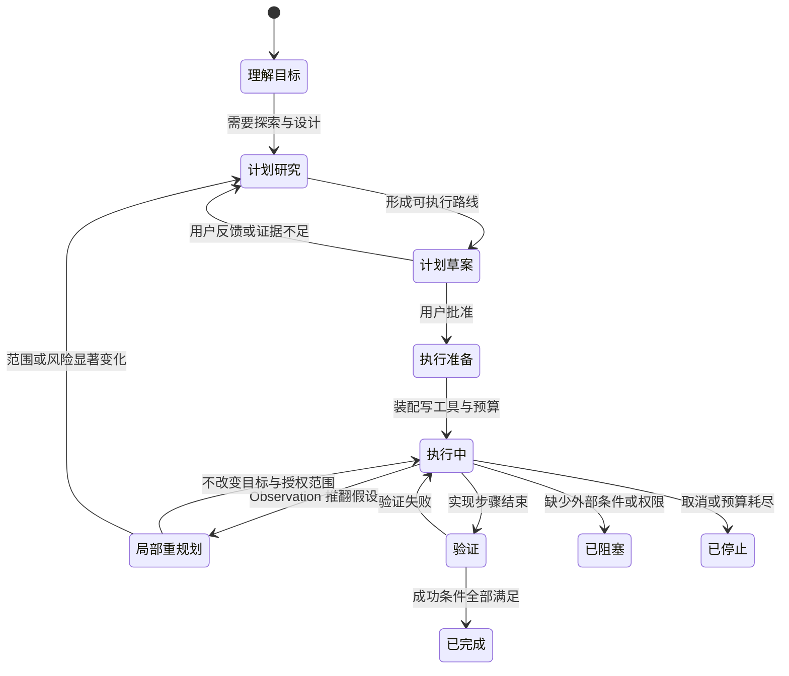

# Goal、Planning 与 Todo

[统一参考架构的八个核心对象](04_reference_architecture.md#八个核心对象一项任务由什么组成)把 Session、Turn、Message、Event、Item、Context、Memory 与 Artifact 定义为 Harness 的共同语言；[Harness Loop 的循环不变量](05_harness_loop.md#turn状态与循环不变量)又要求行动可归属、结果能闭合、Observation 优先于猜测。可是，一项 Coding 任务即使每一轮都“合法”，仍可能在局部动作之间漂移：模型读了很多文件，却忘了用户要修复什么；Todo 全部打勾，却没有运行要求的测试；计划已经不符合现场，执行仍机械前进。本章解决的正是这层问题：Harness 怎样表达目标、把目标分解为可执行工作、展示进度，并在完成、预算耗尽或真正阻塞时给出可解释判定。

仍以[序章定义的配置解析修复案例](00_index.md#一句话请求先要落到正确的工作区)为教学案例。用户要求“定位并修复配置解析错误，运行相关测试，并解释修改”。这里至少包含一个期望终态、一条可修改的实现路线、若干执行单元和一个进度视图。把四者都叫作“计划”，会让界面状态、模型推理和 Runtime 控制混在一起；把它们完全分离，又会出现计划完成而目标未完成的断裂。

本章与第 05 章的边界是：第 05 章解释 Loop 为什么继续、怎样取消以及如何收敛；本章解释 Loop 正在追求什么、工作怎样分解，以及凭什么说目标已经完成。计划和进度的落盘属于[Session 持久化与恢复](12_session_persistence_and_resume.md#event-logsnapshot-与-checkpoint)的延伸，Token、时间和调用次数等资源则沿用[完整 Token 账本](14_token_efficiency_and_cost_control.md#token-账本到底记录什么)的分层，而不在这里重新展开计费机制。

## Goal、Plan、Task 与 Todo

目标（Goal）描述希望外部世界达到的终态，以及用什么证据接受这个终态。配置修复的 Goal 不是“编辑解析器文件”，而是“错误输入得到正确处理、相关测试通过、修改原因能够解释”。文件名和实现方式可能随着调查改变，终态约束却应保持稳定。一个可操作的 Goal 通常还包含范围、禁止事项和成功条件；如果只保存一句宽泛愿望，后续完成判定仍会退化为模型自我评价。

计划（Plan）是从当前状态走向 Goal 的可修订路线。它可以是自然语言步骤、结构化阶段、计划文件或高层 Planner 的输出。Plan 的价值不在于预测所有未来细节，而在于显式暴露关键假设、顺序和验证点。例如先复现错误、再追踪配置覆盖链、随后修改最窄入口、最后运行针对性测试。Observation 发现真正问题位于 schema 迁移层时，合理行为是更新 Plan，而不是维护旧计划的表面一致性。

任务（Task）是可以被调度、执行和结算的工作单元。相较于 Plan 中一句“检查配置加载”，Task 往往需要更明确的输入、状态、依赖、执行者和结果。Task 可以独立失败、等待前置条件或交给 Subagent；只有当 Runtime 真正使用依赖关系控制准入时，任务集合才形成可执行的 Task Graph，而不只是缩进列表。

待办项（Todo）是面向模型和用户的进度投影。它通常只保留简短文本、顺序以及 `pending`、`in_progress`、`completed` 等状态，适合回答“现在做到哪一步”。Todo 可以来自 Plan，也可以在执行中临时增加，但它不天然拥有 Task 的调度语义，更不天然证明 Goal 已经满足。一个 Todo 被标为完成，最多说明某个维护者提交了状态更新；是否真的完成，还要回到工具结果、文件 diff、测试和用户约束。

表 15-1 把四个对象放在同一条控制链上。它不是要求所有 Harness 都建立四张表，而是提供一个判断标准：系统中的某个 `plan`、`task` 或 `todo` 字段究竟在承担哪一层责任。

| 对象 | 回答的问题 | 典型内容 | 何时可以改变 | 不能单独证明什么 |
|---|---|---|---|---|
| Goal | 最终要达到什么状态 | 目标、范围、成功证据、禁止事项 | 用户修改目标，或经授权重新界定范围 | 具体怎样执行 |
| Plan | 准备怎样到达目标 | 阶段、顺序、假设、验证点、回退路线 | 新 Observation 推翻假设，用户反馈或环境变化 | 步骤已经真正执行 |
| Task | 哪个工作单元可以被调度和结算 | 输入、依赖、状态、所有者、结果 | 分解、重试、取消、阻塞或重新分配 | 上层 Goal 已整体满足 |
| Todo | 当前进度怎样被看见 | 简短事项、顺序、状态、优先级 | 执行开始、完成、取消或新增发现 | 状态更新与现实证据一致 |

*表 15-1　Goal、Plan、Task 与 Todo 的职责边界。*

表 15-1 的关键含义是“同一段文字可以跨层流动，但责任不能随命名消失”。用户目标可以被 Plan 引用，Plan 的阶段可以生成 Task，Task 状态可以投影成 Todo；反向汇总时，Todo 全部完成只能触发 Goal 验证，不能直接把 Goal 改成完成。这个分层也解释了为什么计划文件适合用户审阅，而 Runtime 仍可能需要独立的任务状态和预算计数。

## 从 ReAct 到 Plan-and-Execute

[行动—执行—Observation 的 Loop](05_harness_loop.md#行动执行与-observation)说明，模型可以在每次观察后决定下一步。ReAct 把推理与行动交错，让新 Observation 及时改变后续选择 [@yao2023react]。对于根因未知、工具结果高度不确定的配置错误，这种短反馈路径很重要：第一次搜索可能否定最初猜测，测试输出可能暴露另一条覆盖链，下一步应根据事实重新选择。

纯粹逐步反应也有代价。长任务中的全局约束容易被近期错误淹没，模型可能重复搜索、遗漏验证，或者在每一轮重新生成近似路线。Plan-and-Execute（先计划、再执行）把高层路线与低层行动分开：Planner 先建立阶段和依赖，Executor 再把阶段翻译为工具调用。Plan-and-Solve 的实验表明，显式先分解再求解可以减少漏步，但其中的计划仍是自然语言推理结构，不是持久 Todo Runtime [@wang2023planandsolve]。ReWOO 进一步展示了把推理蓝图与 Observation 解耦可以减少交错调用的重复上下文；它的适用前提同样是后续步骤大体可预见 [@xu2023rewoo]。

两种路线不是互斥开关。Coding Harness 更常见的是分层混合：Goal 和阶段计划相对稳定，每个 Task 内仍用 ReAct 式 Loop 处理未知；关键 Observation 到来时，Executor 把变更反馈给 Plan，再决定继续、重排或退回用户。规划研究也把任务分解、计划选择、外部规划模块、反思和 Memory 视为不同机制，而不是一个统一的“会规划”标签 [@huang2024planningagentsurvey]。

> **学术背景｜高层路线与环境动作之间仍需闭环**
>
> Plan-and-Act 把长程任务中的 Planner 与 Executor 分开：前者生成结构化高层计划，后者把计划翻译为环境动作，并在环境变化后重新规划 [@erdogan2025planandact]。这为 Harness 提供了分析参照：计划能减少局部行动对全局目标的遮蔽，但执行结果仍必须回流。该研究面向网页导航与训练框架，不能据此把某个 CLI 的 Todo 工具写成论文方法的直接实现。

因此，评价规划机制不应问“是否有计划按钮”，而应问三个更具体的问题：计划是否保留 Goal 和成功条件，执行是否能把真实 Observation 回写，计划失效时是否有明确的修改或审批路径。缺少任何一项，Plan-and-Execute 都可能退化为一次漂亮但不可执行的说明文。

## 计划模式与执行模式

计划模式（Plan Mode）是一种协作与权限状态，不等于 Plan 对象本身。它通常允许读取、搜索、提问和保存计划 Artifact，却限制源码修改、命令副作用和自动实施。执行模式（Execution Mode）则恢复写文件、运行命令和调用有副作用工具的能力，并把批准后的 Plan 作为输入。模式分离的首要收益不是“让模型多想一会儿”，而是在用户尚未接受路线时，阻止探索无意间变成实施。

图 15-1 展示一个较完整的模式转换。计划草案可以被用户修改，也可以因新事实退回研究；批准只是允许进入执行，不代表每个具体工具自动获得授权。执行期间发现假设失效时，系统可以局部重规划，或在范围变化较大时重新进入正式计划评审。

*图 15-1　概念图：计划模式、执行模式与完成判定。替代说明：计划需经评审进入执行，执行结果可以触发局部或正式重规划，只有验证满足成功条件才进入完成；不表示七个固定版本都具有同名组件或全部转换。*

图 15-1 特意把计划批准、工具授权和 Goal 完成分成三道边界。OpenCode 与 Gemini CLI 都把计划写入单独的 Markdown Artifact，并在用户确认后切换到可执行 Agent 或审批模式；Codex 的对话式 Plan Mode 与 `update_plan` 清单工具明确分离；Pi 的核心则不预设 Plan Mode，但官方扩展示例可以通过切换工具集合实现类似边界。机制强弱取决于 Runtime 是否真的过滤工具和维护模式状态，而不是系统提示中是否出现“只读”二字。

> **安全提示｜批准计划不等于批准计划中的每个副作用**
>
> 攻击前提可能是仓库文本、工具输出或用户可编辑计划中混入扩大范围、读取凭据或发送数据的步骤。用户批准总体路线，只能说明接受设计意图；当执行落到具体路径、命令、网络目标和凭据时，仍应经过[Tool Call 的权限与副作用边界](08_tool_call_system.md#权限和副作用边界)。计划文件需要来源、修改记录和受限写入位置，高风险动作还要按最终参数重新授权。

## 任务分解、进度与完成判定

好的分解不是把动词拆得越细越好，而是让每个单元都能产生可观察结果。配置修复可以分为“稳定复现”“定位解析与覆盖路径”“实施最小修改”“运行目标测试与相关回归”“解释 diff 和剩余风险”。其中每一步都有退出证据，且后一步确实依赖前一步的事实。相反，“思考问题”“继续调查”“完善代码”无法判断何时结束，只会把模型内部活动伪装成 Task。

分解粒度还要匹配恢复和授权。若一个 Task 同时包含读取、修改、测试和远端发布，失败后很难知道哪部分可以重试；若每次文件读取都成为一个 Task，状态更新的成本又超过工作本身。实用边界通常是：同一输入假设、同一副作用等级、同一验证结果可以组成一个单元；跨越权限边界、可并行区域或独立失败域时再拆开。

进度状态至少应区分未开始、进行中和完成；复杂 Runtime 还需要取消与阻塞。`blocked` 不是“模型暂时没有思路”，而是一个仍未满足的外部前提，例如缺少必须由用户提供的环境、授权或远端状态。`cancelled` 表示这个工作单元不再属于当前 Plan。若系统没有专门状态，也应在相邻解释中保留原因，避免把未完成项直接删除。

完成判定要从 Goal 向下检查，而不是从 Todo 向上猜测。对配置修复，至少需要四类证据：错误已按预期复现并消失；修改范围与用户要求一致；相关测试实际运行且结果可归属；最终说明覆盖原因、改动和未验证部分。文件写入成功只证明一个 Tool Call 闭合，测试退出码只证明某个命令结果，Todo 全部打勾只证明计划投影已更新。只有这些证据共同满足 Goal，Harness 才能把任务标为完成。

这也是计划状态与 Loop 终止的边界。第 05 章的终止条件决定本轮是否还调用模型或工具；本章的完成条件决定“停止”能否解释为“成功”。达到最大步骤数、用户取消、Provider 失败和真正完成都可能结束 Loop，但它们必须映射成不同终态。OpenCode 的最大步骤提示会禁用工具并要求总结剩余工作；Goose 的最大 Turn 会要求用户决定是否继续；这两者都是可解释停止，不是自动成功。

> **设计取舍｜由模型报完成，还是由独立验证器裁决？**
>
> 模型最了解自然语言意图，适合判断解释是否充分、某个发现是否改变范围；独立验证器更适合检查退出码、文件状态、依赖闭合和预算。完全依赖模型简单，但容易把“已经尝试”写成“已经完成”；完全依赖形式化检查又难覆盖开放式目标。较稳妥的组合是：Runtime 验证可机械检查的证据，模型提交带理由的完成请求，用户保留修改 Goal 或拒绝完成的权力。

## 预算、停止与阻塞状态

预算把“继续努力”变成有界控制。可用单位包括模型步骤、Turn、Token、费用、墙钟时间、工具调用数和 Subagent 并发。它们不可互换：一个 20 Turn 上限不能说明花费可控，一个 Token 上限也不能阻止长时间 Shell 命令。第 14 章的账本负责准确计量，本章只要求每种耗尽都映射到清楚状态和后续选择。

预算接近上限时，Harness 可以提醒模型收敛、减少范围、压缩 Context 或优先验证；到达硬上限时，应停止新增高成本动作并保存剩余工作。Codex 的持久 Goal 可以记录 Token budget、使用量以及 budget-limited 状态；DeepSeek Harness 的 Goal 使用最大自动轮数，并在耗尽后进入带原因的 blocked；Goose 与 OpenCode 分别以最大 Turn 和最大步骤限制自治长度。它们控制的资源不同，不能在比较表中折成一个“有预算”勾选项。

停止状态应至少回答“谁停止、为什么、能否继续”。用户取消意味着授权撤回；预算耗尽意味着资源边界到达；Provider 或工具失败意味着执行条件异常；Blocked 意味着等待外部条件；Complete 才表示成功证据满足。恢复动作也不同：取消后需要新授权，预算耗尽后需要扩容或缩小目标，Blocked 需要解除具体条件，失败可能需要重试或修复环境。把这些状态都呈现为“任务结束”，会让用户失去判断下一步的依据。

## 持久化、恢复与用户修改

可恢复的规划至少保存三层材料：Goal 的当前版本与成功条件，Plan 的内容与修订来源，Task 或 Todo 的状态与结果关联。[Session 状态机](12_session_persistence_and_resume.md#session-保存的任务边界)已经说明，持久化保存的是可重建连续性，不是冻结进程；对规划而言，这意味着 Resume 后先恢复“要做什么”和“做到哪里”，再重新检查工作区、工具、权限和预算是否仍适用。

计划文件与结构化状态各有优势。Markdown 计划便于用户阅读、评论、重排和交给另一名工程师；数据库行或 Event Log 更适合稳定身份、状态过滤、依赖检查和并发更新。两者并存时必须指定权威关系。Gemini CLI 启用实验 Tracker 时，执行 Agent 可依据获批计划创建或更新持久 Task Graph；计划文件与 Tracker 的一致性主要由 Prompt 约束维持，并不存在 Runtime 自动、事务性地把 Markdown 转成 Tracker 图的统一转换。OpenCode 在计划 Agent 与 Build Agent 之间传递计划文件，同时用 Session Todo 表展示执行进度。若用户编辑计划文件而 Tracker 不更新，两个真相会立刻分叉。

用户修改还需要版本语义。最简单的策略是在空闲时整份替换；更严格的 Goal 状态可以使用 revision 或 compare-and-set，拒绝基于旧版本的并发更新。DeepSeek Harness 的 Goal 每次变更写入完整快照并增加 revision，Resume 后保留目标与阶段，却把自动继续的 process-local activation 解除，要求显式重新授权。Codex 的 Thread Goal 存在状态数据库中，Resume 与 Fork 都能读取或继承 Goal 快照；Pi 的扩展示例则把计划和 Todo 写入 Session entry，并在恢复时重建执行进度。它们都说明“能读回文本”和“自动继续执行”应是两项不同能力。

恢复时不应盲信旧 Todo。文件可能被用户修改，测试环境可能变化，某个 `in_progress` 命令可能已经结束或失去进程句柄。Harness 应把旧计划作为意图与历史证据，把当前 Workspace 和 Tool Observation 作为现实证据。必要时把原任务标成结果未知、重新验证或等待用户，而不是仅凭旧复选框继续下一项。

## 七个系统的计划机制

表 15-2 按四个设计轴比较七个固定版本：Goal 是否成为持久控制状态，Plan Mode 是否形成权限边界，进度是否结构化，以及预算或完成如何约束继续。项目定位不同，因此“不采用内建 Todo”可以是小内核的明确选择，而不是缺陷。

| 系统 | Goal 与高层 Plan | Plan Mode 与用户修改 | Task/Todo 与进度 | 预算、停止与完成边界 |
|---|---|---|---|---|
| **Aider** | Architect 模型先给编辑指令，Editor 模型再实施，是固定两阶段流水线 | 默认在实施前询问是否编辑，可配置自动接受；没有独立计划文件工作流 | 当前分析范围内未识别内建结构化 Todo/Task Runtime | 编辑后可自动 lint/test 并把错误反馈回 Loop；完成主要由对话、修改和验证结果共同形成 |
| **Codex** | `update_plan` 是执行期清单；另有受功能开关控制的持久 Thread Goal，保存 objective、状态和用量 | 对话式 Plan Mode 限制修改并产出正式 proposed plan；清单工具在 Plan Mode 中明确不可用 | 清单状态为 pending/in progress/completed；Goal 状态另含 paused、blocked、usage/budget limited、complete | Goal 可设 Token budget并在空闲时继续；模型只能报 complete/blocked，暂停、恢复和资源终态由用户或系统控制 |
| **DeepSeek Harness** | Event-sourced Goal 保存 objective、revision、phase、round cap；Plan Mode 以 Session Event 恢复 | Plan Mode 的进入、退出和评审独立持久；用户批准后才离开 | `todo_write` 每次写完整列表快照；可由部署选择是否允许多个 in-progress | Goal 有 active/paused/blocked/complete，达到最大 Goal rounds 会阻塞；Resume 后默认 disarm，需显式重启自动继续 |
| **Gemini CLI** | 正式 Markdown Plan 与执行期 Todo 分开；实验 Tracker 可形成父子任务与依赖 | Plan Mode 功能默认启用，源码写入受限于计划目录；用户可外部编辑并在退出时批准或反馈 | `write_todos` 为 Session 级完整列表；实验 Tracker 提供 open/in-progress/blocked/closed、父子和依赖 | Tracker 拒绝关闭未完成依赖并检测环；Tracker 默认关闭，不能把实验路径当成所有会话默认行为 |
| **Goose** | `/plan` 可选专用 Planner Provider/模型，一次生成计划或澄清问题；接受后把 Plan 作为新执行上下文 | 用户决定是否清空旧消息并实施；`/endplan` 可退出 | 默认启用的 Todo 平台扩展保存整份 Markdown 清单到 Session metadata，并在后续 Context 注入 | 最大 Turn 到达后请求用户继续；`/goal` 要求结束前验证，`/grind` 明确持续到 Turn 上限 |
| **OpenCode** | Plan Agent 研究并写计划文件，Build Agent 接收批准后的 Plan | 计划 Agent 禁止普通编辑，仅允许计划目录；退出工具询问用户是否切换 Build Agent | Todo 按 Session 事务化替换，含 pending/in-progress/completed/cancelled 与优先级 | Agent 可配置最大 steps；到达后工具禁用并要求总结完成与剩余工作，Todo 完成本身不终止 Loop |
| **Pi** | 核心明确不内建 Plan Mode；建议写计划文件或通过 Extension 组合 | 官方示例 Extension 可切换只读工具集、让用户执行/细化计划 | 核心不内建 Todo；示例 Todo 可从分支历史重建，Plan Mode 示例保存步骤与完成标记 | 示例以 `[DONE:n]` 更新进度并可跨 Session 恢复；这些属于可安装示例，不是默认核心路径 |

*表 15-2　七个固定版本在 Goal、Plan Mode、进度和停止控制上的设计落点。*

表 15-2 显示三条主要路线。第一条把规划做成**交互阶段**：Aider、Goose 的 Planner/Architect 先生成执行说明，再由另一模型或新上下文实施。它结构简单，但计划与执行状态的关联主要依赖文本。第二条把规划做成**权限模式与 Artifact**：Codex、OpenCode、Gemini CLI 和 DeepSeek Harness 都让计划阶段与实施阶段可区分，差异在于模式是否持久、计划写到哪里、批准怎样进入执行。第三条把规划做成**可恢复控制状态**：Codex 与 DeepSeek Harness 的 Goal 能表达预算和非成功终态，Gemini CLI 的实验 Tracker 能约束依赖闭合；这比 Todo 更接近 Runtime 调度，但也增加迁移、并发和恢复语义。

Todo 的路线同样不同。Goose 和 Gemini CLI 默认提供执行期清单，OpenCode 将其事务化保存在 Session，DeepSeek Harness 写入可回放 Event；Codex 的清单更偏客户端可见的进度快照；Pi 和 Aider 则不把 Todo 作为核心抽象。比较时应问“这个系统需要解决多长、多并发、多可恢复的任务”，而不是把状态字段数量当成成熟度排名。

从可靠性看，最重要的共同要求不是统一 schema，而是保持三条映射：Goal 到成功证据，Plan 到当前 Observation，进度状态到实际执行结果。系统可以用计划文件、数据库、Event Log 或纯对话实现其中一部分；只要映射断裂，用户看到的“计划完成”就会与仓库现实分离。

## 本章小结

Goal、Plan、Task 与 Todo 分别描述终态、路线、可结算工作单元和进度投影。它们可以互相生成，却不能互相替代：Todo 全部完成只应触发 Goal 验证，Plan 被批准只允许进入执行，Task 返回结果也仍需汇总到用户成功条件。ReAct 适合在不确定环境中根据 Observation 调整，Plan-and-Execute 适合保持长程结构；实际 Coding Harness 往往以高层计划加局部反馈 Loop 组合两者。

本章也回答了配置修复怎样才算真正结束。Harness 需要保存目标和版本，按可观察结果分解工作，让用户看见进行中、取消与阻塞，给步骤、Token 或时间设置有解释的预算，并以复现、diff、测试和说明共同判定完成。Resume 读回计划后还要重新观察现场，不能把旧复选框当作现实。

下一章将沿 Task 继续追问：当一个工作单元交给另一个 Agent 时，父子身份、Context、权限、进度、等待和结果汇聚怎样形成真正的编排，而不是只有一张看起来像任务图的列表。在此之前，可回读[Session 恢复中的副作用一致性](12_session_persistence_and_resume.md#tool-call-和外部副作用的一致性)与[Token 预算的质量边界](14_token_efficiency_and_cost_control.md#七系统指标与质量边界)，把“可以继续”“值得继续”和“已经完成”保持为三个不同判断。
