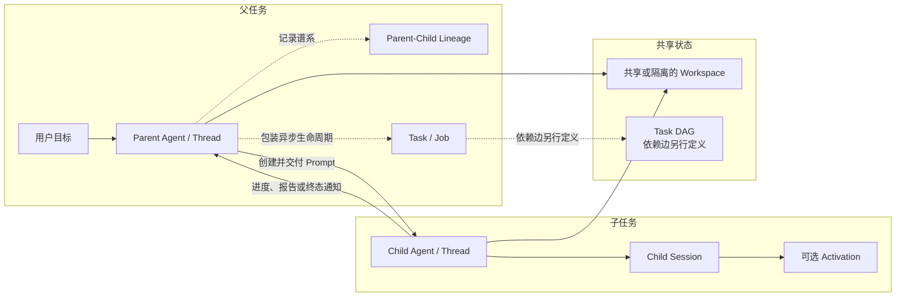
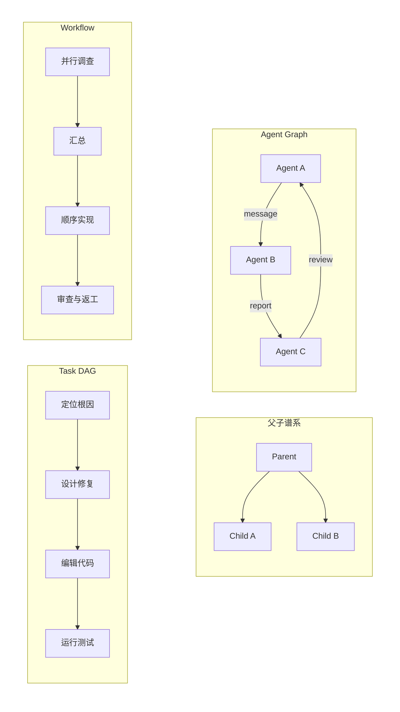

# Subagent 与多 Agent 编排

[统一参考架构的八个核心对象](04_reference_architecture.md#八个核心对象一项任务由什么组成)把会话（Session）定义为一项可连续任务的逻辑容器，把轮次（Turn）、消息（Message）、事件（Event）、工作单元（Item）、本轮上下文（Context）、可检索记忆（Memory）与任务产物（Artifact）放在同一套语言中。本章在这套对象之上增加“谁把工作交给谁”这一维：当一个 Agent 无法或不宜独自完成全部工作时，Harness 怎样创建子 Agent（Subagent），把任务和必要材料交给它，观察进度，接收结果，并在共享代码库中维持可解释的责任边界。

仍以[序章的配置解析错误案例](00_index.md#一句话请求先要落到正确的工作区)为教学案例。用户要求定位并修复解析错误、运行相关测试并解释修改。根 Agent 可以自己搜索、编辑和验证，也可以把“定位解析入口”“检查相邻配置格式”“独立审查候选补丁”分别委派出去。后者可能缩短墙钟时间并减轻主 Context 压力，却同时引入新的问题：子 Agent 看见哪些父历史，能使用哪些工具，是否与父级写同一文件，父级何时等待，取消是否传到孙 Agent，以及一段“已完成”的文本究竟来自子 Agent、运行时还是用户界面。

[Token 效率章节](14_token_efficiency_and_cost_control.md#subagent-的-token-经济性)已经说明，Subagent 只会让父 Context 变小，不保证整个任务更省 Token；本章不重复那份成本结论，而是解释形成成本的运行拓扑。[Tool Call 的权限和副作用边界](08_tool_call_system.md#权限和副作用边界)与[定制机制的权限、参数和上下文继承](11_skills_prompts_commands_and_hooks.md#权限参数与上下文继承)也已建立相邻边界；这里关注权限怎样跨委派关系传播，以及父级为什么仍需对最终结果负责。

## 为什么委派任务

委派的第一种理由是**专业化**。不同子 Agent 可以拥有不同角色说明、模型、工具集合或输出格式：一个只读探索者负责追踪解析调用链，一个测试审查者只检查回归覆盖，一个编辑者根据已确认方案生成补丁。专业化的价值不在于给同一个模型换几个名字，而在于缩小行动空间和完成条件，使每个执行单元更容易判断“需要知道什么、可以做什么、何时返回”。如果角色只是提示词中的称呼，却没有工具、上下文或验证职责上的差异，它更接近角色扮演，而不是系统级分工。

第二种理由是**并行**。多个互不依赖的只读调查可以同时搜索不同目录、检查不同配置格式或复核不同测试，从而减少串行等待。但并行只在任务真正独立时成立。若“设计修复”必须等待“定位根因”，“运行完整测试”又必须等待文件修改，那么把三者同时启动只会让后两个子 Agent 在过时工作区上工作。Harness 因而需要先识别依赖，再决定哪些节点可以并发，而不是把“能同时 spawn”当成“应该同时执行”。

第三种理由是**上下文隔离**。子 Agent 可以在独立 Context 中阅读大量文件和日志，父 Agent 只接收结论、定位与不确定性。这样，父级保留用户目标、禁止事项和全局决策，局部探索材料则留在子 Session 中。隔离解决的是模型可见信息的拥挤，不自动隔离文件系统、进程、网络或凭据。两个拥有独立聊天历史的 Agent 仍可能在同一目录编辑同一文件。

第四种理由是**故障和试验隔离**。父级可以让多个子 Agent 提出候选解释，或让一个审查者攻击性地寻找反例，再由父级比较证据。这里的“隔离”也有边界：错误推理不会直接污染父历史，只要结果回传是有界的；但子 Agent 已执行的命令、写入和网络请求仍属于现实副作用，不能靠丢弃其文本结果消除。

因此，适合委派的通常是边界清楚、输入可自足、结果可验证、与父级当前工作不冲突的子任务。立即阻塞父级下一步的关键调查，往往更适合由父级亲自完成；需要频繁共享隐含状态的细碎步骤，也不适合拆成许多 Agent。多 Agent 不是单 Agent 的默认升级，而是一种用更多运行时状态换取专业化、并行或信息隔离的设计选择。

> **设计取舍｜自由对话还是有界委派？**
>
> 自由对话允许多个 Agent 反复讨论，适合需求仍在形成、观点需要碰撞的任务；代价是消息数量、终止条件和责任归属更难控制。有界委派把输入、可用能力、返回格式和完成条件固定下来，适合代码定位、测试审查与补丁复核。Coding Harness 通常应先提供有界委派，再在确有需要时增加可继续对话，因为文件副作用要求比纯文本讨论更清楚的所有权。

## Parent、Child、Task、Thread 与 Session

多 Agent 系统最容易发生的概念错误，是把“父子关系”“任务关系”和“运行容器”混成同一个对象。本章把创建者称为父 Agent（Parent Agent），把被创建或被委派工作的执行者称为子 Agent（Child Agent）。父子关系描述来源和责任谱系：谁创建了谁，初始信息从哪里来，结果默认回给谁。它不自动表示父级必须等待，也不表示子级只能完成一个任务。

任务（Task）是需要完成的工作及其完成条件；线程（Thread）是一个可独立推进、接收消息和产生状态的执行身份；Session 是保存任务连续历史与控制状态的逻辑容器。不同 Harness 的映射可以不同：Codex 主要以独立 Thread 表示子 Agent；OpenCode 与 Goose 创建带父引用的 child Session；Pi 的官方示例 Extension 每次启动独立进程，却不建立核心持久 Agent tree；Aider 的 Architect/Editor 则是一条固定双模型流水线。Agent 角色（Agent Role）描述执行者的职责，工作流（Workflow）描述步骤与结果传递方式；项目内部使用了 `task`、`agent` 或 `session` 这个名字，不足以判断其通用语义。

表 16-1 给出本章使用的最小区分。它不是要求所有项目都实现七种同名类型，而是帮助读者判断一个功能究竟增加了哪一层状态。

| 对象 | 回答的问题 | 可能持续多久 | 不自动提供什么 |
|---|---|---|---|
| Parent/Child 谱系 | 谁创建谁，结果默认回到哪里 | 可随 Session 持久化 | Task 依赖、等待与递归取消 |
| Agent 角色（Agent Role） | 这个执行者被要求扮演什么职责 | 一次调用、一个 Agent 或配置周期 | 独立运行时与隔离 |
| Task | 要完成什么，何时算完成 | 从创建到完成、失败或取消 | 自己运行、自己选择 Agent |
| Thread | 哪个执行身份正在接收消息和推进 Turn | 一个或多个 Turn | 文件系统隔离与任务依赖 |
| Session | 哪些历史、状态和使用量属于同一连续任务 | 可跨进程 Resume | 活动进程与自动重放副作用 |
| 激活期（Activation） | 某个耐久子 Session 当前的进程内驻留和执行时期 | 从装载到空闲释放 | 新的 Task 身份与持久依赖图 |
| 工作流（Workflow） | 预先或动态描述的步骤、并发和结果传递方式 | 一次运行或可复用 recipe | 通用 DAG scheduler 与跨步骤事务 |

*表 16-1　多 Agent 编排中常被混用的对象。*

表 16-1 的关键含义是“关系可以交叉”。一个 Task 可以由同一 Thread 跨多个 Turn 完成，也可以先后交给多个 Agent；一个 Child Session 可以接收多次后续消息（follow-up），因而完成多个相邻 Task；一个后台 Job 可以只是异步收集某次子运行的包装，并不等于 Child 身份。DeepSeek Harness 的可继续子 Agent（continuable child）更明确地区分了耐久 Session 与进程内 Activation：子 Session 可以在没有活动进程时存在，后续消息到达再冷恢复（cold resume）；Activation 内又可以按先进先出（first in, first out，FIFO）的顺序执行多个 Turn。

图 16-1 把这些关系放到同一条委派路径中。实线表示运行时必须完成的动作，虚线表示可能存在但并非自动成立的关系。

*图 16-1　概念图：Parent、Child、Task、Thread、Session 与 Workspace 的关系。替代说明：父 Agent 创建子 Agent 并传递 Prompt；谱系、异步 Task 包装和 Task DAG 是可选的独立层，父子双方还可能共同作用于同一 Workspace；不表示七个固定版本都具有同名组件或全部转换。*

图 16-1 说明，创建子 Agent 至少要建立 Child 身份和初始输入；是否记录耐久谱系（durable lineage）、是否创建后台 Task、是否支持 cold resume、是否独立 Workspace，都是额外选择。只看到 `parentID` 可以证明谱系，却不能证明依赖准入；只看到任务列表可以证明系统记录了工作，却不能证明下游真的等待了上游。

## 创建、Prompt 传递与上下文继承

子 Agent 的创建入口通常可归为五类。`spawn` 创建新的运行身份；`fork` 创建新身份并引用或复制父历史；`delegate` 强调交付一个有界任务；Task Tool 把委派包装成普通工具调用；外部进程或远端协议则把子 Agent 放到另一个 Runtime。命名并不决定语义，例如“fork”可能共享历史却仍共享工作区，“task”也可能只是返回一段文本的前台工具。

初始 Prompt 是委派最重要的数据边界。一个全新子 Agent（fresh child）若没有父历史，父级必须传递完整任务：目标、范围、已知事实、禁止事项、可用路径、期望输出和验证条件。Gemini CLI 的 `invoke_agent` schema 直接要求完整而详细的 query；OpenCode 的 fresh Task Session 也依赖显式 Prompt。相反，Codex 可选择完整历史、最近若干 Turn 或不继承历史，DeepSeek Harness 的 in-process fork provider 可从父级已完成历史播种，而进程外 DSH SDK provider 默认只继承工作目录。是否继承历史必须是可观察的创建参数或 provider 属性，不能由父级猜测。

Context 继承还要区分“复制材料”和“继承权威”。[Context 构造章节](07_context_and_instruction_system.md#context-为什么不只是-prompt)把 Context 定义为受来源、作用域与预算约束的模型可见投影。将父历史复制给子 Agent，只会复制其中的文本和结构；父级当前使用的工具注册表、Skill、模型、环境变量、审批决定与权限规则未必随之复制。反过来，一个 fresh child 即使不继承对话，也可能从同一 Workspace 重新加载项目指令、Skill 和工具，因此看到与父级相似的环境事实。

历史继承常见的四种形态如下：完整 fork 保留最多上下文，但也携带无关历史与潜在不可信内容；最近 N 个 Turn 减少体积，却可能切掉决定来源；摘要或显式 handoff 较短，但存在遗漏和摘要漂移；完全 fresh 最干净，却要求父级把任务写成自足接口。工程上没有统一最优项，应按子任务对父历史的依赖程度选择，并保留“来自父历史”“父级概括”“子级重新观察”的来源差异。

Memory、Session、文件和 Artifact 的继承同样需要分层。子 Session 可以引用父 Session ID 以保存谱系，却不必复制父 Session 的全部 Item；父级可以把测试日志位置作为 Artifact locator 传给子级，而不是把日志全文塞进 Prompt；用户级或项目级 Memory 可能被两者同时检索，但一次 Session 内的临时决定不应自动升级成长期 Memory。最可靠的委派 Prompt 会明确指出哪些事实必须重新读取，因为文件和进程状态可能已在创建之后变化。

工具、Provider 和模型也可以独立选择。专业化子 Agent 可能使用更便宜模型做大范围搜索，或使用只读工具集做审查；固定双模型流水线则把“规划者”和“编辑者”绑定为两个阶段。Aider 的 Architect 先解决编码问题并给出文件修改说明，再由 Editor Model 生成具体 diff，这提供了清楚的角色流水线，却没有任意子 Agent、双向消息或后台汇合（join）。它提醒我们：多模型不等于多 Agent，Workflow 也不等于可动态创建的 Child Runtime。

## 通信、通知与结果回传

创建之后，编排系统必须定义谁能给谁发送什么消息。最简单的是单向返回：父级调用子 Agent，等待一段最终文本。更完整的系统会增加后续消息（follow-up）、转向输入（steering）或消息发送（send-message），让父级在同一 Child 身份上继续任务；还可能允许 Child 主动报告（report），或让 Runtime 在 Child 结算时自动通知父级。三者必须区分：follow-up 是父级的新输入，report 是子 Agent 选择表达的内容，结算通知（settlement notice）是运行时对生命周期的陈述。

表 16-2 给出一套适用于不同实现的通信分类。每种消息都需要发送者、接收者、所属 Session/Thread、是否触发新 Turn、是否耐久保存，以及一个可与后续状态关联的身份。

| 通信 | 发送者与接收者 | 是否触发执行 | 主要用途 | 不能代表什么 |
|---|---|---|---|---|
| 初始委派 | Parent → Child | 是 | 建立任务和第一轮输入 | Child 已接受全部隐含背景 |
| Follow-up/Steering | Parent → Existing Child | 取决于调度；可排队或唤醒 | 补充事实、继续同一会话、改变后续步骤 | 已经在执行的副作用被撤销 |
| Progress/Activity | Runtime/Child → UI 或 Parent | 通常否 | 展示 Tool Call、思考片段和进度 | 已提交、可恢复或已验证的结果 |
| Report | Child → Parent | 可安静注入或触发父级后续 Turn | 提前报告发现或提交有界结论 | Child 生命周期已经结束 |
| Completion/Settlement | Runtime → Parent | 通常只通知；也可唤醒 | 陈述完成、失败、取消或异常终止 | 任务目标已被父级验收 |
| Final Result | Child → Parent Tool/Message | 前台调用已等待，后台由通知送达 | 提供结论、Artifact 引用和不确定性 | 共享 Workspace 仍与结果描述一致 |

*表 16-2　多 Agent 通信的六种不同语义。*

表 16-2 解释了为什么“子 Agent 返回了”不是一个充分状态。OpenCode 的前台 Task 直接把最后文本作为 Tool Result，实验性后台路径则在 Job 完成后向父 Session 注入 synthetic task result 并触发新的父运行。Gemini CLI 把子 Tool Call 和 thought activity 流式投影到父 Tool Call，最终再收敛为一个结果。DeepSeek Harness 更进一步，为 continuable child 分开 parent follow-up、child report 和 runtime settlement notice，并用不同来源标记避免把运行时的话冒充成 Child 的话。Codex 的 MultiAgent V2 在子 Turn 完成或中止后生成 completion envelope，投递直接 Parent 的消息箱（mailbox）；`wait_agent` 等待的是 mailbox/steer 活动，不是轮询任意线程状态。

> **学术背景｜对话图不是任务依赖图**
>
> AutoGen 把可定制 Agent、工具和人类组织成多 Agent 对话，核心问题是参与者怎样通信与协作 [@wu2023autogen]。多 Agent 综述也把角色画像、通信方式、能力增长和环境作为不同分析轴 [@guo2024llmmultiagentsurvey]。这些工作说明通信拓扑本身值得建模，但不能据此推断某个 Harness 已实现 Task DAG、环检测或失败传播；对话中的“请等 A 完成”仍可能只是自然语言约定。

通信还要处理顺序和唤醒。一个正在运行的 Child 收到 follow-up 时，系统可以把它排入下一个 Turn，或在安全边界 steering 当前 Turn；若目标已空闲，消息可以唤醒旧 Activation；若只剩耐久 Session，则需要 cold resume。发送成功最好返回稳定 Message ID，它表示接收队列已经接受，而不是对方已经阅读、持久化已 flush 或任务已经完成。消息失败也需要说明是否可能“已送达但回执丢失”，否则父级重试会产生重复工作。

## 父子树、Agent Graph、Task DAG 与 Workflow

多 Agent 文档经常把任何节点—边图都叫作 DAG，这会掩盖最重要的运行差异。本章严格区分四类结构。父子树或来源谱系图（provenance graph）记录创建来源与信息流；智能体图（Agent Graph）还可以表示非树形通信、同级关系或运行状态；任务有向无环图（Task Directed Acyclic Graph，Task DAG）用依赖边决定 ready、blocked 和完成准入；工作流图（Workflow Graph）则描述 recipe、pipeline 或脚本中的步骤和数据传递，它可以顺序、并行甚至循环，不必是通用任务调度器。

图 16-2 用同一组节点展示四种图的不同问题。每张子图的边含义不同，不能因为节点名字相似就相互替代。

*图 16-2　概念图：父子谱系、Agent Graph、Task DAG 与 Workflow Graph 的边语义。替代说明：谱系边表示创建，Agent Graph 边表示通信，Task DAG 边表示执行依赖，Workflow 边表示 recipe 或脚本定义的控制与数据流；不表示七个固定版本都具有同名组件或全部转换。*

图 16-2 的判断标准可以落到实现问题上。若系统声称 Task DAG，同一条路径至少应回答：Task 节点在哪里持久化，依赖边何时校验，环怎样拒绝，哪个节点可进入 ready，谁把 ready 节点分配给执行者，完成与失败怎样更新下游，取消怎样传播，多个 Agent 的副作用怎样协调。缺少这些环节时，更准确的称呼是任务列表、父子图、固定 pipeline 或模型遵循的计划。

Codex 的 `AgentGraphStore` 保存 thread-spawn 父子边及 open/closed 状态，并能稳定列出 children 与 descendants；它适合恢复 provenance 和定位后代，却没有 Task dependency 或 ready 调度。Gemini CLI 的 Tracker 具有 `dependencies`、关闭前依赖检查和环检测，系统 Prompt 也要求模型只处理 leaf node；但 Tracker 没有自动把 ready task 绑定到 `invoke_agent`，而子 Agent scheduler 管理的是一个子循环内的 Tool Calls。这两层组合后可以由模型执行 DAG-like 工作，却不能写成 Runtime 已保证 DAG 同步。

DeepSeek Harness 的 Workflow 是另一种设计：模型提交 JavaScript orchestration script，脚本可用 `agent()` 启动子 Agent，用 `parallel()` 形成等待全部分支的屏障（await-all barrier），用 `pipeline()` 串联阶段；worker-thread engine 施加并发和总 child 上限、配对 agent start/end，并在取消或 worker 死亡时清理未决运行。这是一套明确的 Workflow runtime，但脚本中没有持久 Task dependency 节点或通用 ready queue。Pi 示例 Extension 的 parallel 和 chain 更固定：一个是有界并发 join，一个是用前一步结果填入 `{previous}` 的顺序链，也不应扩大解释为 DAG scheduler。

MetaGPT 把标准操作流程、角色和中间产物校验编入多 Agent 协作，强调自由对话之外还需要阶段约束 [@hong2024metagpt]。对 Harness 的启发不是复制它的术语，而是要求 Workflow 明确每个阶段消费什么 Artifact、谁验证、失败后回到哪里。一个共享消息池、共享工作区或角色清单都不能单独承担这些控制义务。

## Wait、Join、取消与失败传播

同步原语决定图是否真的按预期执行。等待（Wait）通常表示当前执行者暂时不继续，直到某个事件、消息或超时发生；汇合（Join）表示收集一个或多个已启动执行的终态；屏障（Barrier）要求一组参与者到达共同阶段后才能继续；完成通知（Completion）只是状态消息，本身不要求父级停下。把它们全部写成“等子 Agent”会让超时、部分成功和后台继续运行无处表达。

前台委派隐含一次 Join：父 Tool Call 在 Child 结果返回前不能闭合。后台委派则把启动与收集拆开，父级获得 Task/Job ID 后继续非重叠工作，稍后显式 load/wait，或由 Runtime 发送完成通知。合理的 wait 应由事件唤醒并支持较长超时，而不是让模型频繁轮询；合理的 join 应返回每个成员的完成、失败、取消或结果未知，而不是在任一失败时丢掉其他已完成结果。

失败传播至少有四种策略。快速失败（fail-fast）在第一个关键失败时取消同组未决工作；全部收集（collect-all）让所有分支结算后一起汇报；尽力完成（best-effort）把失败项标记为空或错误、继续可用分支；重试（retry）会在同一或新 Child 身份上重做。选择取决于副作用和依赖：只读搜索可以 collect-all，多个修改同一模块的写任务更适合提前停止；已有外部副作用的重试必须先判断前一次是否已执行。多 Agent 轨迹研究把失败概括为系统设计问题、Agent 间错位和任务验证问题，说明“每个 Child 都返回文本”仍可能整体失败 [@cemri2025mast]。

取消（Cancellation）尤其不能与回滚混同。[Harness Loop 的终止、取消与防失控](05_harness_loop.md#终止取消与防失控)已经说明，取消是阻止新工作并请求在途执行停止，不会自动撤销已发生的副作用。本章只补充传播维度：父取消可以只中断直接 Child 的当前 Turn，可以递归取消后代，也可以关闭整个子树的准入并 child-first 释放资源。这三种强度必须有不同接口。

固定版本体现了这种差别。DeepSeek Harness 的 `interrupt_agent` 只取消目标当前 Turn，保留其 Activation、未领取消息和已经创建的 descendants；树级 drain 才关闭后代准入、向下传播取消并等待 child-first disposal。Codex 的 interrupt 针对目标 Thread，close/resume 又是独立生命周期操作。OpenCode abort 后台 Task 时同时取消 child prompt 与 BackgroundJob；Goose/Pi/Gemini 把 CancellationToken 或 AbortSignal 传入子运行，但底层 Provider、工具或 OS 进程仍需协作才能真正停止。

若父级结束而 Child 仍运行，就出现孤儿任务（Orphan Task）。它可能继续消耗 Token、修改文件或持有进程。Runtime 应在 Parent/Session teardown 时列出或清理 owned children，区分“请求取消已发出”和“资源已经静默”，并为无法确认的远端 Child 保留结果未知状态。后台工作若需要跨父进程存活，则必须把所有权转交给耐久调度器，而不是让进程内 Future 偶然存活。

## 共享 Workspace、竞争与结果汇聚

模型 Context 隔离和 Workspace 隔离是两回事。常见 Subagent 路径会把父级 cwd 交给 Child：OpenCode child Session、Goose delegate、Pi 子进程、DeepSeek 的进程外 provider 和 Codex spawn 都可能作用于同一仓库。这样做让 Child 立刻看到最新文件，避免复制大型代码库；代价是多个独立推理循环面对一个可变共享状态。

只读并行的主要风险是观察时刻不同。Child A 读取文件后，Parent 或 Child B 修改了它；A 随后返回“第 80 行需要改”，定位已经过时。写并行更危险：两个 Agent 从同一旧版本计算补丁，后写入者覆盖前者；一个 Agent 正在测试，另一个 Agent 又改了文件，测试结果就不再对应最终 diff。网络、数据库和 Git 操作还可能产生无法由文件锁解决的共享副作用。

最基本的治理方式是任务分区。只读调查可以按目录、问题或证据源拆分；写任务应给出互不重叠的文件集合，或者给每个 Child 独立 worktree/容器；共享配置和接口文件由单一所有者修改。Goose 的 delegate Tool 描述直接提示：研究可自由并行，写工作必须严格分文件；Pi 示例虽在独立进程运行，默认仍共享 cwd，进程内的 per-file mutation queue 不能跨进程自动串行化。Harness 应把这类约束放进调度和工具层，而不只写在 Prompt 中。

> **安全提示｜共享 Workspace 会把一个 Child 的错误放大到整项任务**
>
> 攻击或事故的前提是某个 Child 能读写共享仓库、运行进程或访问外部服务，而其 Prompt、仓库文本或 Tool Result 诱导了错误动作。即使 Parent 没有收到恶意文本，Child 的副作用也可能已经改变其他 Agent 读取的现场。缓解包括按任务最小化工具与路径、独立 worktree 或容器、限制并发写、记录每次修改来源，并在汇总前由 Parent 重新检查 diff、测试与工作区状态。

结果汇聚不是把多段文本拼起来。父级至少要收集四类材料：结论及其置信度，支撑结论的文件/符号/测试定位，Child 实际产生的 Artifact 或副作用，以及尚未解决的冲突。若两个 Child 对根因判断不同，父级应回到原始证据或再派独立审查，而不是按多数投票。若多个 Child 修改代码，父级要检查当前工作树中每个变更的来源、顺序和依赖，并在最终状态重新运行验证。

在教学案例中，可以让两个只读 Child 分别追踪配置 schema 和解析入口，第三个 Child 查找相关测试。Parent 汇总后选择一条修复方案，并由单一编辑者修改文件；最后再让独立审查者检查 diff，但测试仍由 Parent 在最终工作区运行。这个安排把并行放在证据收集，把写入放在单一所有权，把最终验收留给 Parent，因而比“所有 Agent 同时改代码”更容易解释和恢复。

## Token、权限与责任

Subagent 的 Token 经济性已经由[第 14 章的独立小节](14_token_efficiency_and_cost_control.md#subagent-的-token-经济性)给出：评估要看父 Session、子树、重复前缀、回传摘要和失败重做的总账。本章只强调拓扑如何改变账本。每创建一个 Child，通常就新增 system/developer 指令、工具 Schema、任务 Prompt、文件探索和输出；并行扇出（fan-out）还会把相同仓库事实重复读取。只有当 Child 中间材料不必回流、父级复核成本较低时，主 Context 的压缩才可能转化为总资源收益。

权限传播比 Token 更难用一个字段表达。父级的 deny 是否必须传给 Child，Child 自己的角色规则能否新增能力，工具集合是复制、取交集还是重新发现，项目级批准能否在子 Session 复用，远端 Agent 的执行环境由谁控制，都是不同问题。OpenCode 只把父 Session 的 deny 和 `external_directory` 规则带入 Child，其他能力主要由 Subagent 定义（definition）决定；Gemini CLI 从父 Tool Registry 构造隔离集合，并用 definition 与 Policy Engine 继续收窄；DeepSeek Harness 让 provider 声明 depth、tool filter、persona 等创建能力，进程外 provider 又把 native Runtime 作为独立边界。

Codex 的 Child 配置继承当前环境与多 Agent 控制状态，并可选择角色、模型和历史范围；Goose 的 Summon 当前让 Subagent 使用 Auto mode，因为审批事件尚未完整转发给 Parent，换取不挂起的代价是需要把允许能力限制在配置和扩展集合；Pi 对项目级 Agent definition 进行额外信任确认，因为这些文件由仓库控制。Aider Architect/Editor 的能力范围更集中，但它仍在同一宿主工作区执行编辑。可见，权限继承不是“是/否”，而是来源、收窄、扩张、执行环境和审批接收者的组合。

责任也不能随着 delegate 消失。Child 对其报告内容和执行记录负责，Runtime 对身份、消息关联、资源上限和生命周期通知负责，Parent 对任务分解、权限授予、冲突解决和最终验收负责，用户对高风险范围与最终批准保留控制。若系统只保存“某个 Agent 做了修改”，却没有 Parent、Task、Tool Call、文件变化与测试之间的 provenance，失败后就无法判断该回滚哪部分，也无法解释哪个决策导致了结果。

资源放大是这一责任模型的安全面。无界递归 spawn、每层完整历史 fork、后台任务不回收、失败自动重试和多个 Child 共享昂贵模型，都会放大成本与可用性风险。深度、并发、总 Child 数、每 Child Turn/Token/时间、模型等级和 Workspace 写权限应当分别设限；达到上限时返回明确的阻塞（blocked）或预算耗尽（budget-exhausted）状态，而不是悄悄少执行一部分任务。

多 Agent 的适用边界最终可以用一个问题判断：新增 Child 是否让输入、行动和验收变得更清楚？若任务只有一条短路径、需要持续共享局部状态，或最终仍要由 Parent 重做全部调查，单 Agent 更简单。若子任务可独立探索、角色差异真实、结果可有界回传、写入可分区且父级有能力汇总，多 Agent 才提供净收益。

## 七个系统的编排路径

表 16-3 按同一组设计轴比较七个固定版本：核心创建路径、上下文/Workspace、通信与同步、图结构与权限边界。表中“非核心”不是能力评价，而是说明该项目把复杂度放在另一种产品形态。

| 系统 | 创建与身份 | Context 与 Workspace | 通信、同步和失败 | 图结构、权限与适用边界 |
|---|---|---|---|---|
| **Aider** | Architect Coder 生成方案，再创建 Editor Coder 执行 | Editor 接收 Architect 文本方案，复用同一工作区；weak model 是辅助调用 | 顺序前台流水线，可选编辑确认；无通用 mailbox、wait 或后台 Child | 固定双模型 Workflow，不是通用 Subagent Runtime；适合规划—编辑分工 |
| **Codex** | `spawn_agent` 创建独立 Thread，记录 parent/root turn、agent path；可无历史、最近 N Turn 或完整 fork | Child 有独立线程 Context，可继承环境选择；常与 Parent 共享 Workspace | send message、follow-up、wait、interrupt、close/resume 分离；Child 终态自动投递 Parent | Agent Graph 保存 provenance，不是 Task DAG；共享 AgentControl、并发 limiter 和预算约束子树 |
| **DeepSeek Harness** | named provider 支持 one-shot run 与 durable continuable child；Session 和 Activation 分离 | in-process 可 spawn/fork；进程外 provider 可只继承 cwd；tool/persona/depth 按 provider 能力装配 | FIFO follow-up、Child report、Runtime settlement notice 分离；interrupt 与 tree drain 分离 | 父子层级不自动成 DAG；另有脚本 Workflow 的 parallel/pipeline/barrier 与 child lifecycle ledger |
| **Gemini CLI** | `invoke_agent` 从 Registry 选择 local/remote definition，创建独立 executor/session | 要求完整 Prompt；独立 history、model、tool registry；通常共享工作区 | 流式 activity＋最终 Tool Result；AbortSignal 取消；远端走 A2A 协议 | Tracker 有依赖/环/关闭校验，但不自动调度 Subagent；Policy 可按 Agent 收窄工具 |
| **Goose** | Summon `delegate` 创建带 parent session 的 SubAgent Session；另有长期 Session Orchestrator | delegate 只知道 instructions/source/context，默认复用或限定于父 cwd | 同步等待或 `async`＋`load` wait/peek/cancel；流式 Tool notification；后台数量受限 | Summon、Orchestrator、Recipe/Subrecipe 是分离路径；SubAgent Session 禁止再次 delegate |
| **OpenCode** | Task Tool 创建/恢复带 `parentID` 的 child Session；`task_id` 延续旧 Child | fresh Prompt 自足，Child 独立模型调用并共享项目位置 | 前台返回最后文本；实验后台 Job 自动注入 completion；abort 同时取消 child/job | parentID 是谱系；深度沿链限制；父 deny/external rule 传播，子 definition 决定其余能力 |
| **Pi** | 核心默认不内建；官方示例 Extension 为每次调用启动独立 Pi 进程 | 独立 Context，模型/thinking 可继承；默认相同 cwd，项目 Agent 需信任确认 | streaming progress、Abort 杀进程；single、parallel join、chain fail-stop；汇总 usage | Extension 的固定 parallel/chain 不是 Task DAG；适合展示小内核怎样外接编排 |

*表 16-3　七个固定版本的 Subagent 与编排路径。*

表 16-3 展示了三种主要路线。Codex、OpenCode、Gemini CLI 与 DeepSeek Harness 都实现了模型可调用的 Subagent 路径，但可用性分别受 `multi_agent_v2` feature、OpenCode 实验后台开关、Gemini CLI preview/模型条件和 DeepSeek Harness bundle/provider 装配约束；身份粒度则分别落在 Thread、child Session、Agent definition/executor 和 provider/Activation。Goose 同时保留隔离 delegate 与长期 Session 管理，适合区分一次性子任务和持续协作。Pi 把能力留在官方示例 Extension，Aider 则用固定 Architect/Editor 流水线解决更窄的问题；把后二者强行填入“原生 Agent Graph”会掩盖它们的小内核或 Git-centric 定位。

同步保证的强弱也不能由工具名判断。DeepSeek Workflow 的 `parallel()` 明确形成 barrier 并清理 child run；Pi parallel 在 `Promise.all` 后返回有序汇总；Goose async delegate 需要后续 `load` 才 join；OpenCode background 依赖实验性 notification；Codex `wait_agent` 等待 mailbox 活动；Gemini Tracker 的 leaf rule 仍由模型执行。正确比较对象是状态和调用链，而不是谁拥有更多名为 `wait`、`task` 或 `agent` 的命令。

权限方面同样不存在单一继承模板。相对安全的共同方向是：Child 不应因 Parent 曾获一次批准就自动获得更大范围；父级 deny 和执行环境上限不能被角色 Prompt 绕过；远端 Agent 的本地 policy 只能控制调用入口，不能替代远端沙箱；最终结果必须带回 provenance 和验证材料。下一章将把这些原则展开为主体、能力、Human Approval、沙箱和凭据隔离的完整安全模型。

### Pi：小内核不是缺功能，而是把治理和编排变成 Extension 责任

Pi 的设计问题不是怎样在核心中预装尽可能多的治理能力，而是怎样让一个可嵌入 Agent 保持少量、可理解的默认状态，同时给宿主留下足够深的编程接口。只用“默认没有 MCP 或 Subagent”描述它，会把明确的小内核边界误读成尚未补齐的功能清单。

默认 Coding Agent 以 read、edit、write 和 bash 等基础工具进入小型 AgentLoop，树形 Session 保存分支与压缩点；Extension API 则可以注册 Tool、命令、Provider、事件处理器和界面，并在 Tool 前后改写或阻断行为。官方 Subagent 示例正是在这层注册新 Tool、启动独立 Pi 进程并组合 single、parallel 或 chain；MCP 桥接、权限门和更复杂编排也遵循同一扩展路径。

代价是这些能力的质量和边界由所选 Extension 与宿主承担。默认核心不内建 MCP、统一逐调用审批、通用 Subagent 或沙箱，Project Trust 只治理项目 Package、Extension、Skill 与 Prompt 是否装入；官方示例也不能反写成默认产品保证。独立子进程仍可能共享同一 cwd，固定 parallel/chain 也不是持久 Task DAG。

这套小内核可以与[Extension 和默认 MCP 边界](09_plugins_mcp_and_extensions.md#七个系统的扩展路径)、[树形 Session 与恢复路径](12_session_persistence_and_resume.md#七个系统的持久化路径)、[Project Trust 和宿主权限边界](17_security_permissions_and_sandboxing.md#workspace-trust-与-credential-isolation)以及[交互、Print、JSON 与实验 Session Server](20_interfaces_and_human_in_the_loop.md#七个系统的人机边界)一起阅读。

## 本章小结

Subagent 解决的不是“让更多模型同时说话”，而是把一项任务拆成具有独立身份、Context、能力和结果边界的执行单元。委派在专业化、真正可并行的调查、上下文隔离和独立审查中有价值；当步骤强依赖、共享隐含状态很多或父级必须重做全部工作时，单 Agent 往往更清楚。

理解编排需要把对象和图分开：Parent/Child 记录来源，Agent Role 描述职责，Task 描述工作，Thread/Session/Activation 承载执行和历史，Workflow 描述步骤；父子树、Agent Graph、Task DAG 与 Workflow Graph 的边语义不同。Runtime 的 wait、join、barrier、completion、interrupt 和 tree drain 又是另一层同步语义。只有依赖准入、环处理、调度、完成、失败、取消与副作用策略形成闭环时，才可以声称系统保证 DAG 同步。

在共享代码库中，独立 Context 不等于独立 Workspace。并行只读仍会遇到状态漂移，并行写会产生覆盖和测试错配；可靠的汇聚要求任务分区、单一写入所有权、Artifact 与来源记录，以及 Parent 在最终工作区重新检查 diff 和测试。权限与责任也必须沿委派关系显式传播：Runtime 管身份和生命周期，Child 管局部执行与报告，Parent 管授权、冲突和验收，用户保留高风险决定。

七个固定版本分别采用固定双模型流水线、Thread-based Child、可继续 Session 与脚本 Workflow、local/remote Agent Tool、Session delegate、child Session Task Tool 和示例 Extension。它们没有共同的最佳拓扑，只有共同的工程问题：信息怎样传，权限怎样收窄，工作怎样等待，失败怎样结算，副作用怎样归属。下一章将沿这条责任链进入[安全、权限与沙箱](17_security_permissions_and_sandboxing.md#harness-保护什么)，进一步分析 Parent、Child、Tool、Plugin 与执行环境之间的信任边界。
