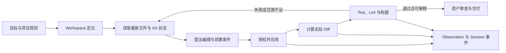

# 代码编辑、Git 与 Workspace

[上下文构造章节](07_context_and_instruction_system.md#workspace代码与动态上下文)把工作区（Workspace）定义为任务发生的目录、仓库与执行现场，[Tool Call 章节](08_tool_call_system.md#执行结果与-observation)则说明模型提出的动作必须经过参数验证、授权和结果关联。本章继续追问 Coding Harness 最有工程特征的一段：模型怎样把“应该改什么”变成真实文件修改，Harness 怎样让用户看清净变化，Git 怎样保存或隔离修改，测试、Lint 与构建又怎样把一次写入变成可以交付的结论。

继续使用[序章定义的配置解析错误案例](00_index.md#一句话请求先要落到正确的工作区)。用户要求“定位并修复配置解析错误，运行相关测试，并解释修改”。这句话看似只要求改几行代码，实际却隐含一条完整事务：确认仓库与局部规则，读取最新文件，选择编辑表达，避免覆盖用户同时进行的修改，展示实际 Diff，运行正确范围的验证，区分测试失败与环境失败，最后说明改了什么以及哪些状态没有被触碰。Coding Harness 的价值，就在于把这条链从模型的一段回答提升为可检查、可恢复、受作用域约束的工程闭环。

## Coding Harness 的工程闭环

软件修改不是“生成新文本”这么简单。文件内容、Git 索引、工作树、构建缓存和外部依赖同时存在；用户还可能在 Agent 工作期间继续编辑。模型即使准确猜到根因，只要在错误目录写入、覆盖了较新的内容、遗漏格式化后的变化，或把一个无关测试的成功当成修复完成，任务仍然失败。工程闭环因此至少包含定位、读取、提出变化、应用、观察净变化、验证和交付七个阶段。

图 18-1 把这些阶段与前文的共同语言连接起来。用户目标和项目规则进入本轮 Context，模型通过 Tool Call 提出搜索、编辑或命令；执行结果成为新的 Observation，并以文件 Diff、测试状态和构建 Artifact 更新 Session。只有验证结果与用户目标一致，Loop 才应结束；否则，错误和审查意见继续进入下一轮。

*图 18-1　概念图：Coding Harness 的工程闭环。替代说明：修改必须从工作区定位和最新读取开始，经编辑、实际 Diff 与验证后才进入交付；任何失败都会带着新的观察回到循环；不表示七个固定版本都具有同名组件或全部转换。*

图 18-1 的重点是“实际 Diff”而不是“模型声称的修改”。自动格式化器可能扩大变化，用户可能在审批界面改写提案，多文件 Patch 也可能只应用了一部分；因此提议内容、写入结果和最终工作树是三个不同对象。[Session 持久化章节](12_session_persistence_and_resume.md#tool-call-和外部副作用的一致性)已经说明外部副作用不能仅靠对话记录回滚，本章把这一原则落到文件系统：每次编辑都要能回答修改依据是什么、写入是否真的成功、之后谁又改变了文件，以及恢复动作会删除哪些新增内容。

软件工程评测也强化了这一边界。SWE-bench 以真实仓库快照、Issue、补丁和可执行测试定义任务，而不是只比较短函数文本；论文同时指出，测试通过并不足以保证补丁在可读性、完整性和工程质量上等同于人工修复 [@jimenez2024swebench]。OpenHands 把写代码、命令行、浏览与沙箱执行组合为平台能力，说明执行环境本身就是 Coding Agent 的一部分 [@wang2024openhands]。这些工作不是七个 Harness 的实现说明，却提供了一个共同问题：完成应由仓库状态和执行证据界定，而不是由模型停止生成界定。

## Workspace 发现与作用域

Workspace 首先是路径身份，其次才是提供给模型的目录树。当前工作目录（current working directory，cwd）告诉相对路径从哪里解释，仓库根告诉 Git、ignore 和项目规则从哪里生效，额外 Workspace Root 则表示同一任务被允许访问的其他目录。三者可能相同，也可能不同。一个 CLI 从子目录启动时，cwd 可以是 `src/parser`，Git 根却在两层祖先；一个 IDE 会话还可能同时打开多个根；恢复旧 Session 时，保存的 cwd 甚至已经不存在。

可靠发现需要把路径规范化（canonicalization），即消除相对段、解析真实目录身份，并在必要时检查符号链接。否则，同一目录可能以多个拼写被重复注册，或者一个看似位于 Workspace 内的路径经符号链接落到外部。DeepSeek Harness 的 Workspace Registry 以 `realpath` 规范化持久目录，并用 Session header 中的 cwd 校验归属；该注册表服务于宿主分组，本身不向模型授予文件权限。Codex 则把 Turn environment 选定的 Workspace Roots 与权限配置结合，文件和进程工具使用同一组有效根。Pi 在选定或恢复 Session 后才确定最终 cwd，再重建项目设置、资源和工具，避免用启动目录加载另一个项目的配置。

Git 根也不能替代全部作用域。Aider 从输入文件向上寻找单一工作树，并拒绝把来自多个 Git 仓库的文件放进同一编辑事务；OpenCode 区分当前目录与 worktree 根，允许根内子目录共享项目状态，同时对根外路径触发额外权限检查。Goose 的 Developer Extension 和 Shell 以 Session working directory 为基准；DeepSeek Harness 的 Fs/Shell provider 也把 Session cwd 作为相对路径与沙箱根。它们的共同点是先绑定一个执行现场，再解释模型参数，而不是让模型在每次调用中自行声明可信根。

Ignore 规则解决的是“默认不纳入”，不是“绝对不可访问”。`.gitignore`、项目专用 ignore 和搜索工具默认排除可以减少生成目录、依赖树和敏感文件进入 Context。Aider 会跳过命中 Git ignore 或 `.aiderignore` 的文件；Goose 的 tree/推荐搜索路径尊重 `.gitignore`；OpenCode 的 Snapshot 还会从内部索引移除后来变成 ignored 的文件。但 ignore 主要影响发现、快照或默认选择；如果 Shell 权限允许，显式路径仍可能被访问。把 ignore 当成安全沙箱，会把便利性规则误写成访问控制。

大型仓库还要求区分“结构范围”和“写入范围”。Repo Map、目录树、LSP 符号与搜索结果帮助模型找到候选文件，[第 07 章已经解释它们如何形成 Context 投影](07_context_and_instruction_system.md#文件选择repo-map-与检索)；本章只强调，结构摘要不构成写入依据。AutoCodeRover 使用 AST 级类与方法搜索，并可借助测试故障定位收窄范围，说明仓库探索可以利用程序结构而非仅做文本匹配 [@zhang2024autocoderover]。真正编辑前仍需读取目标文件的最新内容，并让修改前置条件绑定到这次读取。

## 直接写入、Patch 与结构化编辑

文件编辑可以分成四种表达。**整文件写入（whole-file write）**直接给出目标全文，适合创建文件、生成短配置或确定性产物；它最容易实现，却也最容易覆盖未读到的新变化。**精确替换（exact replacement）**用唯一旧文本定位局部区域，找不到或出现多处时拒绝；它天然暴露“模型依据的旧内容是否还存在”。**补丁（Patch）**把多个文件的新增、删除、更新与移动放进统一语法，可先整体解析和展示。**结构化编辑（structured edit）**则借助 AST、LSP 或语言工具定位符号和诊断；它能利用语义，但仍需最终落成文本与 Diff。

这四种表达没有绝对优劣。Agentless 展示了固定的“定位—修复—补丁验证”流水线可以成为开放式 Agent Loop 的有效对照，说明复杂自治并不是形成 Coding 闭环的必要条件 [@xia2024agentless]。对于配置解析错误，若修改只涉及一个唯一条件分支，精确替换比重写整个文件更容易审查；若需要同步改 schema、解析器和测试，多文件 Patch 更能表达一次提案；若根因依赖类型和调用关系，LSP 或 AST 搜索适合先定位，但不能省略最终文本核对。

真正决定可靠性的，是编辑前置条件。Aider 先解析 edit format，再做 dry-run 和可编辑性检查；Codex 的 `apply_patch` 先完整解析 hunk、核对旧行和路径，再经过权限判断；Pi 让一次调用中的多个替换都针对同一份原文，并拒绝不唯一或相互重叠的区域；Goose 的 `edit` 同样要求 `before` 文本唯一。OpenCode 还对单文件编辑加锁，保存 BOM 与原换行风格，写入后运行 Formatter 和 LSP。它们都在减少“猜测式写入”，但保护范围不同：单文件锁不能保证多文件 Patch 原子提交，唯一文本匹配也不能发现另一个进程在读取之后、写入之前修改了不相交区域。

DeepSeek Harness 给出更明确的并发边界。读取可以产生一个不透明文件版本，后续 `edit-intent` 或 `write-intent` 把该版本作为守卫交给 Fs provider；若当前版本已经变化，provider 返回陈旧版本错误，模型必须重新读取。这个机制接近乐观并发控制：不长期锁住文件，而是在提交写入时验证依据仍然成立。它是否启用取决于部署是否组合了观察策略，因此正文不能把可插拔保护写成所有部署的默认保证。

> **设计取舍｜容错匹配还是严格失败？**
>
> 严格唯一匹配能及早暴露旧上下文和歧义，代价是格式化、缩进或小幅用户修改后需要重新读取。Gemini CLI 还提供柔性、正则和模糊恢复，并记录采用的策略；这能提高编辑成功率，却也扩大了“相似文本被误认成目标”的空间。高风险配置、权限文件和生成脚本更适合严格失败；低风险、可立即审查且有测试覆盖的局部样式变化，可以接受受限容错。无论选择哪一种，最终都要展示实际 Diff，而不是只展示搜索与替换参数。

## Diff、审查与用户修改

差异（Diff）是编辑事务的公共语言：模型用它检查修改，用户用它批准或修正，Session 用它记录发生过什么，Git 用它比较工作树与基线。但 Diff 也有不同时间点。**提议 Diff**来自尚未执行的候选内容，适合审批；**应用 Diff**来自工具实际写入的 before/after；**净 Diff**则把一个 Turn 或 Session 的连续修改合并到稳定基线。三者不应混用。

Gemini CLI 的 `replace` 和 `write_file` 在执行前生成文件 Diff、统计和上下文片段，审批界面还允许用户修改候选内容；工具用 `modified_by_user` 和原始 AI 提案区分最后写入者。DeepSeek Harness 的文件工具把调用时 Diff 与执行后 before/after 分开，结果元数据可随 Session 重放。OpenCode 在 edit/write/apply_patch 审批中携带 Diff，应用后再由工具返回实际变化与 LSP diagnostics。Codex 可以在流式接收 Patch 参数时发布增量预览，完整执行后再由 Turn Diff Tracker 汇总本 Turn 的精确净变化。

这些设计也揭示了审查盲区。Codex 的内存 Turn Diff 主要跟踪已确认的 `apply_patch` delta；若 Shell、Formatter 或外部编辑器直接改了文件，必须重新读取工作树或调用 Git 才能得到完整净变化。OpenCode 和 Gemini 的写入路径会主动通知 Formatter、LSP 或 IDE，但格式化后的文本可能不同于审批时的原始提案。Goose 的通用 Developer edit 返回的是局部替换结果，独立 `goose review` 命令才从 Git root 收集真实 diff，并额外合成未跟踪文件的差异。审查面是否完整，取决于它的基线和采集范围，而不是 UI 是否显示了红绿行。

用户同时修改文件时，Harness 应保留而不是抹掉这种并发事实。Aider 会在编辑已有脏文件前创建提交基线，以便之后区分用户改动和 Agent 改动；其 undo 还会拒绝覆盖带有新未提交变化的文件。OpenCode 的 Session Revert 使用 Snapshot 恢复文件并调整会话尾部，但恢复逻辑需要明确处理快照后新增的文件。最保守的原则是：发现不属于当前事务的变化时，先缩小修改范围、重新读取并解释冲突；“回到干净状态”不是默认正确动作，因为那个状态可能早于用户自己的工作。

## Git、Worktree 与 Submodule

Git 在 Coding Harness 中承担三种职责。第一是**发现与选择**：仓库根、tracked/untracked/ignored 状态帮助确定工作集。第二是**审查与来源**：Diff、提交和分支把变化绑定到基线与作者身份。第三是**恢复**：提交、隐藏仓库或 Snapshot 可以提供撤销点。Git 不负责模型权限，也不自动使多文件操作原子；工作树写到一半时进程崩溃，Git 只会忠实显示一个部分修改的现场。

表 18-1 比较三种常见 Git 事务。它们解决的问题不同，不能都简称“自动保存”。

| 事务方式 | 基线放在哪里 | 主要收益 | 主要边界 |
|---|---|---|---|
| 用户仓库提交 | 当前分支历史 | 可审查、可共享，Git 原生 undo 路径清楚 | 改变用户历史；可能触发 Hook；脏文件归属需要区分 |
| 隔离 Shadow Git / Snapshot | Harness 私有 Git dir，以 Workspace 为 work tree | 不污染用户分支，可记录 Turn/Tool 前后状态 | 恢复可能删除新增文件；ignore、Submodule 与大仓库需要专门处理 |
| 仅依赖工作树 Diff | 用户仓库或文件基线 | 机制简单，不自动提交 | 崩溃恢复和跨轮来源较弱；未跟踪文件容易漏掉 |

表 18-1 中，Aider 最接近第一类：它可在 Agent 编辑前提交用户脏改动，在编辑后只暂存指定文件并自动提交，还提供 `/diff` 与受约束的 `/undo`。Gemini CLI 的 checkpoint 和 OpenCode 的 Snapshot 更接近第二类：两者用独立 Git dir 管理恢复基线，不要求用户仓库生成提交。Gemini 还隔离 Shadow Repo 的身份、全局 Git 配置和危险环境变量；OpenCode 的 Snapshot 对 ignored 文件、大型 worktree 和 Session revert 做了专门处理。Codex、DeepSeek Harness、Goose 与 Pi 的核心 Coding 路径更接近第三类或“由 Shell 显式选择 Git 动作”：它们能运行 `git status`、`git diff`、测试和提交命令，但不应因此被描述为默认自动提交系统。

工作树（worktree）在这里有两个含义：Git 的 working tree 是检出文件集合；`git worktree` 则允许一个仓库同时拥有多个独立检出目录。OpenCode 在控制面提供创建 Git worktree 的路径，并让 Session、权限和 Snapshot 绑定具体 worktree。其他系统只要从一个 worktree 目录启动，通常也能把它当普通仓库工作，但“能在目录中运行”不等于“管理 worktree 生命周期”。创建、分支命名、清理和并发冲突仍可能完全由用户或外部编排承担。

Submodule 又是不同边界。父仓库记录的是子仓库提交指针，不是子仓库文件内容；父仓库干净不代表 Submodule 工作树干净，父仓库回滚也不必然撤销子仓库内部修改。Nested repository、Submodule 和多个 Workspace Root 都会让“本次修改属于哪个仓库”变得具体。Harness 在提交或回滚前至少要分别读取父仓库与相关子仓库状态，并把修改文件映射到各自根；没有跨仓库事务证据时，不应承诺一次 undo 能恢复全部层级。

## Test、Lint 与构建

测试、静态检查（Lint）与构建分别回答不同问题。测试检查行为是否满足可执行断言；Lint 和类型检查捕获风格、语法、类型或局部规则；构建验证依赖解析、代码生成、链接和打包路径。它们都不能只凭命令名称判断成功，Harness 需要保留执行目录、命令、退出状态、关键输出、超时或取消状态，以及输出是否被截断。

验证顺序通常从窄到宽。配置解析错误先运行最接近修改点的单元测试，失败时得到短反馈；通过后再运行相关包测试、类型检查或构建，确认没有跨模块回归。若项目指令指定了命令，就应使用项目命令而不是凭语言猜测；若没有现成测试，至少可以运行解析器的最小重现、Lint 或构建，但最终说明必须如实区分“完整测试通过”“仅相关测试通过”和“未能运行”。这正是[Harness Loop 的完成不变量](05_harness_loop.md#终止取消与防失控)在 Coding 场景中的具体化。

Aider 把 Lint 和 Test 明确接入编辑循环：自动 Lint 为默认路径，自动 Test 可配置，失败输出可以触发后续修复；提交还可选择是否跳过 Git hook 验证。OpenCode 在文件写入后运行可发现的 Formatter，并请求 LSP diagnostics；项目测试仍通常经 Shell。Gemini CLI、Codex、Goose、DeepSeek Harness 与 Pi 都通过命令工具完成测试和构建，差别主要在 cwd 绑定、审批、沙箱、超时、流式进度与大输出处理。SWE-agent 的研究表明，工作目录、错误呈现、截断和调用—结果配对都会改变同一模型的软件工程表现 [@yang2024sweagent]；因此验证工具的接口不是中性管道，而是完成质量的一部分。

测试失败也要分类。断言失败可能证明补丁错误；依赖未安装、网络不可达、编译器缺失或权限拒绝说明环境不足；超时可能是测试变慢，也可能是进程没有被正确清理。Harness 应把这些状态作为 Observation 送回，而不是把所有非零退出码压成一句“测试失败”。同样，测试成功只证明运行到的路径满足断言，不能证明未运行的平台、并发路径、数据迁移或安全属性。最终交付要把验证范围与 Diff 放在一起解释。

## 七个系统的 Coding 路径

表 18-2 按同一闭环比较七个固定版本。它不排名，也不把每个系统都要求成 Git 客户端；集中式编辑器、通用 Runtime、平台型 Harness 与可扩展小内核本来就选择了不同控制中心。

| 系统 | Workspace 与编辑入口 | Diff、恢复与 Git | 验证路径与适用边界 |
|---|---|---|---|
| **Aider** | 单一 Git 根；显式文件、Repo Map；多种 edit format 解析后 dry-run 与局部写入 | 用户仓库脏改动基线、自动提交、`/diff`、受约束 `/undo`；ignore 文件默认跳过 | Lint 接入默认循环，Test 可配置；最 Git-centric，跨仓库事务受限 |
| **Codex** | Turn environment 的 cwd/Workspace Roots；freeform `apply_patch` 经解析、权限与环境文件系统 | Patch 流式预览与 Turn 净 Diff；Git 操作主要经 Shell，Core 不默认替用户提交 | 命令工具运行 Test/Lint/Build；Diff tracker 对非 Patch 外部写入需重新核对工作树 |
| **DeepSeek Harness** | 持久 Workspace Registry 与 Session cwd 分离；Fs 工具可用版本守卫、精确 edit 或 `str_replace_editor` | before/after 生成可重放 Diff；Git 由组合的 Shell/插件承担 | Fs/Shell/Sandbox/Observation policy 可组合；保证强度取决于部署装配 |
| **Gemini CLI** | target dir、Folder Trust 与路径校验；replace/write 支持多种匹配策略 | 执行前 Diff 审批、用户修改提案；Shadow Git checkpoint 可恢复文件 | Tool 后通知 IDE；Shell 运行验证；模糊匹配与 checkpoint 清理需要理解其边界 |
| **Goose** | Session working dir；内建 Developer tree、write、unique edit、shell | 通用编辑结果简洁；`goose review` 从 Git 收集 tracked 与 untracked diff | 指引 Agent 先读后改并按需测试；Git 提交与回滚主要由 Shell/用户控制 |
| **OpenCode** | directory/worktree 双边界；edit/write/apply_patch 带外部目录权限、文件锁、Formatter 与 LSP | 编辑审批 Diff；Git-backed Snapshot、Step patch、Session revert；可创建 worktree | 写入后格式化和诊断；项目级 Test/Build 经 Shell；多文件 Patch 不宣称跨文件原子性 |
| **Pi** | 最终 Session cwd 决定项目服务；小内核提供 read/edit/write/bash，扩展可替换 | edit 返回 unified patch；Git 与恢复通常经 Bash 或 Extension | 精确多替换、单文件 mutation queue；没有必要内建 Aider 式自动提交 |

表 18-2 显示，七个系统的分叉不在“会不会写文件”，而在事务中心。Aider 把编辑事务与 Git commit 绑定得最紧，在启用 Git 与 auto-commit 时以提交形成基线和结果边界；Codex 放在受权限约束的 Patch 与 Turn；DeepSeek Harness 放在可组合文件版本和策略 seam；Gemini CLI 放在可编辑审批与 checkpoint；Goose 放在 Developer Extension 加独立 review；OpenCode 放在 Session Snapshot；Pi 则只提供可组合的精确编辑原语。公平的比较问题是：每种设计能否在自己的边界内保留最新读取、实际变化、验证结果和用户控制，而不是谁内建的 Git 子命令最多。

### Aider：以 Git 基线组织编辑事务，而不是通用工具总线

Aider 面对的核心问题是怎样把模型给出的编辑格式可靠地落成代码，并让用户改动、Agent 改动和验证结果拥有可比较的基线。它不把任意工具调度作为事务中心，而是把编辑前后的 Git 状态拉近 Coder Loop，使一次代码修改更容易审查和撤销。

机制链从可配置的 dirty commit 开始：若待编辑文件已有用户脏改动，Aider 可以先保存基线；模型输出随后经过 edit format 解析、dry-run 与可编辑性检查，再写入目标文件。写入后默认 lint、按配置运行 test，失败结果进入反思；启用 auto-commit 时只提交本次编辑文件，`/diff` 展示变化，受约束的 `/undo` 尝试撤销满足归属、未推送和工作树条件的最近提交。

这条路线不意味着每个 Aider 会话都必须产生 Git commit。`--no-git`、关闭 auto-commit、dry-run、没有仓库或不满足提交条件都会让提交边界缺席，自动测试也不是默认路径；`/undo` 只是对特定提交的补偿，并非 Session 级事务回滚。提交还可能触发项目 Git Hook，因此 Git 基线提高可审查性，也把仓库状态和供应链脚本带进执行边界。

理解这条编辑事务可以串联[集中式 Harness Loop 的反馈路径](05_harness_loop.md#七个系统如何组织-loop)、[Repo Map 与文件选择](07_context_and_instruction_system.md#文件选择repo-map-与检索)、[Session 恢复中的有限补偿](12_session_persistence_and_resume.md#tool-call-和外部副作用的一致性)以及[项目脚本与依赖供应链](22_configuration_identity_and_supply_chain.md#自动更新与依赖生命周期)。

## 数据损坏与供应链边界

数据损坏最常见的前提不是“模型恶意”，而是依据陈旧、范围错误或恢复过度。整文件写入覆盖用户新改动，容错匹配选中相似但错误的代码块，多文件 Patch 在中途失败，Formatter 静默扩大变化，恢复动作删除快照后新增文件，或者在父仓库执行回滚却遗漏脏 Submodule，都可能破坏完整性。缓解方向对应前文闭环：编辑前读取并绑定版本，应用前展示提议 Diff，应用后计算实际净 Diff，恢复前列出删除与覆盖集合，跨仓库操作逐根确认。

敏感文件则同时涉及发现与授权。Ignore 能减少 `.env`、生成目录或凭据文件进入默认工作集，但不能替代 Workspace 权限、路径校验和用户审批。符号链接、额外根和外部目录会绕开仅按字符串前缀判断的边界；Shell 还可能通过命令参数访问文件工具看不到的位置。因此，[统一参考架构建立的信任边界](04_reference_architecture.md#信任边界意图授权与后果)仍然适用：模型是否看见文件、编辑工具是否允许路径、进程实际能否访问宿主，是三个独立问题。

> **安全提示｜“运行测试”可能执行仓库提供的代码**
>
> 攻击前提是攻击者能够控制仓库中的测试脚本、构建配置、Git Hook、Formatter、编译插件、依赖清单或 Submodule 来源，而 Harness 在具有凭据、网络或宿主写权限的环境中执行它们。此时 Test、Lint、Build、`git commit` 与包安装都可能触发任意项目代码，而不只是读取源码。缓解包括先建立 Workspace Trust，按命令和环境限制权限，隔离凭据与网络，审查新增依赖和 Hook，并让高副作用步骤获得明确批准。这里描述的是执行链风险，不是对任一固定版本的漏洞结论。

供应链问题从这里出现，但不在这里展开。自动安装 Formatter、LSP、测试依赖或 Extension，会把包注册表、Git URL、锁文件和更新策略带入任务；Submodule 还把父仓库的一个指针连接到外部仓库历史。Coding 闭环只需记录来源、版本和触发动作，并避免把“验证需要依赖”变成无提示的全局安装。签名、来源证明、企业配置与依赖生命周期将在[配置、身份与供应链章节](22_configuration_identity_and_supply_chain.md#pluginmcp-与-skill-来源)系统讨论。

## 本章小结

Coding Harness 的特殊能力不是生成代码，而是维护一条从 Workspace 到可交付修改的工程闭环。它要先确定 cwd、仓库根和允许访问的 Workspace Roots，再基于最新文件选择整写、精确替换、Patch 或结构化定位；随后把提议 Diff 交给权限与用户审查，把实际 before/after 和净 Diff 写回 Session，并用 Test、Lint 与构建产生可解释的完成证据。

Git 在这条链中提供发现、来源和恢复，但不同系统把事务中心放在不同位置：Aider 使用用户仓库提交，Gemini CLI 和 OpenCode 使用隔离 Snapshot，Codex、DeepSeek Harness、Goose 与 Pi 更多让 Git 经 Shell 或宿主显式组合。Worktree、Submodule、ignore 与大型仓库进一步说明，目录可达、仓库归属和恢复范围必须分别核对。最终，一个可信的“已修复”结论应同时回答：改的是哪个工作区，写入依据是否仍新鲜，用户实际接受了什么，工作树最终变化是什么，运行了哪些验证，以及哪些供应链和外部副作用仍需单独批准。

下一步可以进入[观测章节对模型请求与 Tool Call 的关联](19_observability_evaluation_and_replay.md#模型请求和-tool-call-关联)：当编辑、Diff、测试和恢复已经形成工程事件后，Harness 还需要怎样记录它们，才能调试失败、比较评测并在不泄露源码与凭据的前提下回放任务。
