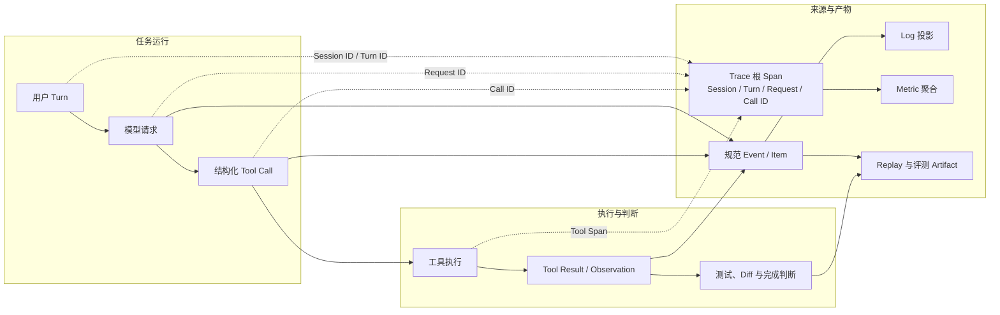
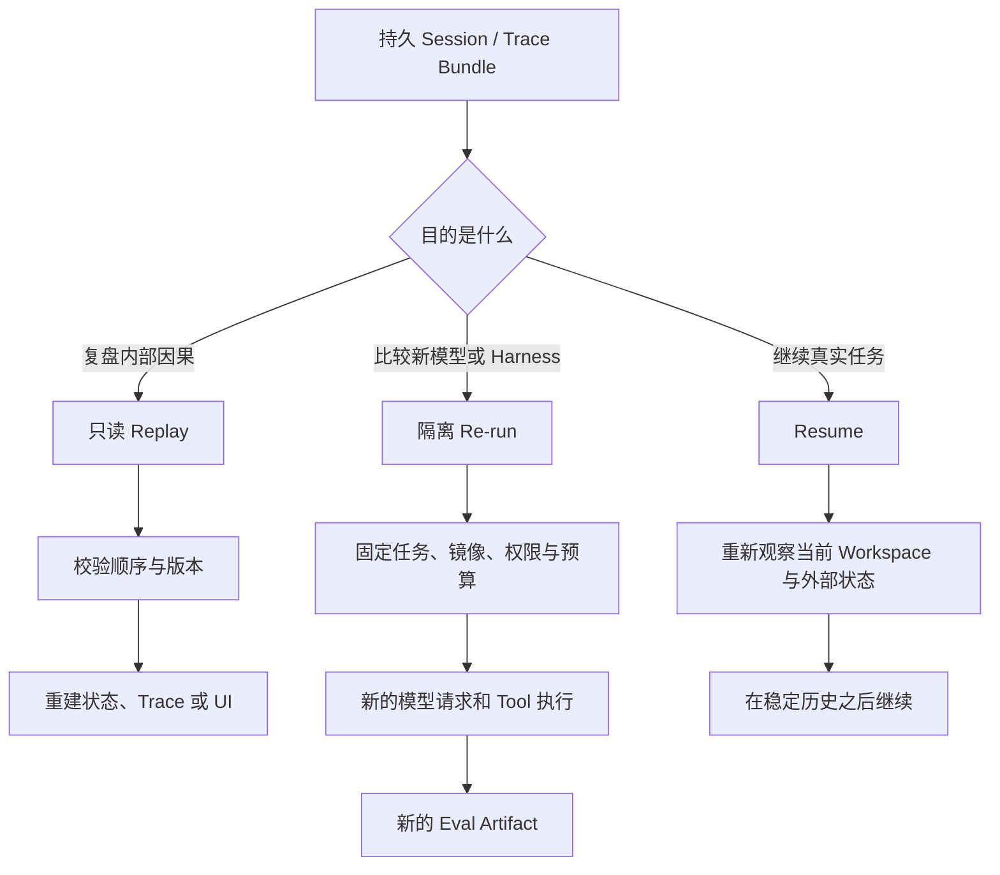

# 观测、评测与回放

[统一参考架构的八个核心对象](04_reference_architecture.md#八个核心对象一项任务由什么组成)把 Session、Turn、Message、Event、Item、Context、Memory 与 Artifact 分开，是为了让一项任务在执行、保存和交付时仍能说明“什么发生了”。本章继续追问另一个独立问题：当配置修复任务变慢、工具结果错配、成本突然上升，或测试明明通过却没有真正解决问题时，工程师怎样从运行记录中找到原因，并判断修复是否可信？这需要的不只是多打印几行文字，而是一套能关联行动、结果、资源与任务质量的可观测性（Observability）和评测（Evaluation）体系。

仍以[序章定义的教学案例](00_index.md#一句话请求先要落到正确的工作区)为例：用户要求定位并修复配置解析错误，运行相关测试，并解释修改。若最终失败，根因可能是模型判断错了，也可能是 Context 选错文件、[Tool Call](08_tool_call_system.md#请求参数与-call-id) 参数失真、权限拒绝没有回流、测试进程超时、历史恢复漏掉结果，甚至只是在一个较慢的 Provider 上等待。观测要把这条链拆开；评测则要在可复现环境中判断整个链是否完成了任务。回放位于两者之间：它用已保存历史重建内部视图，帮助复盘因果，却不能把模型、网络和工作区倒回过去。

本章的核心结论是：Harness 的观测单位应从“一个最终回答”下沉到 Session、Turn、模型请求与 Tool Call，同时保留任务级结果；四类信号分工记录局部诊断、规范状态、跨边界因果和聚合资源。只有共享稳定身份，[Token、费用、延迟、错误和验证结果](14_token_efficiency_and_cost_control.md#token-账本到底记录什么)才能回到同一条任务链。[Replay 默认重建记录，不重新产生副作用](12_session_persistence_and_resume.md#resumereplaybranch-与-fork)；Harness 评测（Harness Eval）评价模型、Context、工具、循环、权限和环境的组合，不是换名的模型排行榜。

## Harness 为什么需要可观测性

传统命令行程序失败时，用户常能从一次调用的输入、退出码和错误栈定位原因。Agent Harness 却在一次 Turn 内反复调用模型和工具，还可能并行读取文件、等待审批、压缩历史、委派子任务，再从中断处继续。[Harness Loop 的六条不变量](05_harness_loop.md#turn状态与循环不变量)要求目标连续、行动可归属、结果闭合、观察优先、副作用受控和终止可解释；可观测性就是让这些关系在运行后仍可检查，而不是只在内存中短暂成立。

配置修复案例可以出现三类看似相同、实则不同的“慢”。第一类是模型首个 Token 很晚才到，瓶颈在 Provider 排队、网络或推理。第二类是模型很快提出搜索，但 Tool Call 在权限、进程启动或大输出处理中耗时。第三类是每一步都不慢，Loop 却重复读取相同文件，导致任务总时长和成本不断增长。一个总计时器只能证明“慢”，不能指出慢在哪一层；一份无关联的日志又会把同时发生的调用混在一起。

失败同样需要分层。测试非零退出是任务事实，模型 API 认证失败是基础设施故障，权限拒绝是控制决定，补丁冲突是可继续的 Observation，崩溃则可能使最后一个 Tool Call 进入结果未知。若所有情况都写成一条 error 字符串，评测会把环境故障算成模型能力不足，恢复路径也可能把未知副作用当成安全重试。可观测性要先保存对象身份、阶段与结果类型，再为人类提供易读解释。

可观测性也不是“收集越多越好”。Prompt、源码、环境变量、文件路径与 Tool Result 可能包含敏感信息；全量 Trace 增加开销，高基数标签还会让 Metric 后端失控。合理设计先定义调试问题，再选择信号和字段：日常健康度只需计数、延迟和错误类别；复现复杂 Session 时才需要本地详细记录或经同意导出的诊断包。采样、脱敏和保留策略是机制的一部分。

## Log、Event、Trace 与 Metric

日志（Log）是带时间和级别的诊断记录，适合回答“某个组件当时说了什么”。事件（Event）在本书中是改变或声明 Session 状态的有序事实，[其持久化语义由第 12 章定义](12_session_persistence_and_resume.md#turnmessageevent-与-item)：例如 Tool Call 已提交、审批被拒绝、Turn 已取消。追踪（Trace）把一次任务跨组件的操作组织成父子区间，每个区间称为跨度（Span）；指标（Metric）则把大量运行折叠为计数器、分布和比率。四者可以描述同一次工具执行，但服务于不同查询。

表 19-1 以一次测试调用为例说明分工。Event 与 Item 仍承担可恢复的业务语义，Trace 不能取代它们，因为遥测可能采样、丢弃或改变保留期；反过来，规范 Event Log 也不适合直接承担高频延迟聚合和跨进程性能分析。

| 信号 | 对配置修复案例的记录 | 最适合回答 | 不应承担的责任 |
|---|---|---|---|
| **Log** | “测试进程启动失败：命令不存在”，附组件与级别 | 局部故障、人工排查、错误上下文 | 规范 Session 状态或跨服务完整因果 |
| **Event / Item** | Call ID 对应的测试请求、结果、取消或结果未知 | Resume、审计、Context 投影与完成判断 | 大规模分位延迟和高频运行监控 |
| **Trace / Span** | Turn span 下包含模型请求 span、测试 Tool span 与存储 span | 一次任务在哪里等待、哪一层失败、父子调用关系 | 默认保存全部 Prompt，或作为业务真相唯一来源 |
| **Metric** | Tool 成功数、错误率、首 Token 延迟、总延迟、Token 和费用分布 | 趋势、容量、告警与版本回归 | 还原某次具体任务的文本与完整顺序 |

*表 19-1　Log、Event、Trace 与 Metric 的职责。表中同一测试调用可以投影成四种信号，但只有 Event/Item 维护第 12 章要求的持久状态语义。*

表 19-1 的关键不是术语数量，而是规范事实与诊断投影分离。测试完成后，Harness 应先把带 Call ID、退出状态和结果类别的 Item 闭合；随后可以发一条 Log、结束一个 Span，并把 duration 计入 Metric。若遥测 exporter 故障，测试结果仍应保存并进入下一轮 Context。Pi 的 telemetry adapter contract 明确要求记录失败不能改变业务回调，DeepSeek Harness 的 telemetry seam 也把 backend batching 和失败策略留在业务 Event 之外，体现了相同边界。

Trace 的核心是关联标识和父子关系。Dapper 通过共享 trace ID 与嵌套 span 把一次请求跨进程串起来，说明仅有各组件时间戳不足以定位分布式延迟 [@sigelman2010dapper]。OpenTelemetry（OTel）进一步把 Trace、Metric、Log 与上下文传播分成可组合信号，并用语义约定统一属性名称；其 GenAI 约定仍在演进，适合作为互操作方向，而不是冻结不变的产品 Schema [@otel2026specification]。Harness 可以借用这一模型，把 Session 或 Turn 作为根范围，把模型请求、Tool Call、Subagent 与存储操作作为子 Span。

图 19-1 展示一次 Turn 从规范状态到观测信号的投影。图中“评测 Artifact”并非另一个运行信号，而是把任务输入、版本、轨迹、文件结果和 scorer 输出固定下来，供后续比较。

*图 19-1　概念图：一次 Turn 的状态、追踪与评测数据流。替代说明：模型请求、Tool Call 和结果先以稳定身份进入规范历史，再投影为日志、追踪、指标与评测材料；不表示七个固定版本都具有同名组件或全部转换。*

图 19-1 说明观测的先后关系：恢复与完成状态不能依赖可能丢失的 exporter；Trace 负责连接，不决定业务结果；Metric 来自已分类操作，不能靠解析自由文本日志猜测。这样的分层也便于控制敏感数据：远程 Trace 只导出低敏属性，用户报告问题时再生成经检查的 Debug Bundle。

## 模型请求和 Tool Call 关联

[Tool Call 请求的稳定 Call ID](08_tool_call_system.md#请求参数与-call-id)只解决“结果属于哪个调用”，完整观测还需要把它放进 Session、Turn 和模型请求。最小关联链通常包含 Session ID、Turn ID、模型 request/response ID、Tool Call ID，以及并发或 Subagent 场景中的 parent span/session ID。时间戳只能辅助排序，因为并行调用会交错，跨主机时钟也可能偏移；真正的因果关系来自“谁创建了谁”。

模型请求开始时应记录 Provider、模型、路由结果、输入投影版本、工具集合摘要与重试序号，但不必默认记录全部正文。流式过程中可以观测首 Token、事件数量和中断；完成时再绑定 response ID、finish reason、usage 与错误类别。Tool Call 则在最终参数成形后建立自己的 Span，并保留工具名、风险类别、审批结果、执行器、结果状态和 duration。若参数分片尚未闭合，界面可以显示增量，却不应提前建立“已执行”的 Metric。

并行工具尤其需要稳定父子关系。模型一次提出三个文件读取，结果可以按完成顺序回来；Trace 展示实际重叠与慢调用，Event/Item 则按第 05 章定义的提交策略形成稳定历史。只用日志文本“read done”无法知道是哪一个文件，也无法区分调用成功后写入历史失败，还是历史已提交而客户端没有收到。关联字段应贯穿 Provider adapter、调度器、执行器、持久层与客户端，而不是每层重新生成无关 ID。

七个固定版本给出多种落点。Codex 的 SessionTelemetry 记录 API 与 Tool Call 计数、duration、首 Token 与响应时序，并在 exec server 的 RPC/relay 中传播 W3C `traceparent`；Gemini CLI 的详细 Trace 可记录 conversation ID 与 tool call ID；Goose 的 GenAI spans 在内容关闭时仍保留模型、response ID、finish reason、Token 与工具身份。OpenCode 的实验 AI SDK telemetry 给模型 span 注入 Session ID。Pi 则不依赖全局 ambient context，而让宿主显式传递 TelemetryContext，并用 typed schema 约束 run、turn、step、AI request 与 tool span 的父子关系。它们证明关联可以由不同库实现，但共同要求是身份不能只存在于 UI 文本中。

> **设计取舍｜高基数身份是否进入 Metric 标签？**
>
> Session ID、Call ID 和文件路径适合 Trace 或 Log 查询，却不适合直接成为长期 Metric 标签。每个唯一值都会扩大时间序列数量，增加后端内存、索引和费用。Metric 通常只保留模型、工具类别、结果类型、版本或权限模式等有界维度；需要下钻时，再从 exemplar、trace ID 或时间窗口跳到具体 Trace。保留关联能力不等于把所有身份复制到每个信号。

## Token、成本与延迟

[第 14 章的 Token 账本](14_token_efficiency_and_cost_control.md#token-账本到底记录什么)已经定义请求压力、账单桶、辅助调用、时间资源与任务质量，本章不重复字段表，而是说明这些数字怎样进入观测链。Token usage 应绑定具体模型请求和 Turn，费用要注明 Provider 报告、模型目录估算或未知，延迟则至少区分首 Token、模型总耗时、Tool duration、等待审批、重试退避与任务墙钟时间。把这些值只累计到 Session 总数，会失去性能诊断所需的阶段结构。

延迟不是 Token 的简单函数。缓存命中可能减少首 Token 时间却不改变逻辑输入长度；并行读取会缩短墙钟时间，却增加同一时刻的资源占用；Subagent 能缩小父 Context，却产生独立模型调用；工具外置大结果可能减少下一轮 Token，却增加磁盘 I/O。可观测性应把 Token、duration、调用拓扑和结果放在一起，才能解释一次优化究竟减少了什么。

表 19-2 给出从单次操作到任务的三个聚合层。它沿用第 14 章账本的包含关系，但关注诊断用途，而非重新列 Provider 字段。

| 聚合层 | 主要指标 | 能回答的问题 | 仍需配对的质量信号 |
|---|---|---|---|
| **请求 / Tool Call** | Token、TTFT、总 duration、重试、错误、缓存状态 | 某次模型或工具为什么慢、贵或失败 | 参数是否正确、结果是否完整、是否被截断 |
| **Turn** | 多次模型请求、工具等待、审批时间、辅助调用与终止原因 | 一轮为何反复或等待，成本集中在哪一段 | 目标是否推进、调用是否闭合、是否有新 Observation |
| **任务 / Eval Case** | 总 Token、费用、墙钟时间、Turn 数、Tool 数、成功率 | 一个版本或配置是否以更少资源完成任务 | 测试、diff、约束、安全、人工修正和未决风险 |

*表 19-2　Token、成本与延迟的三个聚合层。最上层用于任务比较，但必须能下钻到 Turn 和具体调用。*

表 19-2 也解释了为何平均值容易误导。模型延迟和工具运行常有长尾，少数超时会决定用户体验；任务成功率若不同时显示 timeout、server error 和预算耗尽，就会把基础设施不稳定误成能力差异。实际报告应保留分布、错误分类与样本数，并说明并发、timeout、重试和预算。Codex 记录模型与 Tool duration/TTFT，Gemini CLI 和 Goose 对齐 GenAI token/duration 属性，OpenCode、Pi 与 Goose 又把费用或 usage 持久到 Session，使下钻与聚合能够连接。

成本指标还必须说明缺失。某些 Provider 在取消流或特定认证路径下不给完整 usage，模型价格也会变化。此时“未知”优于填零；估算值要保存模型目录版本和计算方法。评测使用固定价格快照，日常观测同时保留原始 Token 桶，便于未来重新定价。

## Telemetry、Crash Report 与隐私

遥测（Telemetry）是为运行诊断、产品改进或运营监控而采集并传送的观测数据；Crash Report 是崩溃上下文的专门集合，可能包含异常栈、版本和系统信息；本地日志则可以完全留在用户设备。三者的信任边界不同。本节沿用[第 17 章的主体、能力与信任边界](17_security_permissions_and_sandboxing.md#主体能力与信任边界)：资产包括 Prompt、源码、工具结果、路径、凭据和身份；主体包括本地 Harness、扩展、collector、分析服务与接收报告的人；关键问题是默认采什么、谁能读、保留多久、怎样关闭、导出前能否检查与删除。

OpenTelemetry 的 GenAI 方向把模型名、Token 和 duration 作为常规低敏属性，并将 Prompt、Tool argument 与结果内容视为需要显式开启的内容采集 [@otel2026specification]。这不是说元数据天然无风险：Session ID、用户名、工作目录、工具名和精确时间也可以被关联；但它提供了合理默认，即先观测结构和资源，再按具体调试需要 opt-in 采集正文。

七个固定版本展示了不同控制。Aider 的产品分析要求用户 opt-in，可永久关闭，也能把同一事件只写本地文件；它的未捕获异常先把 traceback 路径缩成 basename，再展示预填 GitHub issue 并由用户决定是否打开。Gemini CLI 的 OTel telemetry 默认关闭，可选本地或 GCP 目标，完整 Trace 需要另开 `traces`；需要注意的是，一旦 telemetry 启用，`logPrompts` 的默认值为 true，因此组织部署应显式设定内容策略，而不是只看总开关。

DeepSeek Harness 的 base bundle 默认关闭 Session telemetry，并提供 full、feedback-only 与硬 opt-out；但显式启用导出时，基础 seam 没有内建脱敏规则，Session Event 可包含消息、系统提示、Tool 参数/结果、摘要与 cwd，部署方必须在 outbound copy 上挂载 redaction。Goose 默认不写完整消息、Tool 参数和结果，只有设置内容采集环境变量才加入。Pi 核心只提供 NOOP、进程内 reference 与 adapter contract，没有自带远程 exporter，具体采集取决于宿主。

OpenCode Desktop 把 Crashpad 设置为不上传，日志按本地七天窗口轮转；用户显式导出 Debug Bundle 时，才把桌面/服务日志、网络日志和 crash dump 打包到 Downloads。其 renderer Sentry 还受构建时 DSN 控制。这种“本地先收集、人工导出”的路线提高可检查性，却仍需提醒用户：Debug Bundle 可能包含 URL、路径、请求头、命令输出或源码，生成压缩包不等于已完成脱敏。

> **安全提示｜观测后端是新的数据外传路径**
>
> 攻击或事故前提可能只是仓库、Tool Result 或环境元数据中含有秘密，而 Harness 开启了内容采集或把本地 Debug Bundle 发给外部接收者。传播路径从不可信或敏感内容进入 Session，再被 Trace、Log、Crash dump 或网络日志复制到不同保留系统。缓解方向包括默认关闭正文采集、字段 allowlist、路径与凭据脱敏、采样和大小上限、短保留期、访问审计、用户可见的 opt-in/opt-out、导出预览与删除控制。权限沙箱限制工具能做什么，却不会自动限制遥测 SDK 能发送什么。

隐私控制应覆盖整个生命周期。采集前决定最小字段，传输时加密并限制目标，存储时区分生产告警与调试材料，分享时生成一次性、可检查的包，过期后删除原始和派生副本。删除本地 Session 不一定删除远端 Trace，关闭未来上传也不等于撤回历史数据；产品和企业配置需要分别声明这些语义。本章只比较固定客户端与源码可见边界，collector 的地域、保留和删除保证仍需按具体部署核验。

## Replay 与确定性边界

[第 12 章已经把 Replay 定义为从日志或快照重建内部投影，并默认不再次发出外部动作](12_session_persistence_and_resume.md#resumereplaybranch-与-fork)。本章不重复 Resume、Branch 与 Fork 的差异，只关注 Replay 作为调试和评测工具时的确定性边界。若相同 Event 序列经过同一版本的纯 reducer 得到相同状态，这一部分可以确定性回放；只要过程重新读取当前时间、随机数、网络、模型采样、文件系统或并发完成顺序，就已经越过纯投影边界。

Codex rollout-trace 把本地 bundle 按 seq 归约为语义图，DeepSeek Harness 的 Session Query 用与 Resume 相同的验证和 surface fold 读取事件，Pi 的 reducer 与 in-memory telemetry reference 也强调稳定顺序；这些适合复盘“系统根据记录认为发生了什么”。Goose 与 OpenCode 的 ACP load 会把持久消息和工具结果重新投影给客户端，Gemini CLI 的 rewind 能跨压缩点重建会话。它们都可以恢复展示或 Context 前缀，却不等于重新运行原任务。

模型输出通常不能按历史精确再生。即使 Provider 提供 seed，服务端版本、路由、并发批处理、工具 Schema、系统指令与采样实现仍可能变化。更稳妥的回放模式是把原模型 response 和 Tool Result 当作录制结果读回，只测试 Harness 的解析、状态迁移、UI 和完成判断；若目标是重新评估新模型，则应明确称为 re-run 或 counterfactual eval，并在隔离 Workspace 中产生新的 Session 与副作用记录。

外部动作的边界更严格。事件溯源要求 Replay 把外部更新与真实处理分开，否则重建状态时会再次发送动作 [@fowler2005eventsourcing]；回滚恢复研究同样指出内部检查点无法自动收回已对外输出 [@elnozahy2002rollback]。因此，历史中的文件写入、Shell、Git push 或网络提交只能作为已记录结果回读。若要验证工具实现，应使用 mock、record/replay transport、临时工作区或幂等测试服务，而不是对生产目标重新执行。

图 19-2 给出三条不同路径。只读 Replay 用于调试内部状态；受控 Re-run 用相同任务重新调用模型和工具，测量新版本表现；生产 Resume 则从当前现场继续。三者的结果不能混在同一个“可复现”标签下。

*图 19-2　概念图：只读 Replay、隔离 Re-run 与生产 Resume 的边界。替代说明：Replay 只重建记录，Re-run 在隔离环境重新执行，Resume 则必须先观察当前现实；不表示七个固定版本都具有同名组件或全部转换。*

图 19-2 也是评测数据治理的基础。公开或共享轨迹若包含源码和工具结果，Replay 工具会扩大可读范围；隔离 Re-run 若未禁用网络或敏感凭据，又可能把恶意历史重新送进能力执行。评测输入应视为不可信，重放器默认只读，执行式路径使用最小权限和一次性环境，并给每次新运行分配新身份。

## Harness Eval 与模型 Eval

模型评测（Model Eval）通常问“给定输入，模型输出是否正确或更受偏好”；Harness 评测（Harness Eval）则问“在指定仓库、工具、权限、预算和停止条件下，整个 Agent 系统能否完成任务，并留下可信证据”。前者可以把工具与环境固定或移除，后者必须把 Context 构造、ACI、编辑格式、Tool Result、重试、Session 和验证器纳入实验对象。SWE-agent 的研究已经说明，智能体—计算机接口的参数、错误反馈和观察形式会改变同一模型的表现 [@yang2024sweagent]。

真实软件工程基准进一步揭示结果边界。SWE-bench 从仓库 issue、代码快照和测试构造执行式任务，测试提供可操作成功信号，却不能保证补丁全面、可读或符合所有工程约束 [@jimenez2024swebench]。Aider 的 Polyglot benchmark 同时测模型、edit format、文件落盘和单元测试；Gemini CLI behavioral eval 直接断言 Tool Call、参数、顺序与危险行为；Goose Harbor 把容器、dataset、extensions、timeout、turn cap、verifier、Token、耗时和费用一起保存；Pi eval 在隔离目录运行真实 AgentSession，并保存原生 Session JSONL、judge score 与资源差值。这些入口评的是“模型经过某个 Harness 后做成了什么”。

新近工作把这个边界直接作为实验变量。The Scaffold Effect 在固定模型后比较 Goose、OpenCode 与 OpenHands-SDK，发现不同 Harness 会形成不同的资源消耗和失败指纹，因此模型名和通过率不足以描述被评对象；论文仍是初步预印本，但其方法论结论与本章要求一致：报告应以 Harness-model pair 为单位，并公开完整配置、Token、延迟和失败分类 [@vats2026scaffoldeffect]。SABER 进一步把安全评测放进有状态项目工作区，以行动序列后的最终环境状态判断操作安全，说明“任务完成”与“没有造成危险副作用”必须作为两类结果保存 [@hu2026saber]。

一份可信的 Harness Eval 至少要固定六组条件：任务与初始 Workspace；模型、Provider 和采样配置；Harness commit、Context 与工具集；权限、沙箱、网络和凭据；Token、费用、Turn、并发与 timeout；scorer、重复次数和失败分类。结果还要保存 diff、测试或 verifier、关键轨迹、usage 与环境 manifest。否则，两个分数的差异可能来自模型、接口、缓存、依赖镜像或超时，而不是被比较的改动。

评分应采用多种互补信号。确定性测试、静态检查和文件断言适合可执行正确性；轨迹断言可以检查是否调用危险工具、是否先读后写、是否遵守权限；人工或模型评委适合解释质量、可维护性和开放结果。但大模型评委存在位置、冗长和自我增强偏差，交换顺序、提供参考答案和保留原始评分依据只能缓解，不能把主观判断变成执行证明 [@zheng2023llmjudge]。工具 Agent 的评价还应同时观察任务效用与风险，避免防护提高安全分却破坏可用任务，或成功率提高却依靠危险动作 [@ruan2024toolemu; @debenedetti2024agentdojo]。

> **设计取舍｜线上轨迹能否直接变成离线 Eval？**
>
> 真实 Session 包含难例、失败链和长尾环境，能补足人工构造基准；代价是隐私、许可、分布偏差和不可复现副作用。较稳妥的流程先取得授权并脱敏，把原始轨迹转成最小任务描述、固定仓库快照和明确 verifier，再保留来源与转换版本。直接把用户 Session 送给评委，既可能泄露数据，也会把“用户如何使用产品”误成均匀任务分布。

评测最终应回答机制问题，而不只生成 leaderboard。例如修改 Tool Result 截断策略后，不仅看 pass rate，还看失败是否集中在被省略的中段、Token 是否下降、重试是否增加、locator 是否被使用；开启并行读取后，同时看墙钟时间、调用错配、取消收敛与资源峰值。这样的 Eval 才能反过来指导 Harness 设计。

## 七个系统比较

表 19-3 比较七个固定版本的主要观测面、内容/隐私默认、Replay 语义和仓库内评测入口。它不评价谁“最可观测”，因为编辑器型 CLI、平台型 Session runtime、库式内核和桌面产品面对不同部署责任；某列未识别同等入口时，只说明本次固定版本与调查范围。

| 系统 | 主要观测与关联 | 内容、Crash 与隐私边界 | Replay 与 Eval 落点 |
|---|---|---|---|
| **Aider** | 本地/远程 analytics 事件、模型与系统元数据、请求成本 | 分批询问 opt-in，可永久关闭；Crash issue 展示后由用户确认，路径 basename 化 | Chat 恢复不等于执行 Replay；Polyglot 容器 benchmark 测编辑、测试、格式、耗时和成本 |
| **Codex** | OTel Log/Trace/Metric、Session/Turn、API/Tool duration、TTFT、W3C context | Prompt 记录与 exporter 可配置；rollout trace 明确为本地且不自动上传 | rollout bundle 按 seq 离线归约；仓库含多类测试/宏基准，但本章未识别统一公开七系统任务 Eval |
| **DeepSeek Harness** | 规范 Session Event 投影为 telemetry record，Token Meter 与 Session Query 可下钻 | base 默认关闭；full/feedback-only/硬 opt-out；显式导出默认无内建 redaction | 规范日志可做 surface、lineage 和 event trace；组合式核心在本次范围内未识别同等端到端公开 benchmark |
| **Gemini CLI** | OTel logs/metrics、可选 detailed traces、conversation/call identity | telemetry 与 traces 默认关闭；启用 telemetry 后 Prompt 记录需显式治理 | Rewind 重建会话并可补偿 AI 文件编辑；Behavioral Eval 断言工具行为、重复运行并报告 pass rate |
| **Goose** | GenAI spans、Trace ID、usage ledger、Tool Call 与 session metadata | 完整消息、工具参数/结果需内容采集环境变量；exporter 由装配决定 | ACP 重放持久会话内容；Harbor 固定容器、模型、扩展与预算，保存 verifier、轨迹和资源 |
| **OpenCode** | Effect logs、实验 AI SDK OTel、Session usage、桌面本地日志 | Desktop Crashpad 不上传、日志七天；人工导出 Debug Bundle；Sentry 受构建 DSN 控制 | ACP 重放持久 Message/Part；实验 V2 区分 durable cursor 与 ephemeral delta，未作为稳定产品承诺 |
| **Pi** | 显式 TelemetryContext、typed span schema、NOOP/进程内 reference、usage/cost | 核心无 exporter；宿主决定 backend、采样和内容，记录失败不得影响任务 | Reducer/Session artifact 支撑只读分析；Evals 运行真实 AgentSession，配对 baseline/candidate、重复与资源差值 |

*表 19-3　七个 Harness 的观测、隐私、Replay 与 Eval 路径。表中 Default 只指固定版本可确认的默认装配，不外推到所有发行渠道和企业部署。*

表 19-3 显示三条设计轴。第一条是**规范状态与观测的距离**：DeepSeek Harness 直接从 Session Event 投影，Codex 与 Pi 在运行路径中建立 typed telemetry，Aider 更偏产品使用事件，OpenCode Desktop 还存在独立 Crash/Debug 层。距离越近越容易关联业务状态，但也越容易把敏感内容复制到遥测；距离越远越轻量，却难以复盘完整因果。

第二条是**内容默认**。Aider 以同意门槛控制产品分析，Gemini CLI 与 DeepSeek Harness 默认关闭整个出口，Goose 默认只发结构属性，Pi 核心不给 exporter，OpenCode Desktop 默认把 Crash 留在本地。这些选择不能简化成一个“隐私最好”排序：本地全量日志仍可能被恶意进程读取，默认关闭会减少生产故障样本，反馈门控又依赖用户主动报告。设计者需要按部署信任边界选择默认值，并让当前状态可见。

第三条是**评测对象**。Aider、Gemini CLI、Goose 与 Pi 都有明确的端到端或行为 Eval 入口，却分别强调编辑格式、工具行为、容器任务和配置对照；Codex、DeepSeek Harness 与 OpenCode 在固定树中具有丰富测试、Trace 或 Session replay 机制，本次调查没有把它们强行填成同一种公开 benchmark。公平比较应使用外部统一任务适配器，同时保留各项目原生诊断数据，而不是把某项目内部 leaderboard 与另一项目的单元测试数量并列。

## 本章小结

章首的问题是：当一项配置修复变慢、变贵、失败或看似成功时，怎样找到原因并判断结果？答案是先让每个模型请求和 Tool Call 归属 Session 与 Turn，以稳定身份闭合请求、审批、执行和结果；再把规范 Event/Item 投影为不同观测信号。Log 解释局部故障，Trace 连接跨边界因果，Metric 观察趋势与资源，持久 Event/Item 则继续承担恢复和完成语义。Token、成本与延迟只有与调用拓扑、错误类型和任务质量配对，才形成可行动的账本。

Telemetry 与 Crash Report 不能脱离第 17 章的信任边界。Prompt、Tool Result、源码和路径默认不应因为“方便调试”就全量外传；opt-in/opt-out、内容开关、脱敏、采样、保留、导出预览和删除需要共同定义。七个固定版本分别采用显式同意、默认关闭、内容门控、宿主注入或本地 Debug Bundle，说明观测能力与数据共享政策可以分层实现。

Replay 的边界同样清楚：它从稳定历史重建状态、Trace 或 UI，不重新调用模型和工具，也不撤销外部副作用。重新比较模型或 Harness 属于隔离 Re-run，继续真实任务属于 Resume；二者都要产生新的身份和证据。Harness Eval 最终评价的是模型、Context、ACI、工具、循环、权限、Workspace 与验证器的组合，必须固定环境、重复运行、分类失败，并同时保存成功、风险和资源指标。

下一章将从“系统怎样解释自己做过什么”转向“用户怎样在不同客户端中观察、批准、编辑和中断这些行动”，进入接口与 Human-in-the-loop。理解两章的连接点时，可回看[流式事件与并行 Tool Call](05_harness_loop.md#流式事件与并行-tool-call)：同一批运行状态既要形成可观测记录，也要成为用户及时取得控制权的界面反馈。
