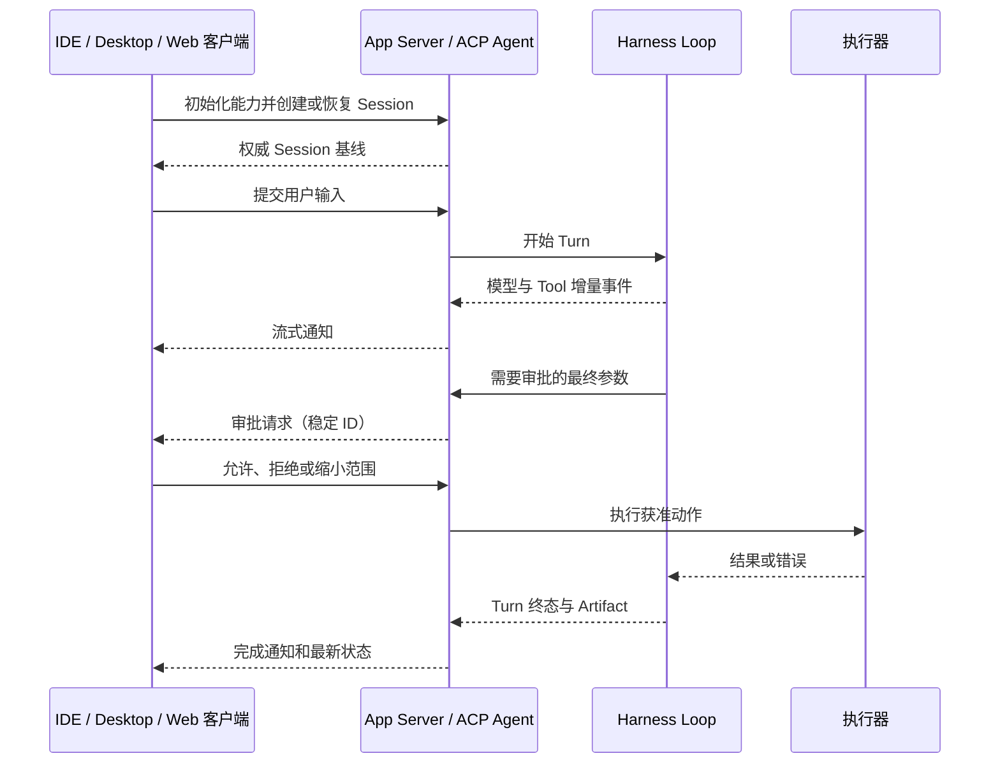

# 接口与 Human-in-the-loop

[统一参考架构已经把能力、协议与客户端分成三层](04_reference_architecture.md#能力协议与客户端同一工具为什么会有不同体验)：能力说明 Harness 能做什么，协议说明组件怎样交换请求、事件和决定，客户端则决定人或自动化程序怎样看到并控制这些能力。本章把这组三层关系进一步落到人机边界。读者即使没有看过前文，也可以先抓住一个问题：当 Agent 正在读文件、修改代码和运行测试时，用户究竟在什么位置拥有知情、选择、纠正和停止的权力？

仍以[序章定义的教学案例](00_index.md#一句话请求先要落到正确的工作区)为例：用户要求 Agent 定位并修复配置解析错误，运行相关测试，再解释修改。这个任务可以从终端里的对话开始，也可以从 IDE、桌面应用、网页或自动化流水线发起。界面变化的不只是排版。交互式客户端可以当场展示 diff、追问范围并等待批准；无界面执行只能依赖预先政策、结构化错误或远程审批；多个客户端同时观看一个 Session 时，还要决定哪份状态是权威、谁可以回答同一个请求，以及断线后怎样补齐遗漏。

Human-in-the-loop（人在回路，HITL）因此不是“每一步都问人”，也不是一个把自治打开或关闭的总开关。它是人在信息获取、判断方案、选择行动和实施后果等不同阶段拥有不同参与程度。自动化水平研究也强调，这些阶段可以分别分配给人或机器，而不是只在“全手动”和“全自动”之间二选一 [@parasuraman2000automation]。本章先比较入口形态，再解释非交互、协议、审批、模式和状态一致性，最后把七个固定版本放回同一人机边界上。

## CLI、TUI、IDE、Desktop、Web 与 API

本报告沿用[参考架构给出的客户端术语](04_reference_architecture.md#能力协议与客户端同一工具为什么会有不同体验)。命令行界面（Command-Line Interface，CLI）以参数、标准输入和标准输出组织调用；终端用户界面（Terminal User Interface，TUI）在终端中维持可更新的对话、状态栏和选择器；集成开发环境（Integrated Development Environment，IDE）把 Agent 与文件树、编辑器和 diff 审查连接起来；桌面应用（Desktop）拥有独立窗口、系统集成和后台服务；网页界面（Web）通过浏览器访问；应用程序接口（Application Programming Interface，API）与软件开发工具包（SDK）则让其他程序创建 Session、发送输入和读取结果。

这些入口应按三个问题比较，而不是按屏幕大小比较。第一，**展示契约**决定用户能看见什么：模型文本、工具参数、命令输出、diff、测试状态和最终 Artifact 是否区分。第二，**控制契约**决定用户能做什么：提交新输入、批准、拒绝、编辑提议、切换模式、改变模型或中断执行。第三，**状态契约**决定客户端怎样知道当前事实：依靠本地内存、读取持久 Session、订阅 Event，还是从服务端 Snapshot 重建。

表 20-1 说明不同入口的典型优势与遗漏。这里的“典型”不是强制实现；例如 CLI 也能输出 JSON，Web 也可能只展示只读分享页。真正重要的是产品把三类契约放在哪一层。

| 入口 | 主要优势 | 容易遗漏的边界 | 适合的人在回路位置 |
|---|---|---|---|
| CLI | 易组合、启动直接、参数和退出码清楚 | 长流程状态、并行进度和复杂 diff 难以持续呈现 | 发起任务、短确认、查看最终结果 |
| TUI | 在终端内保留连续对话、流式状态和选择器 | 受终端能力与单窗口注意力限制 | 逐步审批、模式切换、取消与恢复 |
| IDE | 直接关联文件、选区、诊断和原生 diff | 容易把编辑器可见范围误当成完整执行范围 | 编辑/接受 diff、限定 Workspace、核对诊断 |
| Desktop | 可整合多 Session、系统通知、凭据和后台服务 | 前端与后台进程可能具有不同生命周期 | 管理任务、审批、查看 Artifact 与历史 |
| Web | 便于远程访问和多设备查看 | 需要身份、断线重连和浏览器信任边界 | 远程审批、跨设备跟踪、团队可见性 |
| API / SDK | 可嵌入流水线和其他产品，输入输出可结构化 | 没有天然人类注意力和现场对话 | 预设政策、外部审批服务、机器判定与升级 |

*表 20-1　六类入口的展示、控制与状态侧重点。*

表 20-1 的含义是：同一个 Harness 可以在不同入口提供不同自动化水平。Aider 把核心循环集中在 CLI，并让 Streamlit GUI 复用同一个 Coder；Codex 用 TUI 直接交互，又以 App Server 支撑 IDE 和富客户端；OpenCode、Goose 和 DeepSeek Harness 更明显地把后台 Session/事件层与 Desktop 或 Web 分开。Pi 的小型核心则同时提供交互模式、单次输出、JSON 事件和 RPC。入口越多，越不能用“它们调用同一个模型”来代替状态与权限分析。

直接操纵（direct manipulation）传统强调对象与动作可见、操作增量而且效果及时可见，并让用户能快速修正 [@shneiderman1997directmanipulation]。映射到 Coding Agent，IDE diff、终端中的实时命令、可编辑计划和取消动作都在把不可见的代理行为重新变成可检查对象。这并不要求所有 Harness 都使用图形界面，而是要求界面选择与后果强度匹配。

## Headless 与非交互模式

无头模式（Headless Mode）指不依赖持续人类界面的执行路径；非交互模式（Non-interactive Mode）进一步表示当前进程不会在执行中弹出问题并等待键盘选择。两者经常同时出现，但不是同义词：一个后台服务可以没有窗口，却通过远程客户端等待审批；一个 CLI 也可以在终端中输出文本，但由于 stdin 不是 TTY 而禁止任何追问。

把 TUI 隐藏并不能自动得到可靠自动化。交互路径中的每个等待点都必须重新分类：可以由预设政策回答，可以转成结构化“需要批准”状态，可以安全拒绝，也可以升级给外部客户端。最危险的处理是保留不可见问题，使任务永久挂起；其次是为了避免挂起而默认为允许，使脚本获得比交互用户更大的能力。

固定版本体现了几种明确做法。Codex `exec` 默认不向用户发起审批，自动取消 MCP elicitation，也不支持 `request_user_input`，但仍把事件输出成人类文本或 JSONL，并让 Ctrl-C 进入 `turn/interrupt`。Gemini CLI 在 `-p` 或非 TTY 条件下进入 Headless，可输出单个 JSON 或包含 init、message、tool、error 与 result 的 JSONL 流；需要互动的工具会从非交互能力集合中移除。DeepSeek Harness 的 Headless profile 创建持久 Session，等待 Agent 完全静默并 flush 后才从耐久区间推导最终文本与结束原因。Goose Run 和 Pi Print/JSON 也把“持续对话”改为有界输入、结构化进度和退出状态。

> **设计取舍｜脚本应失败关闭，还是请求远程批准？**
>
> 对本地 CI 或一次性批处理，遇到未预授权的高副作用动作时直接失败，语义简单且不会无限等待；代价是任务需要重新运行。把审批请求发给远程客户端可以保留长任务进度，适合有人值守的平台；代价是 Session 必须持久保存等待状态、稳定请求 ID、超时和审查者身份。二者都优于把交互式默认答案偷偷搬进 Headless。

非交互模式还需要可机器判定的完成边界。最终回答文本不能单独表示成功；脚本至少要获得退出码、结束原因、已执行工具的终态和可定位 Artifact。对于配置修复任务，合理结果可以是“修改和相关测试已完成”，也可以是“需要批准一条命令”或“测试失败”；它不能因为模型输出了自然语言总结，就把后两种情况包装成成功。

## ACP、JSON-RPC 与应用服务器

Agent 客户端协议（Agent Client Protocol，ACP）是一种让编辑器或其他客户端用统一方法驱动 Agent 的协议形态；JSON-RPC 是以请求、响应和通知表达远程调用的消息约定；应用服务器（App Server）则是持有 Session、处理命令并向一个或多个客户端发送事件的运行组件。三者不在同一层：ACP 可以建立在 JSON-RPC 上，App Server 也可以使用自定义 JSON-RPC、HTTP/SSE、WebSocket 或二进制协议。正如[扩展章对 Client、Server 与双向能力的区分](09_plugins_mcp_and_extensions.md#mcp-transport-与双向能力)，采用某个传输并不会自动产生完整的人机语义。

协议必须承载的不只是 `prompt → response`。一个 Coding Agent 客户端通常还需要初始化能力、创建或恢复 Session、提交输入、接收模型与 Tool 的增量、回答权限请求、切换模式或模型、取消工作，并在断线后取得当前状态。若协议只转发最终文本，IDE 就无法区分“模型正在描述命令”和“命令已经执行”；若只转发实时 delta，晚加入客户端又无法知道旧审批是否仍待处理。

图 20-1 展示一个富客户端与应用服务器之间的最小双向关系。请求与通知采用何种具体字段不重要，关键是控制动作、状态事件和审批响应都与同一个 Session/Turn/Call 身份关联。

*图 20-1　概念图：富客户端通过应用服务器参与 Agent Turn。替代说明：客户端先取得 Session 基线，再消费增量；审批作为反向请求插入执行前，最终状态回到同一 Session；不表示七个固定版本都具有同名组件或全部转换。*

图 20-1 解释了几个真实实现的差异。Codex App Server 使用双向 JSON-RPC 风格消息，连接先初始化，再用 Thread、Turn、Item API 和通知流驱动任务，命令、文件和权限审批反向发给订阅客户端。Gemini CLI 与 Goose 都能作为 ACP Agent，由 IDE 或 Desktop 客户端发起 Session、设置 Mode、接收 Tool 更新并取消 prompt。DeepSeek Harness 的 ACP 桥明确只面向自动化：它提供一次性权限选择和取消，但不承载 Web 卡片布局。OpenCode 的共同边界不是 ACP，而是 HTTP API、SSE Event 和 PTY WebSocket。Pi 的实验 Session Server 更进一步采用带长度帧的 CBOR，并明确 Snapshot 是权威状态；这说明互操作目标相似，并不要求协议同构。

## 审批、编辑与中断

[Tool Call 章的规范化审批封装](08_tool_call_system.md#请求参数与-call-id)已经规定审批至少要关联调用、展示最终参数与资源范围、保存决定及作用域。本章从人的角度补充：一个好的审批交互不是一个脱离上下文的 Yes/No。用户需要知道将发生什么、为什么现在需要决定、允许一次还是长期允许、拒绝后任务会怎样继续，以及能否先编辑范围再批准。人机 AI 交互指南把及时反馈、能力边界、可纠正性和后果说明视为不同阶段的设计责任 [@amershi2019guidelines]。

编辑是比“同意模型提议”更强的控制。Gemini CLI Companion 允许用户在 IDE 原生 diff 中修改后再接受；Aider 可以先由 Architect 形成方案，再询问是否进入编辑；Web/Desktop 客户端可以把命令参数、目标文件或计划作为可审查对象。编辑后的内容必须重新进入策略检查，因为用户缩小路径与用户扩大命令产生的风险不同，原批准也不能自动覆盖改写后的动作。

中断至少有两层含义。运行时中断是停止正在生成或执行的工作，例如 Ctrl-C、AbortController、`turn/interrupt` 或 ACP cancel；注意力中断则是系统决定何时打断用户请求批准。HCI 对可中断性的研究关注后者：同一个通知在用户专注工作时和任务间隙出现，代价不同 [@fogarty2005interruptibility]。因此流式进度可以保持可见，却不应把每个状态变化都升级成抢占注意力的确认框；真正需要人的决策点才进入阻塞交互。至于进程是否已停止、子进程怎样清理和副作用能否撤销，属于运行时取消与可靠性问题，不能由“用户按了取消”推断。

> **安全提示｜批准的对象必须是最终动作，而不是友好摘要**
>
> 攻击或事故前提是模型受到仓库内容、工具结果或外部页面影响，生成了超出用户原意的路径、命令或网络目标。若界面只显示“运行测试”这类摘要，实际参数可能包含写文件、下载或上传。缓解方向是展示最终命令、工作目录、diff 和身份范围，把允许一次与持久规则分开，并让改写后的动作重新仲裁。批准证明的是审查者同意某个动作，不证明动作成功，也不替代沙箱。

混合主动（mixed-initiative）界面提供了一个更稳健的决策准则：系统与用户共享主动权，并按动作价值、代价和意图不确定性决定何时询问 [@horvitz1999mixedinitiative]。在配置修复任务中，读取已知 Workspace 内的配置文件通常可以自动继续；创建新文件、运行未知安装脚本或改变工作区之外的状态，则更适合停下来。这个准则不是固定风险表，而是说明审批应服务于不确定性和后果，而不是机械增加点击次数。

## 模式切换与流式反馈

模式（Mode）把一组权限、工具可见性、提示约束和交互预期绑定为当前 Session 的操作状态。Plan/Build、Default/Auto-edit/YOLO、smart/auto 等名称不能跨项目直接对齐；要比较的是切换后哪些动作可见、哪些需要批准、决定是否持久化，以及客户端怎样确认模式已经生效。

模式切换本身也是控制动作。Gemini CLI 的 Plan 模式限制写入，`exit_plan_mode` 要把最终计划交给用户正式批准，再切回执行模式；Codex 的协作模式在当前固定版本向 TUI 暴露 Default 与 Plan，并把有效模式随 Session 配置传递；Goose 的 ACP 把 GooseMode 映射成 SessionModeState；OpenCode 的 Agent/permission 组合和 DeepSeek Harness 的 Session 模式则通过各自服务与事件表达。无论名称如何，客户端都不应只在本地改变一个标签，而要等待 Harness 返回新的有效状态。

流式反馈（Streaming Feedback）是进行中状态的增量呈现。[Harness Loop 已经说明流式事件与持久状态不同](05_harness_loop.md#流式事件与并行-tool-call)：模型 token、工具参数片段和命令输出可以先到，完整 Item、Result 和 Turn 终态稍后才提交。界面应利用增量降低等待感，同时标出“进行中”“等待批准”“已完成”“已中断”等阶段，避免把半段响应当作完成事实。

流也必须尊重注意力层级。普通 token 不需要通知；长工具可以更新状态；需要用户决定的请求才抢占输入；最终失败和结果未知需要明确收尾。Aider 的 Markdown stream、Codex 的 Item delta、Gemini Headless 的 stream-json、Goose 的 stream-json/ACP update、OpenCode 的 SSE 和 Pi 的 Agent Event 都提供了增量材料，但客户端是否把它组织成可理解的阶段，仍是界面责任。

## 多客户端状态一致性

当 TUI、IDE、Desktop 或 Web 同时连接一个 Session，最直觉的做法是广播所有事件。然而广播只解决“尽量都收到”，不解决晚加入、断线、重复、乱序和竞争回答。可靠多客户端界面需要一份权威基线、一条可关联的增量流，以及对控制权的明确规则。

可以把一致性过程分成三步。连接时，客户端先取得 Session、活动 Turn、已提交 Item 和待处理交互的基线；运行中，再按序消费增量 Event；发生缺口或重连时，重新读取 Snapshot、事件游标或持久 Session，而不是根据屏幕上最后一行猜测。审批、问题和取消还需要稳定 ID，使多个客户端看到同一个请求，并让服务端只结算有效响应。

[Session 持久化状态机](12_session_persistence_and_resume.md#session-保存的任务边界)在这里成为界面基础。Codex App Server 为 Thread 维护订阅连接，并允许客户端重新 list/read；DeepSeek Web 在 WebSocket 打开时发送订阅基线并重放未决审批，稳定 approvalId 让重复帧幂等；OpenCode 用服务端 Session/Event 和 SSE 驱动 App 的同步缓存；Pi 的实验协议明确规定 Server/Session Snapshot 带 revision 且权威，progress 只作为瞬时提示。Goose ACP 也在 Session 建立时发送模式、模型和配置状态，再持续发更新。

> **设计取舍｜单一控制者还是共享观察者？**
>
> 单一控制者最容易定义审批、模式切换和取消的顺序，其他客户端只观察；代价是控制者离线时要转移所有权。允许多个客户端同时控制更灵活，却要处理重复审批、相互覆盖模式和交错输入。Pi 的 shared/exclusive lease 展示了显式所有权的一种做法；其他系统也可以在服务端用审查者身份、请求版本或先到有效响应实现。关键不是采用同一种锁，而是不要让每个前端把自己的本地状态当成全局真相。

多客户端一致性不是要求所有屏幕像素相同。一个 IDE 可以重点显示 diff，Web 重点显示 Session 列表，CLI 只打印命令输出；只要它们对“当前 Mode、活动 Turn、待审批请求、已提交结果和终态”得到一致解释。展示可以异构，控制和状态身份不能漂移。

## 七个系统的人机边界

表 20-2 按主要入口、自动化路径、人在回路位置和状态边界比较七个固定版本。它不按界面数量排名；Aider 的集中式编辑循环、Pi 的可编程小核心和 OpenCode 的客户端—服务器平台承担的产品目标不同。

| 系统 | 主要入口 | Headless / 协议路径 | 人在回路的主要位置 | 状态与多客户端边界 |
|---|---|---|---|---|
| **Aider** | 交互 CLI；Streamlit GUI | `--message` / message file 单次运行 | 文件准入、Shell、Architect 编辑、lint/test 修复、Ctrl-C | Coder 进程内集中状态；GUI 复用缓存 Coder，不是通用多客户端服务 |
| **Codex** | TUI；IDE/Desktop 经 App Server | `exec` 文本/JSONL；双向 App Server | 命令/patch/权限审批、Plan、用户输入、中断 | Thread/Turn/Item 与订阅连接；客户端按协议读写同一 Core Session |
| **DeepSeek Harness** | Web；可组合 Profile | 持久 Headless；automation-only ACP | Web 审批/问题/模式；ACP 一次性策略决定与取消 | HTTP 上行＋WebSocket 下行；订阅基线、序号和待交互重放 |
| **Gemini CLI** | TUI；IDE Companion | Headless JSON/JSONL；ACP stdio | Tool 确认、原生 diff 编辑、Plan、模式与取消 | 本地 CLI Session；ACP/IDE 以各自连接投影 Core 状态 |
| **Goose** | CLI、TUI、Desktop | Run text/json/stream-json；ACP stdio/HTTP/WebSocket | Tool permission、Mode/模型选择、取消、Desktop 审批 | SessionManager 为共同状态层；ACP SessionUpdate 驱动客户端 |
| **OpenCode** | TUI、Desktop/App、SDK | Run/Serve API；HTTP/SSE/WebSocket | Session 权限回复、编辑/终端、Agent/模型选择、中断 | Server 是权威边界；客户端用 API 基线＋Event 流同步 |
| **Pi** | 可扩展 TUI | Print、JSON、JSONL RPC；实验 CBOR Session Server | TUI 中断/选择；默认审批由扩展或宿主提供 | 本地 Session 树；实验远程层用 revision Snapshot 和 lease |

*表 20-2　七个 Harness 的接口路径与 Human-in-the-loop 边界。*

表 20-2 显示了三种架构重心。第一类是**进程内交互**：Aider 和 Pi 的默认 Coding Agent 把界面、循环和本地状态放得较近，扩展简单，但多客户端与统一审批需要宿主另建。第二类是**协议化富客户端**：Codex、Goose 和 Gemini CLI 通过 App Server 或 ACP 让 IDE/Desktop 参与 Session、模式、工具和审批。第三类是**服务端状态平台**：OpenCode 与 DeepSeek Web 让浏览器或桌面前端订阅后台状态，必须认真处理重连、待交互重放和访问控制。实际系统可以跨类，例如 Goose 同时有直接 CLI 与 ACP Desktop。

差异还体现在“人缺席时怎么办”。Codex Exec 和 Gemini Headless 主动删除或拒绝需要现场回答的能力；DeepSeek Headless 与 Goose Run 等待内部活动收敛并给出可判定终态；Pi 和 Aider 提供单次脚本入口，但默认权限与交互策略仍由参数或宿主决定；OpenCode Server 可以让远程客户端稍后回答，但必须保持 Session 等待状态。公平比较要问的是某入口如何处理人的缺席，而不是仅检查是否存在 `--yes`、`--yolo` 或 API。

### OpenCode：Server 是权威状态边界，客户端只是不同投影

OpenCode 的平台化问题是 TUI、Desktop、Web 或 SDK 同时操作任务时，谁保存 Session 的真实状态。若每个客户端只根据自己收到的流维护局部事实，断线、晚加入和重复审批都会让界面与执行器对当前 Turn 得出不同结论。

它把 SQLite 中的 Session、Message 与 Part 放在 Server 一侧，通过类型化 HTTP API 接受创建、更新、权限回复和中断；持久 Event 与全局事件总线经服务器发送事件（Server-Sent Events，SSE）更新客户端，伪终端（pseudo-terminal，PTY）另走 WebSocket。TUI、生成 SDK 和 Desktop 都通过 server client 工作，Desktop 可以启动本地 sidecar；Task Tool 创建的 child Session 也继续落在同一服务端状态边界内。

代价是 Server 本身成为需要保护和运维的控制面。访问控制、远端暴露、事件缺口、客户端缓存重建和多个控制者竞争都必须由协议处理；SSE 增量不能替代重新读取权威基线，sidecar 与远端 Server 也不共享同一部署风险。进程内 Plugin 仍继承宿主故障域，公共分享页面则只是只读投影，不能据此推断完整控制能力。

这条状态边界与[数据库 Session、Message 和 Part 的持久化](12_session_persistence_and_resume.md#七个系统的持久化路径)、[child Session 的 Task Tool](16_subagents_and_orchestration.md#七个系统的编排路径)、[Permission 与执行隔离的区别](17_security_permissions_and_sandboxing.md#七系统安全模型)以及[事件、Trace 与 Replay 边界](19_observability_evaluation_and_replay.md#logeventtrace-与-metric)共同组成完整平台视图。

### Goose：以 MCP Extension 和 ACP 把能力生态与客户端状态接在一起

Goose 的区分点不只是“支持 MCP”，而是怎样让外部能力生态与 CLI、Desktop 和 IDE 看到的 Session 状态连成同一条运行链。只列出 Tool 数量会遗漏权限询问、模型与模式状态、远端认证和在途调用都需要跨 Extension 与客户端边界协调。

Extension Manager 管理 MCP Client 及其 Tool、Resource、Prompt、工具列表变化和在途调用，也承接 sampling、roots 与用户交互等反向能力，并为本地或远端 Server 处理子进程、OAuth 和连接生命周期。另一侧，ACP 把同一 Agent 与 SessionManager 映射成 Session、Mode、模型选项、Tool 进度和权限请求，客户端的允许、拒绝、持续许可或取消再回到内部 Permission 与 CancellationToken。

这条连接的代价是能力服务和客户端协议各自增加一层失败与信任边界。远端 MCP 的身份、可用性和返回数据不由 ACP 保证，ACP 显示的权限状态也不能替代宿主沙箱；不同客户端对 GooseMode 的展示只是映射，不表示内部或跨产品模式同构。OAuth、工具热变化和未结算调用仍需要在 Session 结束、断线和恢复时重新确认。

能力侧可以接着阅读[MCP Transport、反向能力与 Extension 生命周期](09_plugins_mcp_and_extensions.md#mcp-transport-与双向能力)，状态侧可结合[Goose 的 Session 持久化与恢复](12_session_persistence_and_resume.md#七个系统的持久化路径)、[权限检查与宿主执行边界](17_security_permissions_and_sandboxing.md#七系统安全模型)以及[取消和后台资源收敛](21_reliability_and_resource_control.md#后台进程与资源清理)。

## 本章小结

本章的问题是：Agent Harness 怎样让人既不必微操每一步，又不会在关键后果发生时失去控制。答案首先是把接口拆成展示、控制与状态三个契约。CLI、TUI、IDE、Desktop、Web 和 API 只是不同承载；是否能可靠展示增量、表达审批与编辑、执行中断，并从权威 Session 重建事实，决定了它们实际提供的人机边界。

Headless 不是删掉界面，而是把所有等待点重新映射为政策、结构化状态、外部审批或明确拒绝。ACP、JSON-RPC、HTTP/SSE 和应用服务器可以把 Session、Event、Mode、Approval 与 Cancel 暴露给富客户端，但协议只提供通道，不能替代审批语义和状态所有权。模式切换要由 Harness 确认生效，流式进度要与已提交结果区分，多客户端则要以基线、序号或 revision 重建一致状态。

回到配置修复案例，合理的人在回路不是让用户批准每次读取，而是在系统对目标不确定、动作代价提高或需要最终审查时交还主动权：先让 Agent 自动定位，必要时审查命令和 diff，允许用户修改方案，持续显示测试进度，并保留可以中断、恢复和核对的 Session 与 Artifact。下一章将继续讨论这些控制动作在超时、重试、取消和资源耗尽下怎样可靠收敛。
