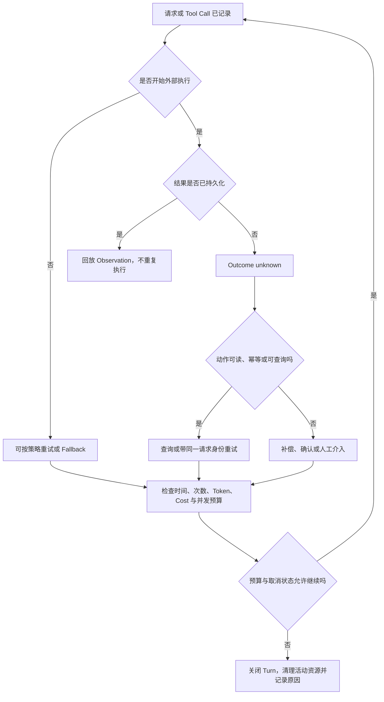

# 可靠性与资源控制

本章讨论一个很实际的问题：当 Agent 已经开始调用模型、运行命令和修改工作区后，系统怎样确保它不会因为一次断流就放弃，也不会因为不断重试而制造更大的故障？为了让从本章进入的读者能够独立阅读，可以先把 Harness 理解为夹在用户意图、模型、工具和外部环境之间的运行控制层；一次任务由 Session、Turn、Message、Event、Context、Tool、Policy 与 Artifact 等[八个核心对象](04_reference_architecture.md#八个核心对象一项任务由什么组成)共同承载。本章把错误分类、恢复动作和资源上限放入同一个故障模型，而不是分别把 retry、timeout 或 max turns 当成万能开关。

贯穿示例仍是[定位并修复配置解析错误，运行相关测试，并解释修改](00_index.md#一句话请求先要落到正确的工作区)。在这个任务里，Provider 可能在模型流式输出一半时断开，测试命令可能挂起，用户可能按下 Ctrl-C，后台测试服务器可能继续占用端口，重试还可能重复创建文件或外部资源。此前章节已经分别建立了 [Loop 的终止与取消边界](05_harness_loop.md#终止取消与防失控)、[Provider 路由与 Fallback](06_model_and_provider_abstraction.md#能力发现路由与-fallback)、[Tool-call 错误 envelope](08_tool_call_system.md#错误重试与并行调用)、[Session 与外部副作用的一致性](12_session_persistence_and_resume.md#tool-call-和外部副作用的一致性)，以及 [Token 账本](14_token_efficiency_and_cost_control.md#token-账本到底记录什么)。本章不重复这些定义，而是回答它们怎样在一次真实失败中协同工作。

## Harness 的 Failure Model

可靠性首先不是“尽量不报错”，而是明确什么在什么阶段出了问题。可靠性工程常区分故障（fault）、错误状态（error）和失效（failure）：fault 是导致问题的原因，error 是系统内部已经偏离正确状态的部分，failure 则是系统交付给外部的服务不再符合约定 [@avizienis2004dependability]。在 Harness 中，Provider 网络抖动可以是 fault，半条流和未知 Tool 状态是 error；只有当任务无法继续、给出错误答案或留下未管理的副作用时，才形成用户可见的 failure。

这一区分直接改变恢复动作。Provider 还没有接受请求时，重试通常只增加一次模型调用；Tool 已经开始但结果没有持久化时，同样的“重试”可能重复写文件、扣费或创建远端资源；用户取消后若子进程仍在运行，前台 Turn 已结束但资源 failure 仍在继续。因而一个可用的 Failure Model 至少要记录四件事：失败发生在哪个阶段，动作是否越过副作用边界，结果是否已经成为可回放的 Observation，以及当前还有哪些资源处于活动状态。

图 21-1 把这些信息组织成一条恢复决策链。图中的关键不是把所有错误归入同一种异常，而是在每个边界选择不同动作：尚未执行可以重试，执行结果未知需要核对，已记录结果应回放，无法收敛的活动资源必须清理。

*图 21-1　概念图：从已记录请求、外部执行和结果持久化状态到重试、核对、补偿与资源清理的恢复决策链；不表示七个固定版本都具有同名组件或全部转换。*

> **学术背景｜从故障原因到用户可见失效**
>
> Dependability taxonomy 的价值在于分开原因、内部状态与服务后果，而不是为每个异常起一个新名字 [@avizienis2004dependability]。映射到 Harness 后，重试、超时、取消、持久化和资源清理分别作用于不同层；它们是容错手段，不会让 fault 消失，也不能单独证明任务可靠。

## Retry、Backoff 与 Fallback

重试（retry）是重复同一个逻辑尝试，退避（backoff）决定下一次何时发生，Fallback 则改走另一条路径。三者经常同时出现，却不能混称。固定版本中，Aider、Codex、DeepSeek Harness、Gemini CLI、Goose、OpenCode 和 Pi 都能在某些 Provider 错误上重试，但分类、等待和预算不同；Codex 还会把不健康的 WebSocket 传输降级到 HTTP，Gemini CLI 可以依据模型可用性选择候选模型，OpenCode 则有实验性原生运行时（runtime）回到 AI SDK 的 fallback。这些路径改变的层次不同，因此恢复后的能力、费用和消息形状也不同。

最危险的直觉是“失败就立即再试”。多个客户端遇到 429 或服务端过载后同步重发，会把短暂拥塞变成重试风暴。封顶指数退避加抖动（jitter）通过拉开重试时刻降低相关突发；同时应尊重合法的 Retry-After，但对异常长等待设置上限 [@brooker2015backoff]。Goose、OpenCode、Pi 和 DeepSeek Harness 的固定版本都能看到封顶退避或 jitter 机制；Aider 使用倍增延迟和总等待上限，但没有在这一层显式加入 jitter。这里的差异不是排名，而是说明部署规模越大，重试同步化越值得单独治理。

重试还必须有明确对象。模型流在尚未产生可消费输出时断开，通常可以重建请求；已经向用户显示部分文本或并行启动 Tool 后，重放整个响应可能产生重复事件。尾延迟研究也提醒我们，对冲请求（hedged request）与失败后重试并不相同：前者在主请求仍运行时启动备份，并取消较慢副本；它适合幂等读路径，不能直接套到有副作用的 Tool [@dean2013tail]。Harness 的默认策略应更保守：先判断当前 attempt 有没有越过动作边界，再决定重试同一路径、切换传输或模型，还是把失败交还用户。

> **设计取舍｜Fallback 保持连续性，也会改变任务语义**
>
> 传输 fallback 往往保留同一个模型和请求语义；模型 fallback 可能改变上下文窗口、Tool 支持、推理能力和计费；runtime fallback 还可能改变流事件和错误分类。高自治模式可以在等价路径间自动切换，但当候选能力不同或副作用风险上升时，询问用户比“继续就好”更可靠。

## Timeout、Cancel 与 Interrupt

超时（timeout）为等待设置截止点，取消（cancel）请求正在进行的工作停止，中断（interrupt）是用户或上层控制面触发取消的入口。超时并不会自动杀掉任务，Cancel 也不保证外部动作已经撤销。真正的取消收敛要完成三件事：停止派发新工作，把已启动工作带到可观察终态，并为没有结果的调用补齐错误或中断记录。[第 05 章的取消不变量](05_harness_loop.md#终止取消与防失控)描述了 Loop 层要求；本章关注它如何继续下沉到网络、Tool 和进程。

七个系统展示了两类执行方式。DeepSeek Harness 的 Tool timeout 是合作式截止期限（deadline）：Tool 只有声明预算并遵守 AbortSignal 才会停止，包装器（wrapper）会等它结算后返回结构化 `TOOL_TIMEOUT`，不会因为计时器到点就把未完成异步任务丢在后台。Codex、Gemini CLI、Goose、OpenCode 和 Pi 也把取消 token 或 signal 传给模型流和工具；其中 Gemini CLI、Goose、OpenCode 与 Pi 的 Shell 路径还会在超时或取消时终止进程或进程组。合作式取消保留清理机会，硬终止能处理不合作进程；可靠实现通常先请求合作式退出，再经过宽限期（grace period）升级为强制终止。

在教学案例中，如果测试命令到达超时，Harness 应先标记“测试未完成”，终止测试进程树，保存已产生的有限输出，并让 Loop 决定是否以更长预算重试。它不应把 timeout 翻译成“测试失败”，因为二者对应不同事实；也不应直接再次运行写操作，因为上一次可能已经修改了缓存、数据库或远端服务。取消原因进入 Session 后，Resume 才能知道上一轮是 interrupted，而不是误把缺失的结果当作成功。

> **安全提示｜超时保护可用性，不提供回滚**
>
> 攻击者若能让工具忽略取消、持续派生子进程或在被终止前发送网络副作用，单个 timeout 只能缩短前台等待。缓解需要进程树所有权、网络与文件权限边界、输出上限、后台 Job 登记和副作用审计共同生效；不能把“有 timeout 参数”写成资源已经被隔离。

## 幂等性与外部副作用

幂等性（idempotence）指同一逻辑操作执行多次，最终效果与执行一次相同。Provider 与 Tool 的 retry 通常只能提供至少一次（at-least-once）尝试：超时表示调用方没有及时得到结果，不表示对端没有执行。要让至少一次可接受，系统需要自然幂等操作，或使用请求 ID、业务键和去重记录把重复尝试合并 [@helland2012idempotence]。

读取配置、查询 Git 状态通常可以安全重试；向同一路径写入确定内容有时近似幂等，但若写入依赖旧状态，重复应用 patch 就未必相同；启动服务器、发送消息、创建云资源和触发付费任务更不能默认重试。Tool-call envelope 中的 Call ID 只能关联请求和结果，不能凭空让外部服务去重。Harness 需要进一步知道 Tool 是只读、自然幂等、带外部幂等键、可查询，还是必须补偿。

对不可原子提交的长事务，补偿（compensation）是一种语义修正：已经创建临时分支，可以删除分支；已经启动服务，可以关闭服务；已经写入文件，可以用已知快照恢复。Saga 的经典思想正是把长事务拆成子事务，并为已提交步骤定义补偿；补偿不是把整个世界物理恢复到原字节状态，而且补偿本身也可能失败 [@garciamolina1987sagas]。因此“undo”应被描述为覆盖特定资源的补偿能力，而不是任务级事务。

[第 12 章的副作用状态机](12_session_persistence_and_resume.md#tool-call-和外部副作用的一致性)给出了恢复时最关键的三类状态：调用未启动、结果未知、结果已记录。本章据此加上一条运行原则：只有未启动可以直接重新调度；结果已记录应回放 Observation；结果未知必须先查询、核对、补偿或征求用户。内部 checkpoint 无法收回已经发往外部系统的输出 [@elnozahy2002rollback]。

## 后台进程与资源清理

后台进程把“一次 Tool 调用”的生命周期延长到了 Turn 之外。服务器、watcher、Subagent、MCP Server 和长测试任务可能在前台返回后继续使用端口、CPU、内存、凭据和文件句柄。如果 Harness 只保存一段 stdout，却没有资源身份和所有者，就无法判断谁应在 Session 结束、用户取消或进程崩溃时关闭它。

一个可清理的后台资源至少需要稳定 ID、所属 Session/Task、启动时间、当前状态、输出收集位置、取消句柄和终止升级策略。OpenCode 的 BackgroundJob registry 会按 sessionId 和 parentSessionId 收敛后台子树；DeepSeek Harness 的后台 Subagent 通过 Job id 提供输出与 kill，并在 provider dispose 中执行有界 shutdown 和进程树终止；Gemini CLI 的 Shell 使用独立进程组；Goose 的 Shell 在取消或超时后 kill 并等待。Pi 的固定版本存在两条不同路径：新 durable harness 的 NodeJS environment 维护活动 PID 集合并在 cleanup 中兜底终止进程树，默认 Coding Agent Shell 则沿 Bash 工具自己的 timeout/abort kill 路径收敛，不能把前者的清理保证写成后者的默认行为。Codex 也把统一 exec 和协作线程纳入 Session 所有权。Aider 的主路径更接近单进程编辑循环，局部清理 spinner 和临时目录，因此不应强行要求它具备相同 Job 控制面。

清理的完成条件不是“已经发送 kill”，而是资源已退出或被明确标记为外部接管。强制等待无限期会让取消本身卡死；立即遗忘又会产生孤儿资源（orphan）。实践中常用分级策略：先通知停止并给宽限期，再关闭 stdin 或协议连接，随后终止进程组，最终记录仍未收敛的资源，供用户或下次启动检查。输出收集也需要截止期限，否则进程已退出而 reader 仍等待管道 EOF，Session 仍无法进入 idle。

表 21-1 总结了后台资源控制的最小记录。它不是要求所有系统使用相同数据库，而是说明缺少任一列会损害可恢复性。

| 字段 | 回答的问题 | 缺失时的风险 |
|---|---|---|
| 资源 ID 与类型 | 正在控制哪个进程、Job 或远端任务 | 无法精确取消或查询 |
| Owner 与 lineage | 哪个 Session、Turn 或父任务负责它 | 父任务结束后留下 orphan |
| 状态与最终原因 | 是 running、completed、cancelled 还是 unknown | Resume 误判完成 |
| 输出与结果位置 | 已产生的信息在哪里 | 重试时丢失诊断或重复工作 |
| Cancel/kill handle | 怎样请求合作式停止与强制终止 | 只能提示用户手工清理 |
| Deadline 与 grace | 等多久、何时升级 | 永久等待或过早强杀 |

## Loop、Token、Cost 与并发预算

可靠性预算不是一个数字。Loop steps 限制模型—工具往返次数；attempt budget 限制同一请求重试；wall-clock deadline 限制用户等待；Token 和 Cost budget 限制上下文、输出和付费；并发 budget 限制同时运行的 Tool、Agent 和进程。任何一个维度失控，都可能把原本可恢复的 Provider 故障放大为成本或可用性 failure。

[Token 账本](14_token_efficiency_and_cost_control.md#token-账本到底记录什么)已经区分 input、output、reasoning、cache read 和 cache write。本章增加的是失败记账：失败的请求、被取消的流、重试等待和子 Agent 消耗也属于任务成本，不能只统计最后一次成功响应。类似地，达到 max turns 不应显示为普通“完成”；并发槽耗尽不应通过不断 spawn 来解决；context overflow 不应被普通 retry 吞掉。预算耗尽必须成为一等终态或审批点。

七个系统的预算入口并不对称。Gemini CLI 和 Goose 有明确最大 Turn；OpenCode 的 Agent 可以限制 steps，并有 retry 次数与后台 Job 生命周期；DeepSeek Harness 限制并行 Tool 数并把 retry 写入 Session；Codex 限制 Session 并发线程和后台终端时长；Pi 允许全局或 Tool 级顺序屏障；Aider 用 token 检查、有限反思与 Provider 总等待约束编辑循环。由于产品定位不同，比较重点应是“预算是否在正确层阻止资源放大，并把原因暴露给用户”，而不是哪个默认数更大。

一个实用的预算顺序是先检查取消，再检查剩余时间和副作用风险，然后才消耗新的 attempt、Token 和并发槽。这样用户中断不会排在长 backoff 之后，已经没有完成可能的请求也不会继续花费，非幂等 Tool 不会因为还有 retry 次数就自动重做。预算还应保留一小段清理余量；如果所有墙钟时间都交给主工作，timeout 到达时就没有时间关闭进程和写入最终状态。

## 崩溃与 Provider 故障

Provider 故障通常发生在 Harness 仍然活着的时候，因此可以分类、等待、切换和提示；进程崩溃则会同时丢失内存中的取消 token、在途 Tool future 和资源 registry。两者的共同难题是“最后一个已提交事实是什么”。持久执行系统通过事件历史重放已完成步骤，并跳过已经记录结果的外部活动；这是一种适合分析 Harness Resume 的类比，不表示七个系统直接实现 Durable Functions 或 Temporal [@burckhardt2021durablefunctions; @temporal2026durableexecution]。

固定版本中，DeepSeek Harness 对这一边界表达得最直接：副作用前可以设置持久化屏障，冷恢复修复 torn tail，并把悬空 Tool 分成未启动和结果未知。Codex 为中断或 Fork 的半个 Turn 追加中止边界；Gemini CLI、OpenCode、Goose 和 Pi 各自保存会话、工具状态或工作区快照；Aider 则以聊天历史、Git 与编辑事务提供更有限的恢复材料。它们都说明一个共同事实：恢复材料的范围决定可恢复性，保存对话并不等于保存进程，保存 Git 快照也不等于撤销网络副作用。

Provider failure 的处理还要避免掩盖根因。认证失败需要刷新或用户修复凭据；Context overflow 需要压缩或换模型窗口；429/5xx 可能适合退避；流式连接失败可能适合传输 fallback；配额耗尽则常需要等待、换账户策略或显式模型选择。把所有错误都投入同一个 retry loop，会让永久错误消耗预算，并让最终日志只剩“重试次数耗尽”。可靠 Harness 应保留第一次故障、每次恢复决策和最终停止原因。

## 七个系统比较

表 21-2 按恢复层次比较固定版本。表中的“主要边界”说明当前证据支持到哪里，不代表该项目缺少价值，也不把未统一运行验证的机制写成产品保证。

| Harness | Provider 故障处理 | Cancel / Timeout 收敛 | 后台与进程资源 | 预算与恢复边界 |
|---|---|---|---|---|
| Aider | LiteLLM 异常分类，倍增延迟至总等待上限 | 当前发送捕获 Ctrl-C，二次中断退出 | 局部线程与临时目录清理；主路径不是 Job 平台 | token 检查、有限反思；恢复以聊天/Git 编辑路径为主 |
| Codex | 有界流重试；WebSocket 可降级 HTTP | Session 取消活动 Turn/工具并记录中断边界 | 统一 exec、后台终端与协作线程受 Session 所有 | 并发线程、终端时长、Token/compaction 配置；外部 Tool 仍需合作 |
| DeepSeek Harness | Provider policy、Retry-After、封顶指数＋jitter，重试计划持久化 | Tool deadline 合作式收敛；未分发调用补结果 | Job registry；Subagent 有界 shutdown 与进程树 dispose | 并行 Tool、retry 与 checkpoint 可组合；效果取决于 bundle/profile |
| Gemini CLI | 连接重试、sticky retry、模型健康与候选链 fallback | Scheduler 将 queued/running 调用转成 cancelled 并保留部分输出 | Shell 独立进程组并在取消/超时时终止 | 最大 Turn、路由与 Tool 状态；真实 quota 故障未运行验证 |
| Goose | Provider retry 默认有界，指数＋jitter，可读 retry delay | CancellationToken 贯穿 Agent、Extension 与 Shell | Shell kill 后 wait，并有限 drain 输出 | max turns、Tool 流与可选状态机；远端 MCP 取决于 server |
| OpenCode | Session retry 最多五次并尊重 Retry-After；原生 route 另有 retry | 取消 Runner、后台 Job 子树，Processor 补 interrupted Tool 状态 | BackgroundJob registry；Shell 分级 kill | Agent steps、retry、timeout 与后台生命周期；后台 subagent 有实验性限制 |
| Pi | 可取消 Provider retry，限制过长 Retry-After | AgentLoop 在 preflight/执行/finalize 检查 AbortSignal | 新 durable harness 的 NodeJS env 可登记并清理进程树；默认 Coding Agent Shell 另有 timeout/abort kill 路径 | Tool 顺序/并行策略、模型 Token 元数据；新 durable harness API 尚未全部可用 |

从表中可以看到，可靠性不是某个独立模块，而是 Provider、Loop、Tool、Session 和进程管理共同形成的闭环。平台型系统更常提供 Job registry、并发槽与多入口取消；专注编辑事务的 Aider 用更小的控制面换取简单路径。组合式 DeepSeek Harness 能把 policy 分层插入，但部署者也必须确认插件是否实际装配；Pi 同时包含成熟的小型 AgentLoop 与仍在演进的 durable harness 接口，不能把两者合并成同一默认承诺。公平比较应围绕系统要控制的资源和自治范围，而不是要求所有项目实现相同控制平面。

## 本章小结

本章的核心答案是：Harness 只有在失败分类、恢复动作和资源所有权形成闭环时，才具有工程上的可靠性。重试要面向可重试错误并受次数、时间和成本约束；backoff 与 jitter 防止故障放大；fallback 必须说明改变的是传输、runtime 还是模型；timeout 只是 deadline，cancel 只有在停止派发、结算在途工作和清理资源后才收敛；外部副作用则需要幂等身份、查询、补偿或人工确认。

对教学案例而言，可靠完成并不是“最终生成了一个解释”，而是配置修复、测试状态、Provider 恢复决策、被取消的命令、后台进程和成本都能被追踪，任务中断后也不会把结果未知当作未执行。下一章将把视角移到配置、身份与供应链：这些可靠性策略由谁配置、凭据代表谁、扩展和更新又从哪里进入系统。
