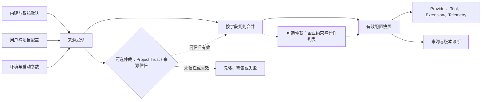

# 配置、身份与供应链

[统一参考架构的八个核心对象](04_reference_architecture.md#八个核心对象一项任务由什么组成)解释了一个任务怎样由 Session、Turn、Message、Event、Item、Context、Memory 与 Artifact 保持连续，但这些对象不会自行决定系统应装入哪个 Provider、允许哪些 Tool、信任哪份项目规则，或把数据发送到哪里。真正把“可选机制”变成“本次运行事实”的，是配置；真正说明“谁以什么来源发起调用”的，是身份与来源谱系；真正决定代码、插件和依赖从哪里进入机器的，是供应链（software supply chain）。三者如果分开看，系统会出现一种危险错觉：配置文件解析成功、用户已经登录、扩展也能启动，于是整个运行就可信了。

仍以[序章的配置解析错误案例](00_index.md#一句话请求先要落到正确的工作区)为教学案例。用户要求 Agent 定位并修复错误，恰好暴露了本章的核心矛盾：报错可能来自项目配置覆盖用户默认值，也可能来自环境变量压过文件；测试调用可能使用[第 06 章定义的 Provider 凭据（Provider Credential）](06_model_and_provider_abstraction.md#token速率限制与认证)，也就是授权模型服务请求的秘密或令牌，却由 IDE、CLI 或 Subagent 发起；修复流程还可能装入[第 09 章区分的 Plugin、MCP 与 Skill](09_plugins_mcp_and_extensions.md#pluginextensionmcpskill-与-hook)。要解释最后为何执行了某个动作，不能只看最终值，而要回答四个连续问题：值来自哪里，谁有权覆盖，哪种身份授权了外部调用，以及运行代码经过了怎样的获取、验证与更新路径。

## 配置层级与覆盖规则

配置（configuration）不是一份静态文件，而是把默认值、系统政策、用户偏好、项目约定、环境变量和本次启动参数组合成有效运行状态的过程。最直觉的规则是“后读取的值覆盖先读取的值”，但它只适合解释标量。真实 Harness 还要决定对象是否深合并、数组是拼接还是替换、同名 Plugin 是否去重、项目层是否在信任前可见，以及企业层表达的是一个更高优先级偏好，还是用户根本不能突破的约束。

因此，本章把配置层级拆成三个动作。**发现**回答有哪些候选来源；**合并**回答它们怎样形成一个值；**约束**回答即使用户或项目写了另一个值，系统是否允许它生效。Codex 的配置栈会保留层来源、逐层版本与逐键 winning origin，并把 EnterpriseManaged、User、Project、SessionFlags 和 MDM 等来源放在显式优先级中。Gemini CLI 则把 system-defaults 放在用户与项目之下，把 system settings 放在它们之上，使管理员既能提供可覆盖默认，也能给出不可被普通层覆盖的系统值。DeepSeek Harness 的 Profile 更接近“有序插件图”：bundle 先贡献完整 entry，profile、Harness-home 与命令行 patch 再依次修改；其中对命中 entry 的 config 是整项替换，不是深合并。

图 22-1 展示一条配置求值概念链。它强调有效配置不是原始文件集合，而是经过解析、合并以及可选的 Project Trust 和企业约束仲裁后的快照；同时保留来源信息，才能在错误发生时反向解释。

*图 22-1　概念图：从配置来源到有效运行状态的求值链，虚线表示可选的 Project Trust 与企业约束仲裁层；不表示七个固定版本都具有同名组件或全部转换。*

图 22-1 中最容易被省略的是右下角的诊断分支。若系统只保存最终值，用户看到 `model = X`，却不知道它来自项目、环境还是管理员下发；看到某个 Skill 被禁用，也不知道是名称冲突、Project Trust，还是企业 allowlist。配置来源谱系（configuration provenance）因此不是调试装饰，而是解释当前能力表面、恢复旧 Session 和审计政策执行的基础。[第 12 章的 Session 环境绑定](12_session_persistence_and_resume.md#session-保存的任务边界)已经说明恢复时要保存模型、Provider、扩展与权限模式；本章进一步补充：保存旧值仍不够，Resume 时必须重新求值当前来源，并把差异显示为环境变化。

> **设计取舍｜覆盖还是约束？**
>
> 把管理员设置实现为“最后一个配置文件”简单且兼容现有 Loader，但用户仍可能通过另一条未纳入合并链的环境变量或命令行入口绕开它。约束层则先描述允许集合，再验证最终配置是否落在集合内，适合登录方法、扩展来源、Telemetry 出口和沙箱模式。代价是实现要保留来源、错误归属与可解释拒绝，不能只返回一个合并后的对象。

## 用户、项目与企业配置

用户配置解决跨项目偏好，例如默认模型、主题、输出风格和常用 Provider；项目配置解决仓库特定事实，例如测试命令、局部 Skill、MCP Server 和工具政策；企业配置解决组织范围的强制要求，例如只允许某种登录、禁止公共 Extension、固定 Telemetry collector 或要求特定审批模式。三者都可能写“配置”，却处在不同信任边界。项目作者可以控制仓库内容，但不应因此获得用户账号或企业策略的同等权威。

[第 11 章的项目定制边界](11_skills_prompts_commands_and_hooks.md#prompt-template-与项目定制)已经说明，仓库中的 Command、Prompt 与 Hook 可能影响 Context 或触发执行。本章回收那个结论：项目配置是否进入 Loader，本身必须是一个可见的信任决定。Pi 在互动启动时检测 `.pi/settings.json`、项目资源和项目包；没有已保存决定时询问用户，非交互模式按全局 `defaultProjectTrust` 处理。Gemini CLI 的 Folder Trust 也把项目 Command、Hook 与设置加载置于工作区信任之后。Aider 的 `.aider.conf.yml` 和 `.env` 则直接按 home、Git root、cwd 顺序加载，固定版本中未识别同型的统一项目信任闸门；这使其配置模型更直接，也要求用户更谨慎地对待进入陌生仓库后的启动目录和环境文件。

企业层不能只追求“更高优先级”，还要追求**完整仲裁**：每次敏感决定都经过同一个政策入口，而不是只有 UI 尊重政策、环境变量或 headless 路径仍可绕开。最小权限、失败安全默认和完整仲裁是经典保护原则 [@saltzer1975protection]。映射到 Harness，管理员可以分别控制登录方法、Credential 存储、MCP/Plugin 来源、永久批准、网络出口、反馈与更新检查；默认拒绝未知来源，再由明确 allowlist 打开。Codex 的 requirements 层已经把这些要求建模为带来源的约束；Gemini CLI 和 OpenCode 也提供 system/managed 配置入口。Aider、Goose、Pi 与 DeepSeek Harness 的固定版本更偏本机或部署者装配，企业集中管理更多依赖系统配置、发行包装或外部运维，而不是统一云策略面。

## Agent Identity 与调用来源

Agent 身份（Agent Identity）是对一个 Agent 运行工作负载的可验证或可关联标识；调用来源（call provenance）则说明一次 Session、Turn 或 Tool Call 是由 CLI、IDE、Desktop、API、父 Agent、Subagent、Plugin 或自动化任务中的哪一条路径发起。它们都不同于“当前登录用户”。用户身份回答账户、租户和计费归属；Agent Identity 回答哪个运行实例或任务代表该账户行动；调用来源回答请求经过了什么客户端与委派链；Provider Credential 只回答远端服务是否接受本次认证。

表 22-1 用同一请求区分四种身份。这个区分对安全和调试都重要：一个请求携带有效 API key，不表示它来自用户正在看的终端；一个带 `User-Agent` 的请求能说明产品版本，却不能证明运行实例未被伪造；一个 Subagent 沿父 Session 继承权限，也需要保留父子 lineage，才能把成本和副作用归回原任务。

| 身份层 | 回答的问题 | 典型载体 | 不能单独证明 |
|---|---|---|---|
| 用户/组织身份 | 谁拥有账户、租户与策略 | OAuth subject、account id、workspace | 哪个 Agent 实例发起动作 |
| Agent Identity | 哪个运行工作负载代表用户行动 | runtime id、任务 id、公私钥或短期声明 | 调用经过哪个客户端与插件 |
| 调用来源谱系 | 从哪个表面和委派链到达 | session source、originator、client/version、parent id | 已获得 Provider 授权 |
| Provider Credential | 远端 API 为什么接受请求 | API key、OAuth token、云工作负载凭据 | 请求意图、代码来源与用户知情 |

*表 22-1　用户身份、Agent Identity、调用来源与 Provider Credential 的责任边界。*

表 22-1 解释了为什么本章不把“身份”缩成登录章节。Codex 的固定版本同时保留 `originator`、`SessionSource`、App Server client name/version，并在受管理 ChatGPT 路径中注册包含 runtime 与 task 绑定的 Agent Identity；Subagent 还能以专门 SessionSource 保留 lineage。OpenCode、Pi 与 Goose 更常通过产品 User-Agent、Session、Recipe/Agent 名称或资源 SourceInfo 表达来源；这些字段适合诊断和 Telemetry 关联，却不应写成加密认证身份。公平的比较问题不是“谁有最多身份字段”，而是高风险调用能否同时回答账户、运行实例、客户端入口和委派关系。

## Provider Credential

[第 06 章的认证装配](06_model_and_provider_abstraction.md#token速率限制与认证)已经区分 API key、OAuth、云身份和外部命令。本章关注 Credential 在配置系统中的位置：配置应尽量保存**引用和选择**，Credential Store 保存**秘密值**，Provider 在操作边界解析有效凭据，Tool 与 Extension 只得到完成职责所需的最小视图。这种分离使用户可以共享配置而不共享密钥，也使轮换密钥不必重写项目文件。

DeepSeek Harness 把这条边界表达得最直接：Provider config 保存环境变量形状的引用，每次模型请求前重新 `resolve`；本地 Credential Provider 按 inherited environment、受管理 `.credentials.yaml`、project `.env`、user `.env` 求值。若只读环境变量遮蔽文件值，写入会失败，而不是表面成功、实际继续使用旧值。Codex、Gemini CLI、Goose、OpenCode 与 Pi 也都把 OAuth/API key 放进独立 Auth/Credential 组件，文件降级通常采用 owner-only 权限，部分系统优先系统 keychain。

文件权限仍不是 Credential Isolation。DeepSeek Harness 的文档明确指出，同一用户身份运行的 Shell 或文件工具仍可能读取 `.credentials.yaml`；`0600` 主要隔离其他操作系统用户。类似地，把 token 放进环境变量方便子进程继承，也扩大了 Extension、Hook 和命令的可见面。真正的隔离需要让 Tool 进程拿不到秘密，只由 Provider 代理在请求时附加；若 MCP Server 自己需要 OAuth，则应使用独立 token store 和目标 Server 作用域，而不是复用主模型 Credential。后续安全分析会继续沿“模型、Tool、Extension 与 Credential Store 是否处在同一进程和同一用户权限”判断隔离强度。

> **安全提示｜Credential 引用也可能泄露边界信息**
>
> 攻击前提是项目配置、Plugin 或错误输出可被攻击者控制。即使配置只写 `apiKeyEnv`，攻击者仍能据此知道应尝试读取哪个环境变量；若系统把“是否已配置、来自哪个文件、账号邮箱”完整送入模型，侧信道会进一步扩大。缓解方向是只向 UI 暴露必要状态，向模型隐藏 Credential 路径与值，在 Provider 边界注入认证，并对日志、Crash Report 和 debug bundle 做独立脱敏。

## Plugin、MCP 与 Skill 来源

[第 09 章建立的五分类](09_plugins_mcp_and_extensions.md#pluginextensionmcpskill-与-hook)解决了 Plugin、Extension、MCP、Skill 与 Hook 分别改变哪一层；该章把扩展供应链的深入分析留到这里。本章的关键补充是：安装对象的身份不能只由显示名称决定。至少要保留来源 URI 或包名、版本或 commit、安装 scope、manifest 摘要、依赖闭包，以及当前激活贡献。一个名为 `deploy` 的 Skill 若从项目目录覆盖用户版本，和一个由企业 Plugin 打包、固定 commit 的同名 Skill，不是同一个制品。

Skill 看似只是 Markdown，也已经是可分发的过程性制品：它可以携带脚本、参考材料和资产，并指导模型调用执行能力 [@anthropic2025agentskills]。MCP Server 可能是远端 URL，也可能通过 `npx`、`uvx` 或本地命令在安装/首次运行时解析包。Plugin 更可能直接在宿主进程运行代码。来源越靠近文本，风险不一定越低；区别只在传播路径：恶意 Skill 先影响 Context，恶意 MCP 直接提供 Tool，恶意进程内 Plugin 则可以修改注册表和生命周期。

七个系统形成几类治理方法。Gemini CLI 安装 Extension 时保留 Git、GitHub Release、本地或 link 元数据，展示 MCP、Hook 与 Skill 贡献并请求同意；企业设置还能禁止 Git 来源或使用正则 allowlist。其本地完整性 HMAC 用于发现 install metadata 被修改，不能证明远端发布者身份。Pi Package 接受 npm、Git 和本地路径，可固定精确 npm version 或 Git ref，并把资源标成 user、project 或 temporary；项目包只有在 Project Trust 后才自动补装。DeepSeek Harness 用 profile `package.json` 和 pnpm 管理外部 bundle；Goose 对可识别的 `npx`/`uvx` 包查询 OSV 恶意 advisory，但未知命令明确跳过检查。Codex 通过 Plugin manifest、Marketplace 与 requirements 表达来源和允许范围；OpenCode 则在合并配置时保留 winning Plugin origin/scope，再通过包管理器或本地文件装入。

## Telemetry 与企业策略

Telemetry 配置决定哪些运行事实可以离开本地边界、发往哪里、是否包含内容，以及管理员能否统一约束。[第 14 章的 Token 账本](14_token_efficiency_and_cost_control.md#token-账本到底记录什么)关注 input、output、cache 与 cost 指标；本章关注的是这些指标及其关联元数据怎样被采集。最小配置至少要分开 enabled、destination、content capture、identity attributes、retention/queue 与 failure policy。只提供一个 `telemetry=true` 开关，会把“记录匿名版本号”和“上传 Prompt、文件内容、Tool 参数”混成同一授权。

固定版本中的默认值差异很大。Aider 分析要求用户同意，并支持永久禁用、本地审计日志或自定义 PostHog；Goose 产品 Telemetry 也在未选择时关闭，而 GenAI OTel 的消息与 Tool 内容需要单独环境变量显式开启。DeepSeek Harness 的 OTel backend 默认 `DISABLED`，还把 `FULL`、`FEEDBACK_ONLY` 和 `DISABLED` 作为部署可披露政策；值得注意的是，它的 Telemetry seam 本身不提供默认脱敏规则，上传部署必须另装 redaction waterfall。Gemini CLI 的 OTel `enabled` 默认 false，但启用后 `logPrompts` 的默认配置需要管理员明确审查。OpenCode 的 AI SDK span 要求实验开关和 OTLP endpoint，Desktop Crashpad 固定为本地、不上传。Codex 则允许企业 requirements 约束反馈、更新和出口，并把 Session source/originator 纳入关联元数据。

企业策略的重点不是统一要求“全部开启”或“全部关闭”，而是把数据类别与用途绑定。例如可以允许 token、时延、错误码和版本号进入组织 collector，同时禁止 Prompt、Tool Result、cwd 与用户邮箱；可以允许用户显式提交反馈时上传有界 Session 前缀，而不允许持续全量捕获。策略还应覆盖 headless、IDE、Desktop 和 Subagent 路径，避免只有主 CLI 遵守。任何“已脱敏”结论都必须说明规则装在哪里、默认是否启用、失败时放行还是阻断，以及 Crash Report 是否走另一条数据流。

## 自动更新与依赖生命周期

自动更新把“系统未来会运行什么”交给一个长期控制循环。生命周期至少包含发现新版本、选择渠道、下载、验证、暂存、替换、回滚和依赖迁移。若 Plugin、MCP 或 Skill 还通过通用包管理器取得，更新会进一步触发依赖解析与安装脚本。于是，版本新鲜度、可复现性和供应链暴露形成直接冲突：自动跟随分支获得修复最快，却也最难重建；固定 commit 最可复现，却需要主动接收安全更新。

Goose 提供了本轮明确追踪到的强制验证路径：CLI 更新器下载平台 archive 后计算摘要，从 GitHub Attestations 取得 Sigstore bundle，验证 GitHub Actions issuer、预期 workflow 与制品 digest；验证不可完成或无 attestation 时拒绝替换，并在解包时拒绝路径逃逸。Sigstore 用 OIDC 身份、短期证书和透明日志把“谁声明了这个摘要”从长期发布私钥中拆出 [@newman2022sigstore]；SLSA provenance 则记录制品由什么构建、输入和构建者产生 [@slsa2026specification]。两者都不证明源码无恶意或依赖无漏洞，Goose 的实现也不应被表述成“更新因此安全”。

其他系统更多依赖发行渠道。Aider 查询 PyPI 并在用户确认后调用 pip；OpenCode 根据 npm、Homebrew、Scoop、Chocolatey、curl 等实际安装方式更新，patch release 可按配置自动执行；Pi 的自更新、Package 更新和模型目录刷新是分开的目标，offline 模式统一关闭启动网络动作；Gemini CLI 的 Extension 更新按 Git commit、GitHub Release tag 或本地 manifest version 判断，并在候选安装失败时恢复旧目录。Codex 支持官方脚本、npm、Homebrew 与 Release 下载，但本轮未从固定版本建立统一自更新验证结论。DeepSeek Harness 的 `dsh plugin` 直接复用 pnpm，安装与更新还可能运行包的 build/prepare 脚本。

> **设计取舍｜自动更新还是可复现 pin？**
>
> 自动更新适合需要快速修复客户端兼容与安全问题的个人工具，但更新失败会直接影响启动。精确版本、lockfile 与 commit pin 适合 CI、企业镜像和可审计环境，代价是维护者必须持续评估旧版本风险。折中方案是分渠道更新：二进制只接受有 provenance 的稳定制品，Extension 默认通知并展示贡献差异，项目包固定版本，安全公告触发受控升级。

## 七系统比较

表 22-2 按配置权威、身份/凭据、扩展来源、Telemetry 和更新验证五个轴比较七个固定版本。它不按层数或功能数量排名；Aider 的集中 CLI 配置、DeepSeek Harness 的组合式 Profile 和 Codex 的托管约束服务于不同部署目标。

| 系统 | 配置权威 | 身份与 Credential | Extension/Skill/MCP 来源 | Telemetry 与企业控制 | 更新与依赖边界 |
|---|---|---|---|---|---|
| **Aider** | home → Git root → cwd，CLI/显式文件覆盖 | API key 主要由参数和环境装配；未识别专门 Agent Identity | 固定核心为主，当前分析未识别第一方通用 Plugin/MCP/Skill 安装面 | 分析 opt-in，可永久禁用或改发自有 PostHog；未识别企业层 | PyPI 检查，确认后 pip 升级；信任交给包渠道 |
| **Codex** | System、Enterprise、User/Profile、Project、Session 与 MDM，保留来源和 constraints | 用户 Auth、Agent Identity、originator、SessionSource 分层；多种 secret backend | Plugin manifest、Marketplace、MCP、Skill，requirements 可约束来源 | OTel/feedback/update 可受托管配置和 requirements 约束 | 官方脚本、npm、Homebrew、Release；本轮未确认统一自更新 provenance |
| **DeepSeek Harness** | 有序 bundle → profile patch → home patch → CLI overlay | Credential ref 每操作解析；环境、受管文件和 `.env` 分层 | Profile 依赖与 bundle 经 pnpm 装配，Cordis Loader 激活 | OTel mode 默认关闭，可 full/feedback-only；部署自带 redaction 责任 | pnpm 管理插件及依赖脚本；未识别内建签名验证 |
| **Gemini CLI** | defaults、system-defaults、user、project、system、env、CLI | 主 OAuth 与 MCP token 独立存储；UI 可显示用户身份 | Git、GitHub Release、本地/link；同意、allowlist、Folder Trust 与本地完整性记录 | OTel 默认关闭；system settings/admin policy 可集中控制 | CLI/Extension 自动检查；Extension 暂存、校验本地 metadata、失败回滚 |
| **Goose** | system、附加文件、user，单键环境覆盖 | 环境/keyring/file secrets；Session/Recipe 作为运行来源 | MCP Extension 为主；npx/uvx 部分路径查 OSV | 产品 Telemetry 显式 opt-in；GenAI 内容单独 opt-in | CLI archive 强制验证 Sigstore/SLSA provenance 后替换 |
| **OpenCode** | global、well-known、项目、`.opencode`、env、Console、managed/MDM | API/OAuth/WellKnown auth store；UA 与 username 是来源标签 | 包或本地 Plugin、MCP、远端 Skill；保留 winning origin/scope | OTel 需显式 endpoint/实验开关；Desktop crash 只本地 | 按安装渠道自更新；Plugin/SDK 依赖由包管理器准备 |
| **Pi** | global + 受信项目深合并，CLI 可单次覆盖 trust | `auth.json` + runtime key overlay；资源带 user/project/temporary provenance | npm、Git、本地 Package，可携带多类资源并支持 pin | 安装 ping 与版本检查分开；offline 一并关闭 | 可分别更新自身、Package、模型目录；npm install 执行依赖生命周期 |

*表 22-2　七个固定版本在配置、身份、来源、Telemetry 与更新生命周期上的设计取舍。*

表 22-2 显示，差异主要来自控制中心。Codex 与 Gemini CLI 把企业/系统策略放进明确高权威层；Pi 和 Gemini CLI 用 Project Trust 阻止仓库资源自动进入；DeepSeek Harness 与 OpenCode 让配置本身能够重塑插件图；Aider 把多数选择集中到 CLI、YAML 和环境；Goose 在二进制更新路径中强制验证制品 provenance。没有一列可以单独代表总体安全：企业层很强但 Extension 更新无签名，或二进制 provenance 很强但 MCP 指向未验证远端服务，仍然留下不同攻击面。

## 供应链风险

供应链风险不只发生在“下载恶意二进制”这一点。对 Harness，更完整的路径是：攻击者控制配置来源、包名或维护者账号；解析器选中攻击者制品；安装脚本或 Extension 在宿主权限下运行；Skill/MCP 内容再影响模型或 Tool；自动更新把同一变化传播到更多机器。间接 Prompt Injection 研究已经说明，外部数据一旦被 Agent 当作指令，就可能沿工具能力继续传播 [@greshake2023indirectpromptinjection]。因此配置文件、Skill 文本、MCP Tool 描述和包安装脚本应被视为不同形态的不可信输入，而不是因其“属于开发工具”就获得高权威。

包生态研究还揭示了两个结构性问题。第一，传递依赖会扩大隐式信任集，少数高影响维护者或包可以触及大量下游 [@zimmermann2019npm]。第二，依赖解析本身允许 typosquatting、公共/内部命名空间混淆，以及 install-time 代码执行 [@duan2021packagemanagers]。这些研究对象不是七个 Harness 的插件市场，不能把论文统计数字直接套进表 22-2；它们支持的结论是：只验证顶层仓库 URL 不够，仍要固定解析来源、检查 lockfile 和安装脚本、限制公共回退，并缩小运行权限。

可以把防护分成五层。来源政策限制允许的 registry、组织、域名和本地路径；版本政策要求精确版本、commit 或受控渠道；制品验证检查摘要、签名、透明日志与 provenance；依赖政策审计 lockfile、传递闭包和 install hooks；运行政策则用 Project Trust、权限、沙箱、最小环境与可撤销更新控制影响。SLSA 把 source、build 和 dependency 威胁分段，并明确 provenance 只证明构建事实，不证明源码可信 [@slsa2026specification]。对企业而言，真正可执行的规则应是“哪些来源和验证条件满足时允许激活”，而不是笼统要求“使用可信插件”。

最后还要保留恢复路径。更新前保存旧版本和 manifest，先在临时目录完成解析与验证，再原子切换；Session 恢复时比较 Extension 版本与 Tool Schema；发现供应链事件后能够禁用来源、轮换 Credential、清理缓存和回滚制品。没有这些能力，签名只帮助判断“谁发布了问题版本”，无法让正在运行的 Agent 回到可控状态。

## 本章小结

本章从配置解析错误出发，回答了为什么 Harness 不能只保存一份最终配置。有效运行状态来自发现、信任、合并和约束；可靠诊断还要保留每个值与能力的来源。用户配置表达个人偏好，项目配置表达仓库定制，企业配置表达跨入口强制政策，三者不能只靠“最后加载”混在一起。

身份同样需要拆分：用户账号、Agent Identity、调用来源谱系和 Provider Credential 分别回答所有者、运行工作负载、调用路径和远端授权。Credential 应由独立 Store 在操作边界解析，不应随项目配置、Tool 环境或 Telemetry 任意传播。Plugin、MCP 与 Skill 则都是供应链制品；名称和安装成功不足以建立信任，还要知道来源、版本、依赖、完整性、发布身份和运行权限。

七个固定版本展示了不同控制中心：托管配置栈、系统覆盖、Project Trust、组合式 Profile、包来源元数据、显式 Telemetry policy，以及带 Sigstore/SLSA provenance 的更新路径。共同的工程结论是，配置决定系统形状，身份决定责任归属，供应链决定未来会执行什么；三条链必须在同一次任务中闭合。接下来的个案章节将把这些横向机制还原到各 Harness 的整体架构，观察同一套配置与来源选择怎样与 Loop、Context、Tool、Session 和安全边界组合成不同产品。
