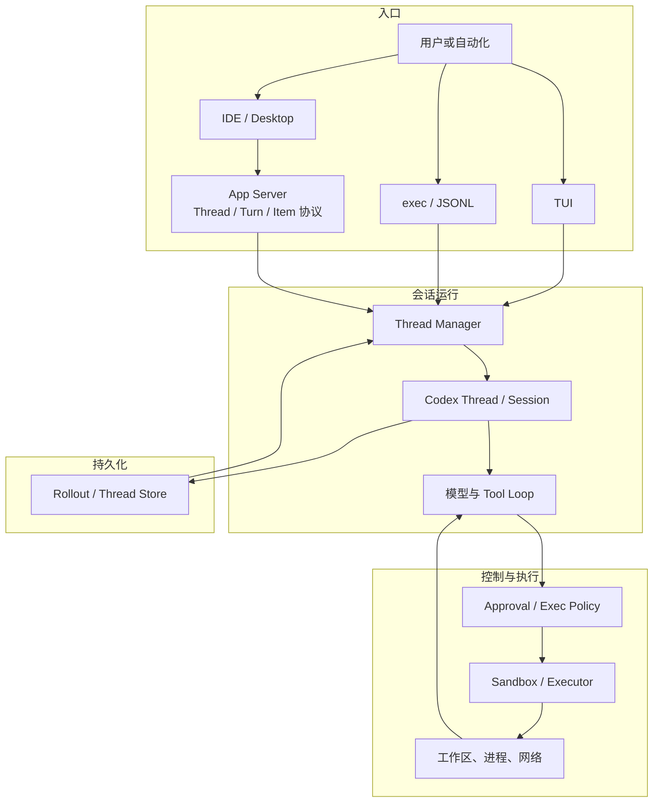

# Codex：安全控制面与多入口 Runtime

Codex 是一个以 Rust 为主要实现语言、在本地工作区中运行的 Coding Agent Harness。用户既可以从终端用户界面（Terminal User Interface，TUI）持续对话，也可以用 `exec` 执行非交互任务，或由集成开发环境（Integrated Development Environment，IDE）和桌面客户端经应用服务器（App Server）驱动同一类任务。它不是把一份聊天界面简单复制到多个前端，而是把会话、轮次、事件、工具执行、审批、沙箱和持久化组织成可被不同入口复用的运行时。

本章仍从[“一句话请求先要落到正确的工作区”](00_index.md#一句话请求先要落到正确的工作区)这一教学案例出发：用户要求定位并修复配置解析错误、运行相关测试并解释修改。Codex 面对的设计问题是，怎样让这项任务既能在交互终端中逐步推进，也能进入 IDE 或自动化；怎样让模型多次采样、工具执行和用户审批保持同一任务身份；又怎样在拥有本地文件与进程能力时，把“模型建议”“策略允许”和“系统实际可达”分成不同控制层。

固定版本源码显示，Codex 的中心不是某个前端，而是由 Thread Manager、Codex Thread、Session、Protocol、Tool Runtime 与 Rollout Store 共同形成的运行核心。本章回答三组问题：这套核心怎样被多个入口共享；一次 Turn 怎样在事件流和持久记录中闭合；审批（Approval）、沙箱（Sandbox）与执行策略（Exec Policy）为什么要分层，而不能合并成一个“安全模式”开关。

## 项目定位与设计问题

Codex 的开源仓库首先把自己定位为运行在用户计算机上的 coding agent，同时提供 CLI、IDE、Desktop 与云端产品的入口指引。就本报告的统一参考架构而言，它属于“分层 Session 运行时”：控制平面持有任务身份、模型循环和授权决定，执行平面承担文件、进程与网络副作用，客户端只选择怎样展示和控制这些状态。这里的 Session 不只是聊天历史，而是[八个核心对象](04_reference_architecture.md#八个核心对象一项任务由什么组成)中连接 Turn、Message、Event、Item、Context 与 Artifact 的任务容器。

它要处理的第一个矛盾是**本地能力与高风险副作用同时存在**。配置修复需要搜索仓库、编辑文件、运行测试，通用 Shell 又可能访问工作区之外的路径或网络。若把一切交给模型判断，低信任仓库内容可能直接影响高权限执行；若每一步都要求人工确认，长任务又会被确认疲劳拖垮。Codex 因而把能力发现、命令规则、审批与实际限制拆开，分别回答“模型能提出什么”“该参数是否允许”“是否需要人决定”和“即使允许，进程最多能访问什么”。

第二个矛盾是**长任务与多入口状态一致性**。TUI 需要流式显示推理、命令和 diff，IDE 需要结构化 Thread、Turn 与 Item，`exec` 则需要稳定事件和可判定退出。Codex 不能让三个入口各自实现一套循环，否则同一命令在不同客户端可能获得不同审批、取消或恢复语义。源码中的统一 Protocol、Thread Manager 和 Codex Thread 正是在收束这条边界。

第三个矛盾是**可恢复记录与现实副作用并不对称**。Rollout 可以保存消息、工具调用、Turn 终态和配置快照，却不能撤销已经写入的文件、停止所有脱离控制的后台进程，或收回已经发出的网络请求。因此，Codex 的持久化重点不是声称事务式回滚，而是把已提交历史、活动边界和结果未知尽量表达清楚；这与[Session 持久化章对 Resume、Replay、Branch 与 Fork 的区分](12_session_persistence_and_resume.md#resumereplaybranch-与-fork)一致。

## Rust Core、Protocol 与 App Server

Codex 的 Rust 工作区不是一个单体 crate。`core` 负责 Session、Turn、模型请求、工具路由与扩展接入；`protocol` 定义提交操作和事件；`rollout`、`state` 与 Thread Store 保存规范记录和查询状态；`app-server` 及其协议 crate 把这些能力投影给富客户端；`tui`、`exec` 与 `cli` 则负责不同入口。这样的拆分让协议对象不必直接等于内部状态，却仍能保留稳定的 Thread、Turn、Item 和 Call ID。

Thread Manager 负责创建、Resume、Fork 与管理内存中的 Codex Thread。每个 Codex Thread 包装一个 Session 和双向消息通道：客户端提交操作（Operation，`Op`），核心发回事件（Event）。同一提交队列既接收新 Turn，也接收审批答复、MCP elicitation、动态工具结果、压缩、回滚、内存模式更新、中断与关闭。它的意义不只是减少 API 数量，而是让状态变更在一个有序入口中被核心解释，避免客户端直接修改 Session 内部结构。

Protocol 将控制请求和展示事件明确分开。请求侧包括开始或引导 Turn、命令审批、补丁审批、权限答复、MCP 交互与 Interrupt；事件侧包括 TurnStarted、TurnComplete、TurnAborted、ItemStarted、ItemCompleted、命令输出增量、审批请求、Token 统计和 ContextCompacted。App Server 再把核心事件映射成 `thread/start`、`thread/resume`、`turn/start`、`item/started` 等双向协议消息。客户端可以有不同界面，但不能自行发明“任务已经完成”的判断。

图 23-1 展示这条共享路径。它不是进程部署图，而是责任图：入口可以直接嵌入核心，也可以通过 App Server 远程驱动；一旦进入 Thread Manager，任务身份、工具循环和记录边界回到同一套 Core Session 语义。

*图 23-1　Codex 多入口共享运行核心。替代说明：TUI、非交互 exec 和经 App Server 接入的 IDE 最终都由 Thread Manager 创建或恢复 Core Session，工具动作经过策略、审批与沙箱后作用于外部环境，Rollout 保存可恢复记录。*

图中的共享并不表示各入口能力完全相同。TUI 可以现场回答问题和审批，`exec` 必须为无人交互给出确定政策，App Server 还要处理连接初始化、订阅、重连与多个客户端观察同一 Thread。共享的是任务和控制语义，不是每个界面都拥有相同控件。

## Loop、Event 与 Rollout

Codex 的一个用户可感知 Turn 可以包含多次模型采样。核心先处理可能需要的压缩，解析输入中要求的 MCP Server 或 Plugin，捕获本次 Step Context，再构造模型输入。模型若返回 Tool Call，Tool Runtime 执行并把结果写回历史；若工具结果、用户 steering、邮箱消息或停止 Hook 要求继续，核心在同一 Turn 内再次采样。只有不再需要后续动作并通过停止边界，Turn 才进入完成状态。这正是[循环不变量](05_harness_loop.md#turn状态与循环不变量)在 Codex 中的实际落点：行动有稳定身份，工具结果在继续采样前闭合，取消与完成使用不同终态。

模型流、界面流与持久记录在这里是三件事。输出文本、推理摘要、工具参数和命令输出可以增量形成 Event，让 TUI 或 IDE 及时更新；完整 Tool Call、Tool Result 与 Turn 终态才是稳定 Item。Codex 在采样结束后等待在途工具收敛，再发出 Token、diff 和终态相关事件。这样，界面可以按到达顺序显示进度，下一轮 Context 仍按 Call ID 和工作单元关系组织。[Tool Call 章的四类 envelope](08_tool_call_system.md#请求参数与-call-id)可用于理解这些请求、审批、响应与错误，但 Codex 的真实线协议由自己的 Protocol 定义。

Rollout 是这条路径的规范持久记录。后台 recorder 按序接收需要保存的 Rollout Item，新线程延迟到真正有内容时才物化文件，Resume 则打开既有记录继续追加。待写 Item 只有成功写入后才从内存队列移除；一次 I/O 失败会保留未写后缀，并在后续 persist 或 flush 时重新打开文件重试。Thread Store 和 SQLite 状态更适合列表、分页和查询，但固定版本的本地路径仍把 Rollout 历史作为关键来源，而不是让每个客户端维护私有聊天副本。

Turn 边界还承担耐久承诺。任务主体结束后，Session 会先 flush Rollout，再生成统一的完成或中断生命周期；TurnStarted、TurnComplete、TurnAborted 与部分 ItemCompleted 都属于持久化策略。Fork 若发生在活动 Turn 中，会截断到可证明的边界或加入与真实中断一致的标记，而不是复制一段看似完整、实际缺少结果的尾部。这种处理也连接了[Compaction 的截断、摘要、选择与外部化四类方法](13_compaction_and_context_management.md#截断摘要选择与外部化)：压缩可以改变模型下一次看到的历史，却不能抹去 Thread 身份和已提交的 Turn 终态。

需要注意，持久 Rollout 并不等于可重放所有副作用。Protocol 明确区分 Interrupt 与清理后台终端，Thread rollback 也只丢弃模型上下文中的若干用户 Turn，不负责撤销磁盘修改。对照[可靠性章的 Timeout、Cancel 与 Interrupt](21_reliability_and_resource_control.md#timeoutcancel-与-interrupt)，Codex 的记录可以说明“控制循环在哪里停下”，但进程、文件和远端服务仍要重新观察。

## Approval、Sandbox 与 Exec Policy

Codex 的安全控制面适合从一次 Shell 请求逆向理解。模型生成命令后，执行策略先把命令拆成可匹配的程序与参数序列；规则可以给出允许、询问或禁止。Tool Orchestrator 随后根据本次审批政策、最终参数、文件权限画像和工具自己的要求，决定跳过审批、立即拒绝或发出审批请求。获准之后，运行时才选择平台沙箱和网络限制执行第一遍；若受限执行失败，是否允许请求额外权限或脱离原沙箱重试，还要重新经过政策与审批。这个顺序把[Tool Permission 与 Human Approval](17_security_permissions_and_sandboxing.md#tool-permission-与-human-approval)和[文件、进程与网络沙箱](17_security_permissions_and_sandboxing.md#文件进程与网络沙箱)落实为两个不同阶段。

Exec Policy 不是 Shell 黑名单。固定版本的策略语言以命令前缀规则为主，规则对 token 序列匹配，并以“禁止高于询问、询问高于允许”的严格度合并多个命中；绝对可执行文件还可以通过 host executable 元数据约束 basename 回退。未命中的命令会进入结合审批模式、Permission Profile、平台沙箱和危险命令启发式的后备判断。规则因此提供的是可重复的控制面判断，而不是证明命令业务正确。

沙箱回答的是另一个问题：即使命令获准，它最多能读写哪里、是否可以访问网络、由哪个平台后端执行。Protocol 中的文件系统策略能够表示受限根、读写和 deny 项，网络策略区分受限与启用；运行时再选择 macOS Seatbelt、Linux Landlock/`bwrap`、Windows Sandbox 或外部执行器管理的限制。工具还能声明使用默认权限、要求提升，或请求额外权限。审批决定并不自动扩大文件系统可达面；反过来，沙箱允许工作区写入也不表示每条命令都符合用户意图。

这套分层还覆盖补丁、MCP 与网络请求。Protocol 为命令和补丁保留独立审批操作，MCP elicitation 与动态 Tool 也使用稳定 ID 回答；网络审批可以形成仅本次、Session 级或策略修订结果。所有这些路径都以最终动作作为审批对象，而不是让前端批准一句友好摘要。对[Prompt Injection 到能力执行](17_security_permissions_and_sandboxing.md#prompt-injection-到能力执行)而言，低信任仓库内容可以影响模型提议，却仍要跨过工具 Schema、策略、审批和执行限制。

> **安全提示｜审批通过、策略允许与沙箱可达是三种事实**
>
> 审批只说明某个审查者同意了当时展示的最终动作；Exec Policy 说明规则如何分类命令；Sandbox 说明执行环境实际限制什么。任一层单独存在都不能推出任务“安全”：宽规则可能减少询问，错误挂载可能扩大沙箱，获准命令仍可能失败或产生部分副作用。恢复 Session 时也应重新应用当前策略，而不是把旧审批当成永久能力。

这条边界与[Workspace、Git 和测试闭环](18_code_editing_git_and_workspace.md#testlint-与构建)直接相关。允许修改文件不等于修改正确，允许测试不等于测试通过；Codex 会把 Turn diff、命令终态和最后消息作为不同信息交付。安全控制限制行动范围，工程验证判断任务结果，两者共同形成完成证据。

## MCP、Skill、Plugin、Memory 与 Subagent

Codex 的扩展面不是单一 Plugin API。按照前文对[Plugin、Extension、MCP、Skill 与 Hook 五类机制](09_plugins_mcp_and_extensions.md#pluginextensionmcpskill-与-hook)的区分，Plugin 更像带 manifest 和来源权限的装配包，可以贡献 Skill、MCP、App 或 Hook；MCP Manager 管理外部 Server 与 Tool；Host Skills Service 负责多来源 Skill；Extension Registry 与 Hook Runtime 进入生命周期；这些服务由 Thread Manager 创建并共享，再在每个 Turn 捕获有效快照。

这种组织的关键不是“功能很多”，而是**发现与本次使用分开**。Turn 开始时，核心先根据用户输入识别必需的 MCP Server 和显式提及的 Plugin，再捕获带相应工具目录的 Step Context；随后才构造 Skill 和 Plugin 注入项。工具目录、Context 与执行绑定因此基于同一次 Step 快照，减少“模型看到旧 Schema、执行器已经换成新实现”的漂移。MCP Server 的启动、刷新、elicitation 和 Tool Call 终态则经 Session Event 回到客户端。

Skill 主要改变过程性指令和资源入口，并不自动授予执行权限。Plugin 可以同时改变工具、Context 与 Hook，所以来源信任比普通说明文件更强；Hook 位于 Prompt、Tool、Stop 或 Session 边界时，还要区分它能否阻断、改写或只观察。Codex 会把这些贡献装入共享 Session 运行时，但工具最终仍经过审批与沙箱，[权限、参数与上下文继承](11_skills_prompts_commands_and_hooks.md#权限参数与上下文继承)不能被简化成“来自受信 Plugin 就全部允许”。

Memory 也不是 Session 的别名。固定版本存在独立的 Memory 读扩展和写入管线：读侧可以把摘要作为开发者指令注入，并提供列举、搜索、读取与追加临时笔记的工具；写侧从符合条件的 Rollout 提取记录，再串行整合为文件系统中的高层材料。Thread 还保存是否允许生成 Memory 的模式，外部 Context 可能把其标记为污染。它对应[项目级、用户级与 Session 级 Memory 范围](10_memory.md#项目级用户级与-session-级范围)中的跨任务可检索层，而 Rollout 仍承担当前 Thread 的连续性。Memory 命中只是一条可能陈旧的输入，使用时仍要回到工作区和源码核验。

Subagent 复用的仍是 Codex Thread，而不是一个只有文本输出的轻量回调。Agent Control 在同一根任务树中共享并发额度和注册表，创建子 Thread 时记录父 Thread、深度、角色和来源；可选择全新 Context 或从父 Rollout 的可证明前缀 Fork。发送消息、等待、继续任务与关闭 Agent 都通过 Thread 状态工作，Agent Graph Store 则在本地状态可用时保存父子边。与[Parent、Child、Task、Thread 与 Session](16_subagents_and_orchestration.md#parentchildtaskthread-与-session)的统一概念一致，子 Agent 有独立 Thread 身份，但不自动拥有独立 Workspace。

子 Agent 的边界因此有三层。第一，Fork 历史会先 flush 父 Rollout，并对活动 Turn 使用中断语义，避免继承未闭合尾部。第二，子 Agent 的 SessionSource 记录角色、深度与父关系，便于工具、遥测和权限判断识别调用来源。第三，创建新 Thread 仍需重新形成有效配置和执行政策；只有父子配置层等条件相同，执行策略才适合共享。它不是把父权限对象无条件复制给任意后代。

## CLI、IDE 与服务入口

顶层 `codex` 二进制本身就是一个多工具入口。无子命令时进入交互 TUI；`exec` 和 `review` 走非交互路径；`app-server` 启动面向富客户端的协议服务；`mcp-server` 把 Codex 作为 MCP Server 暴露；另有 Session Resume/Fork、插件与 MCP 管理、Sandbox 调试、Cloud Task、独立 Exec Server 等命令。入口列表很长，但[接口章的展示、控制与状态契约](20_interfaces_and_human_in_the_loop.md#clituiidedesktopweb-与-api)比命令数量更重要。

TUI 适合持续人在回路：它可以显示模型与工具增量、呈现审批、接受 steering、切换协作模式并中断 Turn。`exec` 面向脚本和批处理，输出可以是人类文本或 JSONL；没有现场用户时，交互能力必须被取消、拒绝或由预设政策解决，最终还要通过事件与退出状态让调用者判断结果。App Server 则把 Thread/Turn/Item、审批、动态工具、配置与订阅转换成双向服务接口，让 IDE 和 Desktop 不必链接核心内部类型。

多入口共享核心的收益是状态语义集中：Resume 和 Fork 不需要从某个 UI 缓存重建，审批响应可带稳定 ID 回到活动调用，客户端断线后可以重新读取 Thread。代价是协议版本、实验字段、权限画像、事件投影和连接生命周期都成为兼容面。App Server 还允许 stdio、Unix Socket 与 WebSocket 等传输，远程控制会进一步引入认证和连接信任；这与[配置、身份与供应链章的调用来源](22_configuration_identity_and_supply_chain.md#agent-identity-与调用来源)相连，不能仅凭“同一用户启动”忽略 originator 与 SessionSource。

Codex 的入口共享也有明确例外。客户端可以暴露不同动态工具，TUI 能回答的问题在 `exec` 中可能不可用，IDE 还会提供应用级 Context；Protocol 为附加 Context 区分不可信来源与应用来源。共享 Core Session 的目标是统一任务身份和控制规则，而不是强迫所有入口具有完全相同的 Context、工具或交互能力。

## 代表性设计和边界

前面的结构说明了 Codex 有哪些组件，本节进一步回答它为什么在本报告的机制章中反复出现。真正有代表性的不是 Rust crate 数量，而是三项组合设计：把审批、规则和执行隔离做成分层控制面；把 Rollout 的耐久位置与 Turn 边界绑定；让 TUI、App Server 与 `exec` 共享 Core Session。三项设计彼此依赖，也各自有不能越过的边界。

### 审批、沙箱与 Exec Policy 的分层控制面

动机来自通用 Shell 的两面性。它让 Codex 能适应未知构建系统和仓库，却无法仅靠 Tool 名称判断风险。一个 `git status`、一个包安装脚本和一个上传命令都可能进入同一执行工具。Codex 因此先用 Exec Policy 对完整命令求值，再由 Approval 决定是否需要审查，最后由 Sandbox 限制真实访问；工具失败后若请求扩大权限，还要产生新的决策点。这里实际体现了[工具可见、动作获准和执行限制的三层边界](08_tool_call_system.md#权限和副作用边界)，也体现了[主体、能力与信任边界](17_security_permissions_and_sandboxing.md#主体能力与信任边界)。

> **特色机制｜同一命令跨过三个独立控制点**
>
> Exec Policy 可以稳定复用组织规则，Approval 保存用户对具体动作的决定，Sandbox 在操作系统或外部执行器层限制后果。收益是每层都能在不同入口复用，并能区分“政策禁止”“等待审批”“受限执行失败”。代价是配置和故障组合明显增加：规则、Permission Profile、网络代理和平台后端必须保持一致，客户端还要正确展示每次权限扩大。

这一机制的边界同样重要。前缀规则只能依据被解析出来的命令结构与启发式判断，不能理解所有脚本的业务语义；Sandbox 的强度取决于平台后端、挂载和代理配置；用户也可能批准危险动作。源码存在这些控制，只能支持“固定版本已实现分层路径”，不能推出跨平台隔离已经由本报告运行验证。对于进程内 Extension、Hook 或外部 MCP Server，还要检查它们是否经过同一执行路径，不能把 Shell 的控制保证自动外推到所有能力。

### Rollout 持久化与 Turn 边界

Codex 把一次任务看成持续追加的工作历史，而不是若干独立请求。Rollout 记录 Session 元数据、Response Item、Turn Context、World State 和终态事件；Thread Store 提供列表与分页视图。任务完成前先 flush，Fork 活动历史时加入中断语义，都是为了让“新进程能够证明的前缀”尽量接近用户看到的任务边界。它对应[Event Log、Snapshot 与 Checkpoint](12_session_persistence_and_resume.md#event-logsnapshot-与-checkpoint)中的日志加耐久屏障路线。

> **特色机制｜Turn 终态是恢复语义的一部分**
>
> `TurnComplete` 与 `TurnAborted` 不只是 UI 通知，它们进入 Rollout 持久化策略。收益是 Resume、Fork、审计和多客户端投影拥有共同边界，未完成 Turn 不必伪装成成功。代价是 recorder、查询投影、压缩历史和协议事件必须共同维护顺序；写入失败时系统还要继续运行、告警并重试，而不能静默把屏幕状态当成耐久事实。

这项设计也有清楚的代价和边界。异步 writer 能避免阻塞模型循环，却引入缓冲、flush 与终止协调；JSONL 适合追加和审计，查询、分页与迁移则需要额外 State DB 和 Thread Store。更重要的是，Rollout 只记录 Harness 知道的事实。Interrupt 不自动终止长期后台终端，Rollback 不恢复文件，网络超时也可能留下结果未知。因此[可观测性章的 Log、Event、Trace 与 Metric](19_observability_evaluation_and_replay.md#logeventtrace-与-metric)可以帮助关联行为，但记录完整性仍不能代替外部状态核验。

### 多入口共享 Core Session

第三项设计解决产品形态增长后的架构分叉。TUI、IDE 和自动化需要不同展示，却都要创建或恢复 Thread、提交 Turn、消费 Item、回答 Approval 和执行 Interrupt。Codex 让 Thread Manager 与 Codex Thread 成为共同控制中心，App Server 只是把 Core Protocol 映射为客户端协议，`exec` 则把同类 Event 投影成人类文本或 JSONL。这样，[Headless 与非交互模式](20_interfaces_and_human_in_the_loop.md#headless-与非交互模式)不需要重新实现工具循环，IDE 也不必从日志文本猜测 Call ID。

> **设计取舍｜共享 Core，不共享全部界面能力**
>
> 共享 Core Session 降低了入口间的语义漂移：同一 Thread 能 Resume，Turn 终态和审批 ID 可被不同客户端识别，工具与 Rollout 仍由核心维护。代价是 App Server 协议成为长期兼容面，实验字段、事件映射、连接认证和订阅恢复都需要版本治理。某入口缺少交互通道时，核心还必须得到明确策略，而不能假定客户端总能弹窗。

边界在于“同一核心”不等于“同一运行环境”。IDE 可加入选区和诊断，`exec` 可能禁用需要人工回答的工具，App Server 可由远端连接驱动，SessionSource 与 originator 也会影响限制产品和遥测。模型、Provider、Context 和工具目录仍可能按入口配置变化；对[Provider 抽象中的能力发现与路由](06_model_and_provider_abstraction.md#能力发现路由与-fallback)和[Context 中的 Workspace 与动态现场](07_context_and_instruction_system.md#workspace代码与动态上下文)而言，客户端只能提供输入，Core 必须重新形成本 Turn 的有效快照。

三项机制共同构成 Codex 的主要取舍：它以更多类型、事件和服务边界换取可组合入口、细粒度授权和可恢复任务身份。这使它适合需要长期演进的产品运行时，也意味着调试不能只查看最后一条模型消息。工程人员必须同时追踪 Session、Turn、Item、Call ID、审批决定、实际 Sandbox 与 Rollout 提交位置。

放回七个 Harness 的共同坐标，Codex 的差异主要是责任组合方式，而不是功能数量。Aider 将编辑、Git 与反馈更集中地放在编码循环周围，Pi 保持较小核心并把较多治理交给扩展或宿主；OpenCode 更强调 Server、数据库和客户端事件，Gemini CLI 将模型 Turn 与工具 Scheduler 分工，Goose 则以 Session 和 MCP Extension 连接多种入口。Codex 选择由 Core Thread 统一持有 Turn、工具、审批和 Rollout，再让多种客户端投影这些状态。这种路线更适合统一多入口语义，但也更依赖 Protocol、持久化和权限层之间的长期兼容。

## 适用场景与延伸阅读

Codex 的架构适合三类场景。第一类是需要在真实仓库中持续读写、测试和解释，同时希望命令与补丁经过明确控制的本地 Coding 工作。第二类是一个 Agent 核心需要同时服务 TUI、IDE、Desktop 或自动化，且客户端要消费结构化流、恢复 Session 并参与审批。第三类是任务可能跨多个 Turn、发生压缩、Resume、Fork 或 Subagent 委派，需要保留任务身份和事件证据，而不只保存最终回答。

它不天然消除部署复杂度。只需要极短、集中式编辑循环的工具，可能不需要 App Server、Thread Store 和多层协议；完全受管的远端执行平台还需要在 Codex 核心之外提供租户隔离、密钥托管、容器生命周期和组织审计。启用大量 Plugin、MCP、Skill、Memory 与 Subagent 时，[Token 账本与输出预算](14_token_efficiency_and_cost_control.md#token-账本到底记录什么)和[Subagent 的 Token 经济性](14_token_efficiency_and_cost_control.md#subagent-的-token-经济性)也会成为实际约束。

继续深入时可以按问题选择阅读。想理解同一 Turn 为什么会多次采样，可回到[Harness Loop](05_harness_loop.md)；想理解工具请求、Call ID、并行和结果封装，可读[Tool Call 系统](08_tool_call_system.md)；想研究恢复、Fork 与副作用一致性，可读[Session、持久化与 Resume](12_session_persistence_and_resume.md)；想分析扩展供应链，可串联[Plugin、MCP 与扩展系统](09_plugins_mcp_and_extensions.md)、[Skills、Prompt、Command 与 Hook](11_skills_prompts_commands_and_hooks.md)和[配置、身份与供应链](22_configuration_identity_and_supply_chain.md)。

若关注自主程度，应把计划和委派放回各自机制边界。Codex 的 Plan 或 Goal 状态属于[Goal、Plan、Task 与 Todo](15_goals_planning_and_todos.md#goalplantask-与-todo)所讨论的控制状态，Subagent 属于[多 Agent 编排](16_subagents_and_orchestration.md)，两者都不能替代父 Thread 对真实 Artifact 的检查。Memory 则应结合[Memory、Context 与 Compaction](10_memory.md#memorycontext-与-compaction)理解：过去经验可以帮助定位入口，却必须允许新文件和新测试推翻旧结论。

## 本章小结

Codex 的中心设计不是某个终端界面，而是一套由 Rust Core、Protocol、Thread Manager、Codex Thread、Tool Runtime 与 Rollout Store 组成的 Session 运行时。TUI、`exec` 和经 App Server 接入的 IDE 可以使用不同展示与交互能力，却把 Thread、Turn、Item、审批和恢复交给同一核心解释。多入口因而共享任务身份，而不是仅仅共享一个模型账号。

这套架构最有代表性的三点是：审批、Exec Policy 与 Sandbox 分别处理意图、规则和实际可达性；Rollout 把工作单元和 Turn 终态放进可恢复的追加历史；多个入口复用 Core Session，同时保留各自的 Context 与人机边界。它们的共同收益是控制语义集中、状态可关联、客户端可以演进；共同代价是协议、持久化、权限组合和跨平台执行需要更严格的一致性维护。

回到配置解析错误案例，Codex 可以让模型在一个 Turn 内多次读取、编辑和测试，让用户只在必要动作处介入，并让任务从另一个入口 Resume。但“记录已恢复”不等于环境已回滚，“审批通过”不等于命令成功，“子 Agent 完成”也不等于父任务已经验证。Codex 的价值正在于把这些不同事实做成可分别观察和控制的状态；它的安全与可靠性边界，也必须沿这些状态逐层检查。
