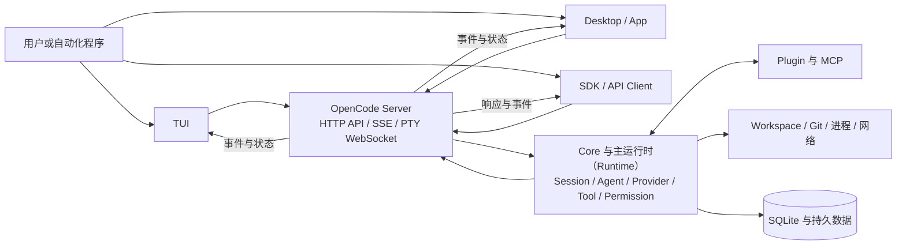

# OpenCode：多模型平台与 Agent Mode

OpenCode 是一个以 TypeScript 与 Bun 为主要实现环境的开源编程智能体（Coding Agent）平台。它既能在终端用户界面（Terminal User Interface，TUI）中直接运行，也能把同一套会话（Session）、工具和权限能力交给桌面应用、网页客户端、无头服务与软件开发工具包（Software Development Kit，SDK）。因此，理解 OpenCode 不能只看终端里的聊天窗口，也不能只把它概括为“接入很多模型的命令行界面（Command-Line Interface，CLI）”；真正的中心是一个持有 Session、事件、权限请求和执行状态的服务层，以及围绕这个服务层组合出来的多种客户端。

本章回答三个问题：OpenCode 怎样把多 Provider、多客户端和可配置 Agent 组织成一个平台；Build、Plan 与 General Agent 的差异怎样落实为工具与权限，而不是停留在界面标签；Session、后台任务和工作区快照又怎样共同支持连续执行、委派与有限恢复。读者可以直接从本章进入；涉及通用概念时，正文会链接到前面的定义，而源码路径、符号、固定版本和证据状态保存在本章内部台账。

仍以[“一句话请求先要落到正确的工作区”这一教学案例](00_index.md#一句话请求先要落到正确的工作区)为例：用户要求系统定位配置解析错误、提出修复、修改文件并运行测试。OpenCode 的平台式答案不是让每个界面各自实现一遍 Agent，而是让客户端选择工作目录、模型与 Agent，再由服务端建立 Session、运行[行动—执行—观察的循环](05_harness_loop.md#行动执行与-observation)、裁决工具权限、保存消息和文件变化，最后把事件投影回不同界面。以下各节沿这条控制流展开。

## 项目定位与平台形态

OpenCode 的产品定位是开源 Coding Agent，但其源码形态更接近一套可嵌入的 Agent 平台。根命令可以启动 TUI、一次性运行、无头服务端（Server）、网页界面（Web）、Agent 客户端协议（Agent Client Protocol，ACP）与维护命令；桌面应用在本机启动受密码保护的边车（sidecar）Server；SDK 既能创建客户端，也能拉起独立的 `opencode serve` 进程。不同入口共享的不是一段提示词，而是 Session、模型服务适配层（Provider）、工具（Tool）、权限（Permission）、事件（Event）、项目（Project）和工作区（Workspace）等服务。

这套形态首先把“模型选择”与“任务运行”分开。Provider 层负责发现模型、取得认证、建立请求并把不同服务的流式响应归一到会话处理器能够消费的事件；Agent 层再决定当前角色、系统提示、模型覆盖、步数与权限。用户可以在同一个 Session 中选择不同 Provider 或 Agent，而工具执行、消息存储和客户端同步仍留在 Harness 一侧。这正是[Provider 抽象所隔离的变化](06_model_and_provider_abstraction.md#provider-层在隔离什么)：模型服务可以替换，现实世界的工作区与副作用不能因此失去统一控制。

其次，OpenCode 把“本地应用”与“本地单进程”区分开。普通 TUI 默认会启动内部 worker，worker 承载 Server 与项目实例；若显式暴露网络地址，则 TUI 改用真实 HTTP 地址。`attach` 可以把同一 TUI 接到已有 Server。Desktop 也不是把核心逻辑编译进每个渲染窗口，而是启动本地 sidecar Server，等待健康检查通过后再由 App 连接；它还允许选择远端 Server。由此形成一种稳定的平台边界：客户端负责展示和控制，Server 负责状态与动作。

这种拆分扩大了适用面，也扩大了责任面。一个只在本机回环地址运行的 Server、一个暴露到局域网的 Server、一个被 Desktop sidecar 管理的 Server，在身份、跨域、凭据和生命周期上不是同一种部署。固定版本在未配置 Server 密码时会明确警告服务未受保护；Desktop sidecar 则生成并注入本地凭据。换言之，多客户端能力必须与[配置、身份和供应链边界](22_configuration_identity_and_supply_chain.md#用户项目与企业配置)一起理解，不能把“能远程连接”直接当成安全的协作服务。

## Core、Server、TUI、Desktop 与 SDK

在固定版本中，一部分基础能力已经下沉到 `@opencode-ai/core`，主 `opencode` 包则完成 CLI、Agent、Provider、Session、Tool、插件（Plugin）、MCP 与 Server 的装配。`@opencode-ai/server` 提供协议路由和中间件；`@opencode-ai/tui` 提供终端界面；共享 App 包承担桌面与 Web 的主要前端状态；Desktop 包负责 Electron 生命周期、本地 sidecar、窗口与系统集成；生成式 SDK 则把 HTTP API、事件订阅和进程启动包装为程序接口。图 24-1 展示这些部分的主要关系。

*图 24-1　OpenCode 的客户端—Server—Runtime 关系。替代说明：TUI、Desktop 与 SDK 都通过 Server 驱动同一组 Session、Agent、Provider、Tool 和 Permission 服务，Runtime 再访问工作区与持久存储。*

图 24-1 的关键不是包名，而是权威状态的位置。客户端提交创建 Session、发送 Prompt、回答权限请求、中断运行或读取文件等请求；Server 根据目录或工作区定位项目实例，把请求交给 Runtime，再通过服务器发送事件（Server-Sent Events，SSE）向客户端推送 Session、Message、Tool、Permission 与状态变化。伪终端（Pseudo Terminal，PTY）与其他双向流另有 WebSocket 路径。SDK 在请求中携带工作目录，使一个 Server 能为多个目录选择相应实例，而不是让客户端进程的当前目录成为唯一真相。

TUI 的内部模式说明“经过 Server”不一定意味着开放一个网络端口。默认交互路径可以通过远程过程调用（Remote Procedure Call，RPC）把 `fetch` 和全局事件桥接到内存中的 Server；需要对外监听时，再启动真实网络监听器。这样既保留了统一 API，也避免本地默认路径无条件暴露端口。`attach` 则反向证明客户端与 Runtime 已经解耦：只要远端提供相同状态与控制接口，TUI 不需要拥有 Server 进程。

Desktop 的边界更明显。主进程以实用进程（utility process）启动 sidecar，把 Server 用户名、随机密码和状态目录注入其环境，并在窗口开始工作前轮询健康端点；退出时先请求优雅停止，超时后才终止子进程。渲染层复用共享 App，通过 SDK 管理 Server、项目和 Session。这样的代价是必须处理前端、sidecar 与工作目录三个生命周期，以及本地、WSL 和远端 Server 的差异；收益是同一 App 不必复制 Agent Loop，也能在多个 Session 间切换。

SDK 同时提供两层能力。低层客户端由 OpenAPI 生成，暴露类型化的 Session、MCP、Provider、Permission 与事件方法；高层启动函数可以先拉起 `opencode serve`，解析监听地址，再返回可直接使用的客户端。它适合把 OpenCode 嵌入其他工具，但调用者仍需负责 Server 进程、Abort、认证和工作目录。关于这类接口为何要分别承担展示、控制与状态契约，可回看[接口章的客户端三契约](20_interfaces_and_human_in_the_loop.md#clituiidedesktopweb-与-api)。

## Build、Plan 与 General Agent

OpenCode 的智能体模式（Agent Mode）不是单纯改变回答风格。每个 Agent 定义包含角色范围、可选模型、提示、步数和权限规则；运行时（Runtime）在每轮创建工具集合、系统指令和模型请求时读取这份定义。固定版本内建的 Build、Plan 与 General Agent 分别对应执行主角色、规划主角色与通用子智能体（Subagent），此外还有面向快速代码探索的 Explore，以及标题、摘要和压缩等隐藏内部 Agent。

| Agent | 运行角色 | 默认能力重点 | 主要边界 |
|---|---|---|---|
| Build | 主 Agent（Primary） | 读取、编辑、Shell、Task、提问与计划入口 | 高副作用动作仍受最终权限规则与外部目录规则约束 |
| Plan | 主 Agent | 调查、形成计划、与用户确认后切换执行 | 普通编辑被拒绝，只允许写入规定的计划文件；对特定 Subagent 进一步收窄 |
| General | 子 Agent（Subagent） | 复杂搜索与多步任务，可由 Task Tool 调用 | 独立 child Session；默认不写父级 Todo，递归委派受权限和深度限制 |

*表 24-1　Build、Plan 与 General Agent 的职责与边界。表中描述的是固定版本内建规则，用户配置可以继续覆盖或收窄。*

表 24-1 说明 Agent 的差异落在能力集合上。Build 作为默认 Primary Agent，可以进入执行闭环；Plan 通过“最后匹配规则生效”的权限集拒绝一般编辑，却为专用计划文件保留窄写入路径，并允许向用户发起问题或退出计划模式。General 只作为 Subagent 出现，适合把一个有界调查交给独立 Session。这个设计与[计划模式和执行模式的通用区别](15_goals_planning_and_todos.md#计划模式与执行模式)一致：计划阶段不是“请模型少写代码”，而是 Harness 改变了模型实际可见和可执行的能力。

Plan 与 Build 的转换也有两层。客户端可以在下一条用户消息中直接选择 Agent；实验性 Plan Mode 还提供进入与退出工具，并把计划保存到受限路径。退出时，Runtime 向用户展示“是否切换到 Build 并执行计划”的问题；用户同意后，系统写入一条合成用户消息，明确指定 Build Agent 与计划位置。TUI 收到对应 Tool Part 完成事件后同步本地 Agent 选择。这里服务端消息与客户端标签相互校准，避免只在界面上换一个颜色，后台却仍沿旧权限运行。

General 的调用走任务工具（Task Tool），而不是在同一提示（Prompt）里模拟另一个人格。父 Agent 必须提供任务描述、完整 Prompt 与 Subagent 类型；Runtime 创建带 `parentID` 的子会话（child Session），选择 Subagent 自己的模型和权限，然后运行独立 Loop。若提供旧 `task_id`，则恢复同一个 child Session。这个过程落实了[Parent、Child、Task 与 Session 的区分](16_subagents_and_orchestration.md#parentchildtaskthread-与-session)：父子引用表示来源，任务描述表示本次工作，Session 才保存子运行的连续历史。

> **设计取舍｜用 Agent 权限集切换阶段，而不是只改提示词**
>
> 把 Build 与 Plan 表示为可配置 Agent，能够同时改变系统提示、工具可见性和逐调用权限，客户端也可以显示当前有效角色；代价是用户覆盖规则、Session 规则和内建规则的合并顺序必须可解释。尤其当用户配置重新允许某类编辑时，“Plan 是只读”的产品直觉就应以最终规则为准，而不能只看 Agent 名称。

## Provider、Tool、Plugin 与 MCP

多模型是 OpenCode 的显著平台特征，但 Provider 层并不直接拥有工作区能力。固定版本集成多种 AI SDK Provider 和 OpenAI-compatible 入口，结合模型目录、认证信息、Provider 插件与请求变换构造具体模型。模型差异可能影响消息格式、工具模式定义（Schema）、流式事件、推理字段和输出上限；Session Processor 接收归一化后的流，再把文本、推理、工具调用（Tool Call）、错误、令牌（Token）与结束原因写回消息状态。Provider 因此是模型协议边界，不是执行授权边界。

工具目录由多条来源汇聚。内建工具覆盖读取、搜索、编辑、写入、Patch、Shell、Web、Question、Todo、Skill 和 Task；配置目录中的 TypeScript/JavaScript 工具与 Plugin 暴露的工具也进入注册表；MCP Server 的工具在连接成功后被命名空间化并加入当前 Session。注册表还会依据模型特征在编辑工具和 Patch 工具之间选择，依据客户端形态决定是否暴露 Question，依据实验开关加入 Code Mode、LSP 或 Plan Tool，最后再根据 Agent 与 Session 权限隐藏确定拒绝的能力。其中 Skill 作为按需加载的过程知识入口，可结合[Skill 的发现、选择与加载](11_skills_prompts_commands_and_hooks.md#skill-的发现选择与加载)理解。

这一过程对应[Schema、注册表与能力发现](08_tool_call_system.md#schema注册表与能力发现)，但 OpenCode 还把“工具定义”与“工具执行”分成两个可扩展点。Plugin 可以新增工具，也可以在工具定义送给模型前修改描述或模式定义（Schema），并在聊天消息、请求参数、事件与权限等生命周期点运行生命周期钩子（Hook）；工具执行时仍收到工作目录、工作树、调用标识（Call ID）、取消信号（AbortSignal）与权限询问接口。输出过长时，Runtime 会截断并给出外置位置，让[工具结果（Tool Result）的压缩与外部化](13_compaction_and_context_management.md#tool-result-与文件内容压缩)不会完全抹掉取回线索。

模型上下文协议（Model Context Protocol，MCP）是另一条边界。OpenCode 同时支持本地标准输入输出（stdio）、远端 Streamable HTTP 与旧 SSE 传输（Transport），维护连接、状态、超时与 OAuth 流；连接成功后不仅能获得 Tool，还能读取 Server instructions、Prompt、资源（Resource）和资源模板（Resource Template）。模型可见名称包含 Server 命名空间，Session 还提供资源列表、模板列表与读取工具。这里的 MCP Client 仍由 Harness 持有：Harness 选择连接、转换 Schema、执行调用、限制二进制资源大小并把结果包装成环境观察（Observation），而不是让模型绕过 Runtime 直连外部进程。更完整的边界见[Plugin、MCP 与扩展系统](09_plugins_mcp_and_extensions.md#mcp-transport-与双向能力)。

> **安全提示｜扩展来源进入的是同一进程信任边界**
>
> 外部 Plugin 可以注册 Hook 与 Tool，并取得项目、工作树、SDK Client 和运行时辅助能力；本地 MCP 则可能启动带环境变量的子进程。攻击前提是用户或项目配置引入了不可信来源。逐 Tool Permission 能限制模型发起的部分调用，却不能把已加载 Plugin 自动变成隔离代码。缓解方向是核对来源与版本、减少默认加载、使用纯净模式排查，并把外部进程和网络能力放进实际沙箱；相应的通用模型见[扩展供应链与信任边界](09_plugins_mcp_and_extensions.md#供应链与信任边界)和[主体、能力与信任边界](17_security_permissions_and_sandboxing.md#主体能力与信任边界)。

## Session、存储与 Subagent

OpenCode 用 Session 保存一个可继续任务的身份和汇总状态。固定版本的 Session 记录项目与工作区、目录、父 Session、标题、Agent、模型、Token、成本、权限、归档、分享、变更摘要和恢复（Revert）信息；Message 与 Part 分别保存用户/助手消息以及文本、推理、Tool、Patch、Compaction 等细粒度工作单元。这组对象可映射到[统一参考架构的八个核心对象](04_reference_architecture.md#八个核心对象一项任务由什么组成)，但 OpenCode 的持久粒度以 Session、Message、Part 和事件投影为主，不要求与参考模型同名。

仓库内的 `CONTEXT.md` 设计文档进一步把系统上下文（System Context）、会话历史（Session History）、上下文来源（Context Source）、Provider Turn 与 Session Drain 分成不同契约词汇 [@opencode2026sessionruntime]。它说明维护者希望避免把“当前送给模型的上下文”与“耐久会话历史”混为一谈；作为滚动设计文档，它不证明这些理想不变量已经在所有 Provider 上得到运行验证。

Session、Message、Part 与 Todo 的主要记录已经进入 SQLite 表；部分历史数据、Session Diff 和迁移兼容仍经过 Storage 服务。Server API 负责创建、列举、归档、分叉（Fork）、发送 Prompt、读取消息、执行 Revert 与中断。SSE 事件让客户端维护本地投影，但重连或晚加入时仍应重新读取权威 Session 基线，而不是把最后看见的增量当成完整事实。这延续了[Session 保存的任务边界](12_session_persistence_and_resume.md#session-保存的任务边界)和[多客户端状态一致性](20_interfaces_and_human_in_the_loop.md#多客户端状态一致性)的原则。

主 Loop 在每一步重新读取压缩后的消息，找到最新用户消息、最后助手终态和待处理子任务或上下文压缩（Compaction）；若前一助手已经形成非工具终态则退出，否则选择模型与 Agent，解析当前工具集合，依据[上下文构造与指令层级](07_context_and_instruction_system.md#context-为什么不只是-prompt)组合环境、项目规则、MCP instructions 与 Skill，运行流式处理器，再按 Tool Call、错误、溢出和最大步数决定继续、压缩或停止。这条[循环不变量](05_harness_loop.md#turn状态与循环不变量)保证工具结果要回到后续模型轮次，残留的中断调用会被标记为错误，而不是被误判为成功。

上下文过长时，OpenCode 会在 Tool Result 截断、旧结果裁剪（Pruning）、自动摘要和保留最近 Turn 之间组合处理。它们分别属于[压缩的截断、摘要、选择与外部化四类](13_compaction_and_context_management.md#截断摘要选择与外部化)，而不是一种无损恢复（Resume）。核心还保留隐藏的 Compaction Agent，并把摘要、保留尾部和继续提示写回 Session。这里保存的是同一任务的可恢复状态，不应与跨任务可复用知识混为一谈；[可检索记忆（Memory）的项目级、用户级与 Session 级范围](10_memory.md#项目级用户级与-session-级范围)说明了两者为何需要分开。

Subagent 建立在相同 Session 基础上。Task Tool 先检查 Agent 类型、父 Session 的 Task 权限和 Subagent 深度，再创建或恢复 child Session。子 Session 继承父级的明确 deny 与外部目录规则，其余能力由 Subagent 定义决定；若 Subagent 本身没有允许 Todo 或 Task，则再加入拒绝规则。前台模式等待 child 完成，把最后文本包装成父 Tool Result；实验性后台模式立即返回运行身份，完成后向父 Session 注入合成结果并触发父 Loop。共享目录使子 Agent 能看到最新仓库，也意味着并行写入需要遵守[共享 Workspace 的竞争与结果汇聚边界](16_subagents_and_orchestration.md#共享-workspace竞争与结果汇聚)。

## 代表性设计和边界

前几节说明了 OpenCode 的总体组合。本节把固定版本中最能体现其设计取舍的三项机制单独展开。它们分别解决多客户端权威状态、规划到执行的能力转换，以及长任务中的后台工作与文件恢复；三者也反复连接了接口、权限、Subagent、可靠性和 Workspace 等机制章。

### Server 作为权威状态层与多客户端

OpenCode 最有辨识度的选择，是把 Server 当作共同状态和控制边界。TUI 可以通过内部 worker 访问同一 Server，Desktop 通过 sidecar 访问，SDK 或 `attach` 可以连接独立 Server；客户端都通过 Session、Message、Permission、File、PTY 与 Event API 行动。这样，客户端不需要拥有 Agent Loop，也不应自行决定某个 Tool Call 是否完成。一次权限请求、一次中断或一次 Agent 切换，只有在 Server 接受并形成新状态后才对其他客户端有效。

多客户端的动机是让同一任务可以在不同界面中被观察和控制：TUI 适合连续键盘交互，Desktop 适合多 Session 与系统集成，SDK 适合嵌入自动化。机制上，客户端先读取 Server 基线，再订阅事件增量；工作目录随请求定位实例；权限以稳定请求 ID 回答；活动运行由 Session RunState 串行协调。代价是 Server 成为高价值边界：网络暴露需要认证和跨域策略，多个客户端竞争回答同一请求时必须由服务端结算，进程重启还要区分持久 Session 与仅存在内存中的运行状态。

> **特色机制｜内部调用与网络调用共享同一 Server API**
>
> 默认 TUI 可以用内存桥接避免开放端口，Desktop 可以启动受管 sidecar，远端客户端则使用 HTTP/SSE；三条路径保留相同的 Session 与事件语义。收益是客户端实现收敛，代价是 Server API、目录路由和事件投影必须长期保持一致。它适合希望同时提供终端、桌面和嵌入式入口的平台；对于只需要单进程编辑循环的系统，这层协议和生命周期成本未必值得。

这项设计也有明确边界。SSE 提供增量而不是事务日志重放保证，客户端仍需在缺口后重新同步；Server 权威不表示外部副作用可回滚；开放网络监听更不等于多租户隔离。相关通用机制分别见[模型请求和 Tool Call 的关联](19_observability_evaluation_and_replay.md#模型请求和-tool-call-关联)、[幂等性与外部副作用](21_reliability_and_resource_control.md#幂等性与外部副作用)以及[Workspace Trust 与凭据隔离](17_security_permissions_and_sandboxing.md#workspace-trust-与-credential-isolation)。

### Plan/Build Agent 的权限切换

第二项代表性机制，是把规划与执行表示为 Agent 定义和权限集。动机很直接：用户在陌生仓库中先调查配置解析链时，希望模型能读、搜、提问和写计划，却不希望“计划”在尚未审阅时改变源码；计划通过后，又希望同一 Session 不必丢失历史即可进入修改和测试。OpenCode 因此让 Plan 与 Build 共享 Session 历史，同时在每轮以不同 Agent 构造系统提示、工具目录与权限。

机制上的关键是最终规则而不是名称。Plan 拒绝普通编辑，只给计划文件开窄口，并允许退出计划；Build 恢复执行工具。退出动作先发起用户问题，得到同意后再写入指定 Build Agent 的合成用户消息，客户端收到完成事件后更新选择。这个转换把[人工批准（Human Approval）](17_security_permissions_and_sandboxing.md#tool-permission-与-human-approval)、Agent 身份和后续模型输入连在一起，使“计划已批准”成为可观察的 Session 事件，而不是只存在于模型自然语言中。

代价是配置合并会改变边界。OpenCode 的权限规则采用最后匹配语义，用户与 Session 配置能够覆盖内建规则；同一 Agent 在不同项目、客户端或实验开关下还可能看见不同工具。因而 Plan 的安全含义必须从有效权限集判断。它也不是沙箱：拒绝编辑工具能减少直接写文件，但获准的 Shell、Plugin 或 MCP 能力是否产生写入，仍取决于它们自己的权限和实际执行环境。此处应与[Tool Permission 和实际沙箱的区分](17_security_permissions_and_sandboxing.md#文件进程与网络沙箱)一起阅读。

> **设计取舍｜同一 Session 中切换 Agent，还是创建独立计划 Session？**
>
> 同一 Session 保留调查历史、用户反馈与计划文件位置，切换成本低；代价是旧上下文（Context）和自定义权限会继续影响执行阶段。独立 Session 可以形成更清楚的阶段边界，却需要显式传递计划、工作区状态和批准来源。OpenCode 选择前者，并用 Agent/permission 与合成消息记录转换，因此调用者仍应在 Build 阶段核对最终计划和当前工作树。

### 后台 Job 与 Snapshot

第三项机制由两部分组成：后台作业（Background Job）让独立 Subagent 工作与父任务重叠，快照（Snapshot）则为文件变化提供可计算的前后边界。二者都服务长任务，但不能混为“事务”。BackgroundJob 是作用域内、进程本地的运行注册表，保存 running、completed、error 或 cancelled 状态，支持等待、扩展、提升为后台和取消；实验性后台 Subagent 使用 child Session ID 作为 Job ID，完成后把结果注入父 Session。Snapshot 则使用独立 Git 元数据跟踪工作树，生成补丁（Patch）、差异（Diff）和恢复点，并在每次模型步骤前后记录变化。

后台化的动机是避免父 Agent 为独立调查阻塞。前台 Task 如果等待过久，还可被提升为后台；父 Agent 收到的是“任务继续运行”的明确结果，而不是超时后猜测。Job 完成时，通知路径触发父 Session 新一轮 Prompt，使结果重新进入正常 Loop。资源边界也被显式处理：Session 取消会沿父子元数据寻找并取消相关 Job，Subagent 深度有配置上限，Job scope 结束会中断在途 Effect。

但 BackgroundJob 在源码注释中明确不是耐久调度器：进程重启或 owner scope 关闭会丢失状态并中断工作。它适合单进程生命周期内的并发，不适合宣称跨重启的后台任务恢复。结果注入也不是自动验收；父 Agent 仍需检查 child 报告、当前文件和验证结果。关于 Wait、Cancel 与孤儿任务的完整边界见[Wait、Join、取消与失败传播](16_subagents_and_orchestration.md#waitjoin取消与失败传播)和[后台进程与资源清理](21_reliability_and_resource_control.md#后台进程与资源清理)。

Snapshot 的动机是让一次模型步骤（Step）的文件副作用可见。Session Processor 在模型流开始前取得快照，在工具运行和步骤结束后计算 Patch 与 Diff，Session Revert 再根据消息边界恢复文件并清理后续消息。收益是 UI 能展示变更，用户可以撤销到较早步骤，摘要也能基于真实文件差异而非模型自述。代价是它依赖 Git 能力与可追踪文件，跨文件 Patch 不等于原子提交，外部进程、网络请求、数据库写入和已经推送的 Git 操作都不在恢复保证内。

> **特色机制｜后台并发与文件恢复保持为两个边界**
>
> OpenCode 没有把 Job 状态、child Session 与 Snapshot 合并成一套“可回滚任务”。Job 管运行与取消，Session 管历史和父子关系，Snapshot 管工作树文件差异。分离减少了虚假的事务承诺，也要求父 Agent 在汇聚时同时核对运行终态、消息来源和最新工作树。它适合在共享仓库中进行有界并发调查；并行写入仍应分区或串行化。

这一边界对应[代码编辑工程闭环中的 Snapshot 与 Revert](18_code_editing_git_and_workspace.md#diff审查与用户修改)：恢复能够补偿被跟踪的文件变化，却不能把已经发生的外部副作用变成未发生。用户看到“Revert 成功”时，仍应检查进程、测试产物和远端系统。

## 适用场景与延伸阅读

OpenCode 适合需要多模型选择、多入口访问和可扩展能力面的本地 Coding Agent 场景。团队可以让开发者在 TUI 中工作，同时用 Desktop 管理多个 Session，或通过 SDK 把同一 Server 嵌入内部工具；Agent 定义适合把只读探索、规划、执行和专用 Subagent 分成不同能力集；Plugin 与 MCP 则适合接入组织内工具、认证和外部服务。平台边界清楚时，客户端可以各自优化展示而不复制核心 Loop。

它不天然解决多租户托管、强沙箱、跨重启后台调度或外部副作用事务。Server 暴露到非回环地址时需要单独设计认证、网络和审计；Plugin 在同一进程运行，必须按受信代码管理；Plan 的权限限制不能替代 OS 级隔离；BackgroundJob 不是耐久队列；Snapshot 也不是数据库或网络回滚。对于只需要紧密 Git 编辑事务、单一交互入口或极小可编程内核的使用者，Aider 或 Pi 所代表的结构可能更直接。这里是在按架构目标区分场景，不构成产品排名。

建议按问题继续阅读：要理解 OpenCode Loop 如何把流式 Tool Call 变成持久结果，回到[七个系统如何组织 Loop](05_harness_loop.md#七个系统如何组织-loop)；要检查工具请求、结果和权限封装，阅读[七系统 Tool-call Envelope 对照](08_tool_call_system.md#七系统-tool-call-envelope-对照)；要区分 Session Resume、Compaction 与 Memory，依次阅读[七个系统的持久化路径](12_session_persistence_and_resume.md#七个系统的持久化路径)、[七个系统的 Compaction 机制](13_compaction_and_context_management.md#七个系统的机制与失效模式)和[七个系统的 Memory 实际机制](10_memory.md#七个系统的实际机制)；要分析 Subagent 权限、共享 Workspace 与 Token 代价，则进入[Token、权限与责任](16_subagents_and_orchestration.md#token权限与责任)和[Subagent 的 Token 经济性](14_token_efficiency_and_cost_control.md#subagent-的-token-经济性)。

若要沿维护者自己的术语继续核对 Session Runtime，可阅读官方 `CONTEXT.md` 设计文档 [@opencode2026sessionruntime]。它适合作为 System Context、Context Epoch、Provider Turn 与 Session Drain 的契约入口，不应被当作性能评测或跨 Provider 正确性证明。

## 本章小结

OpenCode 的核心特征不是单独的多 Provider、TUI 或 Agent 名称，而是把它们组织在一个 Server 中心的平台里：Core 与主 Runtime 持有 Session、Loop、Provider、Tool、Permission 和存储，Server 把这些能力变成 HTTP、SSE 与 WebSocket 状态边界，TUI、Desktop、App 和 SDK 再作为不同客户端访问。这样的结构支持本地内部桥接、sidecar 与远端连接，也要求认证、目录路由、事件同步和进程生命周期保持一致。

Build、Plan 与 General Agent 展示了 OpenCode 如何把角色落实为权限和运行身份。Plan 通过窄写入与用户确认约束规划阶段，Build 承担执行闭环，General 通过带 `parentID` 的 child Session 处理有界委派；用户配置可以继续改变最终能力，因此 Agent 名称不能替代有效权限检查。Provider、Plugin、项目工具与 MCP 汇聚成模型可见的行动空间，但它们分别处在模型协议、同进程扩展和外部服务边界，信任与授权不能混用。

最后，Session、BackgroundJob 与 Snapshot 共同支撑连续工作，却各自保持有限语义：Session 保存任务历史与父子来源，Job 管理进程生命周期内的并发和取消，Snapshot 记录可恢复的文件变化。OpenCode 的代表性设计由这些清楚的分层构成，也由它们不承诺的部分定义。理解这些边界后，读者才能判断它适合成为多客户端 Coding Agent 平台、可嵌入 Runtime，还是仅作为一个本地交互工具使用。
