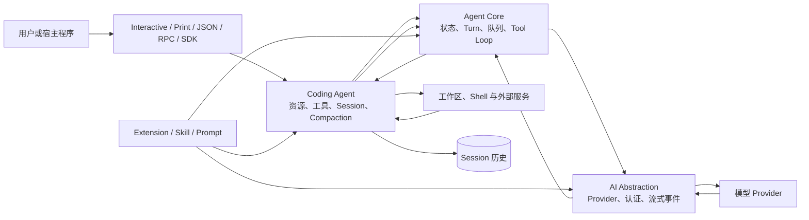

# Pi：极简而可扩展的 Agent Runtime

Pi 是一个以 TypeScript 为主要实现语言、面向终端和嵌入式应用的编程智能体运行时（Agent Runtime）。它提供统一的模型服务适配层（AI Abstraction）、有状态的 Agent Core、带工作区工具与会话（Session）能力的 Coding Agent，以及可单独复用的终端用户界面（Terminal User Interface，TUI）。用户可以直接进入交互终端，也可以使用一次性文本或 JSON 输出、基于标准输入输出的远程过程调用（Remote Procedure Call，RPC），还可以把 Agent Session 嵌入自己的程序。Pi 的特别之处不在于组件少到只剩一次模型请求，而在于它刻意不替所有使用者决定规划、委派、审批和隔离应当采用哪一种形态。

本章仍以[“一句话请求先要落到正确的工作区”这一教学案例](00_index.md#一句话请求先要落到正确的工作区)为入口：用户要求定位配置解析错误、完成修改、运行测试并解释结果。对 Pi 而言，核心问题是，哪些能力必须成为稳定内核，哪些工作流应留给扩展与宿主；模型调用、工具状态（Tool State）、会话历史和 TUI 怎样保持一致；当内核不提供通用权限系统时，项目资源装入、动作拦截和外部隔离又分别承担什么责任。固定版本源码给出的答案是一种“机制完整、策略开放”的组合：核心闭合运行循环，扩展接口（Extension API）承担高级治理，真实安全边界则需要明确落在进程、容器或虚拟化环境上。

## 极简核心的设计哲学

Pi 所说的“极简”，首先是对**产品策略进入内核的克制**。它默认向模型提供读取、写入、编辑和 Shell 四项工具，保留模型选择、思考级别、消息队列、会话树、压缩、分支和恢复等通用运行能力，却不把模型上下文协议（Model Context Protocol，MCP）、子智能体（Subagent）、计划模式（Plan Mode）、Todo、权限弹窗和后台 Shell 规定为唯一标准路径。使用者可以安装第三方 Pi Package，也可以用 TypeScript Extension 组合自己的工具、命令、生命周期钩子（Hook）和界面。这个定位与[Plugin、Extension、MCP、Skill 与 Hook 的五类机制](09_plugins_mcp_and_extensions.md#pluginextensionmcpskill-与-hook)一致：不同机制解决的是不同层次的问题，不必由一个包管理或协议抽象全部吞并；Plan 是否应限制写入，也应回到[计划模式与执行模式](15_goals_planning_and_todos.md#计划模式与执行模式)的真实能力差异判断。

这种选择并不否认高级能力的价值，而是认为高级能力常常包含无法普遍回答的政策问题。一个“规划模式”究竟应该只读、允许写哪个计划文件、是否允许 Shell，取决于组织流程；一个 Subagent 应该共享 Session、启动子进程还是进入远端队列，取决于隔离、成本和恢复要求；一个权限弹窗应该按命令、目录、工具还是风险分类，也取决于部署环境。Pi 把这些选择留在扩展面，使核心不必为了覆盖所有答案而内置一套不断增长的策略矩阵。

表 25-1 把这种责任分配压缩为三个层次。它不是功能清单，而是后文判断边界的基线：稳定内核负责让任务可持续运行，Extension 负责选择工作流政策，宿主环境负责提供不能由同进程代码自证的强制限制。

| 层次 | 主要责任 | 典型机制 | 不能自动推出 |
|---|---|---|---|
| 稳定内核 | 维持模型、Turn、Tool Result、Session 与事件闭环 | AI Abstraction、Agent Core、Coding Agent | 已具备某一种组织治理流程 |
| 扩展与资源 | 定义特定工作流、交互和能力组合 | Extension、技能（Skill）、提示模板（Prompt Template）、Pi Package | Extension 已被隔离或来源可信 |
| 宿主与外部环境 | 限制进程真实可达的文件、网络、凭据和计算资源 | 容器、虚拟机、远端沙箱、操作系统策略 | 模型输出正确或任务已经验证 |

*表 25-1　Pi 的三层责任分配。表中“不能自动推出”一列用于防止把相邻层次的能力误写成同一项保证。*

### 极简内核的取舍：什么不做，以及为什么

这项设计最有代表性的地方，是它把“不内建”写成可替代的责任边界。内核不内建 MCP，不表示外部能力无法接入；Extension 可以注册 MCP Tool，Skill 也可以教模型使用已有命令行程序。内核不内建 Subagent，不表示只能单线程工作；扩展示例可以启动多个独立 Pi 进程。内核不内建 Permission Popup，不表示每个动作都必须无条件执行；Tool Call 前置 Hook 可以确认或拒绝，真正不受绕过影响的限制则应放在容器、虚拟机或操作系统策略中。这个取舍把[工具发现与授权的区别](08_tool_call_system.md#权限和副作用边界)保持得很清楚：模型看见什么、运行时同意什么、进程实际上能做什么是三件事。

> **设计取舍｜固定高级工作流，还是固定可组合的接缝？**
>
> 把 Plan、Subagent、Approval 和 MCP 做成内建功能，可以提供一致默认值和集中测试；把它们放到 Extension，则允许不同团队按照自己的工作区、交互和隔离要求重组。Pi 选择固定 Agent、Tool、Session 与事件边界，再开放足够深的生命周期接缝。收益是内核较小、替换成本较低；代价是治理质量、扩展兼容和安全组合不能只由上游内核负责。

因此，评价 Pi 不能用“内建功能数量”代替架构判断。它更接近一套可编程的本地 Harness：默认路径短，使用者可以直接工作；复杂路径也能构造，但要显式选择扩展、Session backend 和隔离环境。与 Codex 把审批和沙箱做成共享控制面、OpenCode 把 Agent Mode 和 Server 做成平台能力相比，Pi 把更多差异留给部署者。这里是责任分配的不同，不是完整度排名。

## Agent Core、AI Abstraction 与 Coding Agent

Pi 的总体结构可以分成三层。最底层的 AI Abstraction 统一模型服务提供方（Provider）、模型目录、认证、流式响应、Tool Call、推理内容、令牌（Token）与成本。中间的 Agent Core 持有系统提示、模型、思考级别、活动工具、消息转录和运行状态，并执行从模型响应到 Tool Result 再到下一轮模型调用的循环。最上层的 Coding Agent 把这套通用循环放进真实工作区，加入文件与 Shell 工具、Context 文件、Session、压缩、自动重试、资源加载、Extension、CLI、RPC 与 TUI。

这三层对应[统一参考架构的八个核心对象](04_reference_architecture.md#八个核心对象一项任务由什么组成)，但 Pi 不要求内部名称与参考模型完全一致。AI Context 保存系统 Prompt、Message 和 Tool Schema；Agent state 保存本次运行实际使用的模型、工具与消息；Coding Agent 的 SessionManager 再把 Message、模型变化、思考级别、工具集合、压缩摘要和扩展条目放进可继续的树形历史。Context 是模型当前看见的输入，Session 是任务历史，工作区中的文件和测试结果则属于外部状态与 Artifact；三者不能相互替代，这也是[Context 不只是 Prompt](07_context_and_instruction_system.md#context-为什么不只是-prompt)在 Pi 中的具体表现。

图 25-1 展示默认交互路径及其可扩展边界。用户输入先由 Coding Agent 处理命令、Skill 和 Prompt Template，再交给 Agent Core。Agent Core 通过 AI Abstraction 调用 Provider；Tool Call 回到 Coding Agent 的工具注册表，产生 Tool Result 后重新进入循环。TUI、JSON 或 RPC 只是事件与控制的不同投影，Session 则在旁路保存规范历史。Extension 可以进入资源装载、Prompt、模型请求、Tool 和 Session 生命周期，但它并不是一个权限更低的插件沙箱。

*图 25-1　Pi 的分层运行路径。替代说明：不同入口进入 Coding Agent，由 Agent Core 组织模型与工具循环，AI Abstraction 连接 Provider，工具作用于工作区；Session 保存历史，Extension、Skill 与 Prompt 从不同层次改变运行。*

图中的 AI Abstraction 不是简单的请求转发器。Provider 拥有模型目录、认证方式和流式实现，Models 集合负责按 Provider 路由请求，并把不同服务的文本、推理、Tool Call、停止原因和用量映射到统一消息。Coding Agent 可以在同一个 Session 中切换模型，Session 记录模型变化，下一轮仍以统一 Message 和工具结果（Tool Result）继续。这正是[Provider 层所隔离的协议变化](06_model_and_provider_abstraction.md#provider-层在隔离什么)：模型端格式可以不同，Harness 侧对工作区副作用和会话连续性的理解仍需稳定；Token 和成本字段的解释则应服从[Token 账本](14_token_efficiency_and_cost_control.md#token-账本到底记录什么)的口径，而不是只看一个总数。

Agent Core 则故意不知道“代码仓库”是什么。它关心的是 transcript 如何转换成模型消息、Tool Schema 怎样校验、Tool Result 何时回写、事件如何流出，以及用户在运行期间追加的 steering 或 follow-up 怎样进入下一轮。Coding Agent 再把 read、write、edit、bash 等具体能力和[Workspace 发现与作用域](18_code_editing_git_and_workspace.md#workspace-发现与作用域)接上去。这样的分层让 Agent Core 可以服务非编码应用，也让 Coding Agent 能替换模型层或工具实现，而不用改写循环。

固定版本还包含实验性的 Protocol、Client 与 Server 组件，以及独立的遥测（Telemetry）契约。Protocol 使用带请求关联的二进制消息和权威 Session snapshot，Client 不根据瞬时 progress event 乐观修改状态，Server 则要求宿主应用提供 Session service 与传输认证。这些组件说明 Pi 正在把远程 Session 与可观测性变成可组合接口，但它们仍标为实验性；当前 Coding Agent 的主要产品入口仍是交互、print/JSON、RPC 与 SDK，不能据此把 Pi 描述成已经默认运行的多客户端服务平台。若要判断这些事件是否足以支持诊断，还需区分[Log、Event、Trace 与 Metric](19_observability_evaluation_and_replay.md#logeventtrace-与-metric)。

## Loop、Tool State 与 TUI

Pi 的一次 Agent run 可以包含多个 Turn。这里的 Turn 是一次 assistant response 及其产生的工具批次，而不是“一条用户消息到最终答案”的全部过程。模型返回 Tool Call 时，Agent Core 找到对应 Tool，准备并校验参数，执行工具，把结果包装成带同一 Call ID 的 Tool Result，再开始下一个 Turn。没有更多 Tool Call 和 steering 消息后，外层循环还会检查 follow-up 队列；只有这些继续条件都为空，才发出 Agent end。它落实了[Turn、状态与循环不变量](05_harness_loop.md#turn状态与循环不变量)：动作必须有可关联结果，结果必须进入后续 Context，错误、取消和完成不能混成一个终态。

工具执行支持顺序和并行两种模式。默认并行路径先按模型给出的顺序完成每个调用的查找、参数验证和前置 Hook，再并发执行获准的工具。`tool_execution_end` 可以按实际完成顺序到达，使 TUI 及时更新；但写入 transcript 的 Tool Result 最终仍按原始 Tool Call 顺序排列，避免并发时序改变模型下一轮看到的逻辑顺序。只要批次中有工具声明必须顺序执行，整个批次就退回顺序模式。这个设计对应[并行 Tool Call 的双顺序问题](05_harness_loop.md#流式事件与并行-tool-call)：界面追求及时，持久 Context 追求稳定，两者不必共用同一种排序。

错误也被放回相同的 envelope。未知工具、参数 Schema 不合法、前置 Hook 阻断和执行异常都会形成 error Tool Result，而不是让循环丢失调用身份。若模型响应因为输出上限而截断，Pi 不执行其中可能只有半段 JSON 参数的 Tool Call，而是为这些调用生成明确错误，要求模型重新发起完整动作。[Tool-call request、response 与 error envelope](08_tool_call_system.md#七系统-tool-call-envelope-对照)在这里不是抽象表格，而是防止错误调用被误当成成功 Observation 的运行约束。

Tool State 也不只存在于屏幕。Agent state 持有活动工具、流式中的 assistant message、等待完成的 Tool Call 和错误信息；AgentSession 持有所有工具定义、当前启用名称及其来源，并可在 Extension 重载后重建注册表和系统 Prompt；SessionManager 保存最终 Message 和工具集合变化。TUI 消费 start、update 和 end 事件显示流式文本、命令进度与结果，JSON/RPC 则提供机器可读投影。可见进度帮助人在回路（Human-in-the-loop）判断是否中断，但[展示、控制与状态契约](20_interfaces_and_human_in_the_loop.md#clituiidedesktopweb-与-api)仍由 AgentSession 和 Session 历史闭合，屏幕最后一行不是权威记录。

Pi TUI 本身是一套独立组件库。它提供主屏和备用屏渲染器、差分渲染、焦点、Overlay、编辑器、选择器、Markdown 与图片组件；Coding Agent 在其上组合消息区、编辑器、footer、模型选择、Session tree 和工具视图。Extension 还可以替换编辑器、header、footer，加入 widget 或自定义 Overlay。这使界面扩展与 Agent Loop 解耦：同一个 Extension 可以在交互模式展示确认框，在无 UI 的 print 或 RPC 模式中则必须得到保守默认或采用预先配置，不能假定每个入口都能现场询问用户。

长任务还会触发自动重试与上下文压缩（Compaction）。Pi 保留完整 JSONL 历史，再根据 Context 压力生成摘要并保留近期尾部；溢出时可以删除失败 assistant message 对当前重试 Context 的影响、压缩后再尝试一次。这里同时用到了[截断、摘要、选择与外部化四类压缩](13_compaction_and_context_management.md#截断摘要选择与外部化)，但压缩不是记忆（Memory）。Pi 当前核心更重视 Session 内历史与过程性 Skill，[项目级、用户级与 Session 级 Memory 范围](10_memory.md#项目级用户级与-session-级范围)提醒我们：保存全部历史或加载一个 Skill，并不等于系统已经维护跨任务、可更新的语义记忆。

## Extension、Prompt、Skill 与 Session Backend

Pi 的定制面分成三个读者容易混淆的层次。Prompt Template 是可参数化的复用输入，在用户提交阶段展开；Skill 是按需加载的过程知识包，可以通过 `/skill:name` 显式调用，也可以作为可发现资源进入模型工作方式；Extension 是同进程 TypeScript 模块，可以注册真实 Tool、命令、快捷键、CLI Flag、Provider 和 UI，并进入 Context、模型请求、Tool、Session 与 Compaction 生命周期。关于三者为何不能只叫“提示词插件”，可回看[四类定制机制的职责](11_skills_prompts_commands_and_hooks.md#四类机制分别解决什么问题)。本节还会区分当前 JSONL Session 与可替换的会话后端（Session Backend），避免把存储格式和任务语义绑定成同一件事。

资源加载器负责把全局、项目、CLI 临时路径和 Pi Package 解析成有效 Extension、Skill、Prompt 与 Theme。Extension 还可以在 Session start 后贡献额外资源目录，随后 AgentSession 重建系统 Prompt 与命令列表。用户执行 `/reload` 时，旧 Extension Runtime 先收到 shutdown，设置与资源重新加载，新 Runtime 再收到 session start；旧 Context 会被视为失效，扩展若跨 reload 保存旧对象，就可能对已经替换的 Session 操作。热重载带来高迭代效率，也把生命周期纪律变成 Extension 作者必须承担的正确性要求。

### Extension API 承担高级治理

Extension API 是 Pi 代表性设计的控制中心。它可以在 `input` 阶段处理或改写输入，在 `before_agent_start` 修改本轮系统 Prompt，在 `context` 改变送往模型的消息，在 Provider 请求前调整 payload 或 header；它还能在 `tool_call` 阶段阻断动作，在 `tool_result` 阶段修正内容与错误状态，在 Session switch、fork、tree 和 compact 之前取消或替换默认行为。扩展也能写入不会进入模型 Context 的自定义 Session entry，从而保存自己的状态。这一组能力已经超过普通插件注册表，更接近可编程的生命周期控制面。

> **特色机制｜高级治理由 Extension 组合，而不是由模式枚举固定**
>
> Plan Mode 可以通过切换活动工具和保存自定义状态实现，Permission Gate 可以在 Tool Call 前询问，Gondolin 可以替换全部内建工具的执行后端，Subagent 可以注册为一个新 Tool。收益是这些策略能围绕真实环境定制；代价是多个 Extension 可能竞争同名 Tool、Command 或 Hook，加载顺序和冲突诊断必须可见，而且 Extension 本身拥有宿主进程权限。它是治理接缝，不是隔离边界。

这种扩展深度也改变了供应链判断。Pi Package 可以从 npm、Git 或本地路径带来 Extension、Skill、Prompt 与 Theme；固定引用可以减少无意更新，但安装依赖和运行 Extension 仍是执行代码。Skill 虽不是进程内模块，也可能指示模型运行可执行文件。因此，[Plugin、MCP 与 Skill 来源](22_configuration_identity_and_supply_chain.md#pluginmcp-与-skill-来源)中的来源、版本、作用域和更新策略，在 Pi 中直接决定运行时信任面。

Session 持久化同时存在两条层次不同的路径。Coding Agent 当前默认的 SessionManager 把 entry 写入按工作目录组织的 JSONL 文件；每个 entry 有 ID 与 parent ID，因此一个文件可以保存树内分支，`/tree` 在旧节点继续，`/fork` 和 `/clone` 则创建新 Session 文件。Message、模型变化、思考级别、活动工具、压缩摘要、分支摘要和 Extension 自定义条目都能进入历史。这与[Event Log、Snapshot 与 Checkpoint](12_session_persistence_and_resume.md#event-logsnapshot-与-checkpoint)中的追加日志思路接近，但恢复后仍需重新观察工作区和外部进程，不能把历史重放当成副作用回滚。

另一方面，Agent Core 已定义运行时中立的 Session repository、storage、tree、lane 与 record 接口，并提供 JSONL repository；独立包还实现了 SQLite backend，包含写者租约、串行操作队列、WAL 和耐久同步设置。实验性 Server 只依赖宿主提供 Session service，而不强制一种存储。这说明 Pi 正在把 Session Backend 从 Coding Agent 的具体 JSONL 实现中抽离，便于嵌入式或远程应用选择存储。但本章的固定版本中，普通 Coding Agent 默认仍走原有 SessionManager JSONL 路径；SQLite 和协议服务已经实现，不等于交互 CLI 已默认切换。

## 权限与外部隔离边界

Pi 的安全分析必须先接受一个明确事实：默认内核没有通用权限系统（Permission System）和内建沙箱。read、write、edit 与 bash 以启动 Pi 的用户和进程权限运行；Extension 也是同进程代码。这个选择适合用户在自己的开发环境里持续监督 Agent，却不适合把“本地运行”自动解释成最小权限。对[主体、能力与信任边界](17_security_permissions_and_sandboxing.md#主体能力与信任边界)而言，模型、Tool 和 Extension 的逻辑身份不同，但默认在操作系统层并没有因此获得彼此隔离的凭据或文件视图。

### Project Trust 是资源装入门

Pi 的项目可信（Project Trust）机制解决的是**启动时是否装入仓库控制的可执行和配置资源**。当当前目录存在项目 settings、Extension、Skill、Prompt、Theme、系统 Prompt，或路径祖先中存在项目 Agent Skills 时，资源加载器先强制按“不信任项目”启动一次，只加载用户/全局 Extension 和 CLI 显式 Extension。随后系统依次考虑命令行 override、受信 Extension 的裁决、当前或父目录保存的最近决定、全局默认值和交互选择；决定形成后再重载 settings 与最终资源集合。

这个两阶段装入很重要。若先执行项目 Extension 再询问信任，问题已经发生；若连用户级治理 Extension 都不加载，企业或个人又无法接管信任对话。Pi 因而让预先受信的 Extension 有机会处理 `project_trust`，第一个明确 yes/no 的处理器决定结果。交互模式默认可以询问并把规范化目录决定保存到用户 trust store；print、JSON 和 RPC 没有现场 UI 时，默认 ask 会降为不装入项目资源，除非已有决定或显式 override。

> **安全提示｜Project Trust 不批准后续 Tool Call**
>
> 信任项目只允许加载项目 settings、资源、Package 和 Extension。它不是逐动作审批，也不限制已经启用的 read、write、edit、bash。`AGENTS.md`、`AGENTS.override.md` 或 `CLAUDE.md` 等 Context 文件默认仍可在未信任项目中加载，因此仓库文本依然可能影响模型。它防止的是启动前静默改变运行时，不是消除[Prompt Injection 到能力执行](17_security_permissions_and_sandboxing.md#prompt-injection-到能力执行)的整条风险链。

### 无内建通用 Permission System

Pi 并非没有动作拦截接缝。Agent Core 在参数校验后、工具执行前调用 `beforeToolCall`，Coding Agent 把它连接到 Extension 的 `tool_call` 事件；Extension 可以检查工具名和最终参数，弹出确认、拒绝危险 Shell、保护特定路径，或让全部被阻断的工具结果结束当前自动循环。工具完成后，`tool_result` Hook 还能修改返回内容和错误状态。示例中的 Permission Gate、destructive confirmation 与 protected paths 证明这条路径已经接入真实 Loop。

但这些机制属于进程内政策。恶意或错误 Extension 可以不经模型 Tool Call 直接使用 Node API，Shell 工具也可能通过解释器、脚本或子进程表达复杂副作用。用户确认只能说明当时同意展示的动作，路径规则也只覆盖它能够正确解析的路径。因而 Extension gate 适合组织人机流程、减少误操作和实现环境特定策略，却不应被写成操作系统强制边界。需要强限制时，应使用[文件、进程与网络沙箱](17_security_permissions_and_sandboxing.md#文件进程与网络沙箱)。

### 外部隔离的两条路径

Pi 文档给出两类外部隔离。第一类把整个 Pi 进程放入 Docker 或 OpenShell。这样模型请求客户端、内建工具、Extension 和 Session 都在同一隔离域内运行，边界更容易解释；代价是 Provider 凭据、项目文件和用户 Session 如何进入容器必须重新设计。把宿主工作区读写挂载进去，容器内修改仍会写回宿主；挂载宿主的 Pi 配置目录，还会暴露认证和历史。OpenShell 可以进一步把网络、凭据和推理入口交给外部策略控制，但本章没有运行验证其具体部署。

第二类让 Pi 留在宿主，只把工具执行路由到隔离环境。Gondolin 示例用 Extension 替换 read、write、edit、bash、grep、find 和 ls，并把用户 `!` 命令送进本地 micro-VM；宿主当前目录映射到 guest workspace，工作区内修改写回宿主，其他 guest 文件变化留在虚拟机。这样可以保留宿主 Provider 认证和 TUI，同时缩小常用工具的执行面。边界也更碎：没有被替换的自定义 Extension Tool 仍在宿主运行，扩展初始化代码本身也在宿主，不能因为“启用了 Gondolin”就推断所有能力都已隔离。

两条路线体现了 Pi 的一贯选择：内核提供可以替换工具后端的接口，但不宣称进程内拦截等价于强沙箱。整进程隔离的信任边界更完整，工具路由的本地体验更直接；使用者应根据仓库可信度、自动化程度、凭据位置、网络需求和结果回传方式选择，而不是把二者合并成一个“安全模式”。取消、进程清理和部分副作用仍需结合[Timeout、Cancel 与 Interrupt](21_reliability_and_resource_control.md#timeoutcancel-与-interrupt)重新观察。

## Subagent 扩展示例

Pi 的 Subagent 示例是理解其设计哲学最直接的案例。它没有向 Agent Core 增加 child Session 类型，而是注册一个名为 `subagent` 的 Tool。父模型调用它时，Extension 从 Markdown 文件发现专用 Agent 定义；每个定义包含名称、描述、可选模型、工具 allowlist 和系统 Prompt。扩展随后启动独立的 `pi --mode json -p --no-session` 子进程，把专用 Prompt、当前或指定模型、思考级别、工作目录和任务文本传入，再从 JSON 事件流收集 assistant message、Tool Result、用量、错误和最终输出。

这条路径把[Parent、Child、Task、Thread 与 Session](16_subagents_and_orchestration.md#parentchildtaskthread-与-session)拆成一种特定实现：父是当前 AgentSession，Task 是 Tool 参数，Child 是操作系统子进程；示例没有为 Child 创建可 Resume 的持久 Session。每个子进程拥有隔离的模型 Context，却默认可以指向同一个工作目录，因此“上下文隔离”不等于“工作区隔离”。父模型只看到扩展包装后的 Tool Result，仍要核对 child 报告是否与共享文件和测试现场一致。

示例支持 single、parallel 和 chain 三种模式。single 启动一个专用 Agent；parallel 最多接收八项任务，以最多四个并发 worker 执行，并持续汇总各子进程状态；chain 按顺序运行步骤，用 `{previous}` 把前一步输出嵌入下一步任务。AbortSignal 会先向子进程发送终止信号，等待后再强制结束；链中任一步失败则停止后续步骤。模型可见结果设有大小上限，完整细节仍保留在 Tool details。这些选择把[Wait、Join、取消与失败传播](16_subagents_and_orchestration.md#waitjoin取消与失败传播)落实为 Extension 自己的调度政策，而不是 Agent Core 的固定语义。

项目级 Agent 定义还展示了信任传播问题。示例默认只加载用户目录中的 Agent；只有调用者显式选择 project 或 both，才发现仓库控制的 Agent Markdown。在交互模式、项目尚未被信任且确实要运行项目 Agent 时，扩展可以再弹出确认。这里的保护对象不是一个新的可执行模块，而是一份能指示子模型使用 Shell 和文件工具的过程性 Prompt。它说明[权限、参数与上下文继承](11_skills_prompts_commands_and_hooks.md#权限参数与上下文继承)不能只检查代码来源，也要检查委派 Prompt、工具集合和 cwd。

> **特色机制｜Subagent 是一个可替换的 Tool 拓扑**
>
> Pi 示例把委派实现为“父 Tool Call → 独立 Pi 进程 → JSON 事件 → 父 Tool Result”。收益是无需改变 Agent Core，就能替换 agent 定义、并发上限、链式协议和模型选择；子 Context 也天然分离。代价是 child 没有默认持久 Session，取消与错误恢复由扩展负责，共享工作区可能发生写冲突，父 Agent 还必须承担结果汇聚和最终验证。

这并不是唯一可能的 Pi Subagent 方案。另一个 Extension 可以改用 tmux、远端队列、SQLite Session backend 或专用服务，甚至为 child 建立不同容器。正因为可选拓扑很多，Pi 上游没有把示例提升为唯一主路径。这个案例因此不用于证明 Pi “内建多 Agent”，而用于证明 Extension 接缝足以构造一种可工作的多进程委派，并清楚暴露其恢复、权限和 Workspace 边界。

## 适用场景与延伸阅读

Pi 适合希望从一个直接可用的终端 Coding Agent 起步，同时保留深度编程能力的个人或小型工程环境。默认四工具路径容易理解，模型与 Provider 可以切换，JSONL Session 支持分支、恢复和压缩；当团队已有自己的容器、命令行工具、审批流程或远端执行器时，Extension 可以把它们接进真实生命周期，而不必迁移到一个预设治理平台。SDK、RPC 和实验性协议组件也适合把同一 Agent Core 嵌入其他应用。

它不适合被未经设计地当作强隔离、多租户或无人监管执行平台。默认进程拥有启动用户的文件、进程、网络和凭据能力；Project Trust 只管理项目资源装入；Extension 是同权代码；Subagent 示例是非耐久子进程；工具路由沙箱也可能遗漏自定义能力。需要组织级审批、统一审计、跨重启调度或租户隔离时，部署者必须补上外部控制面，或者选择已把这些责任内建为产品核心的 Harness。

继续阅读可以按问题进入机制章。理解 Pi 的多 Turn 与 Tool Result 顺序，可回到[七个系统如何组织 Loop](05_harness_loop.md#七个系统如何组织-loop)和[执行、结果与 Observation](08_tool_call_system.md#执行结果与-observation)；分析 Extension、Skill 与 Pi Package，可串联[七个系统的扩展路径](09_plugins_mcp_and_extensions.md#七个系统的扩展路径)、[Skill 的发现、选择与加载](11_skills_prompts_commands_and_hooks.md#skill-的发现选择与加载)和[供应链风险](22_configuration_identity_and_supply_chain.md#供应链风险)；研究 Session tree、Compaction 与恢复边界，可阅读[Resume、Replay、Branch 与 Fork](12_session_persistence_and_resume.md#resumereplaybranch-与-fork)和[Memory、Resume 与上下文重建](13_compaction_and_context_management.md#memoryresume-与上下文重建)。

若关注委派，应把本章示例与[共享 Workspace、竞争与结果汇聚](16_subagents_and_orchestration.md#共享-workspace竞争与结果汇聚)对照；若关注本地安全，则从[Workspace Trust 与 Credential Isolation](17_security_permissions_and_sandboxing.md#workspace-trust-与-credential-isolation)进入，再检查容器挂载、Extension 来源和 Provider Credential。Pi 的教学价值正是在这些链接之间：它用较少的内核政策，让每一项额外治理都必须说明由谁实现、在哪里执行、失败后留下什么状态。

## 本章小结

Pi 是一个分层而非单薄的 Agent Runtime。AI Abstraction 隔离 Provider、认证和流式协议；Agent Core 持有 transcript、Turn、Tool 与消息队列；Coding Agent 加入工作区工具、Session、Compaction、资源装载、CLI/RPC 和 TUI。一次配置修复因此仍然沿完整循环推进：模型提出 Tool Call，Harness 校验并执行，Tool Result 回到下一轮，Session 保存历史，界面展示进度。

它最有代表性的设计是把高级治理交给 Extension API。Prompt Template 复用输入，Skill 提供过程知识，Extension 则能进入 Prompt、Provider、Tool、Session、Compaction 和 UI 生命周期；Plan、Permission、Sandbox 路由和 Subagent 都可以由同一扩展面组合。当前默认 Coding Agent 使用 JSONL Session tree，新的 Session repository、SQLite backend、Protocol 与 Server 组件扩展了嵌入方向，但其中实验性能力不能写成默认平台路径。

回到章首问题，Pi 的“极简而可扩展”不是用少量代码回避 Harness 责任，而是只固定循环、状态、资源和生命周期接缝，把工作流与政策留给使用者。这个选择带来可塑性，也要求更清楚地承担边界：Project Trust 只控制项目资源装入，Tool Hook 只提供进程内政策，强隔离必须落在外部执行环境，Subagent 结果仍由父任务验证。理解这些责任分界，才是理解 Pi 的关键。
