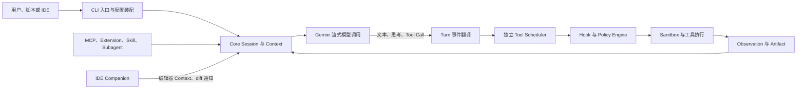
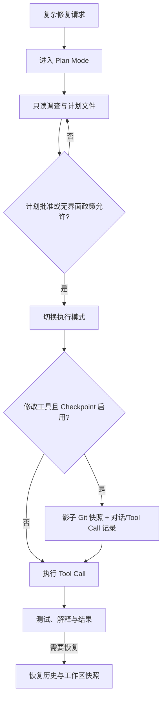

# Gemini CLI：搜索增强、扩展与自动化

Gemini CLI 是一个以终端为主要交互面、以 TypeScript 核心运行时（Core）为中心的开源编程智能体（Coding Agent）。它不只是把用户文字发给 Gemini 模型：系统还要装配工作区指令和集成开发环境（Integrated Development Environment, IDE）现场，注册本地与远端工具，消费模型流，把工具调用（Tool Call）交给独立调度器，执行权限与沙箱判断，再把观察结果（Observation）写回同一任务。读者若直接从本章进入，可以先把这套结构映射到[统一参考架构的八个核心对象](04_reference_architecture.md#八个核心对象一项任务由什么组成)：会话（Session）保存任务连续性，轮次（Turn）表示一次受控推进，上下文（Context）是当前模型调用实际可见的投影，工具（Tool）与任务产物（Artifact）则把推理连接到现实副作用和可检查结果。

本章继续使用[“一句话请求先要落到正确的工作区”](00_index.md#一句话请求先要落到正确的工作区)中的教学案例：用户要求定位并修复配置解析错误、运行测试并解释修改。我们要回答的不是“Gemini 模型能不能写代码”，而是 Gemini CLI 怎样把搜索、流式调用、扩展、计划、恢复和安全控制组合成一条完整路径；这些组件在哪些地方相互复用，又在哪些地方刻意保持边界。所有实现判断均固定到本报告调查的源码快照，项目内部路径和符号保存在作者台账，正文只呈现读者需要理解的机制。

## 项目定位与组件边界

Gemini CLI 的中心问题是：怎样让一个面向个人工作区的终端 Agent 同时具备较丰富的搜索与扩展能力，又不把界面、模型适配、工具执行和安全决策揉成一个不可替换的循环。固定版本给出的答案，是把产品拆成几层相互连接但责任不同的组件。命令行层处理参数、配置、认证、交互式终端用户界面（Terminal User Interface, TUI）和无界面模式（Headless）；Core 层拥有模型客户端、Session 状态、工具注册表、工具调度器（Scheduler）、策略引擎（Policy Engine）、沙箱（Sandbox）、模型上下文协议（Model Context Protocol, MCP）客户端、技能（Skill）、钩子（Hook）和子智能体（Subagent）；软件开发工具包（Software Development Kit, SDK）把 Core 的一部分能力包装为可嵌入的 TypeScript Agent/Session API；IDE 伴随扩展（IDE Companion）则通过本机协议向 CLI 提供编辑器现场与差异（diff）交互。可安装扩展（Extension）位于 CLI 管理面与 Core 能力装配之间，可以一次贡献其中多种对象。

图 26-1 展示主要控制流。这里最值得注意的是两次分离：模型流只产生内容和工具请求，不能直接执行环境动作；工具执行也不由终端 UI 自己完成，而是进入 Core 的调度与政策路径。因而，无论入口是 TUI、非交互命令、SDK 还是 IDE，真正决定“一个请求怎样变成副作用”的仍是同一组 Core 责任。

*图 26-1　Gemini CLI 的主要控制流。模型、调度、安全和执行分别占据不同边界，多个入口最终复用 Core 的 Session 与工具运行时。*

这种分层使系统既像应用，也像平台。作为应用，它提供开箱即用的 TUI、文件搜索、编辑、命令解释器（Shell）、Web 工具、恢复（Resume）和审批界面；作为平台，它允许 Extension 同时贡献 MCP Server、Skill、Hook、Agent、Policy 和 Context，允许 SDK 注入自定义工具与指令，也允许 IDE 只承担编辑器适配而不复制完整 Agent Loop。代价是初始化顺序更复杂：配置必须先确定工作区、信任和管理策略，扩展与 MCP 的发现可能异步进行，工具集合变化后还要更新模型可见模式（Schema），Hook、Skill 和 Agent 注册表（Registry）也需要重载或刷新。

从本报告的统一语言看，Gemini CLI 属于“显式工具运行时”路线。它维护结构化 Tool Call、调用标识（Call ID）、状态、进度、错误与确认，并在独立 Scheduler 中收敛批次；这与[工具系统的四类封装（envelope）](08_tool_call_system.md#请求参数与-call-id)对应。它同时又比纯本地编辑 Agent 更强调外部信息面：Google Web Search、Web Fetch、MCP Resource、IDE Context 和 Extension Context 都能成为新的 Observation。搜索增强不是在模型前面接一条固定的检索增强生成（Retrieval-Augmented Generation, RAG）管线，而是把多种检索能力纳入可治理的工具与 Context 体系。

## CLI、Core、SDK 与 IDE Companion

命令行界面（Command-line Interface, CLI）入口首先处理一个看似与 Agent 推理无关、实际影响可靠性的启动问题：主进程尽量保持轻量，必要时按机器内存配置重新启动重进程，并由父进程负责重启协议和信号衔接。进入重进程后，CLI 才加载设置、解析参数、清理过期临时数据、确定 Session 是新建还是恢复、选择认证路径，并根据终端环境进入交互式或非交互式执行。这使“界面模式”成为入口选择，而不是另起一套模型与工具实现。

Core 初始化则把运行所需的能力聚合到 Config。它先建立存储（Storage）和工作区上下文（Workspace Context），再创建 Prompt、Resource、Agent 与 Tool Registry；随后启动配置中的 MCP Server 和已激活 Extension，发现 Skill，初始化 Hook System 与记忆上下文（Memory Context），最后启动 Gemini Client。交互式启动不会因为慢 MCP 阻塞整个 TUI，但无界面与协议入口会等待发现完成，以便脚本从第一轮起获得确定的工具集合。这一差异说明启动延迟和能力确定性是可以按入口权衡的，而不是所有客户端都必须采用同一等待策略。

SDK 提供更窄的嵌入边界。调用方创建 Agent，传入指令、模型、工具与 Skill，再创建或恢复 Session，并通过异步事件流消费模型文本和工具活动。SDK 仍复用 Core 的 Config、Gemini Client、Registry 与 Agent Tool 调度，却默认关闭 Hook、MCP 和 Extension；其政策默认放行工具，源码还明确留下“将来怎样接入审批”的问题。这种设计适合受信任宿主快速嵌入，但不能把 CLI 产品的文件夹信任（Folder Trust）、交互确认和扩展治理自动算作 SDK 的安全属性。SDK 的边界不是“完整 CLI 的无界面版本”，而是以宿主承担更多决策为代价的可编程内核。

IDE Companion 也保持相似克制。它不是第二个 Agent，而是 VS Code 一侧的本机伴随服务：收集打开文件、活动文件、选区与工作区目录，向 CLI 发送全量或增量 IDE Context；当文件编辑需要人审查时，它打开 diff 视图并把接受或拒绝通知送回 CLI。连接使用回环地址、随机 Bearer Token、受限 Host/CORS 和权限收紧的端口文件。CLI 会把多根 IDE Workspace 加入 Workspace Context，但在模型刚发出函数调用、等待函数结果时延迟普通 IDE 更新，以保持 Provider 要求的 function call 与 function response 相邻关系；这一细节已在[Workspace、代码与动态上下文](07_context_and_instruction_system.md#workspace代码与动态上下文)中建立通用解释。

表 26-1 总结四层边界。它不是功能清单，而是说明同一个请求在不同层由谁拥有状态与副作用。

| 组件 | 主要责任 | 复用的 Core 能力 | 刻意不承担的责任 |
|---|---|---|---|
| CLI | 参数、配置、认证、TUI、Headless、Session 选择与用户反馈 | Config、Gemini Client、Scheduler、Policy、Storage | 不直接解释模型 Tool Call，也不自行实现工具 |
| Core | Loop、Context、Registry、工具调度、权限、沙箱、扩展和持久状态 | 统一的 Message Bus、Event、Tool 与 Session 结构 | 不绑定某一种终端或 IDE UI |
| SDK | 嵌入式 Agent/Session、流式事件、自定义工具与 Skill | Core Config、Client、Tool Registry、Agent Scheduler | 默认不带 CLI 的 MCP、Extension、Hook 与人类审批面 |
| IDE Companion | 编辑器 Context、diff 展示、CLI 启动入口 | Core 的 IDE 协议与 Context 注入 | 不拥有模型会话和最终文件写入逻辑 |

*表 26-1　CLI、Core、SDK 与 IDE Companion 的责任边界。分层的价值在于共享运行时而不复制控制中心。*

## 模型流式调用与搜索工具

Gemini CLI 把一次模型响应翻译为事件流，而不是等待一个最终字符串。Gemini Client 在 Turn 开始前处理 Context 容量、IDE 增量、循环检测、模型路由和工具 Schema，再调用模型流；Turn 将流中的思考、普通文本、函数调用、引用、结束原因和错误转换为内部事件。函数调用若缺少稳定标识，系统会合成 Call ID，并把工具请求收集到 pending 集合。只有 Scheduler 执行完成、结果按原调用关系写回后，客户端才发起下一次模型续行。这一流程具体化了[循环不变量](05_harness_loop.md#turn状态与循环不变量)：模型行动必须获得 Observation，调用与结果必须保持关联，终止原因也必须与“没有更多 Tool Call”区分。

搜索在这条流中有两种互补形态。工作区搜索由文件列表、Glob、文本搜索与读取工具完成，目标是从仓库中逐步缩小证据范围；Web Search 则向一个搜索专用模型发起 Google 搜索依据绑定（Grounding）请求，取得合成文本、来源条目和片段到来源的关联，再把引用标记插入结果。模型得到的不是原始搜索结果页，而是一份带来源列表的 Observation。对于“当前版本文档在哪里”之类问题，这能减少主模型自行拼接搜索片段的工作；对于需要核验细节的问题，系统再通过 Web Fetch 打开具体 URL。

Web Fetch 的边界更接近网络工具。它接受 URL 与处理要求，可由模型服务基于网页 Grounding 生成结果，也有直接抓取和文本转换的后备路径。固定版本限制协议、私有地址、响应体积、超时与每主机速率，并把取得的外部内容包成不可信数据。这样，搜索结果“有引用”与网页内容“可信、可执行”被分开：引用帮助读者回到来源，外部文本仍不能越过[容量预算与不可信内容](07_context_and_instruction_system.md#容量预算与不可信内容)或后续 Tool Permission。

> **设计取舍｜搜索合成还是原始页面？**
>
> 搜索专用模型直接返回带引用的合成答案，能够缩短主 Session 的输入并快速覆盖宽问题；代价是查询、来源选择与摘要都发生在额外模型调用中，主 Agent 未必看到完整页面。Web Fetch 提供深入单一来源的路径，却增加网络、内容体积、Prompt Injection 和时延边界。Gemini CLI 将二者做成独立 Tool，使主模型可以先宽搜、再按需取页；稳健用法仍需检查来源是否真正支持结论，而不能把 Grounding 标签当作事实正确性的证明。

搜索 Tool 也揭示了模型角色分层。主聊天模型负责目标与行动选择，Web Search 使用辅助工具角色（Utility Tool）的专用模型，Subagent 又可独立路由模型。它们共享认证、遥测和部分错误处理，却有不同的 Context 与输出目的。因而，[模型路由与 Fallback](06_model_and_provider_abstraction.md#能力发现路由与-fallback)不能只比较模型名称，还要说明调用属于主对话、辅助 Tool 还是子 Agent；一次辅助搜索失败不应自动终止整个 Session，但其错误必须作为 Observation 返回，避免主模型把“没有结果”误写成“事实不存在”。

### 独立 Tool Scheduler：把模型流与副作用提交拆开

Gemini CLI 最有代表性的设计之一，是让 Tool Scheduler 成为模型 Turn 之外的独立运行时。动机很直接：一个模型响应可能同时给出多个函数调用，其中有的只读、有的编辑文件、有的等待人类审批、有的来自 MCP、有的还会持续汇报进度。若 Turn 一边消费模型服务（Provider）流、一边直接执行工具，界面状态、并行性、确认、取消和错误写回很快会互相缠绕。

Scheduler 接收一批带 Call ID 的请求，先解析工具并构造 Invocation，再把调用推进为验证、等待审批、已调度、执行中、成功、错误或取消等状态。BeforeTool Hook 可以阻断或改写参数，Policy Engine 给出 allow、deny 或 ask，用户确认还可以更新更长期的政策；只有这些步骤收敛后，Executor 才运行工具。执行期间，Message Bus 与 Core Event 可以把确认、MCP 进度、实时输出和取消投射给 TUI 或 Headless 格式化器。最终状态与响应重新形成[执行、结果与 Observation](08_tool_call_system.md#执行结果与-observation)所需的 envelope。

并发不是简单的“全开”。编辑工具与主题更新被强制顺序执行，其他调用默认可并行，模型也能用 `wait_for_previous` 声明屏障。只有当前活动调用全部进入可执行或终态，Scheduler 才并行启动已调度项；用户取消一个确认会取消批次中尚未执行的队列。某些工具还能返回尾调用（tail tool call），让原 Call ID 在同一调度生命周期中转入另一个工具，例如先完成一种准备，再执行最终动作。收益是状态与进度统一，代价是 Scheduler 必须维护显式状态机、队列和事件一致性；取消活动状态也不能自动撤销工具已经产生的外部副作用。

> **特色机制｜独立 Tool Scheduler**
>
> 与把工具执行嵌在模型回复循环中的较窄实现相比，Gemini CLI 将 Tool Call 的解析、政策、确认、并行、进度、执行与终态集中为独立编排层。它让 TUI、Headless、SDK 和 Subagent 可以复用相同工具生命周期，也让编辑顺序、批次取消和沙箱扩权有清楚落点。代价是事件与状态转换更多，Scheduler 只能保证运行时调用收敛，不能把多个文件修改自动变成事务或回滚。该机制分别对应[流式事件与并行 Tool Call](05_harness_loop.md#流式事件与并行-tool-call)和[错误、重试与并行调用](08_tool_call_system.md#错误重试与并行调用)。

## MCP、Extension、Skill 与 Hook

Gemini CLI 的扩展系统不是单一插件接口，而是几种边界的组合。模型上下文协议（Model Context Protocol, MCP）连接外部 Tool、Prompt 与 Resource；Extension 是可安装、启停和更新的能力包；Skill 是带描述与正文的按需过程知识；Hook 则在 Session、Agent、模型、工具和压缩生命周期中截获事件。它们与[Plugin、Extension、MCP、Skill 与 Hook](09_plugins_mcp_and_extensions.md#pluginextensionmcpskill-与-hook)的五分类一致，但在本系统中可以由同一个 Extension 一起贡献，因此“一个包”与“包内能力的运行语义”不能混为一谈。

MCP Client Manager 管理多个 Server 的配置、连接、发现和诊断。Server 可以来自用户配置，也可以由 Extension 提供；同名配置合并时，工具 include allowlist 取交集，exclude blocklist 取并集，使更严格限制胜出。系统只有在工作区受信任、Server 未被管理策略阻断且未被用户禁用时才连接；发现到的能力分别进入 Tool、Prompt 和 Resource Registry，工具名称保留 Server 归属，返回内容包为不可信 Context。交互式启动允许发现异步继续，无界面入口则等待完成，这让 MCP 故障不必拖垮 TUI，同时保证自动化首轮能力更可预测。

Extension 管理面负责来源、同意、完整性、变量和生命周期。一个 Extension 可以贡献 MCP、Context 文件、排除工具、Hook、Skill、Agent、主题、Policy、Safety Checker 与计划目录。安装远端来源可受来源正则或“禁止 Git Extension”设置限制；启停 Extension 时，Core 不只连接或断开 MCP，还会增删政策和 Checker，随后批量刷新 Memory Context、系统指令、Hook、Agent 与 Skill。收益是能力包能够表达完整工作流；代价是安装一个包可能同时改变模型看到什么、能调用什么、何时执行外部命令以及政策怎样裁决，因此同意界面和[Plugin、MCP 与 Skill 来源](22_configuration_identity_and_supply_chain.md#pluginmcp-与-skill-来源)比普通依赖安装更重要。

Skill 采用“摘要常驻、正文按需”的装载方式。系统先从内建、Extension、用户与 Workspace 目录发现 `SKILL.md`，后来源覆盖前来源并对冲突告警；不受信任的 Workspace Skill 不进入目录。当模型调用 `activate_skill` 时，非内建 Skill 要显示将分享的资源并请求确认，执行后才把 Skill 正文和目录结构放进 Context，同时扩大 Workspace Context 以允许读取附带资源。它体现了[Skill 的发现、选择与加载](11_skills_prompts_commands_and_hooks.md#skill-的发现选择与加载)：Skill 激活只是读取与授权边界，正文建议的 Shell 或文件动作仍要再次经过工具政策。

Hook 的覆盖面更深。BeforeAgent 可阻断 Turn 或附加 Context，BeforeModel 可修改请求、替换模型或提供合成响应，BeforeToolSelection 可过滤工具，BeforeTool 可改写参数或拒绝执行，AfterTool 可加工结果，PreCompress 可在压缩前保存状态，AfterAgent 还能拒绝最终回答并让 Loop 继续。Hook Registry 合并项目与 Extension 来源，Runner 支持命令 Hook 和运行时 Hook；项目 Hook 受 Folder Trust 双重检查。退出码和解析错误有自己的失败语义，因此 Hook 是控制点，而不是一段“任务开始时运行的脚本”。它的收益是自动化可以进入关键生命周期，代价是 Hook 自身成为新的代码执行、超时、输出协议与失败时放行（fail-open）或失败时关闭（fail-closed）决策面。

表 26-2 按运行语义，而不是按打包形式区分四类扩展。

| 机制 | 进入系统的对象 | 主要触发方 | 关键边界 |
|---|---|---|---|
| MCP | Tool、Prompt、Resource 与远端进度 | 模型、用户命令或资源读取 | Server 身份、连接、认证、工具政策、不可信结果 |
| Extension | 多种能力的安装包与生命周期 | 用户、管理配置、启停/更新操作 | 来源同意、完整性、组合冲突、热重载 |
| Skill | 描述、正文和附带资源 | 模型激活或用户命令 | 发现优先级、Folder Trust、激活确认、后续动作再授权 |
| Hook | 生命周期输入、决策、改写或通知 | Session/Agent/Model/Tool/Compress Event | 执行来源、退出码、聚合、超时和阻断强度 |

*表 26-2　MCP、Extension、Skill 与 Hook 的运行语义。Extension 可以携带其余三类，但不会消除它们各自的安全与生命周期边界。*

## Planning、Checkpoint 与非交互模式

计划模式（Plan Mode）不是一段“先想一想”的 Prompt，而是审批模式（Approval Mode）与 Policy Engine 联合形成的受限状态。进入 Plan Mode 后，默认政策拒绝所有 Tool，只为只读工具、少数调查型 Subagent、用户询问、Web Fetch、Skill 激活和计划目录中的 Markdown 写入建立更高优先级例外。退出时，系统校验计划路径与内容，将计划展示给用户；批准后切换到执行模式并把计划路径写入 Session，拒绝则把反馈送回模型继续修订。这把[计划模式与执行模式](15_goals_planning_and_todos.md#计划模式与执行模式)落实成行动空间切换，而不是依靠模型自律“不改源码”。

检查点（Checkpoint）则解决另一种风险：工具即将改文件时，怎样留下可恢复的工作区和对话位置。功能启用后，Git Service 在用户项目之外维护一个影子 Git 仓库（Shadow Git Repository），以项目目录为工作树，在修改前提交快照；Checkpoint JSON 同时保存主对话历史、Client History、原 Tool Call 与影子 commit。`/restore` 会恢复历史，并用影子 Git 的 restore 与 clean 把工作区退回快照。它对应[Event Log、Snapshot 与 Checkpoint](12_session_persistence_and_resume.md#event-logsnapshot-与-checkpoint)中的复合 Checkpoint：只有对话或只有文件都不足以回到可解释的行动边界。

非交互模式（Non-interactive Mode）面向管道、脚本和持续集成（Continuous Integration, CI）。它在没有交互终端（TTY）或提供 `--prompt` 时启动，输出可选普通文本、单个 JSON 或逐行 JSON（JSON Lines, JSONL）事件流；流中显式区分 Session 初始化、消息增量、Tool Use、Tool Result、错误与最终统计。它仍运行完整模型—工具循环和 Scheduler，而不是一次生成 API 包装。关键差异是无人可问：Policy Engine 的默认决策变成 deny，ask 也必须由显式无界面政策转成 allow，否则拒绝；这延续了[Headless 与非交互模式](20_interfaces_and_human_in_the_loop.md#headless-与非交互模式)和[Tool Permission 与 Human Approval](17_security_permissions_and_sandboxing.md#tool-permission-与-human-approval)的失败时关闭原则。

### Shadow Git Checkpoint：把恢复点放在用户仓库之外

影子 Git 的动机是同时获得 Git 快照能力和低侵入性。Gemini CLI 不要求用户仓库已经干净，也不把 Agent 的恢复提交写进用户分支；它在独立历史目录创建专用 `.git`，以用户项目作为工作树，并使用隔离的 Git 配置、固定身份和关闭签名。生成快照时把当前文件状态提交到影子仓库，恢复时从对应 commit 覆盖文件并清理快照后新增的未跟踪文件。

这种设计的收益是恢复点可以覆盖尚未纳入用户 Git 的工作区状态，且不污染用户提交历史；Conversation、Tool Call 和 commit hash 的关联也让 `/restore` 能把“当时模型准备做什么”一起带回。代价同样明确。它需要 Git 可用并维护额外对象存储；自动恢复会改变整个工作树并删除快照后新增文件；Checkpoint 若过期、被清理或对象丢失，就不能凭 JSON 重建文件；而 Tool 已经触发的网络请求、外部服务修改和进程副作用仍不在影子仓库内。

> **特色机制｜Shadow Git Checkpoint**
>
> Gemini CLI 将 Agent 修改前的文件快照提交到独立影子仓库，并把该 commit 与对话历史、Tool Call 绑定。这比只保存聊天摘要更接近可恢复事务边界，也比直接在用户分支自动提交更少干扰日常 Git。它仍是文件系统补偿机制，不是跨工具事务；恢复前必须理解它会覆盖工作区并清理新增文件。该边界对应[Tool Call 和外部副作用的一致性](12_session_persistence_and_resume.md#tool-call-和外部副作用的一致性)与[Git、Worktree 与 Submodule](18_code_editing_git_and_workspace.md#gitworktree-与-submodule)。

图 26-2 把计划、执行与恢复串在一起。计划文件是执行授权的输入，Checkpoint 是修改前的恢复点，非交互政策决定无人批准时是否允许动作；三者解决的不是同一个问题，组合后才构成可自动化又可审查的路径。

*图 26-2　Planning、Checkpoint 与自动化的关系。计划控制行动空间，Checkpoint 保存修改前状态，Headless Policy 决定无人交互时的准入。*

## Permission、Sandbox 与 Subagent

权限（Permission）在 Gemini CLI 中主要由 Policy Engine 表达。政策规则可以匹配 Tool、MCP Server、参数模式、Approval Mode、交互状态、Tool Annotation 与 Subagent 身份，并按管理、用户、Workspace、Extension 和默认层级转换为优先级；最高匹配规则给出 allow、deny 或 ask。Shell 还经过命令解析和启发式检查：危险命令降级为询问，已知安全命令可从询问升级为允许，但不可信工作区中的 Git 命令仍保留询问；重定向通常也会降低自动允许。扩展可加入规则和安全检查器（Safety Checker），Checker 抛错时采用拒绝。这比工具级布尔 allowlist 更接近一个可组合控制面。

Sandbox 处在后一道执行边界。固定版本同时存在整 CLI 进入 macOS Seatbelt 或容器的启动路径，以及 Core 的平台沙箱管理器（Sandbox Manager）：Linux、macOS、Windows 使用各自实现，没有启用时则由空操作管理器（Noop Manager）只做环境清理。执行政策可控制允许路径、网络、环境变量清理和本次命令的附加权限；治理文件和 `.env` 类 Secret 文件有专门处理。工具因沙箱拒绝而发现缺少路径或网络能力时，可以返回结构化扩权请求，经 Scheduler 再次确认后带临时权限重试。因而，Policy 回答“是否同意这个意图”，Sandbox 回答“获准进程实际能触达什么”，二者符合[主体、能力与信任边界](17_security_permissions_and_sandboxing.md#主体能力与信任边界)中的分层。

Subagent 则把模型与工具集合再划分一次。主 Agent 通过统一 `invoke_agent` Tool 选择智能体定义（Agent Definition），完整提示（Prompt）被映射到子 Agent 的输入 Schema；本地路径创建独立 Gemini Chat、上下文窗口（Context Window）、Tool/Prompt/Resource Registry 与 Scheduler，远端路径可通过智能体到智能体协议（Agent2Agent, A2A）连接外部 Agent。子 Agent 有最大 Turn、最大时间、模型配置、工具集合和完成协议，进度以思考与工具活动（Tool Activity）回父级，最终有界结果作为父 Tool Result。独立 Context 减少主 Session 噪声，但仍可能共享同一 Workspace 与 Sandbox，因此[共享 Workspace、竞争与结果汇聚](16_subagents_and_orchestration.md#共享-workspace竞争与结果汇聚)的竞态边界仍然存在。

### Folder Trust 与 Policy Engine：先决定装入什么，再裁决每次行动

Folder Trust 的动机是处理启动期风险。一个陌生仓库不只包含源码，也可能包含项目设置、`GEMINI.md`、自定义 Command、Hook、MCP、Skill、Agent 与 Extension 配置；如果在用户尚未建立信任前自动装入，这些内容会直接改变系统 Prompt、行动空间或本地进程。Gemini CLI 因而把工作区信任做成前置门：交互式首次进入未知目录会询问信任当前目录、父目录或不信任；不受信任时，项目设置、指令、Hook、MCP、Workspace Skill 与高权限 Approval Mode 被禁用或降级。

Policy Engine 处理的是装入后的逐次行动。规则不只看工具名，也能看参数、来源 Server、模式和 Subagent；用户一次“始终允许”可以转成较高优先级规则，管理层 deny 又能压过用户 allow。Shell 解析、额外 Sandbox 路径和 Safety Checker 继续收窄结果。把两者放在一起，系统形成“装入门 + 调用门”：Folder Trust 减少陌生仓库能贡献的控制逻辑，Policy Engine 即使在可信项目中仍逐 Tool 裁决。

代价是“可信”容易被误读成“所有内容都安全”。信任目录只是允许加载项目贡献，不会把源码注释、网页或 MCP Result 提升成高权威指令，也不会证明 Hook、Extension 或 Shell 命令没有漏洞。反过来，不信任目录也不是完整 Sandbox：用户仍可能允许文件读取或手动执行命令。可靠评价必须分别检查 Context 权威、Tool Policy 和实际 OS 隔离。

> **特色机制｜Folder Trust 与 Policy Engine 的双门结构**
>
> Gemini CLI 先用 Folder Trust 决定项目级指令和可执行贡献是否进入 Runtime，再用 Policy Engine 对每次 Tool Call 进行按层级、模式、参数、Server 与 Subagent 的裁决。前者降低启动期供应链风险，后者控制运行期能力使用；二者叠加比单一“信任仓库”开关更细。代价是配置与解释成本上升，并且真正的资源隔离仍依赖 Sandbox。对应机制分别见[Workspace Trust 与 Credential Isolation](17_security_permissions_and_sandboxing.md#workspace-trust-与-credential-isolation)和[配置层级与覆盖规则](22_configuration_identity_and_supply_chain.md#配置层级与覆盖规则)。

### Subagent 的独立 Scheduler 与能力收窄

Gemini CLI 的 Subagent 不只是“换一段系统提示”。本地 Executor 为子 Agent 构造独立 Registry，只注册 Definition 允许的工具，并让 `invoke_agent` 不进入子 Registry，从而避免该路径无限递归委派。子循环从项目/Extension Context、用户引导（steering）与完整任务 Prompt 开始，模型每轮产生的函数调用仍交给带 Subagent 身份和父 Call ID 的独立 Scheduler；Policy Engine 可以据此对某个 Subagent 施加专门规则。达到时间、Turn 或完成协议边界时，Executor 还会尝试一次有界收尾，让子 Agent 返回当前最佳结果而不是只丢出“超时”。

这种设计的收益是信息和工具集合都可收窄，父 Session 只接收进度摘要与最终结果，适合大范围代码调查、CLI 帮助或耗费多轮的通用任务。代价是子 Agent 自己也会消耗模型、搜索、Tool 与压缩预算；若被允许编辑同一 Workspace，独立 Scheduler 不会自动协调另一个 Agent 的文件写入；远端 A2A Agent 的内部权限又不完全受本地 Tool Registry 控制。它因此是[创建、Prompt 传递与上下文继承](16_subagents_and_orchestration.md#创建prompt-传递与上下文继承)的一种明确实现，而不是通用任务有向无环图（Task DAG）。

## 适用场景与延伸阅读

Gemini CLI 适合需要在终端中持续探索仓库、结合最新 Web 信息、通过 MCP 或 Extension 接入外部能力，并希望保留明确计划、权限和恢复控制点的工作。教学案例中的配置解析错误正好体现这一组合：Workspace Search 定位入口，Web Search 核对变化的上游文档，Plan Mode 限制调查阶段，独立 Scheduler 收敛读取、编辑和测试，Checkpoint 为文件修改保留恢复点，IDE Companion 可展示 diff，最后 Headless JSONL 又能把同一路径嵌入 CI 或脚本。

它也适合平台型集成。团队可以通过 Extension 打包 MCP、Skill、Hook、Agent 和 Policy，SDK 则允许受信任应用嵌入 Agent/Session。不过，丰富装配面意味着运维与安全成本更高：Extension 更新可能同时改变 Context 与行动空间，MCP 和 Web 扩大网络信任面，Hook 可在关键生命周期运行命令，Checkpoint 占用额外本地存储，跨平台 Sandbox 还必须在真实目标环境验证。只需要一个紧凑编辑循环、极少动态扩展或完全由外部平台治理权限时，更小的 Runtime 可能更容易审计和维护；这属于定位差异，不构成能力排名。

继续阅读可以按问题选择路径：要理解模型为什么不能直接执行环境动作，回到[Harness Loop](05_harness_loop.md#为什么一次响应不等于一个-agent)和[工具如何成为模型的行动空间](08_tool_call_system.md#工具如何成为模型的行动空间)；要设计 MCP、Extension、Skill 与 Hook 的来源和生命周期，阅读[发现、注册与生命周期](09_plugins_mcp_and_extensions.md#发现注册与生命周期)与[Hook 与生命周期拦截](11_skills_prompts_commands_and_hooks.md#hook-与生命周期拦截)；要评价 Plan、Resume 和自动化，阅读[计划模式与执行模式](15_goals_planning_and_todos.md#计划模式与执行模式)、[Resume、Replay、Branch 与 Fork](12_session_persistence_and_resume.md#resumereplaybranch-与-fork)和[Headless 与非交互模式](20_interfaces_and_human_in_the_loop.md#headless-与非交互模式)；要验证权限与隔离，则应继续到[文件、进程与网络沙箱](17_security_permissions_and_sandboxing.md#文件进程与网络沙箱)和[供应链风险](22_configuration_identity_and_supply_chain.md#供应链风险)。

## 本章小结

Gemini CLI 的系统形态可以概括为“多入口、一个 Core、多个受治理能力来源”。CLI、SDK 与 IDE Companion 不各自复制 Agent，而是围绕 Core 的 Session、Gemini Client、Registry、Scheduler、Policy 与 Storage 提供不同接口。模型流负责提出内容与 Tool Call，独立 Scheduler 负责验证、确认、并行、执行和终态，搜索、MCP、Extension、Skill、Hook 与 Subagent 则从不同边界扩展 Context 和行动空间。

它最有代表性的三项设计也由此连成一条控制链。独立 Tool Scheduler 把模型流与副作用提交分开；Shadow Git Checkpoint 把修改前的工作区状态与对话、Tool Call 绑定，同时避免污染用户仓库历史；Folder Trust 与 Policy Engine 先控制陌生项目能装入什么，再逐次裁决已装入能力怎样行动。三者分别解决运行编排、文件恢复和权限治理，不能互相替代：Scheduler 不提供回滚，Checkpoint 不约束网络，Trust 也不等于 Sandbox。

因此，本章问题的答案不是“Gemini CLI 功能很多”，而是它把搜索增强、扩展与自动化放进了一套显式控制面。计划和 Headless Policy 决定何时可行动，Scheduler 与 Subagent 组织行动，Sandbox 限制行动能触达的资源，Checkpoint 与 Session 保存可恢复材料。理解这些边界后，读者才能公平判断一项能力是模型特性、UI 体验、可安装贡献，还是 Core Runtime 真正提供的机制。
