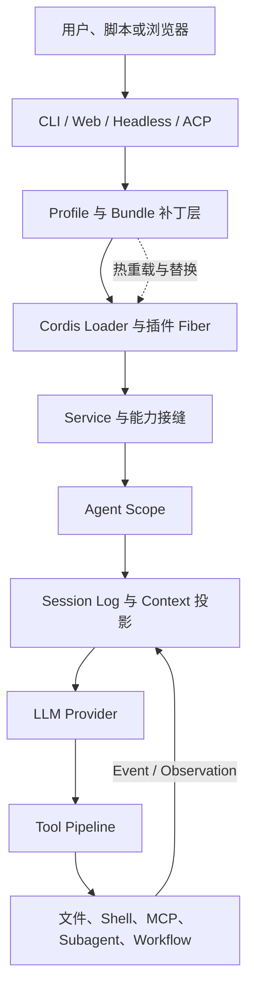
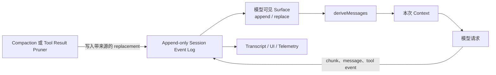
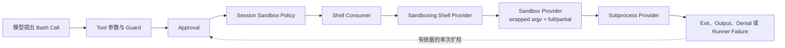

# DeepSeek Harness：组合式 Harness 架构

DeepSeek Harness 是一个以 TypeScript 实现、由 DeepSeek AI 开源的编程智能体（Coding Agent）Harness。固定版本仍处于开发者预览（developer preview）阶段，公开接口、配置与持久格式都可能发生不兼容变化。它最鲜明的架构选择不是某一种模型、界面或编辑器，而是把“本次运行到底由哪些能力构成”本身交给 Cordis 插件树：模型适配、会话日志、工具注册、Agent Loop、权限、沙箱、Web 界面、自动化协议乃至后台任务，都由插件装入并通过服务关系连接。

读者可以直接从本章进入。先把系统映射到[统一参考架构的八个核心对象](04_reference_architecture.md#八个核心对象一项任务由什么组成)：会话（Session）保存一项任务的连续历史，轮次（Turn）和步骤（Step）组织模型与工具往返，本轮上下文（Context）是当前请求实际可见的投影，事件（Event）记录状态变化，工具与任务产物（Artifact）把推理连接到文件、进程和可检查结果。本章继续使用[“一句话请求先要落到正确的工作区”](00_index.md#一句话请求先要落到正确的工作区)中的配置解析错误案例，回答一个中心问题：当 Loop、Session、Tool、Provider、Sandbox 与 Subagent 都能被替换或重组时，系统怎样仍然保持可解释的控制流；反过来，组合自由度又会把哪些装配错误和安全风险提升为核心问题。

## 项目定位与组合原则

DeepSeek Harness 属于组合式 Harness 架构（Composable Harness Architecture）。命令行界面（Command-line Interface, CLI）入口不直接创建一个写死的 Agent，而是选择命名配置档（profile），把若干组合包（bundle）的补丁层、配置档自己的补丁、用户主目录补丁和本次命令覆盖层叠到一个空插件树上，再由 Cordis Loader 装载。`web` 与 `headless` 是同一基础组合之上的不同表层：前者加入 HTTP Host 与浏览器客户端，后者加入一次性任务执行器；Agent 客户端协议（Agent Client Protocol, ACP）和 JSON-RPC 示例则展示自动化或宿主自建插件树的入口。入口不同，模型、工具与会话责任仍来自装入的服务，而不是由入口复制一套私有 Loop。

图 27-1 展示这条装配路径。它不是源码目录图，而是运行责任图：配置层先决定插件图，依赖关系再决定激活顺序；Agent 创建后，Scope 从全局服务中形成当前 Agent 可见的 Prompt、Tool、Skill 与政策；模型行动最终通过 Tool Pipeline 到达文件、Shell、Subagent 或外部服务。

*图 27-1　DeepSeek Harness 的组合式控制流。配置档先装配插件图，服务与 Scope 决定 Agent 实际看到和使用的能力，Session Event 把模型与执行结果重新连接起来。*

图中的关键原则是“插件，而不是 Loop 特判”。新模型通过模型服务注册，新工具通过工具注册表加入，新持久后端监听 Session Event，新执行环境替换对应 Provider；只有无法由既有扩展点表达的行为才需要改变 Agent Loop。这使[Harness Loop 的循环不变量](05_harness_loop.md#turn状态与循环不变量)不必依赖一组固定产品功能：目标连续、行动归属、结果闭合和终止原因由核心事件语义维持，具体能力则由组合决定。

这种结构带来两项直接收益。第一，部署可以用同一代码库形成不同产品面：Web、无人交互任务、协议服务和专用 Agent 预设共享基础服务，又能收窄工具、人格与权限。第二，替换能力时，消费者不必知道实现位于本机、沙箱、子进程还是远端。代价是装配本身成为程序行为：补丁优先级、服务重名、依赖缺失、热重载时机和持久格式都可能改变整个系统。对较集中式 Harness，错误常出现在某个函数；对 DeepSeek Harness，错误还可能出现在“两个本来正确的插件没有形成正确组合”。

## Cordis、Service、Provider 与 Consumer

Cordis 提供上下文（Context）、服务（Service）、事件总线、插件执行单元（Fiber）和可逆副作用。Service 是插件通过 `ctx` 发布的具名能力；消费者只声明需要某个服务名，不直接导入具体实现。依赖尚未满足时，Fiber 保持等待；Provider 出现后再激活。Provider 被卸载或替换时，依赖它的 Fiber 也会卸载并在依赖恢复后重新激活。注册工具、事件监听器或服务都绑定到所属 Fiber 的生命周期，释放时按相反方向撤销。

DeepSeek Harness 在此基础上明确采用能力接缝（capability seam）：一个完整接缝由服务定义（Service Definition）、服务提供者（Service Provider）和消费者（Consumer）组成。表 27-1 用 Shell、Sandbox 与 Workflow 说明三种角色。这里的“可替换”不是任意模块都能互换，而是 Provider 必须兑现 Definition 的请求、结果、失败、取消和释放语义，Consumer 才能保持不变。

| 能力 | Service Definition | Service Provider | Consumer | 主要边界 |
|---|---|---|---|---|
| Shell | 前台运行、后台句柄、输出与退出状态 | 本机 Bash、PowerShell 或沙箱化执行器 | 模型可见 Shell Tool、Terminal、Job Producer | 命令语义相同，执行世界与隔离强度可变 |
| Sandbox | 按单次调用包装进程参数并报告强制完整性 | Linux、macOS、Windows 本地后端 | 沙箱化 Shell、文件系统等执行能力 | 只承诺声明的文件效果，不自动涵盖网络 |
| Workflow | 启动、取消、结果与成员生命周期 | Worker Thread Engine 或未来更强后端 | 模型可见 Workflow Tool | 脚本契约稳定，执行与隔离后端可替换 |

*表 27-1　能力接缝的三角色结构。Definition 固定跨模块语义，Provider 决定真实实现，Consumer 决定能力怎样进入模型或客户端。*

这套分工也解释了 DeepSeek Harness 对模型服务提供者（Provider）的处理。模型适配器注册到 LLM 服务，Agent Loop 读取当前路由并处理流式响应；凭据、设置和重试又是相邻但独立的插件。因而[Provider 层在隔离什么](06_model_and_provider_abstraction.md#provider-层在隔离什么)不能只看请求格式：一个可用 Provider 路径还要有模型目录、凭据解析、流式终态和错误恢复，配置替换时也要避免让旧 Session 历史失去解释。

### 插件图与依赖注入装配

插件图与依赖注入（Dependency Injection）是本系统第一项代表性机制。动机是让大量能力独立演进，却仍能在一个进程中按依赖自动装配。Profile 中的行顺序主要服务可读性，真正的启动顺序由服务可用性决定；一个 Tool Consumer 可以写在 Provider 之前，只要它声明依赖，Cordis 会在 Provider 激活后再启动它。插件创建的注册都是 Effect，启动失败会撤销已经发布的部分贡献，根树启动还会审计未加载、失败和长期等待的条目，避免“进程退出码为零，但关键插件一直没有工作”的静默半启动。

> **特色机制｜插件图既是依赖图，也是释放图**
>
> DeepSeek Harness 不只用依赖注入寻找对象，还让同一关系决定热替换与清理。Provider 消失时，消费者先失活并撤销 Tool、Listener 和后台资源；Provider 恢复后再重新激活。收益是 HMR、配置重组与 Provider 替换能够复用一套生命周期。代价是局部重载会沿依赖边传播，任何没有正确登记为 Effect 的进程、定时器或注册都可能成为泄漏；进程内插件也仍处于宿主权限与故障域中。

它相对普通插件清单的差异，在于“已发现”不等于“已激活”。Loader 必须解析模块、校验配置、等待依赖并完成 `apply`，服务才对消费者成立；热重载也不是简单覆盖一个对象，而是先处理旧 Fiber 的释放，再形成新代。这个生命周期与[扩展的发现、注册与生命周期](09_plugins_mcp_and_extensions.md#发现注册与生命周期)一致，同时把组合失效暴露得更直接：缺少 Provider 可能让 Fiber 等待，重复 Service 会在装载处失败，错误的隔离 Realm 则可能让两个 Agent 读取到不该共享的实现。

## Agent Scope、Session 与 Context

全局插件树只定义一个运行环境的能力全集，具体 Agent 还需要自己的作用域（Agent Scope）。DeepSeek Harness 为每个 Agent 创建不透明 Scope，并允许 Scope 形成父链。Tool、Prompt Section、动态 Context、Skill Provider、Job Controller 与政策贡献都可以注册在全局层或某个 Scope 层；读取时先合并全局与祖先，再由更近层覆盖同名项。事件则沿相反方向向祖先观察者开放，使一个 Agent 预设可以观察其下创建的多个 Agent，而兄弟 Scope 不会自然收到彼此事件。

Scope 的意义是组合与路由，不是操作系统隔离。子 Agent 可以拥有独立 Tool View、Persona 和 Session，却仍可能指向同一工作区、使用同一宿主账号和同一个沙箱 Provider。[Context 中的 Workspace 与动态现场](07_context_and_instruction_system.md#workspace代码与动态上下文)和[共享 Workspace 的竞争](16_subagents_and_orchestration.md#共享-workspace竞争与结果汇聚)仍然成立：注册表隔离能减少模型可见能力，不能阻止两个 Agent 同时改写同一文件。

Session 则是追加式 Event Log。Turn/Step 边界、用户消息、模型原始流块、已提交 Assistant Message、Tool Call/Result、模型请求头、审批和政策变化共享连续序号。每次模型请求前，系统从当前 Scope 装配 Prompt Section、动态 Context、Tool Schema 与变量；动态现场不是临时拼入后遗忘，而是作为带来源的用户角色快照进入 Session，使“模型可见即已记录”成为可检查关系。它与跨任务的[Memory 范围](10_memory.md#项目级用户级与-session-级范围)不同：Session Event 属于当前任务历史，Skill 或 Memory Provider 才负责跨调用、跨任务检索。

图 27-2 展示保存、展示与请求之间的分离。完整日志保留原始事件；模型可见表面（model-visible surface）只选择能产生消息的 Event，并允许带来源的替换节点遮蔽旧范围；Transcript 可以继续读取原始追加消息，客户端也可以订阅 Raw Chunk 和状态 Event。

*图 27-2　Event Log、Surface 与 Context 的关系。完整日志保存发生过什么，Surface 决定模型历史当前看见什么，Context 再叠加本 Step 的动态装配。*

### 事件溯源 Session 与 Surface / 日志分离

这是第二项代表性机制。它的动机是同时满足恢复、审计、流式界面和上下文压缩：如果压缩直接删除旧消息，Resume 与 Transcript 会失去来源；如果模型每次都读取完整日志，窗口又无法控制。DeepSeek Harness 因而借用事件溯源（Event Sourcing）的分析坐标，把状态变化保留为追加事件，再用 Surface 投影当前模型历史 [@fowler2005eventsourcing]。替换节点必须引用被遮蔽的早期节点，Tool Result 的替换还只能改变内容而不能篡改 Call ID、终态等其余事实。

> **特色机制｜保存的事实、模型的视图与人的 Transcript 分开**
>
> Compaction 可以用 checkpoint 与近期尾部替换模型可见历史，Tool Result Pruner 可以用预览与 locator 替换过大结果，但原始 Event 仍留在日志。收益是[截断、摘要、选择与外部化四类压缩](13_compaction_and_context_management.md#截断摘要选择与外部化)不会自动变成物理删除，Resume 能重建同一 Surface，界面也能保留用户实际看过的追加消息。代价是系统必须维护序号连续、来源覆盖、替换代际、格式版本和持久化后端的一致性；日志可重建 Harness 状态，也仍然不能重建外部文件与进程。

这一设计还强化了[Session 的 Event Log、Snapshot 与 Checkpoint](12_session_persistence_and_resume.md#event-logsnapshot-与-checkpoint)边界。内存追加不会等待磁盘 I/O，持久插件异步消费事件；在模型请求和顶层 Tool 副作用前，Checkpoint Policy 可以要求 Flush。若进程在 Tool Call 与 Tool Result 之间中断，恢复修复会区分“没有调用记录的未启动”和“已有调用记录但没有结果的结果未知”，而不是把空白尾部一律视为安全重试。事件记录因此提高可解释性，却不把取消变成回滚，也不保证旧工作区仍与日志一致。

## Tool、MCP、ACP、Skill 与 Subagent

DeepSeek Harness 的工具运行时（Tool Runtime）把能力注册、模型可见 Schema、参数物化、执行前 Waterfall、审批、单调 Guard、执行包装、工具主体、执行后策略和最终 Result 连接成一条流水线。按照[Tool Call 的四类 Envelope](08_tool_call_system.md#请求参数与-call-id)，模型产生 Request，审批只给出授权，执行后再形成 Response 或 Error；Call ID 负责关联，不提供幂等或回滚。并行调用按每次参数被分类为 `parallel` 或 `exclusive`，Tool Body 可以在有界池中重叠，但执行前决策、Result 提交和附加 Context 仍按模型顺序收敛，这与[流式事件与并行 Tool Call](05_harness_loop.md#流式事件与并行-tool-call)保持一致。

工具还可以以原生、代码或两者并存的方式展示。代码模式把可见 Tool Schema 投影为 TypeScript 或 Python SDK，只让模型直接调用 `run_code`，再由程序内子调用进入同一 Tool Runtime。它能减少大量独立 Tool Call 的往返，但并没有绕开 Registry、Guard、审批或 Sandbox；程序只是新的组合传输。相应的 Token 与缓存成本应结合[输入选择、Tool Schema 与稳定前缀](14_token_efficiency_and_cost_control.md#减少输入与选择上下文)评价，而不是假设“一个代码工具”天然更省。

表 27-2 按运行语义区分本节五种机制。它们可以同时由插件图装入，却不应被统称为“扩展”。

| 机制 | 进入系统的内容 | 控制中心 | 关键边界 |
|---|---|---|---|
| Tool | Schema、调用、规范结果与展示元数据 | Tool Runtime 与 Agent Loop | 最终参数、审批、执行、Result 分层 |
| MCP | 外部 Server 发现的 Tool | 每 Server 一个 MCP Client 插件 | 命名空间、连接、重连、远端身份与不可信结果 |
| ACP | 自动化客户端的新 Session、Prompt、Cancel、一次性权限决定 | ACP stdio Bridge 与 Agent Registry | 只投影已提交 Assistant 内容，不等于完整 Web UI |
| Skill | 摘要目录、按需加载的过程性指令和资源基址 | Skill Provider Registry 与 Skill Tool | 指令进入 Context，不自动授予执行权限 |
| Subagent | 具名 Provider、子 Session、一次性或可继续执行 | Subagent Runtime 与 Child Agent Loop | 独立 Scope/Session 不自动等于独立 Workspace |

*表 27-2　Tool、MCP、ACP、Skill 与 Subagent 的运行语义。五者都可组合，但改变的是不同层。*

模型上下文协议（Model Context Protocol, MCP）Client 每个插件实例连接一个 Server，把工具注册为带 Server 名的稳定公开名称。初次激活等待连接与工具同步；列表变化先完整构造新代，抓取失败保留旧代，注册冲突则回滚新代；连接中断进入有界指数退避，耗尽后注销工具；Fiber 释放还要停止重连、关闭 Client、等待同步并撤销注册。这是[配置、分发与组合失效](09_plugins_mcp_and_extensions.md#配置分发与组合失效)的具体实现。固定版本只桥接 MCP Tool，不能把协议中的 Resource、Prompt 或双向能力自动算入产品路径。

ACP 是面向可信自动化客户端的窄适配层。客户端只能创建新 Agent/Session，串行提交 Prompt、接收已提交 Assistant 文本或图像、取消工作，并对当前 Tool Call 给出一次性允许或拒绝。它不提供 Resume、编辑器导航、完整 Transcript、计划或 Web 展示语义。这个边界对应[Headless 与非交互模式](20_interfaces_and_human_in_the_loop.md#headless-与非交互模式)：共享 Agent Core 不等于每个客户端都拥有相同人机控制面。

Skill 采用 Provider Registry。项目、用户、内置或自定义 Provider 先贡献摘要，Registry 按 Scope、来源等级与注册顺序选择同名赢家；模型调用 Skill Tool 时才加载正文。目录变更会以带来源的 Catalog Snapshot 写入 Session，用户显式调用与模型调用分别检查自己的 Invocation Policy。它实现了[Skill 的发现、选择与加载](11_skills_prompts_commands_and_hooks.md#skill-的发现选择与加载)，同时保留一条安全边界：Skill 是模型要遵循的内容，不是 Shell、网络或文件权限。

Subagent 则是另一个完整能力接缝。多个具名 Provider 可以并存：进程内新建、从父历史 Fork、ACP、Codex、Claude Code 或 DSH SDK 路径都可以隐藏在统一 Start 请求后。一次性子任务返回有界结果；可继续子 Agent 拥有持久 Child Session 和至多一个进程内 Activation，后续消息进入其唯一 FIFO Inbox，冷状态可从持久 Session Resume。父子深度、工具过滤、Persona 与政策覆盖都可以在创建时装配；父 Agent 仍负责结果汇聚和最终验证，[创建、Prompt 传递与上下文继承](16_subagents_and_orchestration.md#创建prompt-传递与上下文继承)中的责任没有因 Provider 可替换而消失。

## Guard、Sandbox 与 Shell Provider

DeepSeek Harness 把“阻止坏循环”“是否同意动作”“实际限制进程”拆成不同插件。Guard 可以在 Tool Pipeline 中追加不可逆的拒绝理由，或在执行后注入提醒；重复调用检测记录同一 Agent 连续使用相同参数的次数，超时策略则用派生取消信号要求协作式 Tool 在截止后收敛。Guard 不应被误写为审批系统：重复提醒默认只提供新 Context，超时也不能撤销已经发生的副作用。

审批服务（Approval Service）对一次请求只返回允许一次、拒绝、取消或不可用；缺少 Answerer 时失败关闭。审批问答与 Session Policy 都写入 Event Log，因此 Resume 能重建当前政策，但旧授权不自动扩大到新参数。它落实了[Tool Permission 与 Human Approval](17_security_permissions_and_sandboxing.md#tool-permission-与-human-approval)：审批表达意图，执行结果另行记录。

沙箱政策服务为每次调用解析文件效果模式和工作区根：只读、工作区可写或危险的完全访问。默认服务本身是只读，但官方基础组合显式把新 Session 置于“工作区可写 + 需要审批”，部署环境可以覆盖为只读或完全访问。真正执行时，Sandbox Provider 按平台把准确参数包装为 Linux `bwrap`/Landlock、macOS Seatbelt 或 Windows ACL Restricted Token，并报告强制完整性是 `full` 还是 `partial`。受限模式没有可用后端时必须失败关闭；网络与进程可见性明确不在这套文件政策词汇中。

### 可组合沙箱与策略接缝

这是第三项代表性机制。动机是让同一个 Bash Consumer 在不同部署中连接本机无约束执行、同世界文件沙箱或未来远端执行，同时让逐 Session Policy 与单次扩权保持显式。图 27-3 中，Tool Runtime 先完成参数与政策判断；Shell Consumer 再解析 Session 的 cwd 和 Sandbox Mode；沙箱化 Shell Provider 调用 Sandbox Provider 包装命令；Subprocess Provider 最终启动进程。若命令确实被文件政策拒绝，模型可以按规则提出一次更宽模式的精确重试，该重试重新经过审批。

*图 27-3　策略、审批、Shell 与 Sandbox 的组合路径。每一层回答不同问题，Result 还要区分命令失败、沙箱拒绝和 Runner 自身失败。*

> **特色机制｜沙箱完整性是结果，不是配置假设**
>
> Provider 返回包装后的参数时同时报告 `full` 或 `partial`，Consumer 又先识别 Runner 是否根本没有启动命令，再判断命令是否被沙箱成功拒绝。收益是平台降级和基础设施失败不会被伪装成普通测试失败，也不会静默回退到无约束执行。代价是部署者必须理解每个平台的文件效果范围；即使报告 `full`，它也只对应当前文件政策，不证明网络、凭据、进程树或进程内 Plugin 已被隔离。

这一分层与[文件、进程与网络沙箱](17_security_permissions_and_sandboxing.md#文件进程与网络沙箱)以及[Coding Harness 的工程闭环](18_code_editing_git_and_workspace.md#coding-harness-的工程闭环)互补。Sandbox 限制“最多能改哪里”，不能判断补丁是否正确；允许执行测试也不等于测试通过。Shell 的后台模式还会把进程交给 Job Registry，取消、输出收集和 Owner 释放必须继续沿[后台进程与资源清理](21_reliability_and_resource_control.md#后台进程与资源清理)检查。

## Workflow、Schedule 与 Job

DeepSeek Harness 把三个常被混称为“后台任务”的机制分开。工作流（Workflow）改变任务拓扑：模型写一个 JavaScript 编排脚本，通过 `agent`、`parallel` 和 `pipeline` 扇出多个 Subagent。定时计划（Schedule）改变同一 Session 的未来输入时间：Reminder 状态写入 Event Log，原 Agent 空闲且仍然存活时，把到期内容作为普通后续消息送入新 Turn。后台作业（Job）则包装一个已经启动的进程内资源，提供 Job ID、读取、等待、停止、完成通知与 Owner 清理。

| 机制 | 主要对象 | 持久性 | 恢复与取消边界 | 适合问题 |
|---|---|---|---|---|
| Workflow | 一次脚本 Run 与多个 Child Agent | 成员 Event 可记入父 Session，但脚本中间状态不持久 | 进程重启不能续跑；取消有宽限期，Worker 可被终止 | 大批独立审计、迁移、研究与多阶段汇聚 |
| Schedule | 当前 Session 中的 Reminder 记录 | `schedule/change` 是耐久状态 | Session 冷却时只变成 overdue；不是外部 Cron，也不证明提醒已读 | 同一 Agent 的一次性或固定间隔提醒 |
| Job | 进程局部 Registry 中的后台资源 | 默认内存记录 | Owner/Service 释放会取消并等待；重启后不恢复 | Shell 后台进程、一次性 Subagent 等长时动作 |

*表 27-3　Workflow、Schedule 与 Job 的时间、拓扑和持久边界。三者解决的问题不同，不能用同一个“后台”状态代替。*

Workflow 的 Worker Thread 隔离同步阻塞并允许强制终止，但源码明确把它定位为容纳（containment），不是安全边界；脚本 Realm 没有直接文件和网络 API，真正工作由 Subagent 完成，但 JavaScript VM 仍不能承担不可信代码隔离。并发数、总 Child 数和单次 Item 数是资源上限，不是完成证明。它与[Goal、Plan、Task 与 Todo](15_goals_planning_and_todos.md#goalplantask-与-todo)的区别在于，Workflow 是实际执行拓扑，Goal 与 Plan 是任务控制状态；脚本返回结果后，父 Agent 仍要检查 Artifact。

Schedule 对每次读取和改变先要求 Session Flush，成功创建或删除后再经过持久屏障。它不是官方基础组合的默认行，需要部署显式装入，而且只为插件加载后新建的根 Agent 安装能力。到期时，它等待 Agent Idle，通过 Maintenance 边界把 Follow-up 与 Dispatch Event 放在同一受控区间；固定间隔只交付最新到期项，不回放所有漏过的周期。狭窄的崩溃窗口仍可能造成重复提醒，因此它提供的是 Session-local、至少可解释的提醒状态，不是 Exactly-once 外部调度。

Job Registry 的 ID 是可预测的，访问边界来自 Owner Session，而不是 ID 保密。Provider 必须在注册前完成可失败的资源启动，结算采用 first-wins，Tool Controller 才负责把完成 Notice 注入忙碌 Agent 或唤醒空闲 Agent，并限制连续自唤醒次数。这里可以看到[Timeout、Cancel 与 Interrupt](21_reliability_and_resource_control.md#timeoutcancel-与-interrupt)的区别：等待超时只停止等待，Job 继续；Kill 请求进入 stopping，也不等于进程已经退出。

## 组合失效和安全边界

组合式架构的主要可靠性风险不是“插件数量很多”，而是多个生命周期、命名空间和持久状态之间缺少共同边界。第一类是依赖和命名错误：需要的 Service 缺失会让 Fiber 等待，重复 Service、Tool、Prompt Section、MCP Server Name 或 Skill Provider 可能直接失败或按特定优先级隐藏。系统对启动树采用失败出声和激活审计，但运行期可选能力仍可能合法缺席；因此“Plugin 已加载”不能代替“当前 Agent Scope 能看到该能力”。

第二类是代际与热重载错误。Profile Patch 可以在运行时重组条目，MCP Tool List、Skill Catalog 与设置也可刷新。安全替换要求新代先完整构造，再原子切换或保留 Last-good；旧代还要停止重连、Timer 和在途任务。若某个插件绕过 Effect 注册后台资源，界面上的卸载不会等于真实释放。对[Log、Event、Trace 与 Metric](19_observability_evaluation_and_replay.md#logeventtrace-与-metric)而言，Fiber 状态、注册表代际、Session Event 和外部进程日志必须联合观察，最后一条 Assistant Message 无法定位这类故障。

第三类是持久语义漂移。Session Format、Event Envelope、Surface Replacement 与 Plugin Event Vocabulary 必须能被恢复端解释。固定版本仍处于预发布阶段，对不兼容格式采用拒绝加载而不是兼容承诺；这种失败比静默误读更诚实，却意味着升级需要迁移策略或放弃旧 Session。Compaction、Skill Catalog、Subagent Descriptor、Schedule Record 与 Policy Event 都依赖日志语义，任一插件升级都可能扩大迁移面。

第四类是信任边界。Cordis Plugin 是同进程可信代码，能读取宿主服务并继承宿主账号权限；MCP Server 位于子进程或网络边界，能贡献 Schema 和不可信 Result；Skill 是进入 Context 的过程性指令；ACP Client 可以创建 Session 并自动回答一次性权限；Subagent Provider 可能把工作交给另一个产品。根据最小权限和完全仲裁原则，每次最终动作仍应在能力最窄处检查 [@saltzer1975protection]。Profile 的包管理依赖、外部 Plugin、MCP 命令与 Skill 来源因此属于[Plugin、MCP 与 Skill 供应链](22_configuration_identity_and_supply_chain.md#pluginmcp-与-skill-来源)，而不是普通配置便利项。

> **安全提示｜组合可替换性不是安全隔离**
>
> 攻击前提可以是用户安装了恶意进程内 Plugin，或低信任仓库、Skill、MCP Result 影响了模型。Scope 隔离只限制注册表与事件路由，Fiber 回滚只清理已登记 Effect，Sandbox 只约束经过相应 Provider 的进程文件效果；它们都不能限制任意宿主进程内代码。缓解方向是收窄装入来源、把高风险能力移到进程或远端边界、逐调用审批、在目标平台验证沙箱、限制凭据可达性，并在 Session 与 Telemetry 中保留来源。当前固定版本确认了这些控制路径，不能据此宣称跨平台安全已经得到运行验证。

组合也会改变完成条件。Workflow Child 返回、Job 结算、Schedule Dispatch、MCP Tool Success 和 ACP Prompt Stop 都只是各自边界的终态；父 Agent 仍要回到最新文件、测试和用户目标。对教学案例而言，Subagent 找到了解析入口不等于主任务已修复，Shell Exit 0 不等于所有相关测试覆盖充分，Session 可 Resume 更不等于旧 Artifact 仍新鲜。组合式系统的专业使用方式，是为每层终态保留精确含义，而不是把所有绿色状态压成“完成”。

## 适用场景与延伸阅读

DeepSeek Harness 适合把 Harness 当作可组合平台而非单一终端产品的场景。团队可以用 Profile 与 Bundle 构造 Web、Headless、ACP 或专用 Agent；用 Scope 为不同 Agent 选择 Persona、Tool、Skill 与权限；用 Service Provider 把 Shell、文件、Subagent、Workflow、Storage 与模型后端替换到不同执行世界；用 Event Log、Projection 与 Session 查询构建 UI、审计和恢复。对需要实验新的 Tool Pipeline、并行策略、Agent 预设、Compaction 或 Subagent 语义的研究与开发，这种分解提供了清楚插入点。

它的代价同样决定了不适用场景。只需要一个稳定、窄、长期兼容的本地编辑循环时，Profile、Fiber、Scope、Projection 和大量 Service Seam 会增加理解与发布成本；要求强租户隔离时，同进程 Plugin 和同世界 Sandbox 也不足以替代容器、微虚拟机、独立账号与远端凭据 Broker。固定版本处于开发者预览，持久格式和扩展 API 的不兼容风险还会影响长期部署。这些是架构定位差异，不构成对其他 Harness 的排名。

继续阅读可以按边界选择路径。想理解 Step 为什么可以多次模型调用与工具执行，回到[Harness Loop](05_harness_loop.md)；想研究 Service Provider、路由与凭据，阅读[模型与 Provider 抽象](06_model_and_provider_abstraction.md)；想核对 Scope、Prompt 与动态现场，阅读[上下文构造与指令系统](07_context_and_instruction_system.md)；想分析 Tool、MCP 与 Skill，串联[Tool Call 系统](08_tool_call_system.md)、[Plugin、MCP 与扩展系统](09_plugins_mcp_and_extensions.md)和[Skills、Prompt、Command 与 Hook](11_skills_prompts_commands_and_hooks.md)。

若关注长任务，应继续到[Session、持久化与 Resume](12_session_persistence_and_resume.md)、[Compaction 与上下文管理](13_compaction_and_context_management.md)、[Token 效率与成本控制](14_token_efficiency_and_cost_control.md)、[Subagent 与多 Agent 编排](16_subagents_and_orchestration.md)和[可靠性与资源控制](21_reliability_and_resource_control.md)。若关注部署与治理，则应结合[安全、权限与沙箱](17_security_permissions_and_sandboxing.md)、[代码编辑、Git 与 Workspace](18_code_editing_git_and_workspace.md)、[接口与 Human-in-the-loop](20_interfaces_and_human_in_the_loop.md)和[供应链风险](22_configuration_identity_and_supply_chain.md#供应链风险)阅读；这些章节分别补足运行隔离、工程验证、客户端控制和来源治理。

## 本章小结

DeepSeek Harness 的中心不是一个不可替换的 Agent 类，而是一张由 Cordis Plugin、Service、Event 与 Effect 组成的运行图。Profile 决定装入哪些节点，依赖注入决定何时激活，Capability Seam 把 Definition、Provider 与 Consumer 分开，Agent Scope 再从全局能力形成每个 Agent 的实际视图。模型循环、Tool Pipeline 与 Session Event 仍维护共同的不变量，因此替换 Provider 不必让每个客户端重写控制流。

本章最有代表性的三项设计也形成一条因果链。插件图同时承担依赖与释放，使组合可以热替换却要求所有副作用登记生命周期；事件溯源 Session 将完整日志、模型可见 Surface 和 Transcript 分开，使压缩与恢复保留来源却增加投影和版本成本；可组合 Sandbox 与 Shell Seam 将 Policy、Approval、Provider 和真实进程分层，使降级可见却不夸大文件政策之外的隔离。Workflow、Schedule 与 Job 又说明，拓扑、时间和后台资源必须用不同状态机表达。

回到配置解析错误案例，组合式架构可以让一个 Agent 使用本地文件与沙箱化 Shell，让另一个 Subagent 只做只读调查，让 Workflow 批量检查多个包，再由同一 Session 收集结果。它不能替父任务自动证明补丁正确，也不能让一次取消撤销所有副作用。DeepSeek Harness 的价值在于把“如何组装控制面”公开成架构；它的主要工程责任，也因此从单个 Loop 的正确性扩展到插件图、Scope、持久事件、Provider 语义和安全边界能否作为一个整体收敛。
