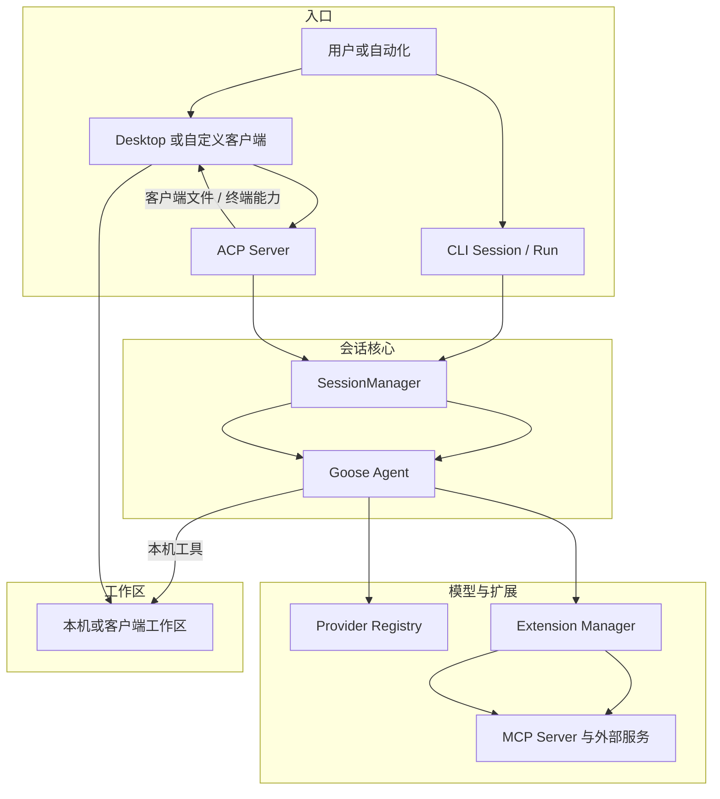

# Goose：本地 Agent 与 MCP 生态

Goose 是一个主要运行在用户机器上的通用本地智能体（general-purpose local Agent）。它以 Rust 核心承载模型调用、会话、工具、权限与扩展，以命令行界面（Command-Line Interface，CLI）、Electron Desktop、Agent 客户端协议（Agent Client Protocol，ACP）服务、应用程序接口（Application Programming Interface，API）和跨语言软件开发工具包（Software Development Kit，SDK）提供不同入口。虽然 Goose 能处理研究、写作、自动化与数据分析，本报告关心的是它怎样把这些通用能力组织成可用于代码仓库的 Agent Harness：请求从哪个入口进入，模型提供者适配层（Provider）与外部 Agent 如何接入，MCP 能力怎样成为工具，工作流配方（Recipe）如何装配任务，长会话怎样压缩，委派怎样隔离本轮上下文（Context），又有哪些安全责任仍留给本机部署。

仍以[“一句话请求先要落到正确的工作区”](00_index.md#一句话请求先要落到正确的工作区)中的配置解析错误为教学案例。用户可以从 CLI 发出请求，也可以让 Desktop 启动本地后端，再通过 ACP 建立会话（Session）；Recipe 可以预先指定修复规则、模型与扩展，MCP 服务端（MCP Server）可以提供代码、工单或持续集成服务，子智能体（Subagent）可以独立追踪解析入口。入口越多、组合越灵活，越需要回答同一个问题：哪些状态由 Goose Core 统一拥有，哪些能力来自外部边界，模型当前看见什么，获准动作最终又以谁的权限执行。本章从整体架构回答这些问题，并把前文分散讨论的机制还原成 Goose 的系统组合。

## 项目定位与治理

Goose 的定位首先决定了它为何不是一套只围绕补丁格式或 Git 提交组织的工具。固定版本的项目说明把它定义为运行在本机的通用 Agent，Desktop、CLI 与 API 是三个并列入口，模型既可以来自云端服务，也可以来自本地推理或已有订阅；外部能力则主要通过开放协议连接。这种定位让代码编辑只是众多工作流之一，但 Coding 场景仍然特别重要，因为本地文件、Shell、测试、Git 和凭据会把模型输出转成真实副作用。

项目治理与技术结构之间存在直接呼应。Goose 由 Block 发起，固定版本已置于 Linux Foundation 旗下 Agentic AI Foundation（AAIF）的治理框架中；治理文件把开放开发、灵活选择模型与协议、用户可改造性列为核心价值。日常技术决策主要通过公开的拉取请求（Pull Request）、讨论与社区渠道形成共识，较大的方向变化要求公开提案、审议与核心维护者（Core Maintainer）批准。它不是一种运行时安全控制，却解释了项目为何持续把 Provider、MCP、Recipe、ACP 和自定义发行版做成可替换边界，而不是把产品锁在单一模型、客户端或组织工作流上。

“可改造”也带来维护责任。配置级定制可以较轻地跟随上游，MCP Extension 和 Recipe 可以把组织能力放在核心之外；一旦发行者修改 Rust Core、Desktop 或更新策略，就要自己承担合并、测试、安全更新、品牌和分发的一致性。因而，开放治理与可分发源码提供的是选择空间，不自动保证所有下游组合都得到上游同等验证。

## Rust Core、CLI、Desktop 与 API

从[统一参考架构的八个核心对象](04_reference_architecture.md#八个核心对象一项任务由什么组成)看，Goose 的 Rust Core 把会话（Session）、消息（Message）、事件（Event）、本轮上下文（Context）与工具工作单元集中在 Agent 和 SessionManager 周围。Agent 持有当前 Provider、Extension Manager、权限与工具检查器、Hook、重试状态、工具结果通道和可选容器；Session 则保存工作目录、模型配置、模式、Conversation、扩展状态、用量和父子关系。一次用户输入进入 `reply` 后，系统先处理控制命令与需要用户回应的动作，再读取 Session，构造系统提示与工具目录，随后进入经典回复循环或受开关控制的实验状态机。

[第 05 章的循环不变量](05_harness_loop.md#turn状态与循环不变量)在这里表现得很具体。Agent 为每轮设置最大 Turn，保存调用与结果，接收取消令牌，并把工具拒绝、错误和输出重新写入 Conversation；Provider 返回最终文本或工具调用后，Loop 才决定继续、压缩、等待、失败或结束。Goose 并未要求所有入口共享同一种界面事件，但它让这些入口最终落到同一套 Agent、Session 与 Extension 状态上。

表 28-1 概括主要组件的责任。它不是源码目录清单，而是说明多入口如何共享控制面，以及哪些差异仍由客户端保留。

| 层次 | 主要责任 | 对配置修复案例的作用 |
|---|---|---|
| Rust Core | Agent Loop、Session、Provider、Extension、权限、压缩、委派 | 组织读取、修改、测试与结果回流 |
| CLI | 交互 Session、headless Run、Recipe、配置、调度、ACP/MCP 子命令 | 直接在终端启动或自动化执行修复 |
| Desktop | Electron/React 客户端，启动或连接 ACP 后端，展示流、审批和 Session | 把同一后端投影为图形化交互体验 |
| ACP Server | stdio、HTTP/WebSocket、Session 与能力协商 | 让 IDE、Desktop 或自定义客户端驱动 Goose |
| SDK/API | ACP 共享类型与 Python/Kotlin Provider 绑定 | 嵌入客户端或复用模型抽象 |

*表 28-1　Goose 的多入口架构。Core 拥有主要任务状态，客户端能力仍会改变工具在哪一侧执行。*

表 28-1 中最重要的细节是：Desktop 不是在 JavaScript 中重写一套 Agent。它启动捆绑的 `goose serve`，为本机回环地址选择端口，注入服务 secret，再用 ACP 连接 Rust 后端。CLI 则可直接创建交互 Session 或用 `run` 进入无界面执行。SDK 一方面公开 ACP 共享类型，另一方面通过 UniFFI 为 Python 和 Kotlin 暴露 Provider 构造与流式完成接口。这样，核心机制可以复用，但入口能力仍非完全相同。

ACP 初始化时，客户端会声明文件读取、文件写入与终端能力。若这些能力存在，Server 可以把 developer Extension 的执行端替换为客户端侧工具：模型仍看到相应能力，实际文件或终端操作却通过 ACP 回到客户端。由此可见，[第 20 章所区分的“能力、协议与界面”](20_interfaces_and_human_in_the_loop.md#clituiidedesktopweb-与-api)在 Goose 中不是抽象分类，而是会改变执行路径、审批呈现与故障位置的运行事实。

*图 28-1　Goose 的入口与执行边界。替代说明：CLI 可直接驱动 Core，Desktop 和自定义客户端经 ACP 驱动同一 Session/Agent；工具既可在本机执行，也可反向交给客户端或远端 MCP Server。*

图 28-1 解释了为何“本地 Agent”不等于“所有计算都在本地”。Session 与许多执行能力由本机进程拥有，模型 Provider、远端 MCP 和外部 ACP Agent 仍可能在网络另一端。部署者要分别判断代码、Prompt、工具参数和凭据越过了哪条边界，不能只依据 Desktop 是否安装在本机作结论。

## Provider Abstraction 与 ACP

Goose 的模型提供者抽象（Provider Abstraction）以 Rust trait 和 Registry 为中心。[第 06 章](06_model_and_provider_abstraction.md#provider-层在隔离什么)已经说明 Provider 应统一请求、响应、流、错误与认证装配，而不应伪装模型能力完全相同。Goose 的公共 Provider 接收 ModelConfig、系统提示、Message 历史和 Tool Schema，以统一消息流（MessageStream）返回文本、思考、工具调用、用量或错误。Agent Loop 因而不必为 Anthropic、OpenAI、Google、Ollama、云平台和订阅式 Provider 分别维护控制循环。

Registry 不只是名称到构造函数的静态表。它同时保存 Provider 元数据、默认模型、模型清单（inventory）解析器、构造方式和清理函数；内建 Provider、声明式自定义 Provider 与 ACP Provider 都可以通过同一查找入口创建。模型目录可以来自静态描述、远端 inventory 和用户配置，轻量任务还可使用快速模型（fast model）或压缩模型（compaction model）。统一点是 Agent 怎样调用，差异点仍包括认证、上下文上限、模式、工具能力和会话所有权。

ACP 在这一层形成一项有代表性的“内外翻转”。Goose 自己可以作为 ACP Agent Server 被 Desktop、IDE 或其他客户端调用；同时，Claude、Codex、Pi、Copilot 等外部 Agent 又可以作为 ACP Provider 被 Goose 调用。后一路径不是把外部 Agent 当成普通无状态聊天接口：ACP Provider 可以声明自己管理对话 Context，维护远端 Session，映射模型与思考档位，并把外部 Agent 发出的工具进度、权限请求和终态翻译回 Goose 的消息流。

这项适配的收益是订阅身份、外部 Agent 的原生工具与既有交互模式可以进入 Goose 的 Provider 选择面；代价是上下文和权限不再完全由 Goose 单方拥有。普通 Provider 通常接收 Goose 构造的完整 system、messages 与 tools；管理自身 Context 的 ACP Provider 只接收当前 Prompt，并在首次交接时尽量附带有界的历史 memo。CLI 因此限制对这类 Provider 做任意会话内切换，自动压缩也会跳过其自管 Context。统一 Registry 让它们可选择，却没有抹平状态所有权差异。

模式映射同样需要诚实保留。Goose 的 Auto、Approve、Smart Approve 和 Chat 会映射到外部 Agent 可识别的模式或权限选择；若目标 Agent 不提供一一对应的模式，适配器只能在候选中取可用项，或把审批请求回传给 Goose。ACP 在这里提供互操作协议，不自动提供统一权限语义；最终仍要问哪个运行时执行工具、哪个客户端能回答审批，以及远端执行环境受到什么限制。

## MCP Extension 与 Recipe

[第 09 章的五分类](09_plugins_mcp_and_extensions.md#pluginextensionmcpskill-与-hook)把 Plugin、Extension、MCP、Skill 与 Hook 分开。Goose 的突出选择是把模型上下文协议（Model Context Protocol，MCP）提升为主要外部能力边界，同时保留平台内建 Extension、frontend tool、Skill 和 Hook。Extension 在产品语言中是装入能力的单元，其中许多外部 Extension 实际由一个 MCP Client 连接一个本地子进程或远端服务。

Extension Manager 因而承担的责任远超“保存工具数组”。它解析 stdio、Streamable HTTP、平台内建、frontend 和 inline Python 配置，合并环境与 secret，启动子进程或建立 HTTP/开放授权（OAuth）连接，完成初始化，发现 Tool、Resource、Prompt 和服务端指令（Server instructions），并把当前工作目录作为工作区根（roots）更新给 Server。它还负责工具目录缓存、变更通知、调用进度、MCP App 资源附件、反向采样（sampling）与信息征询（elicitation），以及禁用或重连时的清理。

Goose 还提供可选的 Code Mode MCP 路径：运行时把 MCP 工具投影成 JavaScript API，让模型先搜索或读取工具定义，再在 Boa 沙箱中执行代码，底层调用仍路由回原 MCP Tool [@hancock2025goosecodemode]。这是一项平台扩展，不是默认唯一调用路径；官方文章也把它作为需要社区继续评估的新做法，不能据此宣称已经通过论文证明优于直接 Tool Call。

工作流配方（Recipe）位于另一层。Recipe 是一份可分享的声明式 Session 装配：它可以指定任务说明、启动 Prompt、Provider、模型、温度、最大 Turn、Extension、参数、期望的 JSON 描述模式（JSON Schema）、重试策略和 Subrecipe。CLI、Desktop 或 ACP Server 解析 Recipe 后，把这些字段交给 SessionBuilder；Provider 与扩展在 Agent 开始推理前完成装配，Recipe 本身也保存到 Session，便于后续诊断、显示和委派。

表 28-2 把 MCP Extension 与 Recipe 放在同一工作流中比较。两者经常一起出现，却解决不同问题。

| 机制 | 主要回答 | 运行时产物 | 主要边界 |
|---|---|---|---|
| MCP Extension | “Agent 能连接哪些外部能力？” | Tool、Resource、Prompt、连接与认证状态 | Server 身份、进程/网络、凭据、调用生命周期 |
| Recipe | “这次 Agent 以什么配置完成哪类工作？” | Session 指令、Provider/Model、Extension 集合、参数与输出要求 | 模板来源、参数与 secret、能力组合、失败与重试 |
| Subrecipe | “哪些可复用角色或子工作流可以被加载或委派？” | Summon 可发现的 source 与独立 SubAgent Session | Context 交接、共享 Workspace、审批和取消 |

*表 28-2　MCP Extension、Recipe 与 Subrecipe 的职责。Extension 提供能力，Recipe 规定本次如何组合能力。*

表 28-2 也说明 Recipe 不是通用耐久工作流引擎。它可以表达预设装配、参数和子 Recipe，特定 CLI 路径也能调度 Recipe；但任意步骤没有被统一建模为带依赖、ready 状态和事务边界的 Task DAG。Recipe 更接近“可执行的 Agent 配置与工作说明”。当它包含 Subrecipe 时，解析器会装入 Summon，模型随后通过 `load` 把说明读进当前 Context，或通过 `delegate` 建立独立子会话执行。

## Context Management 与 Delegation

Goose 的上下文管理（Context Management）把[第 13 章的截断、摘要、选择与外部化四类动作](13_compaction_and_context_management.md#截断摘要选择与外部化)组合在不同位置。完整会话历史保存在 Session，模型只看 agent-visible 的投影；较大的工具结果可以外置，较旧的工具调用—结果对（Tool Pair）可以批次摘要，整体 Conversation 接近 Provider Context 上限时则触发结构化 Compaction。默认自动阈值为上下文上限的 0.8，但配置可以覆盖或禁用。

结构化压缩不是简单删除最老消息。Goose 把原消息保留为用户可见、模型不可见，再加入模型可见的 Conversation Summary 与继续指令；自动压缩还会尽量保住最近的文本用户请求和本轮上下文事件。摘要结果经结构化解析后重渲染，原始分析草稿不直接进入新 Context。这样可以在 Session 中同时保留审计历史和较短的模型投影，但摘要仍然是有损 Item，必须由新的文件读取与测试结果推翻旧结论。

这也解释了为什么内建 Memory Extension 不能与 Compaction 混同。[第 10 章的 Memory 范围](10_memory.md#项目级用户级与-session-级范围)区分 Session、项目与用户传播半径；Goose 的 Memory MCP Extension 可以把分类信息写到项目或用户目录，而 Compaction 默认只改变当前 Session 的可见历史。一个压缩摘要不会因为写得像经验就自动成为长期 Memory，项目 Memory 也不会因为存在就自动进入每次 Context。

委派（Delegation）通过 Summon Extension 改变工作拓扑。`delegate` 接受临时指令，或选择 Recipe、Subrecipe 与 Agent source，并可覆盖 Provider、Model、温度、最大 Turn、Extension、参考 Context 和工作目录。它创建 `SubAgent` 类型的独立 Session，记录父 Session ID，子 Agent 拥有自己的 Conversation 与 Turn 预算；同步路径等待最终文本，异步路径先返回 task ID，父级稍后用 `load` 等待、查看进度或取消。

独立 Session 不等于独立工作区（Workspace）。子 Agent 默认继承父工作目录，调用者只能把它收窄到父目录内；多个子 Agent 仍可能同时读取或修改同一文件。因此，[第 16 章对共享 Workspace 的分析](16_subagents_and_orchestration.md#共享-workspace竞争与结果汇聚)在 Goose 中尤其重要：只读调查可以并行，写任务应严格分区，最终 diff 与测试仍由父级在当前现场重新检查。Summon 的工具说明也直接把这种约束写给模型。

> **安全提示｜Subagent 的 Auto 模式把审批问题前移到能力装配**
>
> 固定版本中的 Subagent 使用 Auto 模式，因为需要用户决定的 ActionRequired 消息尚未完整转发父 Session；若沿用 Approve 类模式，子任务可能停在无人回答的确认通道。这样可以避免委派挂起，却意味着父级必须在创建前限制 Extension、工作目录与任务范围。攻击或事故前提是子 Agent 获得可产生副作用的 Tool，而其 Prompt、Recipe 或读取内容诱导了错误动作；缓解方向是最小化工具集合、分区写入、使用容器或独立工作区，并由父级重新验证结果。

异步委派还增加了生命周期状态。每个 Background Task 有独立取消令牌、Turn 与最近活动统计；启动前检查并发上限，完成结果只在有限时间内缓存。`load` 是显式 Join 点，取消会请求子运行停止，却不会撤销已经写入的文件或已经发出的网络请求。[Loop 的终止边界](05_harness_loop.md#终止取消与防失控)仍然成立：取消之后必须重新观察，而不是把内部 Task 消失当成外部副作用已经回滚。

## Tool Visibility 与发行版定制

工具可见性（Tool Visibility）决定模型当前看见哪些工具描述模式（Tool Schema）。每个 Goose Extension 可以设置 `available_tools`：空列表表示公开该 Extension 的全部工具，非空列表只公开命中的原始工具。Extension Manager 在 MCP `tools/list` 之后先做过滤，再按扩展名增加命名空间与来源元数据，并跳过重复公共名称。对拥有大量工具的 MCP Server，这可以减少 Context 中的 Schema Token，也能降低模型误选无关能力的概率。

可见性不是权限。模型没看见某个工具，通常就不会主动提出调用；模型看见工具，也仍要经过参数解析、Tool Inspection、Permission Inspector 与执行环境。反过来，隐藏 Schema 不一定使底层进程失去访问资源的能力。前文[规范化 Tool-call Envelope](08_tool_call_system.md#请求参数与-call-id)已经区分请求、审批、响应与错误；Goose 的 `available_tools` 只改变请求形成前的能力投影，Mode 与 Permission 改变是否放行，容器、客户端或操作系统才决定实际可达范围。

发行版定制（Custom Distribution）把这套装配前移到构建和分发阶段。组织可以用初始配置预设 Provider 与模型，在 Desktop 目录或 Recipe 中捆绑 MCP Extension，修改系统 Prompt、品牌、界面和默认行为，也可以完全舍弃官方 Desktop，基于 ACP Server 构造自己的 Web、移动或企业客户端。CLI feature 还能关闭自更新命令，适合由包管理器或企业部署系统接管升级。

> **设计取舍｜配置、Extension 还是深度 Fork？**
>
> 配置和 Recipe 的改动面最小，容易跟随上游，但只能改变已公开的装配点；MCP Extension 可以接入组织服务并独立发布，代价是增加 Server 身份、认证和协议生命周期；修改 Rust Core 或 Desktop 能形成完整定制体验，却需要长期维护分支、构建、更新和安全响应。选择的关键不是“能否修改”，而是哪一层最接近真实需求，以及下游团队是否准备承担该层的生命周期。

## 代表性设计和边界

### MCP 作为主要外部能力边界

Goose 最鲜明的架构选择，是把 MCP 从可选附加接口提升为主要外部能力边界。[第 09 章的 MCP 生命周期](09_plugins_mcp_and_extensions.md#发现注册与生命周期)要求协议宿主（Host）处理发现、初始化、命名、刷新、调用和卸载；Goose 的 Extension Manager 正是在 Core 内集中承担这些责任。外部能力可以是本地 stdio 子进程，也可以是远端 Streamable HTTP 服务；模型最终看到的是经过命名与过滤的 Tool，Session 还可接收 Resource、Prompt、Server instructions 和反向交互。

这项选择的动机是让通用 Agent 不必把每种企业服务、数据源或专业工具编进 Rust Core。协议边界允许不同语言独立发布 Server，Recipe 又能把 Server 与任务说明一起装配。相较于让模型自行拼接任意命令，MCP 提供 Schema、调用身份、协议错误、通知和能力协商；相较于深度进程内 Plugin，它把许多故障与依赖放到可单独启动或部署的边界。

代价是 Host 复杂度并未消失，只是从业务工具实现转为连接治理。Goose 仍要管理环境变量、secret、OAuth、step-up scope、Server 版本、工具变化、资源读取、在途调用与取消。远端 Server 还引入网络与租户身份，本地 Server 则继承子进程工作目录和环境。MCP 也不提供 Goose 的 Agent Loop、权限策略或沙箱；一个 Server 能列出工具，不等于这些工具已经适合当前用户和工作区。

适用边界因此很清楚：当能力需要跨语言复用、独立升级、远端部署或由组织服务拥有时，MCP 是自然接点；当扩展必须深度改写 Session 状态、界面或核心生命周期时，平台内建 Extension、Hook 或 Core 修改仍更直接。Goose 没有把一切都改写成 MCP，而是让 MCP 成为外部能力的默认中轴。

### Recipe 把装配变成工作流

Recipe 的代表性不在于 YAML 格式，而在于它把通常分散在命令行、配置、Prompt 和扩展安装中的选择收束为一次可传递的 Agent 装配。[第 11 章区分的 Skill、Prompt、Command 与 Hook](11_skills_prompts_commands_and_hooks.md#四类机制分别解决什么问题)各自只改变一层；Recipe 可以在不混淆它们语义的前提下，把任务说明、启动 Prompt、Provider、模型、MCP Extension、参数、输出 Schema、重试和 Subrecipe 组合成一份工作流入口。

对教学案例，团队可以创建一份“配置解析回归检查” Recipe：说明只修改解析器和对应测试，预设查询 CI 的 MCP Extension，要求结构化输出修改与测试结论，并把“追踪 schema”“检查兼容层”定义为 Subrecipe。用户仍然只发出一次请求，SessionBuilder 却能在首轮推理前装配正确的模型、能力与约束。Recipe 因此连接了配置、Context、Tool 和 Delegation，而不要求用户逐项重建环境。

代价来自可执行配置的供应链属性。Recipe 可能启动本地命令、连接远端 Server、请求 secret、注入长指令或启用 Auto 模式下的工具；参数替换和 deeplink 又扩大了输入来源。固定版本会检查特定 Unicode tag 风险、发现 secret 需求，并提供扫描流程，但这些控制不能代替对 Recipe 来源、Extension 内容和最终动作的审查。Recipe 越容易分享，越需要让用户看见它将选择什么 Provider、启用什么能力、使用哪些凭据。

Block 的内部红队文章给出了这一风险链的具体案例：隐藏在不可见 Unicode 中的提示注入诱导 Goose 经 MCP 采取真实动作，随后由 DART 检测并遏制 [@ring2026gooseredteam]。这是一场内部演练，不是完整威胁模型或漏洞率评测；它既说明内容到能力的传播可能成立，也说明检测和响应层在该场景中发挥了作用。

边界方面，Recipe 不是事务。最大 Turn、重试检查和 Subrecipe 可以组织任务，却不能保证外部副作用原子提交；Session Resume 也要重新装配当时的 Provider 与 Extension。[第 12 章的副作用一致性](12_session_persistence_and_resume.md#tool-call-和外部副作用的一致性)仍然适用：Recipe 可以描述“运行测试并发布结果”，但网络超时或进程中断后，恢复路径仍须查询现场，而不是从工作流说明推断动作未发生。

### 更新路径的 Sigstore/SLSA 制品验证

Goose 的第三项代表性机制位于 CLI 自更新路径，而不是 Agent Loop 内。[第 22 章的自动更新与依赖生命周期](22_configuration_identity_and_supply_chain.md#自动更新与依赖生命周期)提出的问题是：下载到机器上的二进制怎样与预期发布身份、构建流程和摘要关联。固定版本的 Goose 更新器先下载平台压缩制品（archive），计算 SHA-256，再向 GitHub Attestations 查询 SLSA v1 来源证明包（provenance bundle）；随后使用 Sigstore 生产信任根、GitHub Actions 开放身份连接（OpenID Connect，OIDC）签发者、制品摘要（digest）与预期 `release.yml` 或 `canary.yml` 工作流身份（workflow identity）验证证明。没有 attestation、查询失败或所有 bundle 验证失败时，更新器拒绝替换当前二进制。

Sigstore 通过短期身份凭证和透明日志减少长期发布密钥管理，SLSA provenance 则描述制品由哪个构建者、输入和流程产生 [@newman2022sigstore; @slsa2026specification]。Goose 在这条路径中的价值，是把 provenance 检查做成更新前的强制门，而不是只在发布页展示徽章。解包阶段还单独拒绝绝对路径、父目录跳转和越界链接，避免通过合法压缩格式逃出临时目录。

这一设计的代价包括网络依赖、GitHub Attestations 可用性和工作流身份耦合。失败关闭（fail-closed）意味着验证服务暂时不可用时，用户也无法通过内建命令更新；自定义发行版若使用自己的仓库或构建流水线，则需要替换或禁用官方更新逻辑，并建立等价的信任策略。验证还只覆盖下载的 archive 与声明的构建来源，不证明源码无恶意、依赖无漏洞，也不覆盖随后连接的 MCP Server。

它的适用边界同样需要说清：固定版本源码确认的是 CLI `update` 路径，且相关 feature 可以关闭；Desktop 原生更新、操作系统包管理器和企业软件分发各有自己的验证链。因而，Goose 在这里展示的是“一条具体更新路径怎样建立来源闭环”，而不是整个生态已经获得统一供应链保证。

## 适用场景与延伸阅读

Goose 适合需要在本机保留主要任务控制、同时又希望自由选择模型、外部能力和客户端的场景。个人开发者可以从 CLI 或 Desktop 使用同一 Session/Core；团队可以用 Recipe 固化任务入口，用 MCP 连接内部工单、文档、数据库或 CI；工具厂商可以实现 Server，而不必修改 Goose；组织还可以通过 ACP 构造自己的客户端或发行版。对研究、自动化和代码任务混合的用户，这种通用底座减少了在多套 Agent 之间重复配置 Provider 与扩展的成本。

它不一定适合把“窄而强的 Git 编辑事务”作为唯一中心、希望所有修改天然形成提交与回滚边界的工作流；也不适合在没有外部隔离的情况下，把本地 Auto 模式误当成沙箱。大量 MCP 与 Recipe 组合会增加来源、认证和故障状态，ACP Provider 又可能把 Context 所有权交给外部 Agent。系统越可组合，部署者越需要明确哪些组件可信、哪些工具可见、哪些动作需审批、哪些执行在容器或独立工作区中。

继续阅读时，可以按问题进入前文。理解模型与外部 Agent 接入，参见[模型与 Provider 抽象](06_model_and_provider_abstraction.md#七个系统的抽象边界)和[ACP、JSON-RPC 与应用服务器](20_interfaces_and_human_in_the_loop.md#acpjson-rpc-与应用服务器)；理解 MCP、Skill 与 Hook，参见[Plugin、MCP 与扩展系统](09_plugins_mcp_and_extensions.md#七个系统的扩展路径)和[Skills、Prompt、Command 与 Hook](11_skills_prompts_commands_and_hooks.md#七个系统的组合方式)；理解 Session、压缩与 Memory，参见[Session 持久化路径](12_session_persistence_and_resume.md#七个系统的持久化路径)、[Compaction 机制与失效模式](13_compaction_and_context_management.md#七个系统的机制与失效模式)和[Memory 的实际机制](10_memory.md#七个系统的实际机制)；理解委派、安全与发行来源，参见[Subagent 编排路径](16_subagents_and_orchestration.md#七个系统的编排路径)、[安全模型](17_security_permissions_and_sandboxing.md#七系统安全模型)与[配置、身份和供应链](22_configuration_identity_and_supply_chain.md#七系统比较)。

官方延伸阅读可沿两条风险互补的路径进入：Code Mode MCP 长文说明工具渐进发现、JavaScript API 与 Boa 执行沙箱的可选实现 [@hancock2025goosecodemode]；Block 红队长文则记录一次不可见 Unicode 注入、MCP 行动与检测响应链 [@ring2026gooseredteam]。前者不是效果论文，后者不是完整威胁模型，都应按各自边界使用。

## 本章小结

本章的问题是：Goose 怎样把本地通用 Agent、多模型、多入口和 MCP 生态组合成一个可持续运行的 Harness。答案从 Rust Core 开始：Agent、SessionManager、Provider Registry 与 Extension Manager 共同拥有主要控制状态；CLI 可直接驱动这些组件，Desktop 与自定义客户端通过 ACP 复用同一后端，SDK 再把协议类型和部分 Provider API 暴露给其他语言。多入口共享核心，但客户端能力仍会改变文件和终端工具在哪一侧执行。

Provider trait 让普通模型服务与 ACP Agent 进入统一选择面，ACP 同时又是 Goose 对外提供 Session 与工具的协议。MCP Extension 承担主要外部能力边界，Extension Manager 负责连接、目录、命名、认证、反向能力与调用生命周期；Recipe 则把任务说明、模型、扩展、参数、输出和 Subrecipe 组织成可分享的 Session 装配。Context Management 用结构化摘要和 Tool Pair 摘要维持长任务，Summon 以独立 SubAgent Session 支持同步或异步委派，但 Context 隔离没有自动带来 Workspace 隔离。

Goose 的三项代表性设计分别作用于不同边界：MCP 让能力在核心之外演进，Recipe 让装配成为工作流，Sigstore/SLSA 验证让 CLI 自更新在替换二进制前检查摘要与构建来源。它们也分别留下清楚代价：连接治理、可执行配置供应链和更新可用性。理解 Goose 的关键不是把“开放、可扩展、本地”当作功能标签，而是看见这些选择怎样重新分配责任：Core 负责循环与状态，Provider 和协议适配负责翻译，Extension 与 Recipe 的来源需要审查，执行权限由宿主环境决定，父 Agent 和用户仍对共享工作区中的最终结果负责。
