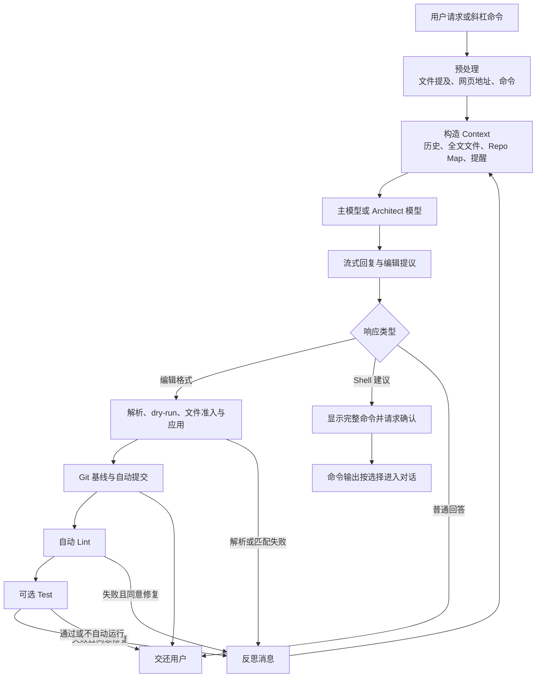

# Aider：Git-centric Coding Agent

Aider 是一个以终端结对编程为主要形态、以 Git 仓库和代码编辑事务为控制中心的 Coding Agent。用户把少量目标文件加入对话，模型获得这些文件的全文与仓库其余部分的结构摘要，再用特定编辑格式提出修改；Harness 负责解析、写入、提交、检查，并把失败重新送回模型。它不像平台型 Harness 那样先建立通用工具注册表、持久 Session 服务和多客户端协议，而是围绕“怎样把一次代码修改做得可定位、可应用、可审查、可撤销”长期演化出一条紧密闭环。

本章回答三个问题：Aider 的 Coder 抽象怎样把不同模型和编辑协议纳入同一循环；仓库地图（Repo Map）、Git 提交（commit）、静态检查（Lint）与测试（Test）怎样共同约束模型修改；这种集中设计为何在本地仓库编辑中直接有效，又为何不能被误解为通用 Agent 平台（Agent Platform）。读者可以直接从本章进入；文中仍沿用[统一参考架构中的八个核心对象](04_reference_architecture.md#八个核心对象一项任务由什么组成)来描述会话（Session）、轮次（Turn）、上下文（Context）和任务产物（Artifact），并继续使用[序章的配置解析错误案例](00_index.md#一句话请求先要落到正确的工作区)：在一个已有仓库中定位并修复解析错误，运行相关测试，解释最终变化。

## 项目定位与历史角色

Aider 的产品自我定位是“终端中的 AI 结对编程”。这里的“结对”不是把模型嵌进编辑器补全栏，而是让开发者持续决定哪些文件进入对话、是否接受额外文件、是否运行模型建议的命令，以及怎样用 Git 审查结果。固定版本的主入口是 Python 命令行界面（CLI）：它先识别 Git 根目录，按用户目录、仓库根和当前目录读取配置与环境，再构造模型、Git 仓库对象、命令集合、历史摘要器和具体 Coder。交互模式、单次消息模式、消息文件模式以及只执行 Lint、Test 或 Commit 的模式，最终都复用这套核心对象。Streamlit 图形界面（GUI）、文件观察和外部编辑器集成扩展了入口，却没有改变主要事务中心。

从项目历史看，Aider 的重要性不只在于“较早提供了聊天式写代码”，还在于它很早就把几个后来成为 Coding Harness 共性问题的机制放在同一条路径上：仓库过大时用符号图选择上下文；模型输出不可靠时设计专门编辑协议；编辑失败时把精确错误反馈给模型；用户工作树不干净时先保存基线；修改后自动提交并接入 Lint；历史过长时用辅助模型摘要。固定源码树的发行记录能够看到这些能力逐步叠加，而当前架构仍保留清楚的中心：Aider 首先是一套针对代码修改优化的 Harness，其次才是多模型聊天客户端。

这种历史角色也解释了标题中的“以 Git 为中心（Git-centric）”。Git 在 Aider 中不是模型偶尔可调用的一条命令解释器（Shell）命令，而是工作区发现、文件集合、脏改动归属、差异（Diff）、自动提交和撤销边界的共同基线。即使用户可以关闭 Git 集成，默认路径仍会主动寻找或建议创建仓库。Aider 因而适合用来观察一种与通用工具运行时（Tool Runtime）不同的设计谱系：把少数高频工程动作收得很紧，以较小的运行时状态换取局部修改的可解释性。

## Coder Abstraction 与核心循环

Coder 抽象（Coder Abstraction）是 Aider 的核心装配点。主模型携带默认编辑格式、是否使用 Repo Map、弱模型、编辑模型、缓存和推理参数等设置；Coder 工厂根据最终编辑格式从注册的子类中选择实现。整文件、搜索替换、统一差异（Unified Diff）、补丁（Patch）、Architect 与只读问答虽然使用不同提示（Prompt）和解析器，却共享文件集合、对话历史、Repo Map、Git 仓库对象、命令、词元（Token）计量以及验证循环。切换模型或格式时，系统还会迁移这些状态；若新旧格式不同，会优先把旧格式历史摘要掉，避免模型把过去的输出样式误当成当前协议。

图 29-1 展示一次配置修复怎样穿过这个集中式循环。它对应[Harness Loop 的循环不变量](05_harness_loop.md#turn状态与循环不变量)：目标要在反思中保持连续，新文件和 Shell 要经过明确准入，实际编辑与检查结果优先于模型原先判断，离开循环时还要说明是成功、用户拒绝、中断、格式重试耗尽还是模型提供方错误。

*图 29-1　Aider 的集中式编辑闭环。替代说明：请求先形成由历史、全文文件和 Repo Map 组成的 Context，模型输出经编辑格式或 Shell 路径进入现实环境，Git、Lint 与 Test 产生新的环境观察（Observation），失败再作为反思输入返回同一 Coder。*

图 29-1 与通用 Agent 状态机的最大差别，是 Aider 不把所有行动统一成带调用标识的工具请求。它先让模型完成一段回复，再从中抽取编辑块和建议命令，按顺序处理。一次用户消息内部可以发生多次模型调用，但继续条件主要来自内部反思消息：文件提及要求增加上下文、编辑格式不合法、代码块无法匹配、Lint 失败或 Test 失败，都可以形成下一轮输入。自动反思最多三次，防止模型在同一错误上无限重试。

模型调用自身也有另一层恢复。可重试的模型提供方（Provider）异常采用有上限的退避；上下文窗口溢出会提示用户用 `/drop`、`/clear` 或缩小文件；输出达到模型限制时，支持续写前缀的模型可以继续取得后续内容。用户按下 Ctrl-C 时，Aider 停止当前回复并把中断事实写入对话，再次快速按下才退出进程。这些路径让错误可见，但它们没有把当前进程升级为[可重放的持久 Session](12_session_persistence_and_resume.md#event-logsnapshot-与-checkpoint)：恢复聊天历史能够重建文本连续性，不能恢复在途命令、审批或完整 Turn 状态。

## Repo Map 与上下文选择

Aider 把仓库材料分成三层。可编辑文件由用户显式加入，模型看到全文，并可能写入；只读文件同样给出全文，但 Prompt 明确说明只作参考；仓库地图（Repo Map）覆盖其余 Git 文件，只提供路径、关键定义和相关上下文。这个分层使“模型知道仓库中存在某个符号”与“模型已经拥有修改该文件所需的最新全文”保持区别。模型若在回答中提到一个尚未加入的文件，Aider 会询问是否把它加入对话，再重新发起模型请求。

### Repo Map 的符号图与预算分配

Repo Map 首先把源文件解析成定义和引用。固定版本使用 tree-sitter 的语言查询提取类、函数、方法和其他标识符；若某种语言查询只能给出定义，没有引用，系统会用词法分析得到的名称作为补充。随后它把文件视为图节点，把“某文件引用一个在另一文件定义的标识符”视为有权边，并用 PageRank 估计哪些定义对当前任务更重要。

这不是一次完全静态的全局排名。当前已加入对话的文件、用户或模型明确提到的路径、当前消息中的标识符，都会改变个性化权重；从已在对话中的文件发出的引用会获得更强优先级。常见到在很多文件中都有定义的名字会被降权，较长且具有代码命名特征的标识符会被提高。排序结果最终不是文件得分清单，而是一组“文件—定义—相关代码行”候选，渲染成模型可以阅读的树形摘要。

预算分配是第二步。模型元数据决定默认 `map_tokens`：有输入窗口信息时取大约八分之一，并限制在约一千到四千 Token；用户可以显式缩放或关闭。当还没有任何全文文件加入对话时，Aider 会暂时扩大 Repo Map，让模型先获得更宽的仓库轮廓，同时为其他输入保留空间。候选符号按排名排列后，系统反复渲染不同长度的前缀并估算 Token，用二分搜索找到接近预算的树。

> **特色机制｜结构摘要不是编辑授权**
>
> Repo Map 的独特价值，是在第一轮就给模型一张受预算约束的符号关系图，而不要求它先猜出所有搜索词。它对应[上下文选择与 Repo Map](07_context_and_instruction_system.md#文件选择repo-map-与检索)中的“结构摘要”路线，也对应[Token 章节的输入选择](14_token_efficiency_and_cost_control.md#减少输入与选择上下文)。收益是跨文件方向更早出现；代价是首次扫描、缓存刷新和启发式排序都有成本。边界同样明确：静态定义—引用图不能证明运行时调用、反射、配置继承或生成代码关系，摘要中的文件也没有自动取得写权限。

Repo Map 的缓存策略进一步体现了工程取舍。标签按文件修改时间缓存，地图可以设置自动、每次、按文件或手动刷新；当自动模式发现生成代价较高时，会更积极复用已有结果。缓存故障会尝试重建，递归深度错误则直接禁用 Repo Map，让对话继续。这种“失去结构摘要但不失去编辑能力”的降级提高了可用性，也意味着用户必须能看见地图已被禁用，不能把旧地图当成当前仓库事实。

## Edit Format 与代码修改

编辑格式（Edit Format）规定模型怎样把“修改代码”表达成 Harness 可以解析的文本协议。它不是普通输出风格：解析器会据此识别目标文件、旧内容、替换内容或 Patch 动作，并决定何种不匹配必须拒绝。Aider 将格式与模型设置绑定，因为不同模型对整文件重写、严格搜索替换、统一 Diff 或分阶段编辑的稳定性不同；用户仍可覆盖模型默认值。

### Edit Format 谱系与反思闭环

表 29-1 把固定版本的主要格式按表达与失败边界归类。表中不穷举内部子类，而是说明为什么同一个 Coder 循环需要多种行动语言。

| 格式族 | 模型提交的主要内容 | Harness 的关键检查 | 典型代价与边界 |
|---|---|---|---|
| 整文件 | 文件名与完整新内容 | 识别目标文件、准入后整体写入 | 简单、适合新文件；长文件成本高，容易覆盖未体现在 Context 中的新变化 |
| SEARCH/REPLACE | 必须存在的旧文本与替换文本 | 精确或受限空白匹配，失败时给出相似实际行 | 局部且易解释；旧文本变化、重复片段会触发重试 |
| Unified Diff | 带上下文的增删行 | 规范化 hunk，要求上下文存在且足够唯一 | 表达紧凑；容错匹配提高成功率，也扩大误配面 |
| Patch | 新增、删除、更新、移动等动作 | 先解析完整动作和上下文，再应用各文件变化 | 多文件表达清楚；仍需面对部分应用与文件并发变化 |
| Architect/Editor | Architect 先给修改说明，Editor 再用专用格式实施 | 可询问或自动接受说明；Editor 使用新的短历史执行 | 规划与编辑可选不同模型；两阶段连接主要是自然语言，不是结构化计划对象 |

*表 29-1　Aider 主要 Edit Format 的表达与边界。表中各族共享 Coder 的文件准入、Git 和验证路径，但解析强度与失败反馈不同。*

表 29-1 的共同点是“先检查提议，再解释实际写入”。Aider 先解析编辑，执行格式相关的预演检查（dry-run）或匹配检查，再判断目标文件是否已在可编辑集合。未加入对话的现有文件必须获得确认；新文件需要创建确认；被 Git ignore 规则排除的文件默认跳过；目标文件已有未提交变化且脏提交开启时，系统先保存基线。写入后，真正编辑到的文件集合才进入自动提交与验证。

编辑失败不会只返回一句“格式错误”。SEARCH/REPLACE 会指出哪一块没有精确匹配、展示可能的实际行，并说明其他块是否已经成功；Unified Diff 会区分没有匹配与匹配不唯一；Patch 解析会指出动作或上下文错误。这些信息成为新的反思输入，模型只修复失败部分。它对应[工具调用（Tool Call）章节的错误即 Observation](08_tool_call_system.md#错误重试与并行调用)，但行动表示没有使用通用调用标识（Call ID）。

> **特色机制｜反思提高恢复力，不提供原子性**
>
> Aider 的反思闭环把“模型没有遵守协议”转化为可继续的环境反馈，这是其编辑路径的关键能力。收益是模型能根据真实文件和解析器错误修正，而不是在旧猜测上重写整段回复；代价是额外模型调用与 Token。边界是部分 edit block 或 hunk 可能已经写入，随后另一部分失败，因此反思起点是“检查当前文件后继续”，不是“事务自动回到编辑前”。这正是[代码编辑章节对实际 Diff 的要求](18_code_editing_git_and_workspace.md#diff审查与用户修改)：模型提议、成功应用部分和最终工作树必须分开核对。

Architect 模式把谱系再推进一步。主模型先扮演架构师，阅读请求和代码后给出精确修改说明；若配置允许，Aider 自动把说明交给编辑模型，否则先询问用户。Editor Coder 清空自己的对话历史，关闭 Repo Map、提示缓存（Prompt Cache）和 Shell 建议，只根据 Architect 说明、共享文件全文与专用 edit format 实施。这个设计可把高推理能力与高编辑遵循能力分给不同模型，却也把计划—执行契约压在自然语言中：Architect 遗漏的约束不会由独立结构化任务对象自动发现。

## Git Commit、Lint 与 Test

Git 将 Aider 的文本编辑转换成可审查事务。默认情况下，Agent 修改会自动提交；若将要编辑的目标文件已经带有用户未提交变化，Aider 先只提交这些目标文件，建立用户基线，再应用 Agent 编辑并为实际修改文件生成新的提交。提交消息由弱模型优先读取 Diff 与对话上下文生成，失败或无法容纳时回退主模型。当前默认还会通过 `Co-authored-by` 记录 Aider 与模型归属，用户可以调整作者、提交者和消息前缀策略。

### Git 提交事务与 /undo 边界

这套事务的动机不是追求“提交越多越好”，而是把用户原有工作、Agent 本轮修改和后续验证放在可比较的 Git 基线上。`/diff` 可以展示自上一条消息基线以来的净变化，自动提交的 hash 会被记录在当前聊天的 Aider commit 集合中，`/undo` 再用这份归属判断是否有资格撤销。

`/undo` 的限制比“执行一次 reset”严格。目标必须是当前聊天中由 Aider 创建的最新提交；不能是仓库首提交或 merge commit；该提交涉及的文件不能又有新的未提交变化；文件必须在上一提交中已经存在，因此新建文件不会被这条安全路径直接删除；若检测到最新提交已经与远端分支相同，也会拒绝撤销。条件满足后，系统逐文件恢复上一版本，再把 HEAD 软重置到父提交。这样的补偿尽量不覆盖用户后来工作，但它不是[Session 与外部副作用的一致性](12_session_persistence_and_resume.md#tool-call-和外部副作用的一致性)所说的全局回滚：Shell、网络、数据库、后台进程和聊天历史都不在范围内。

> **特色机制｜把撤销承诺缩到能证明的最近提交**
>
> Aider 没有用一个“Undo”按钮承诺恢复整个 Agent 世界，而是先证明最新提交的来源、文件清洁度、历史形状和远端状态，再执行局部补偿。收益是边界清楚且与开发者熟悉的 Git 工具兼容；代价是它会改变用户分支历史，也无法处理跨仓库事务和新建文件的自动删除。若逐文件恢复中途失败，用户仍需检查当前工作树，而不能把命令失败当成无副作用。

Lint 和 Test 位于提交之后，承担不同验证责任。自动 Lint 默认开启，只检查本次编辑文件；若发现错误，Aider 展示诊断并询问是否让模型修复，确认后把错误作为反思输入。自动 Test 默认关闭，用户需提供测试命令并显式启用；测试返回非零状态时，命令、输出和失败事实进入对话，再询问是否修复。手动 `/lint`、`/test` 和 `/run` 允许在相同工作区执行检查，其中普通命令输出是否加入对话由用户决定，测试失败输出则自动成为后续上下文。

这里有一个容易误读的默认值：Aider 自己的自动 Lint 默认运行，但 Git 提交前钩子（pre-commit Hook）默认通过 `--no-verify` 跳过；只有开启 `--git-commit-verify` 才执行仓库 Hook。自动 Test 又是另一开关。因此“自动提交成功”只证明 Git 接受了提交，不等于项目 Hook、测试与构建都通过。可靠交付仍要按照[代码编辑闭环中的 Test、Lint 与构建](18_code_editing_git_and_workspace.md#testlint-与构建)说明实际运行了哪些命令、在哪个提交上运行，以及哪些范围尚未覆盖。

## 多模型、弱模型与 Token

Aider 的模型抽象由 LiteLLM 连接不同 Provider，并用模型元数据补充上下文窗口、价格、流式能力、编辑格式、Repo Map、缓存、推理预算和模型角色。用户可以覆盖内建设置，也可以为未知或本地模型提供自定义元数据。重要的是，Provider 多样性没有改变 Coder 主路径：无论模型来自云端还是本地服务，输出仍要服从选定 edit format，文件仍要经过准入，现实结果仍由 Git 与验证反馈。

主模型、弱模型（weak model）和编辑模型（editor model）构成固定任务分层。主模型负责对话、根因分析或 Architect 说明；弱模型负责提交消息与历史摘要，未配置时回用主模型；编辑模型只在 Architect/Editor 路径中承担代码实施。这与[模型路由和任务分层](14_token_efficiency_and_cost_control.md#弱模型路由与任务分层)相符，但不是通用级联：Aider 不根据置信度把任意步骤动态升级，也不把弱模型作为独立 Subagent。

历史管理同样围绕这三个角色。模型最大输入窗口会导出一个历史软上限，通常约为输入容量的十六分之一，并限制在约一千到八千 Token。已完成历史超过上限时，后台摘要器保留近期尾部，把较早用户—助手消息交给弱模型概括，失败时再尝试主模型。它实现的是[Compaction 四类动作中的摘要与选择](13_compaction_and_context_management.md#截断摘要选择与外部化)，不是跨任务长期 Memory；按照[项目级、用户级与 Session 级 Memory 范围](10_memory.md#项目级用户级与-session-级范围)，恢复 Markdown chat history 只提供当前对话的文本连续性，不会自动形成可检索的项目经验库。

Token 控制分成估算、实际用量和缓存三层。`/tokens` 估算系统 Prompt、历史、Repo Map、可编辑文件和只读文件分别占用多少窗口，并提示用 `/drop` 或 `/clear` 释放空间；模型响应后，Aider 优先读取 Provider 返回的输入、输出、缓存命中与缓存写入统计，累计本条消息和本次进程的费用。Prompt Cache 默认关闭；启用且模型支持时，系统把示例或 system、只读文件与 Repo Map、可编辑文件等稳定区块标记为可缓存，还可发出只生成极少 Token 的 keepalive 请求维持短期缓存。缓存能减少重复前缀费用，却不减少逻辑 Context，也不能纠正过时 Repo Map 或摘要漂移。

## 与平台型 Harness 的差异

平台型 Harness 通常把模型行动规范化成工具目录、请求标识、审批、执行结果和持久事件，再允许命令行、集成开发环境（IDE）、桌面端（Desktop）或应用程序接口（API）客户端投影同一 Session。Aider 的集中式 Coder 则把这些责任压进更短的路径：编辑协议表达文件变化，斜杠命令层处理用户命令和 Shell，Git 保存修改边界，内存字段保存当前聊天状态。表 29-2 沿控制中心比较两者，不把“平台化程度”当作质量排名。

| 比较轴 | Aider 固定版本的核心路径 | 平台型 Harness 的常见路径 | 设计含义 |
|---|---|---|---|
| 行动表示 | Edit Format、文件提及、Slash Command 与 Shell 建议 | [请求、响应、错误、审批四类 Envelope](08_tool_call_system.md#请求参数与-call-id)和工具注册表 | Aider 对编辑错误反馈更专用；通用工具关联、并发和跨协议投影较弱 |
| 状态中心 | 单进程 Coder、Markdown 历史、Git commit | 持久 Session、Turn/Event/Item、客户端订阅 | Aider 易理解、启动直接；崩溃恢复、派生（Fork）、多客户端一致性边界更窄 |
| 上下文发现 | 显式全文文件 + Repo Map + 对话摘要 | 搜索/read 工具、项目指令、动态环境和可选索引 | Aider 第一轮结构方向强；运行时现场与非代码资源更多依赖命令和人工加入 |
| 扩展方式 | 固定命令集、GUI、watch、外部编辑器集成 | [Plugin、Extension、MCP、Skill 与 Hook](09_plugins_mcp_and_extensions.md#pluginextensionmcpskill-与-hook)的运行时装配 | 集中核心减少组合状态；第三方能力难以统一治理、发现和持久化 |
| 权限与隔离 | 文件准入和 Shell 明示确认，执行继承宿主用户权限 | 策略、逐调用审批、沙箱、网络和凭据代理分层 | Aider 的人在回路直接；固定版本核心未识别通用操作系统沙箱和企业策略面 |

*表 29-2　Aider 与平台型 Harness 的控制中心差异。表中“常见路径”是本报告的比较坐标，不要求所有平台系统采用完全相同实现。*

表 29-2 说明，Aider 不是“少了平台功能的通用 Agent”，而是选择了不同事务中心。对于文件修改，它能用专用协议报告精确匹配错误，用 Git 区分用户与 Agent 改动，用 Lint/Test 把验证接回反思；如果把这些动作全部改造成通用工具，系统还要重新维护参数模式（Schema）、Call ID、并发、事件持久化和客户端一致性。集中路径以较少抽象换取较高的编辑专门化。

边界也必须同样具体。文件尚未加入对话时，Aider 会询问是否允许编辑；模型建议 Shell 时，会显示完整命令并要求明确同意；但这些动作最终在宿主账号和仓库中执行。`--yes-always`、脚本模式或外部 GUI 会改变人在回路位置，`.gitignore` 与 `.aiderignore` 主要控制默认发现，不是文件沙箱；Provider 凭据从环境或 `.env` 进入进程，也需要考虑 Shell 和其他进程继承。按照[Tool Permission 与 Human Approval](17_security_permissions_and_sandboxing.md#tool-permission-与-human-approval)的区分，确认表达用户意图，不能代替实际资源隔离。

配置装载也反映了这种本机工具定位。Aider 会按用户目录、Git 根和当前目录读取配置、模型设置、元数据与 `.env`，固定版本核心未识别与项目信任（Project Trust）对等的统一装入闸门，也未识别企业托管策略层。进入陌生仓库时，项目配置和环境文件应被视为会影响 Harness 自身的输入；这可继续对照[用户、项目与企业配置](22_configuration_identity_and_supply_chain.md#用户项目与企业配置)。源码确认了装载路径，却没有运行验证统一沙箱或凭据隔离，因此本章不据此报告漏洞。

## 适用场景与延伸阅读

Aider 最适合边界明确的本地 Git 工作：开发者知道目标仓库，愿意挑选需要编辑的文件，希望每轮修改形成容易审查的提交，并能用项目现有命令完成 Lint 与 Test。它对“定位配置解析错误”这类任务尤其自然：Repo Map 先给出跨文件符号方向，开发者再把解析器和测试加入对话，模型用局部 edit format 修改，Git 保存基线，失败诊断进入反思。工作流中的每一步都围绕用户可见的仓库事实，而不是要求开发者先部署 Agent 服务端（Agent Server）或配置扩展生态。

它不天然适合另一类需求：多客户端长期连接同一任务、崩溃后精确恢复悬空工具、动态装配大量第三方能力、远程服务统一治理、跨多个仓库建立事务，或在高风险环境中依赖内建操作系统沙箱。这些目标并非与 Aider 完全不相容，用户可以借助容器、外部编排、IDE 插件和脚本补强；只是补强后的保证来自宿主组合，不应归到固定 Coder 核心。

延伸阅读可按问题进入：要理解反思循环和停止条件，回到[Harness Loop](05_harness_loop.md#行动执行与-observation)；要比较 Repo Map 与按需检索，阅读[上下文构造](07_context_and_instruction_system.md#文件选择repo-map-与检索)；要比较 edit format 与结构化 Tool Call，阅读[Tool Call Envelope](08_tool_call_system.md#七系统-tool-call-envelope-对照)；要核对 Git、Diff、Test 与并发写入，阅读[代码编辑、Git 与 Workspace](18_code_editing_git_and_workspace.md#coding-harness-的工程闭环)；要理解聊天恢复为何不等于任务恢复，阅读[Session 持久化](12_session_persistence_and_resume.md#七个系统的持久化路径)；要评估终端、GUI 和非交互路径的人机边界，阅读[接口与 Human-in-the-loop](20_interfaces_and_human_in_the_loop.md#七个系统的人机边界)。

## 本章小结

Aider 的架构可以压缩成一条清楚主线：Git 根目录确定工作现场，Coder 选择模型适配的编辑协议，全文文件与 Repo Map 构造 Context，模型输出经过解析、文件准入和实际写入，Git commit 建立可审查基线，Lint 与可选 Test 产生新观察，失败再进入有上限的反思。主模型、弱模型和编辑模型分别承担对话、辅助摘要/提交与两阶段实施，Token 预算则通过 Repo Map、历史摘要、文件选择和可选 Prompt Cache 控制。

它最有代表性的三个机制都把承诺限制在可证明范围内。Repo Map 提供受预算约束的静态符号方向，不冒充完整代码事实；Edit Format 把协议错误变成可修复反馈，不冒充跨文件原子事务；`/undo` 只补偿满足来源、清洁度和远端条件的最近 Aider commit，不冒充 Session 或外部世界回滚。正因为边界明确，Aider 在本地 Git 编辑中保持了很强的工程连贯性；也正因为状态集中、扩展和隔离交给外部较多，它与平台型 Harness 服务的是不同问题。理解这条差异，比把两类系统放进同一功能清单更能解释 Aider 的历史角色和持续价值。
